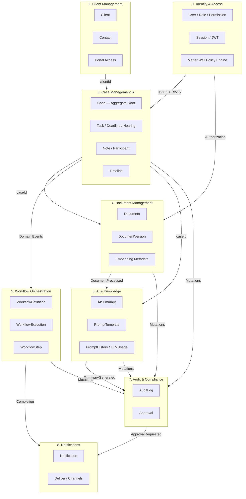
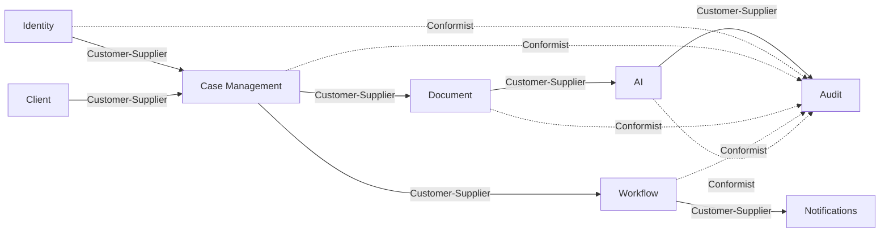
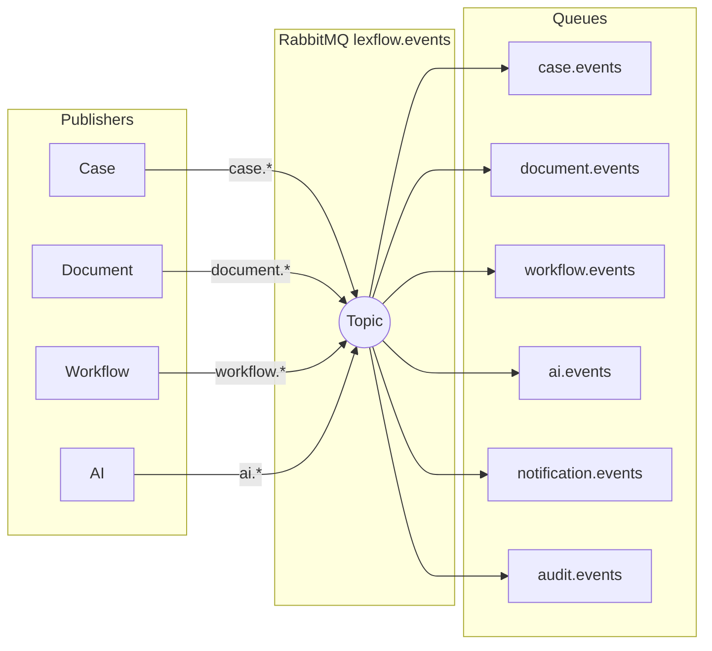
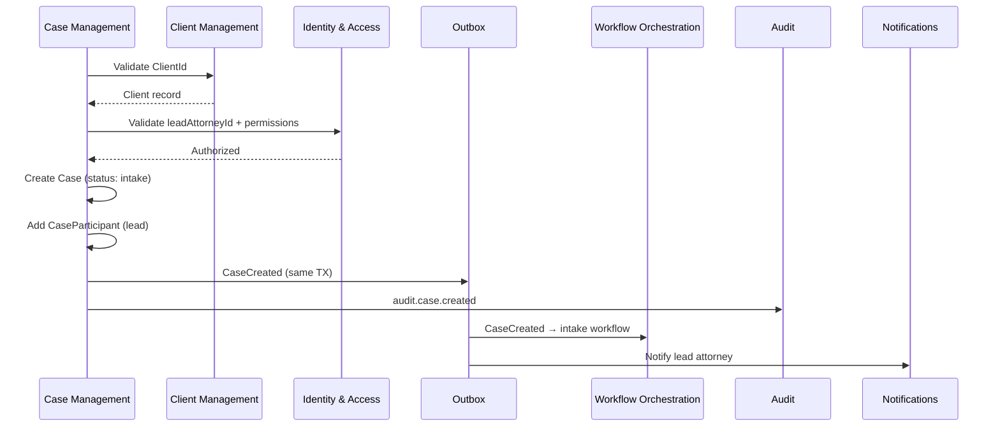

# LexFlow AI — Bounded Contexts & Context Map

**Purpose:** DDD context boundaries and integration patterns for AI assistants.  
**Authoritative source:** `docs/02-domain/bounded-contexts.md`

---

## Eight Bounded Contexts



★ Case Management is the **central context**.

---

## Ownership Matrix

| Context | Owns | Does NOT Own |
|---------|------|--------------|
| Identity & Access | Users, roles, permissions, sessions, matter wall policy API | Case data, client records |
| Client Management | Clients, contacts, portal linkage | Case lifecycle, matter walls |
| Case Management | Cases, tasks, deadlines, hearings, notes, participants, timeline | Client master data, document binaries |
| Document Management | Documents, versions, embeddings metadata, OCR state | AI summary content, workflow execution |
| Workflow Orchestration | Workflow definitions, executions, steps | Business authorization decisions |
| AI & Knowledge | Summaries, prompt templates, prompt history, LLM usage | Document storage, case status |
| Audit & Compliance | Audit logs, approvals | Domain entity mutations |
| Notifications | Notification records, delivery state | Workflow logic, AI inference |

---

## Context Map (DDD Relationships)



| Upstream | Downstream | Relationship | Integration |
|----------|------------|--------------|-------------|
| Identity | Case Management | Customer-Supplier | UserId refs; RBAC + matter wall before case access |
| Client Management | Case Management | Customer-Supplier | ClientId on Case; ClientCreated → intake |
| Case Management | Document Management | Customer-Supplier | CaseId on Document; status may block uploads |
| Case Management | Workflow Orchestration | Customer-Supplier | Case events trigger executions |
| Document Management | AI & Knowledge | Customer-Supplier | DocumentProcessed → embeddings/summary |
| Case Management | AI & Knowledge | Customer-Supplier | CaseId scopes all AI; case context in prompts |
| Workflow Orchestration | Notifications | Customer-Supplier | WorkflowCompleted/Failed → notify |
| AI & Knowledge | Audit & Compliance | Customer-Supplier | SummaryGenerated → approval request |
| All contexts | Audit & Compliance | Conformist | All mutations emit audit; audit never influences upstream |

---

## Schema Mapping

| Context | PostgreSQL Schema | Primary Tables |
|---------|-------------------|----------------|
| Identity & Access | `identity` | firms, users, roles, permissions, user_roles, role_permissions, refresh_tokens |
| Case Management | `cases` | cases, case_participants, tasks, deadlines, hearings, notes, case_timeline_events |
| Client Management | `cases`* | clients |
| Document Management | `documents` | documents, document_versions, document_embeddings |
| Workflow Orchestration | `workflows` | workflow_definitions, workflow_executions, workflow_steps |
| AI & Knowledge | `ai` | ai_summaries, prompt_templates, prompt_history, llm_usage |
| Audit & Compliance | `audit` | audit_logs, approvals |
| Notifications | `shared` | notifications |
| Cross-cutting | `shared` | outbox_events, idempotency_keys |

\* Shared schema, separate aggregate — discipline required.

---

## Integration Mechanisms

### Allowed

1. **Foreign key references (UUID)** — read-only validation across boundaries
2. **Domain events** — transactional outbox → RabbitMQ → idempotent consumers
3. **Application services** — coordinate multi-context ops in single transaction when required

### Prohibited

1. Direct writes to another context's tables
2. Cross-context domain model imports (`services/case/` importing `services/document/domain/`)
3. Cross-schema foreign keys in migrations
4. Synchronous cross-context writes outside application service layer

---

## Event Routing



Routing keys: `{context}.{aggregate}.{action}` — e.g., `case.case.created`

Full catalog: `docs/02-domain/domain-events.md`

---

## Case Creation — Cross-Context Sequence



---

## Context Detail Summaries

### 1. Identity & Access
- JWT auth, RBAC, matter wall enforcement API
- Publishes: UserCreated, RoleAssigned, UserDeactivated
- Consumed by: all case-scoped contexts for authZ

### 2. Client Management
- Client aggregate, organization Contacts, portal UserId linkage
- Publishes: ClientCreated, ClientUpdated, ClientPortalEnabled
- Cannot hard-delete with active Cases

### 3. Case Management ★
- Central hub: Case + Task, Deadline, Hearing, Note, CaseParticipant
- Denormalized timeline for UI
- Publishes: CaseCreated, CaseStatusChanged, TaskCompleted, DeadlineApproaching

### 4. Document Management
- S3 binaries + PostgreSQL metadata + OCR
- Publishes: DocumentUploaded, DocumentProcessed, DocumentVersionCreated

### 5. Workflow Orchestration
- FastAPI decides IF; n8n executes HOW
- Publishes: WorkflowTriggered, WorkflowCompleted, WorkflowFailed

### 6. AI & Knowledge
- Async inference only; HITL approval
- Publishes: SummaryGenerated, SummaryApproved, EmbeddingCompleted

### 7. Audit & Compliance
- Append-only audit_logs; Approval aggregate
- Conformist — all contexts emit; audit never shapes upstream models

### 8. Notifications
- In-app, email, Teams delivery
- Consumes events; upstream specifies recipients

---

## Code Module Mapping

```
services/
├── identity/              → identity schema
├── client_management/     → cases.clients
├── case_management/       → cases.* (central)
├── document_management/   → documents schema
├── workflow_orchestration/→ workflows schema
├── ai_knowledge/          → ai schema
├── audit_compliance/      → audit schema
└── notifications/         → shared.notifications
```

**Rule:** One context, one package. No cross-package domain imports.

Doc: `docs/folder-structure.md`

---

## Extraction Readiness (Future Microservices)

Each context maintains:
- Dedicated PostgreSQL schema (extractable via `pg_dump --schema=X`)
- Repository interfaces behind domain services
- Published event contracts (versioned payloads)

**Extract when:** Sustained resource pressure on one context, deploy conflicts, org boundaries.

ADR: `architecture/DECISIONS.md` ADR-001

---

## Best Practices for AI Assistants

1. **Identify owning context first** — before placing code, determine which bounded context owns the aggregate
2. **Publish events for side effects** — don't call another context's write methods
3. **Matter wall is cross-cutting** — Identity provides enforcement; Case owns participant membership
4. **Name events by aggregate** — `CaseCreated` not `CreateCase`
5. **Audit is conformist** — never let audit requirements reshape domain models
6. **Shared schema ≠ shared model** — `clients` in `cases` schema but Client Management owns aggregate

---

## References

| Document | Topic |
|----------|-------|
| `memory/DOMAIN.md` | Aggregate summaries |
| `docs/02-domain/case-aggregate.md` | Central aggregate detail |
| `docs/03-architecture/component-architecture.md` | FastAPI module layout |
| `docs/05-database/schema-overview.md` | Table definitions |
| `docs/06-workflows/orchestration-model.md` | Workflow context + n8n |
| `architecture/DECISIONS.md` | ADR-001, ADR-003 |
