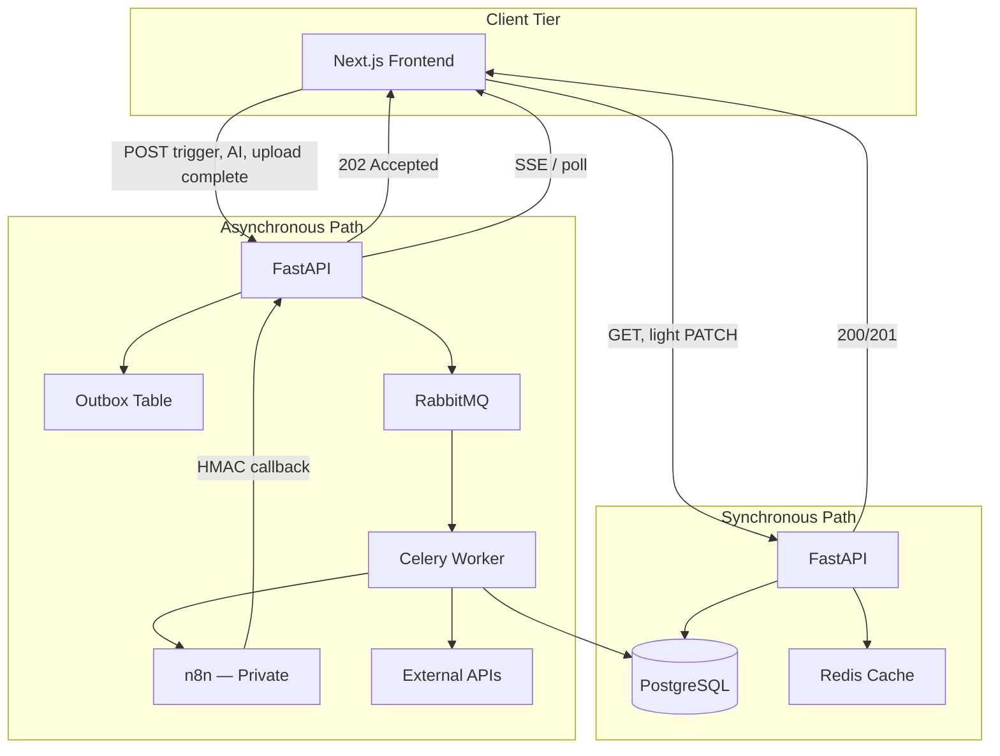
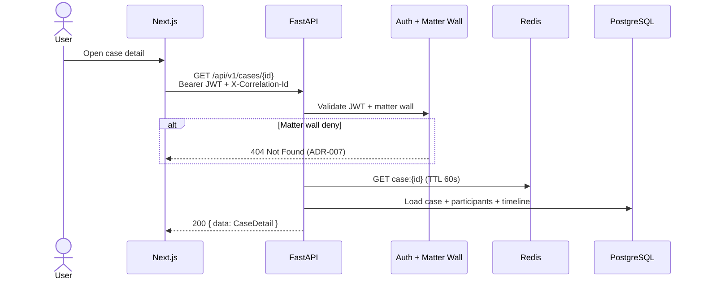
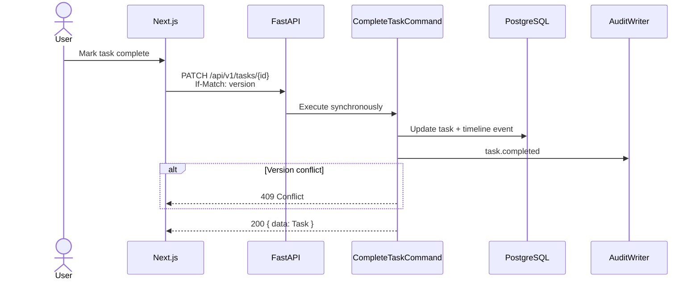
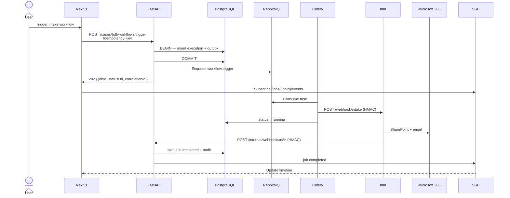
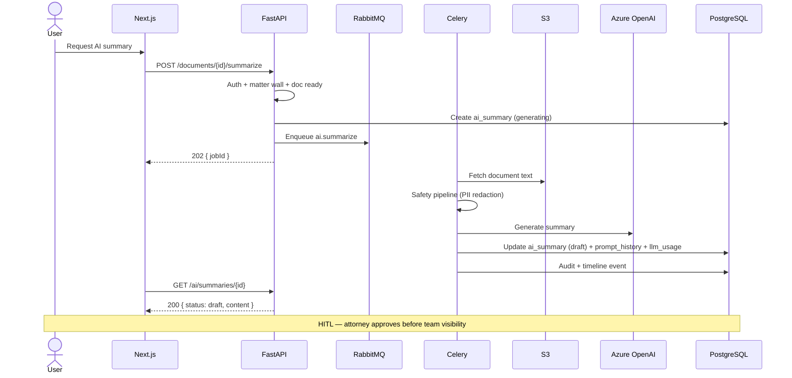
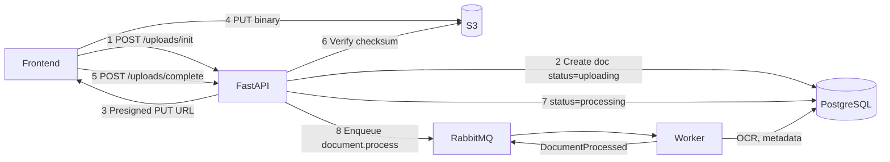
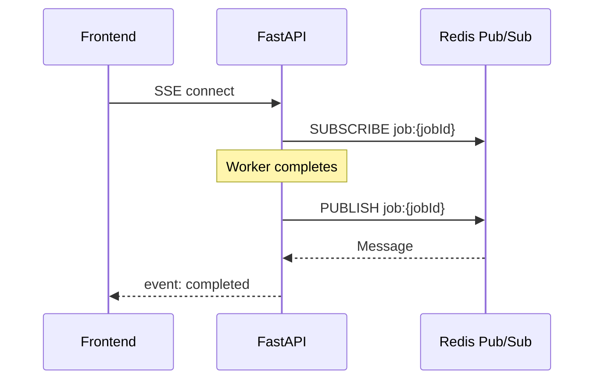

# LexFlow AI — Data Flow Architecture

**Purpose:** Sync vs async request paths for AI assistants implementing features.  
**Authoritative source:** `docs/03-architecture/data-flow.md`  
**Canonical pipeline:** `Frontend → FastAPI → Queue → Worker → n8n → External`

---

## Path Selection Rules

| Path | When | Response | Authority |
|------|------|----------|-----------|
| **Synchronous** | Reads, light writes (< 200ms), auth, config | 200/201 JSON | FastAPI + PostgreSQL/Redis |
| **Asynchronous** | Workflows, AI, OCR, bulk, external orchestration | 202 + jobId + statusUrl | FastAPI initiates; Worker executes |
| **Callback** | n8n completion, external webhooks | Internal HMAC endpoint | FastAPI persists final state |
| **Real-time push** | Job done, notifications | SSE / poll / WebSocket | FastAPI → Frontend |

**Decision tree:**
```
Request → Authenticated? → No → 401
       → Authorized (RBAC + matter wall)? → No → 403 or 404 (ADR-007)
       → Read or light write? → Sync path → 200/201
       → Workflow/AI/OCR/bulk? → Async path → 202
```

---

## Dual-Path Overview



---

## Isolation Rules (Non-Negotiable)

| Rule | Enforcement |
|------|-------------|
| Frontend never calls n8n, RabbitMQ, workers | No credentials in browser; network isolation |
| Frontend never calls LLM providers | No API keys client-side |
| All mutations audited | Audit middleware + domain handlers |
| Async jobs return correlation ID | `X-Correlation-Id` propagated end-to-end |
| n8n never writes PostgreSQL | No DB credentials in n8n; architecture review |

---

## Sync Path — Case Detail Read



**Characteristics:** Immediate response, cache-friendly, matter wall before data load.

---

## Sync Path — Lightweight Write (Task Complete)



**Sync write criteria:** Single aggregate mutation, < 200ms, no external API calls.

---

## Async Path — Workflow Trigger (Canonical)



**Key points:**
- FastAPI authorizes BEFORE enqueue
- Transaction includes outbox event (ADR-006)
- n8n only executes external I/O
- Final state persisted by FastAPI callback handler

---

## Async Path — AI Document Summary



**Never:** LLM call in API handler. Always worker path (ADR-004).

---

## Document Upload Flow



**Rule:** Binary never transits API containers — presigned S3 only.

---

## Real-Time Update Patterns

| Pattern | Use Case | Endpoint |
|---------|----------|----------|
| **SSE** (preferred) | Job status, notifications | `GET /api/v1/jobs/{id}/events` |
| **Polling** (fallback) | Restrictive proxies | `GET /api/v1/jobs/{id}` every 3s + backoff |
| **WebSocket** (Phase 2) | Bidirectional collaboration | FastAPI WS endpoint |



---

## Data Classification by Flow

| Flow | Classification | Encryption | Retention |
|------|----------------|------------|-----------|
| Case metadata (sync) | Confidential | TLS + RDS at rest | Case lifecycle |
| Document binary (S3) | Privileged | SSE-KMS | 7+ years post-close |
| AI prompt/response | Work product | TLS + optional field encryption | 3 years |
| Queue payload | Confidential | AMQP TLS; no PII in headers | 7 day TTL |
| n8n callback | Confidential | HMAC + TLS | Persisted in workflow_executions |
| Audit entries | Compliance | Append-only immutable | 7 years minimum |

---

## Implementation Checklist for AI Assistants

### Adding a sync endpoint
- [ ] JWT + RBAC + matter wall middleware
- [ ] Single aggregate mutation or read
- [ ] Audit log on mutation
- [ ] Optimistic concurrency if updating (`If-Match`)
- [ ] Response envelope per `docs/04-api/rest-standards.md`

### Adding an async endpoint
- [ ] Return 202 with `jobId`, `statusUrl`, `correlationId`
- [ ] Persist job record + outbox in same transaction
- [ ] Enqueue Celery task with idempotency check
- [ ] Worker: idempotent handler, matter wall re-check
- [ ] SSE or poll endpoint for status
- [ ] Audit on completion/failure

### Adding n8n integration
- [ ] FastAPI decides IF to trigger (auth + business rules)
- [ ] Worker invokes n8n webhook with HMAC
- [ ] n8n callbacks to `/internal/webhooks/n8n`
- [ ] FastAPI persists final state — n8n does not write DB

---

## Best Practices

1. Default to async for anything > 500ms expected
2. Propagate `X-Correlation-Id` Frontend → Worker → n8n → callback
3. `Idempotency-Key` on all async triggers
4. Matter wall check at submission AND worker execution
5. Persist AI/workflow results before notifying frontend
6. Presigned S3 for all file uploads

---

## References

| Document | Topic |
|----------|-------|
| `docs/03-architecture/data-flow.md` | Full specification |
| `docs/03-architecture/event-driven-design.md` | Outbox + RabbitMQ |
| `docs/04-api/endpoints-ai.md` | AI 202 pattern |
| `docs/06-workflows/webhook-contracts.md` | n8n payloads |
| `memory/INVARIANTS.md` | Non-negotiable rules |
| `architecture/DECISIONS.md` | ADR-004, ADR-006 |
