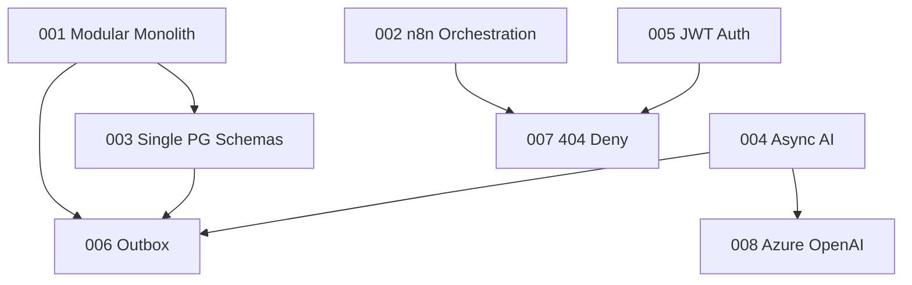

# LexFlow AI — Architecture Decision Records (Summary)

**Purpose:** Compressed ADR reference for AI assistants. Do not contradict without proposing new ADR.  
**Full text:** `docs/13-decisions/001-008` (also duplicated in `docs/adr/`)  
**Status:** All Accepted · Date: 2026-07-06

---

## ADR Index

| ADR | Decision | Impact on Code |
|-----|----------|----------------|
| [001](#adr-001-modular-monolith) | Modular monolith | Single FastAPI deploy, `services/{context}/` modules |
| [002](#adr-002-n8n-orchestration-only) | n8n orchestration only | No business logic in n8n; private network |
| [003](#adr-003-postgresql-single-database) | Single PG, schema separation | 7 schemas, no cross-schema FKs |
| [004](#adr-004-async-ai-processing) | Async AI worker path | 202 + jobId; never sync LLM in handler |
| [005](#adr-005-jwt-authentication) | JWT + refresh tokens | 15min access, 7d refresh, server-side permissions |
| [006](#adr-006-transactional-outbox) | Transactional outbox | Events in same TX as domain write |
| [007](#adr-007-matter-walls-404-deny) | 404 not 403 on GET deny | Anti-enumeration for case access |
| [008](#adr-008-azure-openai-primary) | Azure OpenAI production default | Provider from PromptTemplate config |

---

## ADR-001: Modular Monolith

**Decision:** Single FastAPI application with bounded context modules under `services/{context}/`. Single deploy, shared transaction boundary.

**Extract to microservices when:**
- Sustained CPU/memory pressure isolated to one context
- Deployment frequency conflicts between teams
- Organizational boundaries require independent release

**Module requirements for extraction:**
- Dedicated PostgreSQL schema
- Repository interfaces behind domain services
- Published domain event contracts

| Option | Verdict |
|--------|---------|
| Microservices day one | Rejected — premature ops complexity |
| **Modular monolith** | **Accepted** |
| Monolith without boundaries | Rejected — no extraction path |

**Consequences (+):** Simple deploy, shared transactions, fast development  
**Consequences (−):** Cannot scale contexts independently; shared failure domain

Doc: `docs/13-decisions/001-modular-monolith.md`

---

## ADR-002: n8n Orchestration Only

**Decision:** n8n connects external systems and retries HTTP. FastAPI owns all business logic, auth, audit, workflow lifecycle.

**n8n MAY:** HTTP calls, payload transforms, retry, callback to FastAPI internal webhooks  
**n8n MUST NOT:** Business rules, PostgreSQL access, authorization, public exposure

**Enforcement:**
- Code review checklist
- CI workflow lint — no PostgreSQL nodes
- Network SG — no public ingress
- HMAC on internal webhooks

| Option | Verdict |
|--------|---------|
| Business logic in n8n | Rejected — no audit/auth/testability |
| **n8n orchestration only** | **Accepted** |
| Custom orchestrator | Rejected — reinventing connectors |

Doc: `docs/13-decisions/002-n8n-orchestration-only.md`

---

## ADR-003: PostgreSQL Single Database

**Decision:** One PostgreSQL instance, schema per bounded context.

| Schema | Owner |
|--------|-------|
| `identity` | Identity & Access |
| `cases` | Case Management (+ clients table) |
| `documents` | Document Management |
| `workflows` | Workflow Orchestration |
| `ai` | AI & Knowledge |
| `audit` | Audit & Compliance |
| `shared` | Outbox, idempotency, notifications |

**Rules:**
- Cross-context queries via application services, not cross-schema joins (except approved reporting views)
- No cross-schema foreign keys — UUID refs validated in app layer
- Extraction: `pg_dump --schema=X`

| Option | Verdict |
|--------|---------|
| Single `public` schema | Rejected — no boundaries |
| **Schema per context** | **Accepted** |
| Database per context | Rejected — no shared transactions |

Doc: `docs/13-decisions/003-postgresql-single-database.md`

---

## ADR-004: Async AI Processing

**Decision:** All LLM/embedding operations via async worker path.

```
Frontend → FastAPI (202) → RabbitMQ → Celery → LLM → PostgreSQL
```

- API returns `202 Accepted` with `job_id`, `status_url`
- Frontend polls or SSE for completion
- Worker: retry, rate limit, safety, metering, audit

**Phase 2 exception:** SSE token streaming for chat — full response still async-persisted.

| Option | Verdict |
|--------|---------|
| Sync LLM in request | Rejected — timeouts, no retry |
| **Async via queue** | **Accepted** |
| SSE streaming only | Rejected — audit incomplete |

Doc: `docs/13-decisions/004-async-ai-processing.md`

---

## ADR-005: JWT + Refresh Token Authentication

**Decision:** JWT access (15 min) + refresh token (7 days, rotated, httpOnly cookie).

| Token | Storage | Contents |
|-------|---------|----------|
| Access | Memory (SPA) / server session (SSR) | `sub`, `firm_id`, `session_id` — **NOT permissions** |
| Refresh | httpOnly Secure SameSite=Strict | Opaque ID → `identity.refresh_tokens` |

**Key rules:**
- Permissions resolved server-side per request (Redis-cached role matrix)
- RS256 signed access tokens; JWKS endpoint
- Refresh rotation + theft detection (reuse revokes token family)
- Entra ID OIDC additive in Phase 3

| Option | Verdict |
|--------|---------|
| Server-side Redis sessions | Rejected — harder SSR scale |
| **JWT + refresh** | **Accepted** |
| Entra ID only day one | Rejected — blocks Phase 1 |

Doc: `docs/13-decisions/005-jwt-authentication.md`

---

## ADR-006: Transactional Outbox

**Decision:** Domain events written to `shared.outbox_events` in same database transaction as domain change.

**Publisher:** Celery Beat polls every 1s → RabbitMQ → mark `published_at`  
**Delivery:** At-least-once — consumers must be idempotent  
**Retry:** Exponential backoff; dead-letter after 10 attempts

**Outbox columns:** id, aggregate_type, aggregate_id, event_type, payload (JSONB), created_at, published_at, retry_count

| Option | Verdict |
|--------|---------|
| Direct publish after commit | Rejected — dual-write problem |
| **Transactional outbox** | **Accepted** |
| CDC/Debezium/Kafka | Rejected — overkill for monolith |

Doc: `docs/13-decisions/006-transactional-outbox.md`

---

## ADR-007: Matter Walls — 404 Not 403

**Decision:** Matter wall deny on case-scoped GET/HEAD returns **404 Not Found** — same body as nonexistent case. Prevents case ID enumeration (ethical wall requirement).

| Condition | GET/HEAD Status | Body |
|-----------|-----------------|------|
| Not authenticated | 401 | Auth error |
| RBAC denied | 403 | "Insufficient permissions" — no case metadata |
| Matter wall deny | **404** | Generic "Case not found" — no title/client/participants |
| Case does not exist | **404** | Identical to matter wall deny |

**Internal:** Full deny reason in `audit.audit_events` — never in HTTP response.

**UI:** Generic not-found page — no "access denied" on case routes.

| Option | Verdict |
|--------|---------|
| 403 for all auth failures | Rejected — enumeration attack |
| **404 for matter wall GET deny** | **Accepted** |
| 404 for all failures | Rejected — RBAC debugging broken |

Doc: `docs/13-decisions/007-matter-walls-404-deny.md`

---

## ADR-008: Azure OpenAI Production Default

**Decision:** Azure OpenAI is production-default LLM for completions and embeddings. Provider from `PromptTemplate.model_config` at runtime.

| Provider | Environment | Role |
|----------|-------------|------|
| **Azure OpenAI** | Production | Primary |
| OpenAI API | Staging / failover | Secondary (after Azure 5xx/timeout) |
| Anthropic | Production | Contract review only (128K context) |
| Ollama | Local dev | Never production |

**Rules:**
1. Default `provider: azure_openai` in production PromptTemplates
2. Fallback logged as `fallback_used: true` in `ai.llm_usage`
3. Firm may disable fallback — fail closed if Azure down
4. All text through safety pipeline before any provider

| Option | Verdict |
|--------|---------|
| OpenAI API primary | Rejected — data residency concerns |
| **Azure OpenAI primary** | **Accepted** |
| Self-hosted only | Rejected — capability gap |
| Multi-provider load balancing | Rejected — compliance complexity |

Doc: `docs/13-decisions/008-azure-openai-primary.md`

---

## ADR Dependency Graph



---

## When to Create New ADR

Create ADR in `docs/13-decisions/` when:
- Changing deployment topology (monolith → microservice)
- Adding new data store or message broker
- Changing auth model or matter wall semantics
- New LLM provider as production default
- Violating any invariant in `memory/INVARIANTS.md`

Update this summary file when new ADR accepted.

---

## Quick "Can I Do This?" Reference

| Question | Answer | ADR |
|----------|--------|-----|
| Put validation in n8n IF node? | **No** | 002 |
| Call OpenAI from FastAPI handler? | **No** | 004 |
| Cross-schema FK in migration? | **No** | 003 |
| Return 403 when user not on case? | **No on GET** — use 404 | 007 |
| Embed permissions in JWT? | **No** | 005 |
| Publish to RabbitMQ from handler? | **No** — use outbox | 006 |
| Deploy Case and AI as separate services? | **Not Phase 1** | 001 |
| Use api.openai.com in production? | **Fallback only** | 008 |

---

## References

- Full ADRs: `docs/13-decisions/README.md`
- Platform invariants: `memory/INVARIANTS.md`
- Legacy copies: `docs/adr/`
