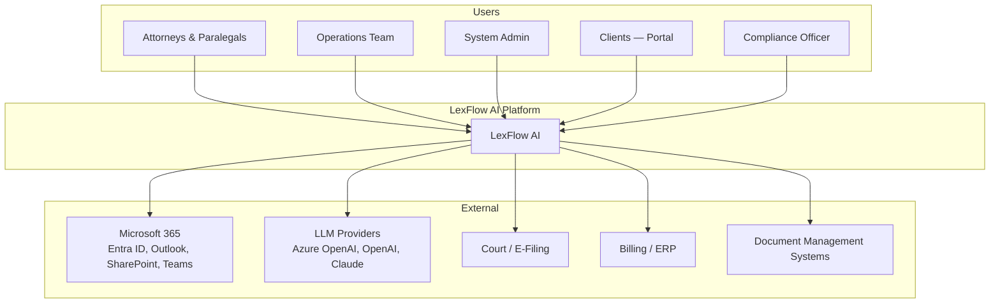
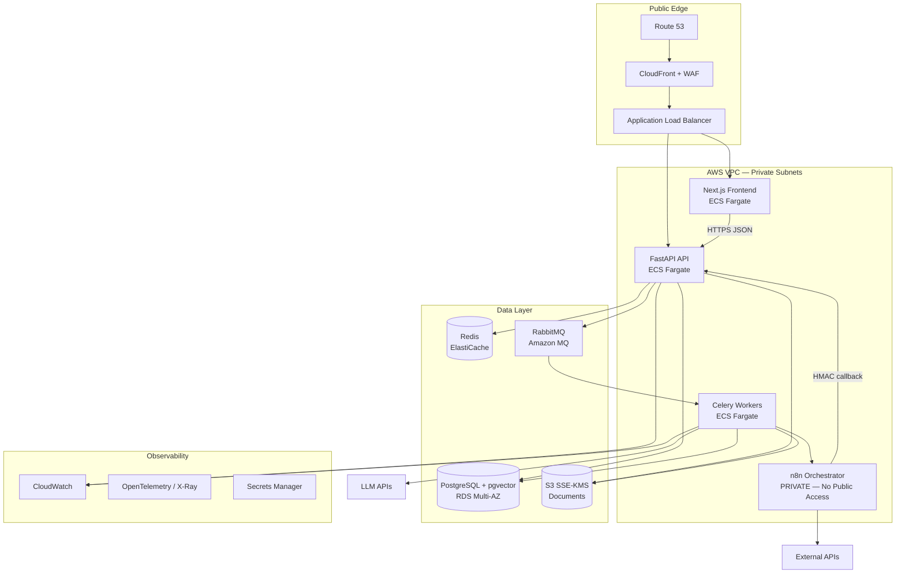
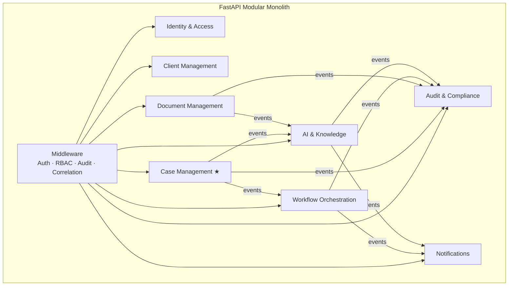

# LexFlow AI — Architecture Overview

**Purpose:** Compressed C4 architecture for AI assistants.  
**Authoritative source:** `docs/03-architecture/`, `docs/high-level-architecture.md`  
**Status:** Pre-implementation

---

## System Purpose

Enterprise AI automation platform for US law firms. Augments legal professionals — does not replace legal judgment. Single-firm deployment initially (modular monolith on AWS).

---

## C4 Level 1 — System Context



Doc: `docs/03-architecture/system-context.md`

---

## C4 Level 2 — Container Diagram



Doc: `docs/03-architecture/container-architecture.md`

---

## C4 Level 3 — FastAPI Modules (Bounded Contexts)



**Pattern:** DDD layers per module — `domain/ ← application/ ← infrastructure/`

Doc: `docs/03-architecture/component-architecture.md`

---

## Layer Responsibilities

| Layer | Technology | Owns | Must NOT |
|-------|------------|------|----------|
| **Frontend** | Next.js, React, TS | UI, client state, SSE client, token refresh UX | Business rules, n8n/queue/LLM calls, secrets |
| **API** | FastAPI, Python | All business logic, authZ, validation, outbox, internal webhooks | Sync LLM in request path |
| **Workers** | Celery | Async tasks, outbox publish, AI inference, n8n bridge | User-facing HTTP |
| **n8n** | n8n | External HTTP orchestration, retries | Business logic, DB writes, public access |
| **PostgreSQL** | RDS | System of record, audit, outbox, embeddings | Cache, message broker |
| **Redis** | ElastiCache | Cache, rate limits, Celery adjunct, SSE pub/sub | Authoritative state |
| **RabbitMQ** | Amazon MQ | Durable messaging, DLQ | Business execution |
| **S3** | AWS S3 | Document binaries, artifacts | Relational queries |

---

## Canonical Request Pipeline

```
Frontend → FastAPI → Queue (RabbitMQ) → Workers (Celery) → n8n → External Services
              ↕                              ↕
         PostgreSQL + pgvector            Redis + S3
```

**Sync path:** Reads, lightweight writes (< 200ms) — 200/201 immediate  
**Async path:** Workflows, AI, OCR, bulk — 202 + jobId + polling/SSE

Detail: `architecture/DATA-FLOW.md`

---

## Deployment Topology (AWS)

```
Region: us-east-1 (primary) · us-west-2 (DR standby)

Route 53 → CloudFront/WAF → ALB
                              ├── web-service (Next.js) — min 2 tasks, CPU autoscale
                              ├── api-service (FastAPI) — min 2 tasks, CPU autoscale
                              ├── worker-service (Celery) — queue depth autoscale
                              └── n8n-service — min 1, internal ALB ONLY

RDS PostgreSQL Multi-AZ (db.r6g.xlarge+)
ElastiCache Redis (cluster mode)
Amazon MQ RabbitMQ (active/standby)
S3 (versioned, lifecycle)
Secrets Manager
CloudWatch + X-Ray
```

**IaC:** Terraform — `infra/terraform/`  
Doc: `docs/09-deployment/aws-topology.md`

---

## Database Architecture

Single PostgreSQL, schema-per-bounded-context (ADR-003):

| Schema | Context |
|--------|---------|
| `identity` | Identity & Access |
| `cases` | Case Management + Client |
| `documents` | Document Management |
| `workflows` | Workflow Orchestration |
| `ai` | AI & Knowledge |
| `audit` | Audit & Compliance |
| `shared` | Outbox, idempotency, notifications |

**Extensions:** pgvector (HNSW embeddings), full-text search  
Doc: `docs/05-database/schema-overview.md`

---

## Event Architecture

```
Domain write (same TX) → shared.outbox_events
                              ↓ Celery Beat (1s poll)
                         RabbitMQ (lexflow.events topic)
                              ↓
                    Context-specific consumers (idempotent)
```

Doc: `docs/03-architecture/event-driven-design.md`, ADR-006

---

## Security Architecture Summary

| Control | Implementation |
|---------|----------------|
| Authentication | JWT 15min + refresh 7d rotated (ADR-005) |
| Authorization | RBAC + matter wall ABAC (ADR-007) |
| Encryption | TLS 1.2+; RDS/S3/ElastiCache at rest |
| Secrets | AWS Secrets Manager |
| Network | n8n private subnet; SG deny public ingress |
| Audit | Immutable append-only logs |
| AI data | PII redaction pre-LLM; Azure OpenAI default (ADR-008) |

Doc: `docs/08-security/threat-model.md`

---

## Cross-Cutting Concerns

| Concern | Approach |
|---------|----------|
| Idempotency | `Idempotency-Key` header + `shared.idempotency_keys` |
| Optimistic concurrency | `version` column + `If-Match` / ETag |
| Correlation tracing | `X-Correlation-Id` end-to-end |
| Retry | Celery exponential backoff; n8n HTTP retry nodes |
| DLQ | All RabbitMQ queues have dead-letter exchange |
| Caching | Redis — permissions, reference data; TTL 60s case detail |
| Logging | Structured JSON — correlationId, userId, caseId, firmId |
| Tracing | OpenTelemetry — Frontend → API → Queue → Worker → n8n |

Doc: `docs/03-architecture/cross-cutting-concerns.md`

---

## NFR Targets

| Metric | Target |
|--------|--------|
| Concurrent users | 1,000+ |
| Workflow executions | 50,000+ / month |
| Documents | Millions |
| Availability | 99.9% |
| RPO / RTO | ≤ 15 min / ≤ 4 hours |
| API p95 (sync reads) | < 200ms |
| Deploy | Zero-downtime rolling |

Doc: `docs/03-architecture/nfr-requirements.md`

---

## Evolution Path

| Phase | Architecture focus |
|-------|-------------------|
| 1 MVP | Modular monolith, basic workflows, AI summary, RBAC, audit |
| 2 | M365 integration, client portal, contract review, SSE streaming chat |
| 3 | Entra ID SSO, read replicas, DR automation, multi-office |
| 4 | Extract AI or Workflow context to microservice if metrics justify |

**Extraction trigger:** Sustained CPU/memory on one context, deploy conflicts, org boundaries.

ADR: `architecture/DECISIONS.md` ADR-001

---

## What Architecture Explicitly Avoids

1. Business logic in n8n
2. Public n8n exposure
3. Frontend → n8n/queue/worker calls
4. Synchronous AI in HTTP handlers
5. Database-per-microservice (Phase 1)
6. Shared mutable worker state outside PostgreSQL/S3

---

## Key References

| Topic | Document |
|-------|----------|
| Data flows | `architecture/DATA-FLOW.md` |
| Bounded contexts | `architecture/BOUNDED-CONTEXTS.md` |
| ADRs | `architecture/DECISIONS.md` |
| Integration | `docs/03-architecture/integration-patterns.md` |
| Folder layout | `docs/folder-structure.md` |
| Coding standards | `docs/development-standards.md` |
