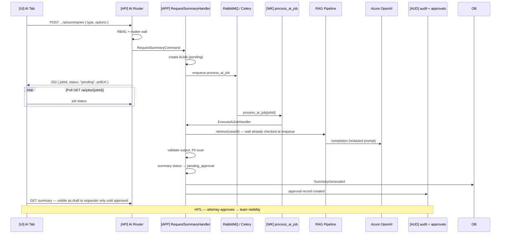

# Example: AI Summary Async

## Scenario

**Actor:** Attorney requesting AI case summary  
**Goal:** Enqueue LLM job, process async, store draft pending human approval  
**Trigger:** `POST /api/v1/cases/{caseId}/ai/summaries` → **202 Accepted**

---

## Flow



---

## Structural Annotation

| Layer | Artifact | Pattern |
|-------|----------|---------|
| API | `apps/api/src/api/v1/ai.py` — returns 202, never awaits LLM | `api-endpoint-pattern` + ADR-004 |
| Job record | `services/ai_knowledge/domain/` AiJob entity | `domain-entity-pattern` |
| Enqueue | `[APP]` RequestSummaryHandler → Celery apply_async | `celery-task-pattern` |
| Worker | `[WK]` `process_ai_job` → ExecuteAiJobHandler | `use-case-pattern` |
| RAG | `[INF]` embedding search filtered by case_id | `docs/07-ai/rag-architecture.md` |
| Prompt | `[INF]` PromptRegistry.get(template_id, version) | `docs/07-ai/prompt-management.md` |
| UI poll | `[UI]` `useAiJob(jobId)` with refetchInterval | `react-query-hook-pattern` |

---

## Response Envelope (202)

```
POST → 202 {
  data: {
    jobId: "uuid",
    status: "pending",
    pollUrl: "/api/v1/ai/jobs/{jobId}"
  },
  meta: { acceptedAt: "ISO8601" }
}
```

---

## Cross-References

- `docs/04-api/endpoints-ai.md`
- `docs/02-domain/ai-aggregate.md`
- `docs/07-ai/human-in-the-loop.md`
- `docs/07-ai/safety-guardrails.md`
- `docs/13-decisions/004-async-ai-processing.md`
- `docs/13-decisions/008-azure-openai-primary.md`

---

## Key Decisions Applied

| Rule | Application |
|------|-------------|
| ADR-004 | 202 + async worker — no sync LLM in API |
| Matter wall | Check before enqueue; RAG filtered by case_id |
| HITL | Legal summary requires approval before team visibility |
| PII | Redact before LLM; validate output |
| Metering | Token counts persisted per job |
| n8n | No LLM in n8n graphs |

---

## Failure Modes

| State | UX |
|-------|-----|
| `processing` | Poll continues |
| `failed` | Show error detail (sanitized) + retry action |
| `pending_approval` | Requester sees draft; approver notified |
| Wall at poll time | 404 on job if access revoked |

---

## Test Matrix (Structural)

| Case | Expected |
|------|----------|
| Walled case | 404 on POST |
| Happy path | 202 → ready draft → approval flow |
| Provider timeout | Retry then failed state |
| Injection fixture | Blocked by guardrails |
