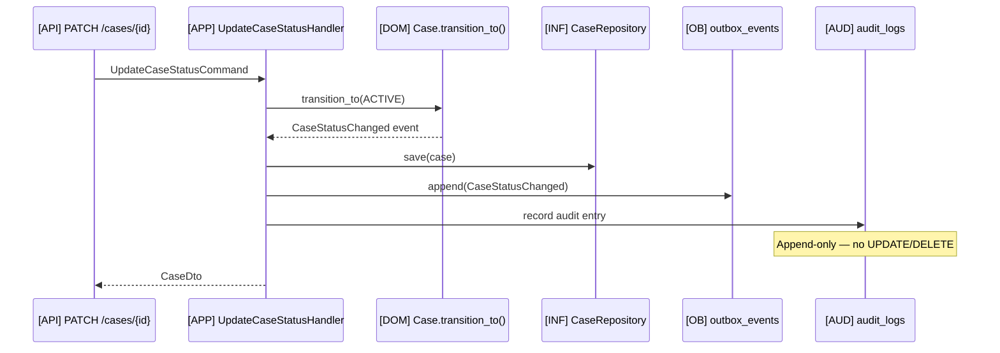

# Example: Audit Log Entry

## Scenario

**Actor:** Intake Coordinator updating case status from `intake` → `active`  
**Goal:** Immutable audit record capturing who, what, when, before/after state  
**Trigger:** Side effect of `UpdateCaseStatusHandler` within same transaction as domain change

---

## Flow



---

## Structural Annotation

| Field | Source |
|-------|--------|
| `id` | UUID generated at write time |
| `firm_id` | From aggregate / actor context |
| `actor_id` | `cmd.actor_id` from JWT |
| `action` | Dot notation: `case.status_changed` |
| `resource_type` | `case` |
| `resource_id` | Case UUID |
| `before_state` | JSON snapshot pre-transition |
| `after_state` | JSON snapshot post-transition |
| `occurred_at` | UTC timestamp |
| `correlation_id` | From request middleware |
| `ip_address` | From request (if available) |
| `user_agent` | From request (if available) |

---

## Audit Row Shape (Structural)

```
audit.audit_logs {
  id: uuid,
  firm_id: uuid,
  actor_id: uuid,
  action: "case.status_changed",
  resource_type: "case",
  resource_id: uuid,
  before_state: { status: "intake", ... },
  after_state: { status: "active", ... },
  correlation_id: uuid,
  occurred_at: timestamptz,
  metadata: { /* optional — no PII document content */ }
}
```

---

## Writer Integration (Pseudocode Location)

```
# Inside UpdateCaseStatusHandler — after domain transition, before commit:
audit_writer.record(
    firm_id=case.firm_id,
    actor_id=cmd.actor_id,
    action="case.status_changed",
    resource_type="case",
    resource_id=case.id,
    before_state=snapshot_before,
    after_state=case.to_audit_snapshot(),
    correlation_id=cmd.correlation_id,
)
```

Pattern: invoked from `[APP]` use case — not from router directly.

---

## Cross-References

- `docs/05-database/audit-schema.md`
- `docs/08-security/compliance-mapping.md`
- `docs/04-api/rest-standards.md` — "Audited: all mutating operations"
- `docs/02-domain/domain-events.md` — audit context is conformist subscriber

---

## Key Decisions Applied

| Rule | Application |
|------|-------------|
| Immutability | INSERT only — no UPDATE/DELETE on audit_logs |
| Same transaction | Audit row commits with aggregate + outbox |
| PII minimization | Snapshots contain IDs/status — not document body text |
| Wall denials | Separate action: `auth.matter_wall_denied` |
| AI approvals | Linked via `audit.approvals` table for HITL |

---

## Actions Catalog (Sample)

| action | resource_type | When |
|--------|---------------|------|
| `case.created` | case | CreateCaseHandler |
| `case.status_changed` | case | Status transition |
| `document.upload_confirmed` | document | ConfirmUploadHandler |
| `ai.summary_requested` | ai_job | RequestSummaryHandler |
| `workflow.execution.completed` | workflow_execution | n8n callback |
| `auth.matter_wall_denied` | case | ABAC deny |
| `approval.granted` | approval | HITL approve |

---

## Query Access (Structural)

```
GET /api/v1/cases/{caseId}/audit-logs
- RBAC: case:audit:read
- Matter wall: required
- Pagination: cursor-based
- Response: envelope with immutable entries
```

UI: `[UI]` infinite query hook — `useCaseAuditLog(caseId)`

---

## Test Matrix (Structural)

| Case | Expected |
|------|----------|
| Successful mutation | audit row with matching before/after |
| Transaction rollback | no audit row persisted |
| Wall deny | audit row for denial (no case details to actor) |
| Retention | rows never deleted per retention policy |

---

## Anti-Patterns

- Audit write in router after use case returns (separate transaction)
- Mutable audit records
- Logging full document content or LLM prompts
- Skipping audit on internal webhook callbacks
