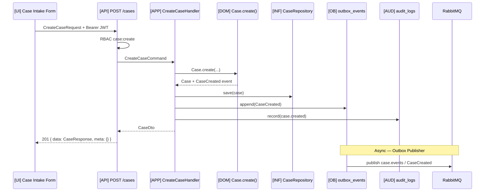

# Example: Create Case API

## Scenario

**Actor:** Intake Coordinator (persona: firm user)  
**Goal:** Create a new legal matter linked to an existing client  
**Trigger:** `POST /api/v1/cases` with JWT + optional `Idempotency-Key`

---

## Flow



---

## Structural Annotation

| Step | Artifact | Pattern |
|------|----------|---------|
| HTTP binding | `apps/api/src/api/v1/cases.py` `@router.post("")` | `api-endpoint-pattern.md` |
| Request schema | `apps/api/.../schemas/cases.py` `CreateCaseRequest` | REST standards |
| Command | `services/case_management/application/commands/create_case.py` | `use-case-pattern.md` |
| Aggregate | `services/case_management/domain/entities/case.py` | `domain-entity-pattern.md` |
| Persist | `services/case_management/infrastructure/repositories/sqlalchemy_case_repo.py` | `repository-pattern.md` |
| Event | `CaseCreated` payload per domain-events.md | `outbox-event-pattern.md` |
| Consumer (later) | `workers/celery/tasks/notification_handlers.py` | `event-handler-pattern.md` |
| UI mutation | `apps/web/src/hooks/useCreateCase.ts` | `react-query-hook-pattern.md` |

---

## Request / Response Shape (Structural)

```
POST /api/v1/cases
Headers: Authorization, Idempotency-Key (optional)
Body: { clientId, title, practiceArea, ... }
→ 201 { data: { id, status: "intake", ... }, meta: {} }
```

---

## Cross-References

- `docs/04-api/endpoints-cases.md` — full contract
- `docs/02-domain/case-aggregate.md` — invariants, status `intake`
- `docs/02-domain/domain-events.md` — `CaseCreated` payload
- `docs/04-api/authorization-rbac.md` — `case:create` permission

---

## Key Decisions Applied

| ADR / Rule | Application |
|------------|-------------|
| ADR-001 | Logic in `services/case_management/`, not router |
| ADR-006 | `CaseCreated` via outbox, same transaction |
| ADR-005 | JWT auth required |
| REST standards | Envelope, idempotency, 201 on create |
| Audit | Immutable log on mutation |

---

## Test Matrix (Structural)

| Case | Expected |
|------|----------|
| Valid intake user | 201 + case in DB + outbox row |
| Missing RBAC | 403 |
| Duplicate idempotency key | Cached 201 response |
| Invalid client_id FK | 422 / domain error |
| Integration | Consumer receives CaseCreated |
