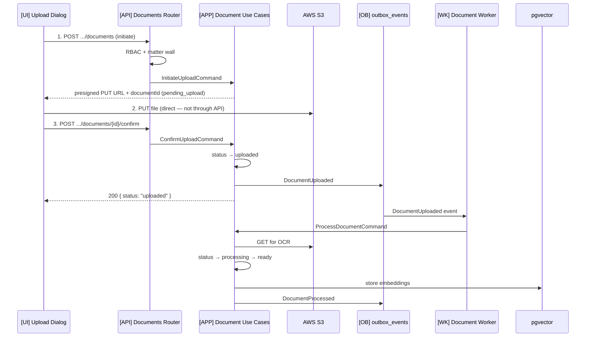

# Example: Document Upload Flow

## Scenario

**Actor:** Associate Attorney uploading a PDF to an active case  
**Goal:** Store binary in S3, persist metadata, trigger OCR + embedding async  
**Trigger:** Three-step presigned upload per `docs/04-api/endpoints-documents.md`

---

## Flow



---

## Structural Annotation

| Phase | Artifacts | Pattern |
|-------|-----------|---------|
| Initiate | `[API]` POST handler, `[APP]` InitiateUploadHandler, `[INF]` S3Adapter.presigned_put | `api-endpoint-pattern`, `use-case-pattern` |
| Client upload | `[UI]` fetch/axios PUT to S3 URL — no API body streaming | `react-page-pattern` |
| Confirm | `[APP]` ConfirmUploadHandler, status transition on Document aggregate | `domain-entity-pattern` |
| Async | `[WK]` on_document_uploaded → ProcessDocumentHandler | `event-handler-pattern`, `celery-task-pattern` |
| Search ready | Document status `ready` — hybrid search enabled | `docs/07-ai/rag-architecture.md` |

---

## Status Lifecycle

```
pending_upload → uploaded → processing → ready
                              ↘ failed (retry available)
```

---

## Cross-References

- `docs/04-api/endpoints-documents.md`
- `docs/02-domain/document-aggregate.md`
- `docs/05-database/documents-schema.md`
- `docs/08-security/encryption.md` — SSE-KMS on S3

---

## Key Decisions Applied

| Rule | Application |
|------|-------------|
| Matter wall | Check before initiate AND confirm — 404 if walled |
| No binary through API | Presigned URLs only |
| Async processing | OCR/embedding in worker, not request thread |
| ADR-006 | DocumentUploaded via outbox |
| Audit | Log upload confirm with document metadata snapshot |

---

## Security Notes

- Presigned PUT: short TTL, content-type constraint, case-scoped key prefix
- Download: separate presigned GET — matter wall on metadata lookup first
- Frontend never stores S3 keys — only documentId from API

---

## Test Matrix (Structural)

| Case | Expected |
|------|----------|
| Walled user initiates | 404 |
| Confirm without S3 PUT | 422 / failed confirm |
| Happy path | ready status + embedding row |
| Worker retry | Idempotent on documentId |
