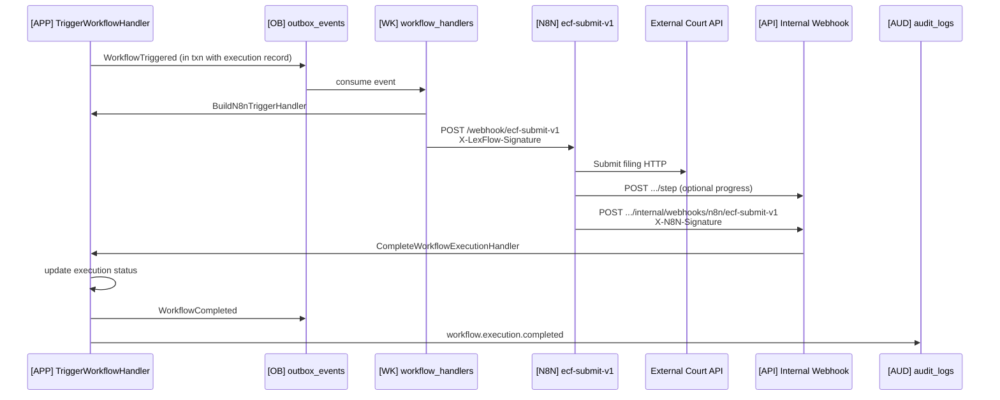

# Example: Workflow Trigger

## Scenario

**Actor:** System (domain event) triggering court e-filing orchestration  
**Goal:** Reliable handoff from FastAPI to n8n, external API calls, callback with result  
**Trigger:** `WorkflowTriggered` event → Celery → n8n webhook

---

## Flow



---

## Structural Annotation

| Component | Location | Pattern |
|-----------|----------|---------|
| Trigger use case | `services/workflow_orchestration/application/` | `use-case-pattern` |
| Event emission | WorkflowTriggered in outbox | `outbox-event-pattern` |
| n8n outbound | `[WK]` signed HTTP to internal ALB | `celery-task-pattern` |
| Workflow JSON | `n8n/workflows/court-filing/ecf-submit-v1.json` | `n8n-workflow-pattern` |
| Callback handler | `apps/api/src/api/v1/internal/webhooks/n8n.py` | `api-endpoint-pattern` (internal) |
| Idempotency | Dedupe on executionId in callback handler | `webhook-contracts.md` |

---

## Trigger Envelope (Structural)

```
{
  executionId, workflowSlug: "ecf-submit-v1",
  correlationId, firmId,
  context: { caseId, triggeredBy, input: { documentIds, courtId } },
  callbackUrl: ".../internal/webhooks/n8n/ecf-submit-v1"
}
```

---

## Callback Envelope (Structural)

```
{
  executionId,
  status: "completed" | "failed",
  outputs: { confirmationNumber, filedAt },
  error: { code, message }  // if failed
}
```

---

## Cross-References

- `docs/06-workflows/webhook-contracts.md`
- `docs/06-workflows/orchestration-model.md`
- `docs/02-domain/workflow-aggregate.md`
- `docs/02-domain/domain-events.md` — WorkflowTriggered, WorkflowCompleted
- `docs/13-decisions/002-n8n-orchestration-only.md`

---

## Key Decisions Applied

| Rule | Application |
|------|-------------|
| ADR-002 | n8n orchestrates HTTP only — eligibility decided before trigger |
| HMAC | Both directions signed |
| Internal ALB | n8n not public |
| Business logic | FastAPI decides *whether* to trigger; n8n decides *how* to call externals |
| Audit | Full execution trail persisted on callback |

---

## Promotion Checklist (Structural)

- [ ] Workflow JSON in repo + CI node scan
- [ ] Slug in workflow-catalog.md
- [ ] Callback handler deployed before workflow activation
- [ ] Staging dry-run with mock external API

---

## Test Matrix (Structural)

| Case | Expected |
|------|----------|
| Invalid HMAC on callback | 401 |
| Duplicate executionId callback | 200 idempotent no-op |
| n8n external failure | error callback → execution failed |
| Missing prohibited nodes | CI blocks merge |
