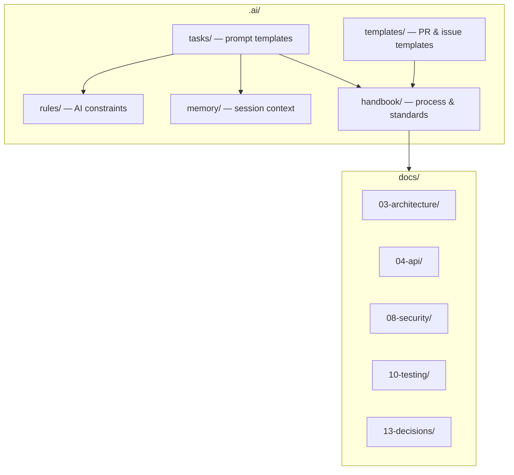

# LexFlow AI — Engineering Handbook

**Version:** 1.0 · **Last Updated:** 2026-07-06

The engineering handbook defines how LexFlow AI is built, reviewed, shipped, and maintained. It complements the canonical architecture documentation in `docs/` and AI-specific guidance in `.ai/tasks/`, `.ai/rules/`, and `.ai/memory/`.

---

## Handbook Index

| Document | Purpose |
|----------|---------|
| [engineering-handbook.md](./engineering-handbook.md) | Complete engineering reference — stack, architecture, standards |
| [development-lifecycle.md](./development-lifecycle.md) | From idea to production — phases, gates, ceremonies |
| [definition-of-ready.md](./definition-of-ready.md) | When a ticket is ready for engineering work |
| [definition-of-done.md](./definition-of-done.md) | When work is complete and shippable |
| [adr-process.md](./adr-process.md) | Architecture Decision Record workflow |

---

## How This Relates to Other Docs

| Layer | Authority | Updates When |
|-------|-----------|--------------|
| `docs/13-decisions/` | Binding architectural decisions | Significant cross-team decisions |
| `docs/` | Technical design and contracts | Feature or architecture changes |
| `.ai/handbook/` | Engineering process and gates | Process changes |
| `.ai/rules/` | AI assistant behavior | Team conventions change |
| `.ai/memory/` | Session-specific context | Per-session |

---

## Quick Reference — Platform Invariants

1. **Case-centric domain** — Cases are the central aggregate; matter walls enforce access
2. **Business logic in FastAPI** — Never in n8n or the frontend
3. **n8n is private** — Orchestration only; not publicly accessible
4. **Async AI** — All LLM calls via queue/worker; human-in-the-loop for legal outputs
5. **Immutable audit** — Append-only audit logs for all significant actions
6. **Event-driven** — Transactional outbox → RabbitMQ → Celery workers
7. **404 deny** — Unauthorized case GET returns 404, not 403 (ADR-007)

---

## Related Resources

- [Documentation Index](../../docs/README.md)
- [Development Standards](../../docs/development-standards.md)
- [AI Task Prompts](../tasks/README.md)
- [PR Template](../templates/pull-request-template.md)
