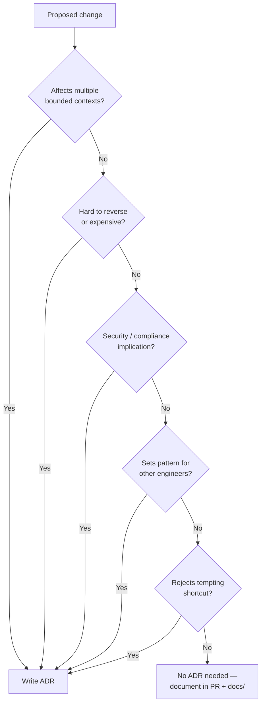
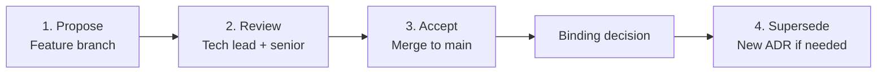

# ADR Process

**LexFlow AI** — Architecture Decision Record Workflow  
**Version:** 1.0 · **Last Updated:** 2026-07-06

---

## Purpose

Define when, how, and where to write Architecture Decision Records (ADRs) for LexFlow AI. ADRs capture binding decisions with context, options, and consequences so the team understands *why* the system is built the way it is.

**Canonical location:** `docs/13-decisions/` (not `docs/adr/` — legacy, deprecated).

---

## When to Write an ADR

Write an ADR when a decision:

- Affects **multiple bounded contexts** or deployment topology
- Is **difficult or expensive to reverse**
- Has **security, compliance, or data residency** implications
- Establishes a **pattern other teams must follow**
- **Rejects a tempting shortcut** (e.g., business logic in n8n, synchronous AI)

### Do NOT Write an ADR For

- Routine library version upgrades
- Single-endpoint request/response shape
- Formatting or naming conventions (see `docs/development-standards.md`)
- Sprint-level task breakdowns
- Bug fix implementation details

---

## Decision Tree



---

## ADR Lifecycle



| Step | Actor | Action |
|------|-------|--------|
| **1. Propose** | Engineer | Draft ADR on feature branch using template below |
| **2. Review** | Tech lead + senior engineer | Validate context, options, alignment with vision and NFRs |
| **3. Accept** | Engineering leadership | Merge to `main` — ADR becomes binding |
| **4. Supersede** | Architect | Create new ADR referencing old number (never edit accepted ADRs) |

---

## ADR Template

Create file: `docs/13-decisions/{NNN}-{kebab-title}.md`

```markdown
# ADR-{NNN}: {Title}

**Status:** Proposed | Accepted | Deprecated | Superseded by ADR-{MMM}
**Date:** YYYY-MM-DD
**Deciders:** {names}

## Purpose
Why this decision exists and what problem it solves.

## Scope
What is and is not covered by this decision.

## Context
Background, constraints, and motivating forces.

## Options
| Option | Pros | Cons |
|--------|------|------|
| A | | |
| B | | |
| C | | |

## Decision
The binding choice and rationale.

## Consequences
### Positive
- What becomes easier

### Negative
- What becomes harder

## Best Practices
How to implement and enforce this decision in code.

## Tradeoffs
| Benefit | Cost |
|---------|------|
| | |

## Future Improvements
Evolution path and triggers for supersession.

## References
- Links to related docs, PRs, external sources
```

---

## Numbering

- Sequential: `001`, `002`, ..., `009`, `010`
- File name: `{NNN}-{kebab-case-title}.md`
- Example: `009-event-sourcing-audit.md`

**Current ADRs (001–008):** See `docs/13-decisions/README.md`

---

## Status Rules

| Status | Meaning | Editable? |
|--------|---------|-----------|
| **Proposed** | Under review; not yet binding | Yes |
| **Accepted** | Merged to main; binding for all new work | No — supersede only |
| **Deprecated** | No longer recommended; no replacement yet | No |
| **Superseded by ADR-{MMM}** | Replaced by newer decision | No |

### Supersession Rules

1. **Never edit** an Accepted ADR — create a new ADR instead
2. New ADR references old: `Supersedes ADR-{NNN}`
3. Update old ADR status: `Superseded by ADR-{MMM}`
4. Update `docs/13-decisions/README.md` index
5. Update cross-references in affected architecture docs

---

## Review Criteria

Reviewers validate:

- [ ] **Context is complete** — reader understands the problem without prior knowledge
- [ ] **Options are fair** — at least 2 alternatives with honest pros/cons
- [ ] **Decision is specific** — not vague ("use best practices")
- [ ] **Consequences are honest** — includes negative impacts
- [ ] **Aligns with vision** — does not contradict `docs/01-product/vision.md` or `non-goals.md`
- [ ] **Aligns with NFRs** — checked against `docs/03-architecture/nfr-requirements.md`
- [ ] **Platform invariants respected** — or explicitly proposes changing one (rare)
- [ ] **Index updated** — README.md in 13-decisions/

---

## ADR in PR Workflow

1. Engineer identifies need for ADR (decision tree above)
2. Draft ADR on feature branch with status `Proposed`
3. Include ADR in same PR as implementation (preferred) or ADR-only PR first
4. Tech lead + senior engineer review ADR before code review
5. On merge: status → `Accepted`
6. Implementation PR references ADR: `Implements ADR-{NNN}`

---

## Existing ADR Summary

| ADR | Title | Key Rule |
|-----|-------|----------|
| 001 | Modular Monolith | Start monolith; bounded contexts as packages |
| 002 | n8n Orchestration Only | No business logic in n8n |
| 003 | PostgreSQL Single Database | Schema separation, not multiple DBs |
| 004 | Async AI Processing | All LLM via worker queue |
| 005 | JWT Authentication | JWT + refresh tokens |
| 006 | Transactional Outbox | Events via outbox, not direct publish |
| 007 | Matter Walls 404 Deny | 404 not 403 on unauthorized GET |
| 008 | Azure OpenAI Primary | Production default LLM provider |

---

## AI-Assisted ADR Writing

Use `.ai/tasks/generate-documentation.md` with:
- `{{doc_type}}` = `adr`
- `{{topic}}` = your decision title
- Load: `docs/13-decisions/README.md`, relevant architecture docs, `.ai/memory/`, `.ai/rules/`

---

## References

- [ADR Index](../../docs/13-decisions/README.md)
- [Engineering Handbook](./engineering-handbook.md)
- [Development Lifecycle](./development-lifecycle.md)
- [Product Vision](../../docs/01-product/vision.md)
- [NFR Requirements](../../docs/03-architecture/nfr-requirements.md)
