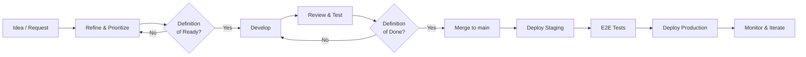

# Development Lifecycle

**LexFlow AI** — From Idea to Production  
**Version:** 1.0 · **Last Updated:** 2026-07-06

---

## Purpose

Define the end-to-end engineering lifecycle for LexFlow AI — from backlog intake through production deployment and post-release monitoring. Every feature, fix, and tech-debt item follows these phases and gates.

---

## Lifecycle Overview

---

## Phase 1 — Intake & Refinement

| Activity | Owner | Output |
|----------|-------|--------|
| Capture request | Product / Engineering | GitHub issue (feature, bug, or tech-debt template) |
| Triage | Tech lead | Priority, size estimate, bounded context |
| Refine | Engineer + Product | Acceptance criteria, API/UI sketch, security notes |
| Ready check | Tech lead | Issue meets [Definition of Ready](./definition-of-ready.md) |

**Gate:** Issue labeled `ready` and assigned before engineering starts.

---

## Phase 2 — Design (if needed)

Required for:
- New bounded context or aggregate
- New API resource group
- Schema changes
- n8n workflow with new external integration
- Security-sensitive changes

| Activity | Owner | Output |
|----------|-------|--------|
| Domain design | Backend engineer | Entity/event updates in `docs/02-domain/` |
| API contract | Backend engineer | Endpoint spec in `docs/04-api/` |
| UI wireframe | Frontend engineer | Component structure in `docs/12-ui/` |
| Schema design | Backend engineer | ER diagram in `docs/05-database/` |
| ADR (if significant) | Architect | Draft in `docs/13-decisions/` per [adr-process.md](./adr-process.md) |
| Security review | Security reviewer | Threat notes for privileged data paths |

**Gate:** Design reviewed by tech lead; ADR accepted if required.

---

## Phase 3 — Development

| Activity | Owner | Output |
|----------|-------|--------|
| Branch | Engineer | `feat/`, `fix/`, or `chore/` branch from `main` |
| Implement | Engineer | Code in `apps/`, `services/`, `workers/`, `n8n/` |
| Unit tests | Engineer | pytest / Vitest per `.ai/tasks/generate-unit-tests.md` |
| Integration tests | Engineer | API + matter wall tests per `.ai/tasks/generate-integration-tests.md` |
| Migration | Engineer | Alembic migration if schema change |
| Docs | Engineer | Updated `docs/` in same PR |
| Self-review | Engineer | Run `make lint`, `make test` locally |

**AI assistance:** Use `.ai/tasks/` templates. Load `.ai/memory/`, `.ai/rules/`, `docs/`.

**Branch lifetime:** ≤ 3 days (prefer ≤ 1 day).

---

## Phase 4 — Review & Quality Gates

| Activity | Owner | Output |
|----------|-------|--------|
| Open PR | Engineer | PR using [pull-request-template](../templates/pull-request-template.md) |
| CI pipeline | GitHub Actions | Lint → unit → integration → matter wall → Trivy |
| Code review | Peer engineer | Approval per `.ai/tasks/review-code.md` |
| Security review | Security reviewer (if auth/data) | Per `.ai/tasks/review-security.md` |
| ADR review | Tech lead (if ADR in PR) | Per [adr-process.md](./adr-process.md) |

**PR merge blockers:**
1. All CI checks pass
2. Matter wall tests pass (if auth touched)
3. Minimum 1 approval
4. No CRITICAL/HIGH vulnerabilities
5. Coverage does not decrease on domain + application

---

## Phase 5 — Staging & E2E

| Activity | Owner | Output |
|----------|-------|--------|
| Auto-deploy staging | CI/CD | Staging environment updated |
| E2E tests | CI / QA | Playwright suite on staging |
| Manual verification | Engineer or QA | Critical path walkthrough |
| n8n promotion | Integration engineer | Workflow imported to staging n8n |

**Gate:** E2E passes; manual sign-off for critical features.

---

## Phase 6 — Production Deployment

| Activity | Owner | Output |
|----------|-------|--------|
| Release approval | Tech lead / Engineering lead | Manual production gate |
| Deploy | CI/CD or SRE | Zero-downtime rolling deploy |
| Migration | Automated (Alembic) | Schema updated with rollback plan |
| n8n promotion | Integration engineer | Workflow imported to production n8n |
| Smoke test | On-call engineer | Health checks, critical path |
| Monitor | SRE | 24h elevated monitoring |

See: `docs/14-playbooks/deploy-production.md`

---

## Phase 7 — Post-Release

| Activity | Owner | Output |
|----------|-------|--------|
| Monitor dashboards | SRE | No P1/P2 alerts |
| Success metrics | Product | KPI tracking per `docs/01-product/success-metrics.md` |
| Retrospective | Team | Process improvements (if incident or delay) |
| Close issue | Engineer | Issue closed with release reference |

---

## Ceremonies

| Ceremony | Frequency | Participants | Purpose |
|----------|-----------|--------------|---------|
| Standup | Daily | Engineering team | Blockers, progress |
| Refinement | Weekly | Eng + Product | Groom backlog, check DoR |
| Architecture review | Bi-weekly | Tech leads + architects | ADRs, cross-cutting design |
| Security review | Monthly | Security + Eng | Threat model updates |
| Retro | Bi-weekly | Engineering team | Process improvement |

---

## Issue Type Workflows

### Feature
Intake → DoR → Design (if needed) → Dev → Review → Staging → E2E → Production

### Bug
Intake → Triage (severity) → DoR (lightweight) → Fix → Review → Staging → Production (hotfix if P1)

### Tech Debt
Intake → Prioritize → DoR → Dev → Review → Merge (may skip E2E if no user-facing change)

---

## Severity & Response Times

| Severity | Definition | Response | Deploy |
|----------|------------|----------|--------|
| P1 | Production down; data breach | Immediate | Hotfix branch |
| P2 | Major feature broken | < 4 hours | Same-day fix |
| P3 | Minor feature degraded | < 2 business days | Normal PR |
| P4 | Cosmetic / low impact | Next sprint | Normal PR |

See: `docs/14-playbooks/incident-triage.md`

---

## References

- [Definition of Ready](./definition-of-ready.md)
- [Definition of Done](./definition-of-done.md)
- [ADR Process](./adr-process.md)
- [Engineering Handbook](./engineering-handbook.md)
- [Development Standards](../../docs/development-standards.md)
- [CI/CD Pipeline](../../docs/09-deployment/cicd-pipeline.md)
