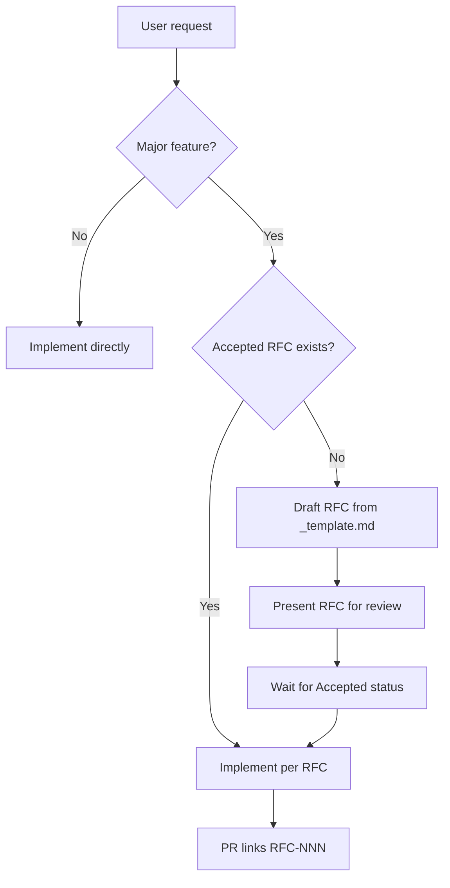

# RFC Process — AI Assistant Guide

**LexFlow AI** — Design Before Code  
**Version:** 1.0 · **Last Updated:** 2026-07-06

---

## Purpose

When the user asks to **implement a major feature**, **start a sprint epic**, or **build a new module**, check for an **Accepted RFC** first. If none exists, **draft the RFC** before writing production code.

**Canonical process:** [`docs/18-rfc/README.md`](../../docs/18-rfc/README.md)

---

## RFC vs ADR — Quick Decision

| Situation | Document |
|-----------|----------|
| New feature, API group, UI flow, integration | **RFC** → `docs/18-rfc/` |
| Irreversible architecture fork (DB topology, auth model) | **ADR** → `docs/13-decisions/` |
| Feature RFC reveals architecture fork | **ADR in same PR** as RFC acceptance |

---

## When to Block Implementation

**Stop and write/draft RFC** if the user request involves:

- New bounded context or module under `services/`
- New `/api/v1/{resource}` group
- AI/LLM, RAG, or HITL flows
- n8n workflow with new external integration
- Case-scoped feature with matter wall implications
- Cross-cutting API + UI + worker deliverable

**Proceed without RFC** for: bug fixes, refactors without contract change, docs, deps, styling within design system.

---

## Workflow for AI Assistants



### Steps

1. **Search** `docs/18-rfc/` for existing RFC (README index)
2. **If Planned stub only** — expand stub into full RFC using `_template.md`
3. **If Draft** — help author complete open sections; do not implement yet unless user explicitly overrides
4. **If Accepted** — load RFC + related ADRs + domain docs; implement to spec
5. **On deviation** — update RFC **Implementation Notes** in same PR

---

## RFC Draft Quality Bar

Before marking **In Review**, ensure:

- Problem, goals, non-goals filled
- API sketch with envelope + RFC 7807 errors
- Matter wall matrix if case-scoped
- ADR-004 async path if AI
- ADR-002 n8n boundary if workflows
- Implementation plan with story breakdown
- Open questions listed

Use task prompt: [`.ai/tasks/create-rfc.md`](../tasks/create-rfc.md)

---

## PR Body (RFC-covered features)

```markdown
## RFC
Implements [RFC-NNN: Title](../../docs/18-rfc/RFC-NNN-slug.md)

### RFC Compliance
- [ ] Matches accepted RFC behavior
- [ ] Deviations noted in RFC Implementation Notes
```

---

## References

- [RFC README](../../docs/18-rfc/README.md)
- [RFC Template](../../docs/18-rfc/_template.md)
- [Definition of Ready](./definition-of-ready.md)
- [ADR Process](./adr-process.md)
- [Development Lifecycle](./development-lifecycle.md)
