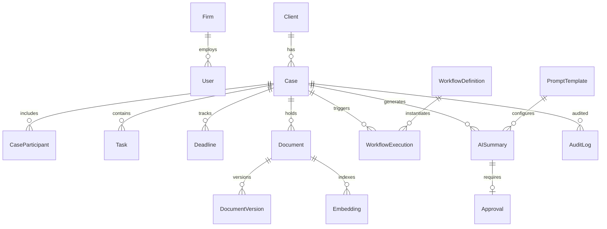

# LexFlow AI — Domain Model Summary

**Purpose:** Bounded contexts, aggregates, and integration rules for AI assistants.  
**Authoritative source:** `docs/02-domain/bounded-contexts.md`, aggregate docs in `docs/02-domain/`

---

## Eight Bounded Contexts

| # | Context | Schema | Aggregate Roots | Publishes Events |
|---|---------|--------|-----------------|------------------|
| 1 | **Identity & Access** | `identity` | User, Role, Firm | UserCreated, RoleAssigned, UserDeactivated |
| 2 | **Client Management** | `cases`* | Client, Contact | ClientCreated, ClientUpdated, ClientPortalEnabled |
| 3 | **Case Management ★** | `cases` | **Case** | CaseCreated, CaseStatusChanged, TaskCreated, TaskCompleted, DeadlineApproaching, CaseParticipantAdded |
| 4 | **Document Management** | `documents` | Document | DocumentUploaded, DocumentProcessed, DocumentVersionCreated, DocumentArchived |
| 5 | **Workflow Orchestration** | `workflows` | WorkflowDefinition, WorkflowExecution | WorkflowTriggered, WorkflowCompleted, WorkflowFailed |
| 6 | **AI & Knowledge** | `ai` | AISummary, PromptTemplate | SummaryGenerated, SummaryApproved, EmbeddingCompleted, ResearchCompleted |
| 7 | **Audit & Compliance** | `audit` | AuditLog, Approval | ApprovalRequested, ApprovalDecided, ApprovalExpired |
| 8 | **Notifications** | `shared` | Notification | NotificationSent, NotificationFailed |

\* Client Management owns `clients` table in `cases` schema — separate aggregate boundary, shared schema for join efficiency.

★ **Case Management is central.** All case-scoped features reference Case aggregate.

---

## Context Map (Integration)

```
Identity ──Customer-Supplier──► Case Management
Client ────Customer-Supplier──► Case Management
Case ──────Customer-Supplier──► Document Management
Case ──────Customer-Supplier──► Workflow Orchestration
Case ──────Customer-Supplier──► AI & Knowledge
Document ──Customer-Supplier──► AI & Knowledge
Workflow ──Customer-Supplier──► Notifications
AI ────────Customer-Supplier──► Audit & Compliance
All contexts ──Conformist──► Audit & Compliance
```

**Integration rules:**
1. No context writes another context's tables directly
2. Cross-context effects via domain events (outbox → RabbitMQ)
3. Synchronous cross-context calls only for read validation (e.g., validate ClientId exists)
4. Audit is conformist — records events, never influences upstream models

Detail: `architecture/BOUNDED-CONTEXTS.md`

---

## Aggregate Summaries

### Case (Central Aggregate Root)

**Context:** Case Management  
**Schema:** `cases.cases`

**Child entities:** Task, Deadline, Hearing, Note, CaseParticipant  
**Value objects:** CaseNumber, BillingCode, PracticeArea  
**References:** `clientId`, `leadAttorneyId`, `firmId`

**Status machine:**
```
intake → active → closed → archived
         ↑ reopen (Managing Partner)
```

**Invariants:**
- Lead attorney required at creation; must be participant with role `lead`
- Matter wall: only participants + authorized firm roles access case data
- Closed cases: no new tasks/documents without reopen
- Optimistic concurrency via `version` column

**Events:** CaseCreated, CaseStatusChanged, TaskCompleted, DeadlineApproaching, DeadlineMissed

Doc: `docs/02-domain/case-aggregate.md`

---

### Client

**Context:** Client Management  
**Schema:** `cases.clients`

**Child entities:** Contact (for organization clients)  
**Types:** individual, organization  
**Invariants:** Cannot hard-delete while active Cases reference `clientId`

**Events:** ClientCreated, ClientUpdated, ClientPortalEnabled

Doc: `docs/02-domain/client-aggregate.md`

---

### Document

**Context:** Document Management  
**Schema:** `documents.documents`, `documents.document_versions`

**Child entities:** DocumentVersion  
**Storage:** S3 binary + PostgreSQL metadata + OCR text  
**Status:** uploading → processing → ready (also: archived)

**Invariants:**
- Versions immutable and monotonic
- All documents require valid `caseId`
- Embeddings generated after DocumentProcessed event

**Events:** DocumentUploaded, DocumentProcessed, DocumentVersionCreated

Doc: `docs/02-domain/document-aggregate.md`

---

### WorkflowDefinition & WorkflowExecution

**Context:** Workflow Orchestration  
**Schema:** `workflows.workflow_definitions`, `workflows.workflow_executions`

**Definition:** Template with slug, trigger type (manual/event/schedule), n8n workflow ref  
**Execution:** Single run with status (queued → running → completed/failed/cancelled), input/output payloads, step records

**Invariants:**
- FastAPI decides IF workflow runs (auth + business rules)
- n8n decides HOW external calls execute
- Idempotency key prevents duplicate executions
- Firm-wide workflows may have null `caseId`

**Events:** WorkflowTriggered, WorkflowCompleted, WorkflowFailed, WorkflowCancelled

Doc: `docs/02-domain/workflow-aggregate.md`

---

### AISummary & PromptTemplate

**Context:** AI & Knowledge  
**Schema:** `ai.ai_summaries`, `ai.prompt_templates`, `ai.prompt_history`, `ai.llm_usage`

**AISummary status:** generating → draft → approved/rejected  
**PromptTemplate:** Versioned Jinja2 + model_config (provider, model, temperature, requires_approval)

**Invariants:**
- All inference async (ADR-004)
- Draft summaries not team-visible until attorney approval (HITL)
- Every LLM call logged in prompt_history + llm_usage
- PII redaction before external LLM call

**Events:** SummaryGenerated, SummaryApproved, SummaryRejected, EmbeddingCompleted

Doc: `docs/02-domain/ai-aggregate.md`

---

### Approval

**Context:** Audit & Compliance  
**Schema:** `audit.approvals`

**Purpose:** Human authorization gate for AI outputs, document sends, workflow steps  
**Fields:** requester, decider, decision, reason, expires_at

**Events:** ApprovalRequested, ApprovalDecided, ApprovalExpired

---

### AuditLog

**Context:** Audit & Compliance  
**Schema:** `audit.audit_logs`

**Rule:** Append-only. INSERT permission only for app role.  
**Consumed by:** Compliance officer search, incident investigation, deny-path debugging (internal)

---

## Entity Relationship (Conceptual)



---

## Case Creation Flow (Cross-Context)

```
1. Case Management validates ClientId (Client Management)
2. Case Management validates leadAttorneyId + RBAC (Identity)
3. Create Case (status: intake) + CaseParticipant (lead)
4. Same transaction: outbox CaseCreated + audit log
5. Async: Workflow Orchestration receives CaseCreated → intake workflow
6. Async: Notifications → lead attorney
```

---

## Module Mapping (Planned Code)

```
services/
├── identity/
├── case_management/
├── client_management/
├── document_management/
├── workflow_orchestration/
├── ai_knowledge/
├── audit_compliance/
└── notifications/
```

Each module: `domain/`, `application/`, `infrastructure/` — no cross-module domain imports.

Doc: `docs/folder-structure.md`, `docs/03-architecture/component-architecture.md`

---

## Domain Events Quick Reference

| Event | Publisher | Primary Consumer |
|-------|-----------|------------------|
| CaseCreated | Case | Workflow (intake), Notifications |
| DocumentProcessed | Document | AI (embeddings, summary eligibility) |
| WorkflowCompleted | Workflow | Case (timeline), Notifications |
| SummaryGenerated | AI | Audit (approval request), Notifications |
| ApprovalDecided | Audit | AI (status update), Notifications |

Full catalog with JSON payloads: `docs/02-domain/domain-events.md`

---

## DDD Rules for AI Assistants

1. **One aggregate per transaction** — modify one aggregate root per unit of work
2. **Reference by ID** — cross-aggregate refs via UUID, not embedded objects
3. **Events for side effects** — don't call another context's write methods
4. **Repository per aggregate** — infrastructure layer only
5. **Commands name intent** — `CreateCaseCommand`, not `CaseService.create()`
