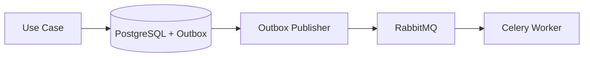

# Design Principles — LexFlow AI

**Applies to:** Architecture decisions, new features, refactors  
**Docs:** `docs/03-architecture/`, `docs/02-domain/`, `docs/13-decisions/`

---

## Purpose

Encode the **foundational design principles** AI assistants must follow when proposing or implementing changes. When in doubt, these principles override local convenience.

---

## Core Principles

### 1. Case-Centric Domain

Cases (matters) are the central aggregate. Most resources are case-scoped. Authorization flows through case participation and matter walls.

| Implication | Action |
|-------------|--------|
| New feature touches legal data | Determine case scope first |
| Cross-case queries | Require firm-wide permission + audit |
| AI retrieval | Scoped to authorized case documents only |

**Ref:** `docs/02-domain/case-aggregate.md`, `docs/08-security/matter-walls.md`

### 2. Modular Monolith (ADR-001)

Start as one deployable API with bounded contexts as Python packages. Extract services only when ADR supersedes.

| Do | Don't |
|----|-------|
| Enforce context boundaries via imports and schemas | Create microservices prematurely |
| Share `services/shared/` kernel for cross-cutting | Create circular dependencies between contexts |

### 3. Hexagonal Architecture in `services/`

Each bounded context has `domain/`, `application/`, `infrastructure/`.

```
domain/           Pure Python — entities, events, repository ports
application/      Use cases — commands, queries, DTOs
infrastructure/   Adapters — SQLAlchemy, S3, HTTP, n8n bridge
```

**Dependency rule:** inward only. Domain never imports FastAPI, SQLAlchemy, or Celery.

### 4. FastAPI Owns Business Logic (ADR-002)

n8n orchestrates HTTP sequences. FastAPI decides **if**, **when**, and **what it means**.

| Layer | Owns |
|-------|------|
| FastAPI | Authorization, validation, state, audit, domain events |
| n8n | External HTTP calls, retries, payload transforms |
| Frontend | Presentation, UX permissions hints (not enforcement) |

### 5. Event-Driven Consistency (ADR-006)

Domain events publish via transactional outbox. Never call RabbitMQ directly from use cases without outbox.



### 6. Async AI (ADR-004)

All LLM calls go through queue → worker. API returns `202 Accepted` with job ID.

| Do | Don't |
|----|-------|
| Return job status endpoint | Block HTTP request waiting for LLM |
| Require HITL for legal outputs | Auto-publish AI summaries to clients |
| Meter tokens per firm/case | Run unbounded LLM calls without quota checks |

### 7. Security by Default

- JWT auth on all routes except `/auth/*` and `/health`
- Matter walls: 404 on GET deny (ADR-007)
- Immutable audit for mutating operations
- PII redaction in logs and prompt history

---

## Bounded Contexts

| Context | Owns | Must Not Own |
|---------|------|--------------|
| Identity & Access | Users, roles, sessions | Case business rules |
| Case Management | Cases, participants, tasks | Document storage |
| Document Management | Files, versions, OCR state | Workflow execution logic |
| Workflow Orchestration | Executions, n8n bridge | External API business interpretation |
| AI & Knowledge | Prompts, embeddings, summaries | Authorization decisions |
| Audit & Compliance | Audit log, approvals | Domain entity lifecycle |

**Ref:** `docs/02-domain/bounded-contexts.md`

---

## Anti-Patterns (Reject in Review)

| Anti-Pattern | Why Forbidden | Correct Approach |
|--------------|---------------|------------------|
| Business logic in n8n Code node | Untestable; no audit | FastAPI use case + callback |
| Frontend RBAC enforcement | Bypassable | FastAPI authorization middleware |
| Cross-matter AI context | Ethics violation | Case-scoped retrieval only |
| Direct DB access from n8n | No matter walls | FastAPI internal webhook |
| Synchronous LLM in API handler | Timeouts; poor UX | Async worker path |
| Shared mutable global state | Race conditions | Inject dependencies; use DB state |
| ORM models returned from API | Leaky abstraction | Pydantic response DTOs |

---

## Decision Framework for AI Assistants

Before implementing, answer:

1. **Which bounded context owns this?** — If unclear, stop and ask.
2. **Is this business logic?** — If yes, it goes in `services/`, not n8n or frontend.
3. **Does this touch case data?** — If yes, matter wall tests required.
4. **Is this a breaking API change?** — If yes, check versioning policy.
5. **Does this need an ADR?** — Multi-context, hard-to-reverse, or security impact → ADR.

---

## Tradeoff Guidance

| Tempting Shortcut | Long-Term Cost | Preferred Pattern |
|-------------------|----------------|-------------------|
| Logic in n8n for speed | Compliance risk; untestable | FastAPI use case + thin n8n |
| Skip outbox for "simple" events | Lost events on crash | Transactional outbox |
| Frontend permission checks only | Security bypass | API enforcement + UX hints |
| Raw SQL in handlers | N+1, no domain invariants | Repository in infrastructure |

---

## References

- [docs/13-decisions/001-modular-monolith.md](../../docs/13-decisions/001-modular-monolith.md)
- [docs/13-decisions/002-n8n-orchestration-only.md](../../docs/13-decisions/002-n8n-orchestration-only.md)
- [docs/13-decisions/004-async-ai-processing.md](../../docs/13-decisions/004-async-ai-processing.md)
- [docs/13-decisions/006-transactional-outbox.md](../../docs/13-decisions/006-transactional-outbox.md)
- [docs/13-decisions/007-matter-walls-404-deny.md](../../docs/13-decisions/007-matter-walls-404-deny.md)
- [design-principles.md](./design-principles.md) → [backend-standards.md](./backend-standards.md)
