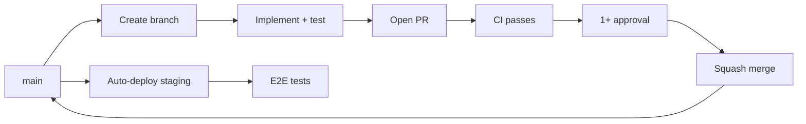

# Git Workflow — LexFlow AI

**Applies to:** All contributors  
**Docs:** `docs/development-standards.md`, `docs/09-deployment/cicd-pipeline.md`

---

## Purpose

Trunk-based development with short-lived feature branches. `main` is always deployable. PRs are the only path to merge.

---

## Commit Author (Repository Default)

All commits in **`abhishekthatguy/luxflow-ai`** use:

| Field | Value |
|-------|-------|
| **Name** | `abhishek` |
| **Email** | `abhishekthatguy@gmail.com` |

Per-commit (without changing global git config):

```bash
export GIT_AUTHOR_NAME="abhishek"
export GIT_AUTHOR_EMAIL="abhishekthatguy@gmail.com"
export GIT_COMMITTER_NAME="abhishek"
export GIT_COMMITTER_EMAIL="abhishekthatguy@gmail.com"
git commit -m "your message"
```

Or one line:

```bash
GIT_AUTHOR_NAME="abhishek" GIT_AUTHOR_EMAIL="abhishekthatguy@gmail.com" \
GIT_COMMITTER_NAME="abhishek" GIT_COMMITTER_EMAIL="abhishekthatguy@gmail.com" \
git commit -m "your message"
```

---

## Branching Model

```
main (protected)
  ├── feat/case-intake-api
  ├── fix/matter-wall-bypass
  ├── chore/upgrade-dependencies
  └── docs/api-versioning-guide
```

| Rule | Detail |
|------|--------|
| Branch from | `main` only |
| Merge method | **Squash merge** |
| PR required | Yes — minimum 1 approval |
| CI required | All checks pass before merge |
| Max branch lifetime | 3 days (prefer ≤ 1 day) |
| Force push `main` | **Forbidden** |

---

## Workflow Steps



### 1. Start Work

```bash
git checkout main
git pull origin main
git checkout -b feat/short-description
```

### 2. Develop

```bash
make lint
make test              # unit + integration
# matter wall tests must pass before push
```

### 3. Open PR

- Fill PR template — explain **why**
- Link related issues/ADRs
- Keep PR < 500 lines

### 4. Review & Merge

- Address review comments
- Squash merge to `main`
- Delete branch after merge

---

## Protected Branch Rules (`main`)

| Rule | Enforcement |
|------|-------------|
| PR required | GitHub branch protection |
| Status checks | lint, unit, integration, matter wall, Trivy |
| Review approval | ≥ 1 |
| No direct push | Except break-glass (incident, documented) |
| Signed commits | Recommended |

---

## CI Pipeline Gates

| Stage | Blocker? |
|-------|----------|
| Lint (ruff, mypy, eslint, tsc) | Yes |
| Unit tests | Yes |
| Integration + matter wall | **Yes** |
| Container scan (Trivy) | Yes on CRITICAL/HIGH |
| Build | Yes |
| E2E (post-merge staging) | Yes before prod |

**Ref:** `docs/09-deployment/cicd-pipeline.md`, `docs/10-testing/README.md`

---

## Deployment Flow

| Environment | Trigger |
|-------------|---------|
| Staging | Auto on merge to `main` |
| Production | Manual approval gate |

**Ref:** `docs/14-playbooks/deploy-production.md`

---

## Hotfix Process

For production incidents:

1. Branch `fix/{incident-short-name}` from `main`
2. Minimal fix + regression test
3. Expedited review (1 senior approver)
4. Squash merge → staging verify → prod deploy
5. Post-incident: `docs/14-playbooks/incident-triage.md`

| Do | Don't |
|----|-------|
| Add regression test for hotfix | Push directly to `main` without PR |
| Document in incident channel | Skip matter wall tests on auth hotfix |

---

## Do / Don't

| Do | Don't |
|----|-------|
| Rebase or merge `main` into branch before PR | Let branch drift > 3 days |
| Squash merge for clean history | Merge commit chains on feature branches |
| One logical change per PR | Bundle unrelated refactors |
| Run `make test` locally before push | Rely on CI to catch missing tests |
| Delete merged branches | Accumulate stale branches |

---

## Special Paths

| Change Type | Extra Steps |
|-------------|-------------|
| Database migration | Staging deploy + rollback test |
| n8n workflow | Staging import smoke test before prod |
| ADR | `docs/13-decisions/` + `.ai/rules/` update |
| Breaking API | Versioning review + ADR |
| Secrets rotation | `docs/14-playbooks/rotate-secrets.md` — no git |

---

## Git Workflow Checklist

- [ ] Branch named per `branch-naming.md`
- [ ] Commits follow `commit-message-standards.md`
- [ ] PR description explains why
- [ ] CI green
- [ ] 1+ approval
- [ ] Matter wall tests pass
- [ ] Squash merge used
- [ ] Branch deleted after merge

---

## References

- [branch-naming.md](./branch-naming.md)
- [commit-message-standards.md](./commit-message-standards.md)
- [code-review-checklist.md](./code-review-checklist.md)
- [docs/development-standards.md](../../docs/development-standards.md)
- [docs/09-deployment/cicd-pipeline.md](../../docs/09-deployment/cicd-pipeline.md)
