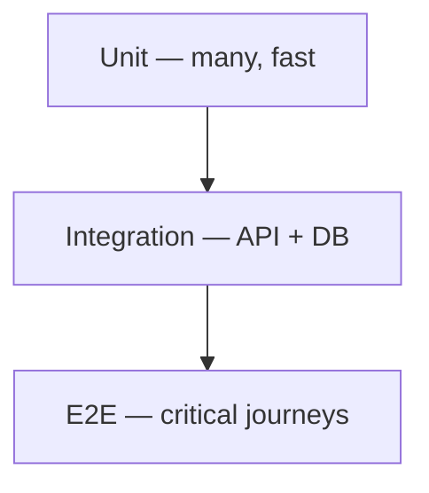

# Testing Standards — LexFlow AI

**Applies to:** All test code in `services/`, `apps/`, `tests/`  
**Docs:** `docs/10-testing/`

---

## Purpose

Testing pyramid, tooling, CI gates, and **non-negotiable matter wall coverage**. Authorization regressions are compliance incidents.

---

## Testing Pyramid

| Layer | Tool | When | Target Duration |
|-------|------|------|-----------------|
| Unit (backend) | pytest | Every PR | < 10 s |
| Unit (frontend) | Vitest | Every PR | < 30 s |
| Integration | pytest + Testcontainers | Every PR | < 5 min |
| E2E | Playwright | Post-deploy staging | < 15 min |
| Load | k6 | Pre-release | On demand |
| Security | pytest + Trivy | Every PR | < 2 min scan |



---

## PR Merge Blockers

1. All unit and integration tests pass
2. **Matter wall suite passes** — no exceptions
3. No CRITICAL/HIGH container vulnerabilities (Trivy)
4. Domain + application line coverage does not decrease
5. No secrets in diff

---

## Matter Wall Tests (Non-Negotiable)

| Rule | Requirement |
|------|-------------|
| Every PR | Full matter wall integration suite passes |
| Auth-touching PRs | RBAC matrix + matter wall matrix |
| New case-scoped endpoint | Matter wall tests **before merge** |
| GET deny | Assert **404**, not 403 |
| Deny audit | Assert `denied_matter_wall` audit entry |

### Test Matrix Dimensions

| Dimension | Values |
|-----------|--------|
| Role | Attorney, Paralegal, Client, ManagingPartner, ... |
| Participant state | lead, associate, non-participant |
| Permission scope | assigned, firm, admin |
| HTTP method | GET, POST, PATCH, DELETE |

**Ref:** `docs/10-testing/integration-testing.md`, `docs/08-security/matter-walls.md`

---

## Unit Testing

### Backend (pytest)

| Layer | What to Test |
|-------|--------------|
| `domain/` | Entity invariants, domain events, pure logic |
| `application/` | Handler orchestration with mocked ports |

| Do | Don't |
|----|-------|
| Zero I/O in domain tests | Import SQLAlchemy in domain tests |
| Test invariant violations raise correct domain exception | Test private method names |
| Use factories for entities | Hardcode UUIDs across tests |

```python
# GOOD — domain invariant test
def test_assign_participant_requires_lead_role():
    case = CaseFactory.with_participant(role="associate")
    with pytest.raises(InsufficientParticipantPermission):
        case.assign_participant(user_id=uuid4(), role="paralegal", actor=non_lead_id)
```

### Frontend (Vitest)

| Do | Don't |
|----|-------|
| Test user-visible behavior | Test internal state implementation |
| Mock API at SDK layer | Mock every child component |
| Wrap with QueryClientProvider for hooks | Test auth enforcement (backend's job) |

**Ref:** `docs/10-testing/unit-testing.md`

---

## Integration Testing

| Rule | Detail |
|------|--------|
| Testcontainers | Real PostgreSQL, Redis, RabbitMQ |
| API-level tests | Full request → response against running app |
| No in-memory SQLite | Misses pgvector, constraints |
| Factories for data | `docs/10-testing/test-data.md` |

```python
# GOOD — matter wall integration test
@pytest.mark.parametrize("role,is_participant,expected_status", [
    ("Attorney", True, 200),
    ("Attorney", False, 404),
    ("ManagingPartner", False, 200),  # firm read override
])
async def test_get_case_matter_wall(client, role, is_participant, expected_status):
    ...
```

**Ref:** `docs/10-testing/integration-testing.md`

---

## E2E Testing (Playwright)

~10 critical journeys on staging after deploy:

- Login → case list → case detail
- Document upload → processing status
- Workflow trigger → completion
- AI summary submit → poll → approval
- Client portal isolation

| Do | Don't |
|----|-------|
| Fix flaky tests at root cause | Skip with `@skip` without ticket |
| Use test accounts from seed | Use production credentials |
| Assert no case ID leakage in network on 404 | Only check UI visibility |

**Ref:** `docs/10-testing/e2e-testing.md`

---

## Security Testing

| Area | Method |
|------|--------|
| RBAC matrix | Parameterized integration tests |
| Injection | SQL, XSS, prompt injection samples |
| Container scan | Trivy on every PR |
| Dependency scan | Dependabot + CI |

**Ref:** `docs/10-testing/security-testing.md`

---

## Test Data Policy

| Do | Don't |
|----|-------|
| Factories and anonymized seeds | Real client names or matter details |
| Unique data per test | Shared mutable fixtures |
| Clean up after integration tests | Leave test data in shared DB |

**Ref:** `docs/10-testing/test-data.md`

---

## TDD Requirements

| Change Type | TDD Required? |
|-------------|---------------|
| Matter wall / RBAC | **Yes — mandatory** |
| Domain invariant | Yes |
| UI styling | No |
| CRUD with existing patterns | Tests required; TDD optional |

---

## Coverage Targets

| Layer | Target |
|-------|--------|
| `domain/` + `application/` | 90% line coverage (enforced) |
| `infrastructure/` | Advisory |
| Frontend components | Critical paths only |

---

## Test Naming

| Layer | Pattern |
|-------|---------|
| Integration | `TEST-INT-MW-{nnn}` |
| Unit | `TEST-UNIT-{context}-{nnn}` |
| E2E | `TEST-E2E-{journey}-{nnn}` |

---

## Testing PR Checklist

- [ ] Unit tests for changed domain/application logic
- [ ] Integration tests for new/changed endpoints
- [ ] Matter wall tests for case-scoped routes
- [ ] 404 asserted on unauthorized GET
- [ ] Factories used — no real client data
- [ ] Coverage gate passes
- [ ] E2E updated if critical journey affected

---

## References

- [docs/10-testing/README.md](../../docs/10-testing/README.md)
- [docs/10-testing/unit-testing.md](../../docs/10-testing/unit-testing.md)
- [docs/10-testing/integration-testing.md](../../docs/10-testing/integration-testing.md)
- [docs/10-testing/e2e-testing.md](../../docs/10-testing/e2e-testing.md)
- [security-rules.md](./security-rules.md)
- [code-review-checklist.md](./code-review-checklist.md)
