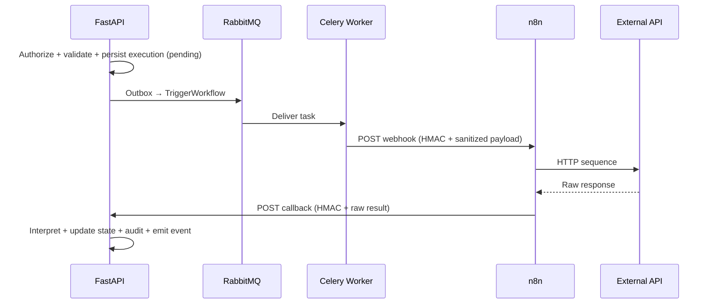

# Workflow Standards — n8n Orchestration Only

**Applies to:** `n8n/workflows/`, workflow-related FastAPI internal webhooks  
**Docs:** `docs/06-workflows/`, `docs/13-decisions/002-n8n-orchestration-only.md`

---

## Purpose

**n8n is a private integration engine** — it executes HTTP sequences and returns raw results. FastAPI owns all decisions, authorization, state, and interpretation. This file is mandatory when creating or editing n8n workflow JSON.

---

## Responsibility Split

| Owner | Responsibilities |
|-------|------------------|
| **FastAPI** | IF workflow runs; input validation; RBAC + matter walls; persist execution state; interpret results; audit; domain events |
| **n8n** | Call external HTTP APIs; retry HTTP; transform payloads; schedule cron; deliver HMAC-signed callbacks |
| **Celery** | Async trigger to n8n webhook; never interpret external responses |

---

## What n8n MUST NEVER Do

| Prohibited | Why |
|------------|-----|
| Query/write PostgreSQL | Bypasses auth and audit |
| Authorization decisions | No RBAC/matter wall engine |
| Legal business rules | Not pytest-testable; not in git as Python |
| Store durable state | No system-of-record |
| Public internet webhooks | Security boundary violation |
| LLM calls with legal prompts | Belongs in Celery AI worker |
| Interpret case/document lifecycle | Domain logic in FastAPI |

---

## Allowed n8n Node Types

| Allowed | Purpose |
|---------|---------|
| Webhook (trigger) | Receive HMAC-signed trigger from worker |
| HTTP Request | Call external APIs (Graph, court, billing) |
| Set / Edit Fields | Payload mapping |
| IF / Switch | Route by flags **from FastAPI** (not computed rules) |
| Wait | Delays between HTTP calls |
| Error Trigger → HTTP callback | Failure notification to FastAPI |
| Schedule Trigger | Time-based **only if** FastAPI pre-authorized via config |

| Forbidden / Discouraged | Why |
|-------------------------|-----|
| Postgres node | ADR-002 violation |
| Code node with business logic | Untestable domain rules |
| AI/LLM nodes | ADR-004 — async worker only |
| Public Webhook without HMAC | Attack surface |

---

## Workflow Lifecycle



---

## File & Naming

| Rule | Example |
|------|---------|
| Path | `n8n/workflows/{domain}/{name}-v1.json` |
| Slug | `intake-new-client-v1` |
| Callback URL | `/api/v1/internal/webhooks/n8n/{slug}` |
| Version bump | New file `{name}-v2.json` — never overwrite active in prod |

---

## Payload Contract

### Trigger (FastAPI → n8n)

FastAPI sends **sanitized** payload — secrets stripped, minimal PII:

```json
{
  "executionId": "uuid",
  "workflowSlug": "intake-new-client-v1",
  "correlationId": "uuid",
  "firmId": "uuid",
  "caseId": "uuid",
  "action": "sync_sharepoint",
  "flags": { "retryOcr": false },
  "payload": { "documentVersionId": "uuid" }
}
```

### Callback (n8n → FastAPI)

n8n returns **raw external response** — FastAPI interprets:

```json
{
  "executionId": "uuid",
  "status": "success",
  "externalRef": "graph-item-id",
  "rawResponse": { },
  "error": null
}
```

**Ref:** `docs/06-workflows/webhook-contracts.md`, `docs/04-api/webhooks-internal.md`

---

## Security

| Rule | Detail |
|------|--------|
| Network | n8n private subnet only — no public ingress |
| HMAC | All trigger and callback requests signed |
| Secrets | Injected at runtime from Secrets Manager — never in JSON |
| Credentials dir | `n8n/credentials/` is `.gitkeep` only |

---

## Do / Don't

| Do | Don't |
|----|-------|
| Add workflow JSON to git | Build workflows only in n8n UI without export |
| Include `correlationId` in every payload | Lose trace linkage |
| Map HTTP errors to callback `status: failed` | Swallow errors silently |
| Use retry with backoff on HTTP nodes | Infinite retry without DLQ |
| Promote via dev → staging → prod pipeline | Import directly to production |
| Document slug in `workflow-catalog.md` | Add undocumented webhooks |

---

## Good vs Bad Workflow Design

```
# BAD — n8n decides if user can run workflow
IF node: {{ $json.userRole === 'Attorney' }}  → business rule in n8n

# GOOD — FastAPI already authorized; n8n routes on pre-set flag
IF node: {{ $json.flags.syncSharePoint === true }}
```

```
# BAD — n8n writes case status
Postgres UPDATE cases SET status = 'closed'

# GOOD — n8n callbacks; FastAPI use case updates case
HTTP Request → POST /api/v1/internal/webhooks/n8n/intake-complete-v1
```

---

## Error & Retry

| Concern | Owner |
|---------|-------|
| HTTP retry/backoff | n8n node config |
| DLQ after max retries | FastAPI marks execution `failed` on callback |
| Idempotent callback handling | FastAPI internal webhook |
| Audit of failure | FastAPI |

**Ref:** `docs/06-workflows/retry-dlq.md`

---

## Promotion Pipeline

1. Develop locally (`docker-compose.n8n.yml`)
2. Export JSON to `n8n/workflows/`
3. PR review with `workflow-standards.md` checklist
4. Import to staging — smoke test
5. Manual approval for production import

**Ref:** `docs/06-workflows/promotion-pipeline.md`, `docs/14-playbooks/add-workflow.md`

---

## Workflow PR Checklist

- [ ] No Postgres, Code (business), or LLM nodes
- [ ] Slug matches filename and callback path
- [ ] HMAC headers documented
- [ ] Payload matches webhook contract
- [ ] `correlationId` propagated
- [ ] No secrets in JSON
- [ ] FastAPI handler exists for callback interpretation
- [ ] Catalog entry in `docs/06-workflows/workflow-catalog.md`

---

## References

- [docs/06-workflows/orchestration-model.md](../../docs/06-workflows/orchestration-model.md)
- [docs/06-workflows/n8n-integration.md](../../docs/06-workflows/n8n-integration.md)
- [docs/06-workflows/webhook-contracts.md](../../docs/06-workflows/webhook-contracts.md)
- [docs/13-decisions/002-n8n-orchestration-only.md](../../docs/13-decisions/002-n8n-orchestration-only.md)
- [backend-standards.md](./backend-standards.md)
