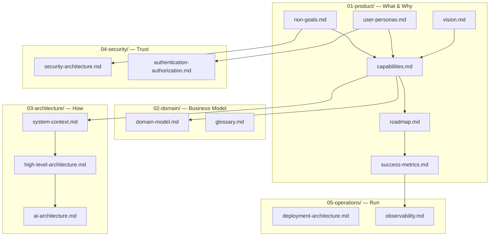
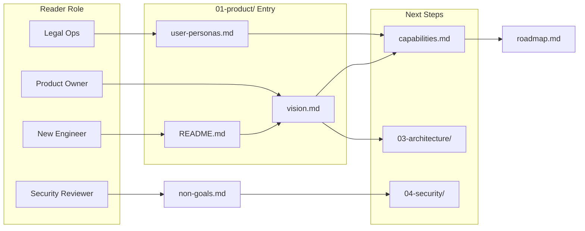
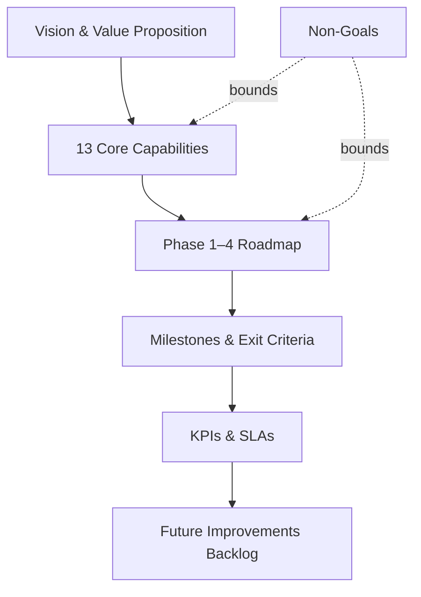

# Product Documentation — LexFlow AI

**LexFlow AI** — Enterprise AI Automation Platform for Law Firms  
**Version:** 1.0  
**Status:** Draft — Pre-Implementation  
**Last Updated:** 2026-07-06

---

## Purpose

This folder is the **product documentation index** for LexFlow AI. It defines what the platform is, who it serves, what it delivers, how success is measured, and what is explicitly out of scope. Product stakeholders, legal operations leaders, engineering leads, and security reviewers should start here before diving into architecture or implementation docs.

LexFlow AI eliminates repetitive manual work in large US law firms while preserving human legal judgment, ethical walls, and compliance-grade auditability.

---

## Scope

| In Scope | Out of Scope |
|----------|--------------|
| Product vision, personas, capabilities, roadmap | API contracts, database schemas, deployment runbooks |
| Success metrics, SLAs, KPIs | Implementation code, Terraform modules |
| Explicit non-goals and rationale | n8n workflow JSON definitions |
| Cross-references to architecture and compliance docs | Vendor procurement or pricing |

This folder answers **what** and **why**. The [03-architecture](../03-architecture/) folder answers **how**.

---

## Responsibilities

| Audience | Responsibility | Primary Documents |
|----------|----------------|-------------------|
| **Product / Legal Ops** | Own vision, personas, capabilities, roadmap priorities | [vision.md](./vision.md), [capabilities.md](./capabilities.md), [roadmap.md](./roadmap.md) |
| **Engineering Leadership** | Align delivery phases with architectural constraints | [roadmap.md](./roadmap.md), [non-goals.md](./non-goals.md) |
| **Security / Compliance** | Validate product scope against regulatory requirements | [success-metrics.md](./success-metrics.md), [non-goals.md](./non-goals.md) |
| **Sales / Implementation** | Communicate value proposition and deployment profile | [vision.md](./vision.md), [user-personas.md](./user-personas.md) |
| **All Contributors** | Keep product docs synchronized with ADRs and architecture changes | This README, [References](#references) |

---

## Architecture

Product documentation sits at the top of the LexFlow AI documentation hierarchy. It informs but does not duplicate technical architecture.

**Key architectural principles** (product-level, enforced in engineering):

| Principle | Product Implication |
|-----------|---------------------|
| **Case-centric** | Every capability orbits the legal matter aggregate |
| **Matter walls** | Ethical/conflict boundaries are non-negotiable |
| **Async AI** | AI never blocks user interactions; attorneys review outputs |
| **Human-in-the-loop** | No auto-submission to courts or clients without approval |
| **n8n orchestration only** | Automation coordinates external systems; FastAPI owns decisions |
| **Business logic in FastAPI** | Product rules are testable, auditable, version-controlled |

See [../03-architecture/system-context.md](../03-architecture/system-context.md) for the full system context diagram.

---

## Flow Diagrams

### Documentation Navigation by Role

### Product-to-Delivery Traceability

---

## Best Practices

1. **Read vision before capabilities** — Capabilities implement the value proposition; reading them out of order loses strategic context.
2. **Validate personas against your firm** — The ten personas are archetypes; map them to actual titles and permission sets during implementation.
3. **Treat non-goals as hard constraints** — Items in [non-goals.md](./non-goals.md) require an ADR and executive approval to revisit.
4. **Update roadmap with ADRs** — Architectural decisions (e.g., async AI, n8n boundaries) may shift milestone sequencing; keep [roadmap.md](./roadmap.md) aligned.
5. **Measure what matters** — [success-metrics.md](./success-metrics.md) defines targets; avoid adding vanity metrics without product review.
6. **Cross-link, don't duplicate** — Reference architecture docs for technical detail; keep product docs outcome-focused.

---

## Tradeoffs

| Decision | Benefit | Cost |
|----------|---------|------|
| **Separate product folder (01-product/)** | Clear audience separation; easier legal ops onboarding | Some overlap with legacy [product-overview.md](../product-overview.md) until migration completes |
| **Ten distinct personas** | Precise RBAC and UX targeting | More complex permission matrix to maintain |
| **Phased roadmap (4 phases)** | Reduces big-bang delivery risk | Some capabilities deferred; firms may expect earlier features |
| **Explicit non-goals document** | Prevents scope creep and mis-set expectations | Requires discipline to say "no" to stakeholders |
| **Human-in-the-loop by default** | Ethical compliance, attorney trust | Slower time-to-output vs. fully autonomous AI |

---

## Future Improvements

| Item | Target | Notes |
|------|--------|-------|
| Migrate legacy flat docs into numbered folders | Phase 1 | Consolidate [product-overview.md](../product-overview.md) into this folder |
| Add firm-specific customization guide | Phase 2 | How enterprises adapt personas and capabilities |
| Product changelog linked to releases | Phase 2 | Semantic versioning of product capabilities |
| Competitive analysis deep-dive | Phase 3 | Expanded positioning vs. Clio, iManage, Harvey |
| Customer success playbook | Phase 4 | Onboarding metrics tied to [success-metrics.md](./success-metrics.md) |
| Interactive capability maturity matrix | Phase 4 | Visual heatmap by roadmap phase |

---

## References

### Documents in This Folder

| Document | Description |
|----------|-------------|
| [vision.md](./vision.md) | Product vision, problem statement, value proposition |
| [user-personas.md](./user-personas.md) | Ten user types — goals, pain points, permissions |
| [capabilities.md](./capabilities.md) | Thirteen core capabilities in detail |
| [roadmap.md](./roadmap.md) | Phase 1–4 delivery plan with milestones |
| [success-metrics.md](./success-metrics.md) | KPIs, SLAs, measurement framework |
| [non-goals.md](./non-goals.md) | Explicit exclusions with rationale |

### Related Documentation

| Document | Path |
|----------|------|
| Documentation root index | [../README.md](../README.md) |
| Domain model | [../02-domain/domain-model.md](../02-domain/domain-model.md) |
| System context (C4 L1) | [../03-architecture/system-context.md](../03-architecture/system-context.md) |
| High-level architecture | [../03-architecture/high-level-architecture.md](../03-architecture/high-level-architecture.md) |
| AI architecture | [../03-architecture/ai-architecture.md](../03-architecture/ai-architecture.md) |
| Authentication & authorization | [../04-security/authentication-authorization.md](../04-security/authentication-authorization.md) |
| Compliance & data governance | [../04-security/compliance-data-governance.md](../04-security/compliance-data-governance.md) |
| Deployment architecture | [../05-operations/deployment-architecture.md](../05-operations/deployment-architecture.md) |

### Architecture Decision Records

| ADR | Topic |
|-----|-------|
| [ADR-001](../13-decisions/001-modular-monolith.md) | Modular monolith first |
| [ADR-002](../13-decisions/002-n8n-orchestration-only.md) | n8n orchestration only |
| [ADR-004](../13-decisions/004-async-ai-processing.md) | Async AI processing |

---

## Quick Navigation

| I need to… | Go to |
|------------|-------|
| Understand why LexFlow exists | [vision.md](./vision.md) |
| Know who uses the platform | [user-personas.md](./user-personas.md) |
| See what the platform does | [capabilities.md](./capabilities.md) |
| Plan delivery timelines | [roadmap.md](./roadmap.md) |
| Define acceptance criteria | [success-metrics.md](./success-metrics.md) |
| Know what we will NOT build | [non-goals.md](./non-goals.md) |
