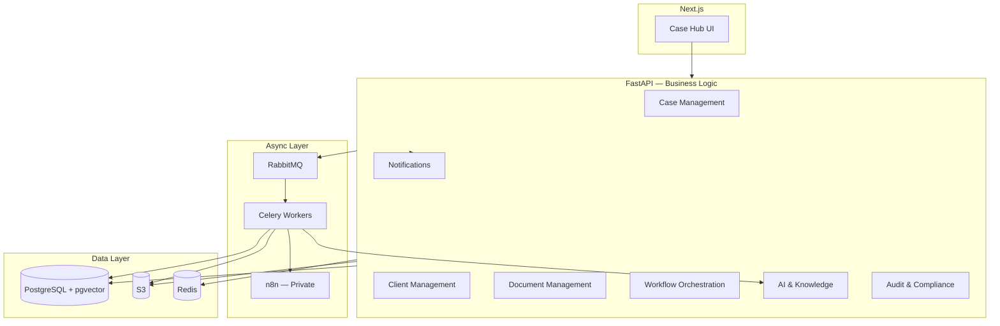
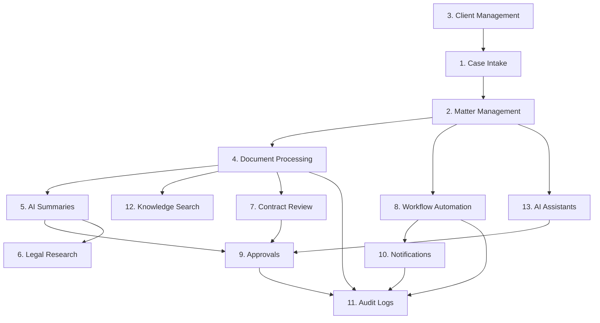
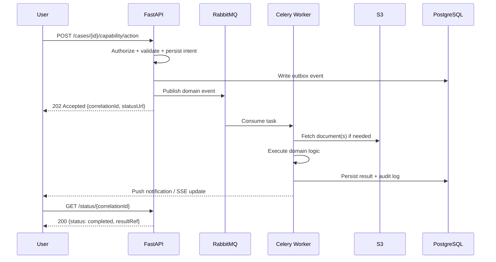
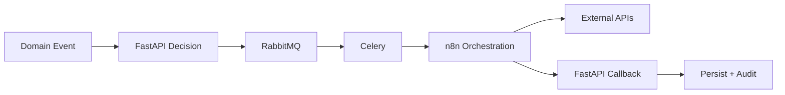

# Core Capabilities

**LexFlow AI** — Enterprise AI Automation Platform for Law Firms  
**Version:** 1.0  
**Status:** Draft — Pre-Implementation  
**Last Updated:** 2026-07-06

---

## Purpose

This document defines the **thirteen core capabilities** of LexFlow AI. Each capability describes business value, functional scope, architectural placement, user interactions, and dependencies. Capabilities are the contract between product vision and engineering delivery.

All capabilities are **case-centric**: they attach to the legal matter aggregate and respect matter walls unless explicitly firm-wide (e.g., audit, workflow templates).

---

## Scope

### In Scope

- Thirteen product capabilities with full behavioral description
- Architectural ownership (FastAPI bounded context, async path, n8n role)
- Persona interactions and approval requirements
- Cross-capability dependencies

### Out of Scope

- OpenAPI endpoint specifications (see [../03-architecture/api-architecture.md](../03-architecture/api-architecture.md))
- Database table definitions (see [../03-architecture/database-architecture.md](../03-architecture/database-architecture.md))
- n8n workflow JSON (see [../03-architecture/workflow-orchestration.md](../03-architecture/workflow-orchestration.md))

---

## Responsibilities

| Capability | Primary Bounded Context | Owning Team |
|------------|-------------------------|-------------|
| Case Intake, Matter Management | Case Management | Backend + Frontend |
| Client Management | Client Management | Backend + Frontend |
| Document Processing | Document Management | Backend + Workers |
| AI Summaries, Legal Research, Contract Review, AI Assistants, Knowledge Search | AI & Knowledge | Backend + Workers + AI |
| Workflow Automation | Workflow Orchestration | Backend + n8n |
| Approvals, Audit Logs | Audit & Compliance | Backend |
| Notifications | Notifications | Backend + Workers |

FastAPI owns **all business logic and authorization**. n8n orchestrates external system calls only. See [../13-decisions/002-n8n-orchestration-only.md](../13-decisions/002-n8n-orchestration-only.md).

---

## Architecture

Capabilities map to bounded contexts and infrastructure components.

### Capability Dependency Graph

---

## Flow Diagrams

### Universal Async Capability Pattern

All AI and heavy processing capabilities follow the async path per [../13-decisions/004-async-ai-processing.md](../13-decisions/004-async-ai-processing.md).

---

## Capability Catalog

### 1. Case Intake

**Description:** Automated new matter creation from web forms, email triggers, or client portal submissions.

| Attribute | Detail |
|-----------|--------|
| **Business Value** | Reduce intake time by 60%; eliminate re-keying errors |
| **Primary Personas** | Paralegal, Legal Assistant, Client, Operations Team |
| **Sync vs Async** | Sync validation; async conflict check and routing via workflow |
| **Approval Required** | Optional — configurable per practice area |

**Functional behavior:**
- Validates required fields (client, practice area, responsible attorney, description)
- Assigns case number per firm sequence rules
- Initiates conflict check via integration adapter (n8n orchestration)
- Routes to responsible attorney with notification
- Creates audit log entry for intake source and submitter

**Architectural placement:** Case Management bounded context; triggers `CaseCreated` domain event.

---

### 2. Matter Management

**Description:** Central case hub — the aggregate root for all matter-related data and activity.

| Attribute | Detail |
|-----------|--------|
| **Business Value** | Single source of truth per matter; ethical wall enforcement |
| **Primary Personas** | All legal practitioners, Managing Partner, Compliance Officer |
| **Sync vs Async** | Sync for CRUD; async for timeline aggregation |
| **Approval Required** | Status changes to closed/archived may require partner approval |

**Functional behavior:**
- Case metadata: title, practice area, status, assigned team, matter wall rules
- Tasks, deadlines, hearings, notes linked to case
- Timeline view aggregating documents, workflows, AI outputs, approvals
- Matter wall enforcement on every read/write
- Optimistic concurrency via version column

**Architectural placement:** Case Management aggregate root; see [../02-domain/domain-model.md](../02-domain/domain-model.md).

---

### 3. Client Management

**Description:** Client records with contact information, engagement history, portal access, and linked matters.

| Attribute | Detail |
|-----------|--------|
| **Business Value** | Eliminate duplicate client records; unified client-matter relationship |
| **Primary Personas** | Paralegal, Legal Assistant, Attorney, Client |
| **Sync vs Async** | Sync |
| **Approval Required** | Merge/dedup operations require admin approval |

**Functional behavior:**
- Support individuals and organizations with nested contacts
- Link multiple matters to one client
- Portal account provisioning with scoped access
- Engagement history and communication log (metadata)
- Duplicate detection on create (fuzzy name/email match)

**Architectural placement:** Client Management bounded context; publishes `ClientCreated`, `ClientUpdated`.

---

### 4. Document Processing

**Description:** Secure upload, virus scanning, OCR, version control, classification, and indexing.

| Attribute | Detail |
|-----------|--------|
| **Business Value** | Searchable documents within minutes; version integrity |
| **Primary Personas** | All legal practitioners, Client (upload) |
| **Sync vs Async** | Sync upload initiation; async OCR, extraction, embedding |
| **Approval Required** | No — processing is automatic |

**Functional behavior:**
- Pre-signed S3 upload URLs with size/type validation
- ClamAV or equivalent virus scan before processing
- OCR extraction for scanned PDFs
- Version control with immutable prior versions
- Document type classification (pleading, contract, correspondence, discovery)
- Full-text index + embedding generation for Knowledge Search
- Download audit logged

**Architectural placement:** Document Management; events: `DocumentUploaded`, `DocumentProcessed`, `OCRCompleted`.

---

### 5. AI Summaries

**Description:** Async generation of case overviews, document summaries, and deposition summaries.

| Attribute | Detail |
|-----------|--------|
| **Business Value** | Reduce first-pass review time; consistent summary structure |
| **Primary Personas** | Attorney, Associate, Paralegal |
| **Sync vs Async** | **Always async** |
| **Approval Required** | **Yes** — attorney approval before marking approved (configurable by type) |

**Functional behavior:**
- Summary types: case overview, single document, multi-document bundle, deposition
- Prompt templates versioned and audited in prompt registry
- Output stored with case linkage, model version, token usage
- Status lifecycle: `pending` → `generating` → `draft` → `approved` / `rejected`
- PII redaction pipeline on stored outputs
- Associate may request; Attorney must approve

**Architectural placement:** AI & Knowledge; LLM calls via provider abstraction only from Celery workers.

---

### 6. Legal Research

**Description:** AI-assisted research with citation tracking; results are drafts requiring attorney validation.

| Attribute | Detail |
|-----------|--------|
| **Business Value** | Accelerate research; maintain citation audit trail |
| **Primary Personas** | Attorney, Associate |
| **Sync vs Async** | **Always async** |
| **Approval Required** | **Yes** — never auto-submitted to courts or clients |

**Functional behavior:**
- Scoped queries: case context, practice area, jurisdiction filters
- Citation extraction and verification flags (unverified citations marked)
- Full query and response logged in prompt history
- Export as draft memorandum format
- Rate limiting per user and firm policy

**Architectural placement:** AI & Knowledge; integrates with Knowledge Search for RAG context.

---

### 7. Contract Review

**Description:** Structured AI analysis of contract clauses against firm playbooks.

| Attribute | Detail |
|-----------|--------|
| **Business Value** | Faster first-pass contract review; risk flag consistency |
| **Primary Personas** | Attorney, Associate |
| **Sync vs Async** | **Always async** |
| **Approval Required** | **Yes** — output is advisory only |

**Functional behavior:**
- Playbook definitions per practice area (missing clauses, non-standard terms, risk thresholds)
- Clause-level annotations with severity (info, warning, critical)
- Comparison against firm standard templates
- Redline suggestions as draft — not applied automatically
- Human-in-the-loop mandatory per [../03-architecture/ai-architecture.md](../03-architecture/ai-architecture.md)

**Architectural placement:** AI & Knowledge; high-risk output classification.

---

### 8. Workflow Automation

**Description:** Event-driven workflow triggers orchestrated by n8n with FastAPI owning all decisions.

| Attribute | Detail |
|-----------|--------|
| **Business Value** | Standardize repeatable processes; visible automation audit trail |
| **Primary Personas** | Operations Team, Paralegal, Attorney |
| **Sync vs Async** | Async — 202 Accepted on trigger |
| **Approval Required** | Configurable per workflow step |

**Functional behavior:**
- Triggers: `CaseCreated`, `DocumentUploaded`, `DeadlineApproaching`, manual trigger
- FastAPI validates trigger, persists `WorkflowExecution`, publishes to RabbitMQ
- Celery invokes n8n internal webhook with signed payload
- n8n calls external systems (Outlook, SharePoint, Teams) — no business logic
- n8n callbacks to FastAPI internal webhook (HMAC-signed)
- Workflow definitions version-controlled in `n8n/workflows/`

**Architectural placement:** Workflow Orchestration; see [../03-architecture/workflow-orchestration.md](../03-architecture/workflow-orchestration.md).

---

### 9. Approvals

**Description:** Configurable approval chains for AI outputs, document sends, workflow steps, and invoices.

| Attribute | Detail |
|-----------|--------|
| **Business Value** | Enforce human-in-the-loop; defensible audit trail |
| **Primary Personas** | Attorney (decider), Associate/Paralegal (submitter) |
| **Sync vs Async** | Sync decision; async notification on request |
| **Approval Required** | N/A — this IS the approval capability |

**Functional behavior:**
- Approval types: AI output, external send, workflow gate, fee authorization
- Configurable chains: single approver, sequential, parallel (all/any)
- States: `pending`, `approved`, `rejected`, `expired`
- Escalation on timeout (configurable SLA)
- Immutable record: who, when, comment, resource reference

**Architectural placement:** Audit & Compliance; events: `ApprovalRequested`, `ApprovalDecided`.

---

### 10. Notifications

**Description:** In-app, email (AWS SES), and Microsoft Teams notifications.

| Attribute | Detail |
|-----------|--------|
| **Business Value** | Proactive deadline and task awareness; reduce email overload |
| **Primary Personas** | All internal personas; Client (limited) |
| **Sync vs Async** | Async delivery |
| **Approval Required** | Client-facing notifications require workflow approval gate |

**Functional behavior:**
- Channels: in-app, email, Teams webhook (via n8n)
- Event types: deadline approaching, task assigned, approval requested, workflow completed, AI summary ready
- User preference management per channel and event type
- Batching for high-volume events (digest mode)
- Delivery status tracking and retry via DLQ

**Architectural placement:** Notifications bounded context; triggered by domain events.

---

### 11. Audit Logs

**Description:** Immutable, append-only audit trail for every significant action.

| Attribute | Detail |
|-----------|--------|
| **Business Value** | Regulatory defensibility; ethics committee readiness |
| **Primary Personas** | Compliance Officer, Managing Partner, System Administrator |
| **Sync vs Async** | Sync write (same transaction as mutation); async export |
| **Approval Required** | N/A |

**Functional behavior:**
- Logged actions: all mutating API calls, AI invocations, document downloads, login events, permission changes
- Fields: timestamp, userId, firmId, caseId, resourceType, action, ipAddress, correlationId, before/after hash
- Searchable by case, user, resource type, date range
- Retention per firm policy (default 7 years)
- Export for compliance review (async, encrypted artifact in S3)
- **100% completeness target** — see [success-metrics.md](./success-metrics.md)

**Architectural placement:** Audit & Compliance; write path cannot be bypassed by workers or n8n.

---

### 12. Knowledge Search

**Description:** Hybrid full-text + semantic search across documents, notes, and AI summaries within authorized case scope.

| Attribute | Detail |
|-----------|--------|
| **Business Value** | Find relevant precedent and matter documents in < 2 seconds |
| **Primary Personas** | Attorney, Associate, Paralegal, Operations Team |
| **Sync vs Async** | Sync query; async index updates |
| **Approval Required** | No |

**Functional behavior:**
- Hybrid search: PostgreSQL full-text + pgvector cosine similarity
- Scoped to authorized cases only (matter wall enforced in query layer)
- Filters: document type, date range, practice area, author
- Highlight snippets with relevance score
- Query logged for compliance analytics
- Index updated on `DocumentProcessed` and `SummaryApproved` events

**Architectural placement:** AI & Knowledge read model; CQRS query side.

---

### 13. AI Assistants

**Description:** Context-aware chat assistants scoped to a case or document set.

| Attribute | Detail |
|-----------|--------|
| **Business Value** | Interactive Q&A on matter context without leaving case hub |
| **Primary Personas** | Attorney, Associate |
| **Sync vs Async** | Async streaming response via SSE |
| **Approval Required** | Optional — chat is internal; exported answers require approval |

**Functional behavior:**
- Scope: single case, document subset, or approved summary corpus
- Conversation history stored in prompt history with PII redaction
- RAG retrieval from pgvector embeddings within matter wall
- Token usage metering per user and firm
- Export conversation as draft memo (triggers approval workflow)
- No cross-case context leakage — enforced at retrieval layer

**Architectural placement:** AI & Knowledge; streaming via FastAPI SSE endpoint backed by Celery/LLM provider.

---

## Best Practices

1. **Case context first** — Every capability invocation includes `caseId`; reject orphan operations.
2. **Async by default for AI and documents** — Never block HTTP request path on LLM or OCR.
3. **Approval before externalization** — AI outputs, client communications, and court filings require approval gates.
4. **Audit everything mutating** — If it changes state, it logs; no exceptions for workers or callbacks.
5. **n8n stays dumb** — Business rules live in FastAPI; n8n receives pre-computed decisions as payload flags.
6. **Idempotent triggers** — Workflow and AI requests accept `Idempotency-Key` to prevent duplicate processing.
7. **Feature flags per capability** — Gradual rollout via LaunchDarkly or env flags per [roadmap.md](./roadmap.md).

---

## Tradeoffs

| Capability | Tradeoff | Rationale |
|------------|----------|-----------|
| AI Summaries | Approval latency vs. speed | Legal malpractice and ethics require human review |
| Knowledge Search | Index freshness vs. query cost | Async indexing acceptable; stale window < 5 minutes |
| Workflow Automation | n8n flexibility vs. governance | Version-controlled JSON + promotion gates mitigate sprawl |
| Document Processing | OCR accuracy vs. processing time | Async pipeline allows quality models without UX impact |
| AI Assistants | Conversational UX vs. audit granularity | Full prompt history stored; export requires approval |
| Audit Logs | Storage cost vs. completeness | Append-only with lifecycle policies; compliance non-negotiable |
| Client Management | Duplicate detection aggressiveness | False positives annoy users; fuzzy match with admin review |

---

## Future Improvements

| Capability | Enhancement | Phase |
|------------|-------------|-------|
| Case Intake | Voice-to-intake, smart form prefill from email | Phase 3 |
| Document Processing | Auto-redaction of PII for external sharing | Phase 3 |
| Legal Research | Verified citation database integration (Westlaw/Lexis adapter) | Phase 4 |
| Contract Review | Multi-party contract comparison | Phase 3 |
| Workflow Automation | Visual workflow builder for Operations Team | Phase 2 |
| Knowledge Search | Cross-matter analytics (anonymized, partner-only) | Phase 4 |
| AI Assistants | Multi-modal input (audio deposition queries) | Phase 4 |
| Notifications | Mobile push notifications | Phase 3 |
| Approvals | Mobile approve/reject with biometric auth | Phase 3 |

---

## References

| Document | Path |
|----------|------|
| Product index | [README.md](./README.md) |
| Vision | [vision.md](./vision.md) |
| User personas | [user-personas.md](./user-personas.md) |
| Roadmap | [roadmap.md](./roadmap.md) |
| Domain model | [../02-domain/domain-model.md](../02-domain/domain-model.md) |
| AI architecture | [../03-architecture/ai-architecture.md](../03-architecture/ai-architecture.md) |
| Workflow orchestration | [../03-architecture/workflow-orchestration.md](../03-architecture/workflow-orchestration.md) |
| Event-driven architecture | [../03-architecture/event-driven-architecture.md](../03-architecture/event-driven-architecture.md) |
| API architecture | [../03-architecture/api-architecture.md](../03-architecture/api-architecture.md) |
| ADR-002 | [../13-decisions/002-n8n-orchestration-only.md](../13-decisions/002-n8n-orchestration-only.md) |
| ADR-004 | [../13-decisions/004-async-ai-processing.md](../13-decisions/004-async-ai-processing.md) |
