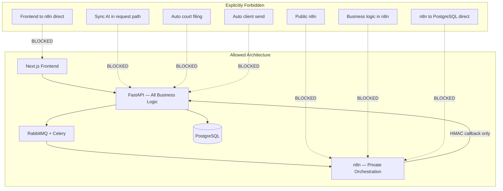
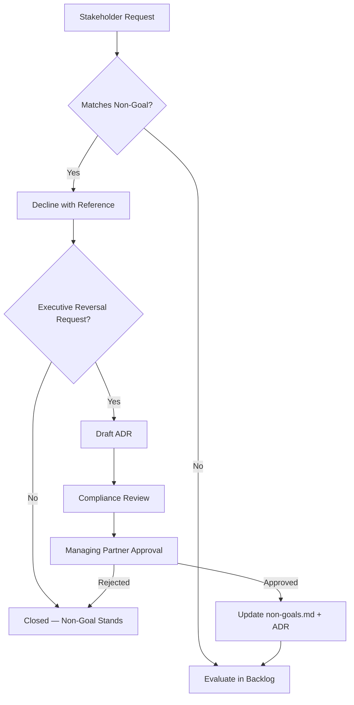
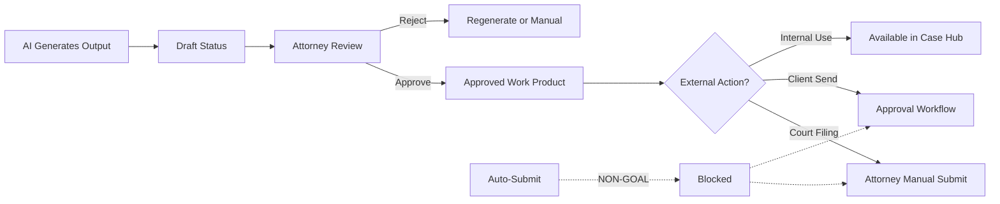

# Non-Goals

**LexFlow AI** — Enterprise AI Automation Platform for Law Firms  
**Version:** 1.0  
**Status:** Draft — Pre-Implementation  
**Last Updated:** 2026-07-06

---

## Purpose

This document lists **explicit non-goals** for LexFlow AI — capabilities, architectural patterns, and business outcomes the platform will **not** pursue. Non-goals prevent scope creep, mis-set stakeholder expectations, and guide architectural discipline.

Revisiting a non-goal requires a formal **Architecture Decision Record (ADR)**, executive sponsor approval, and compliance review.

---

## Scope

### In Scope

- Product non-goals with business rationale
- Architectural anti-patterns explicitly avoided
- AI and automation boundaries
- Integration exclusions
- Comparison to adjacent products LexFlow is not building

### Out of Scope

- Detailed threat model (see [../04-security/security-architecture.md](../04-security/security-architecture.md))
- Feature backlog items that may be reconsidered later (tracked separately)

---

## Responsibilities

| Role | Responsibility |
|------|----------------|
| **Product Owner** | Enforce non-goals in backlog grooming; reject scope creep |
| **Managing Partner (Sponsor)** | Approve any non-goal reversal |
| **Compliance Officer** | Veto proposals that violate ethical boundaries |
| **Engineering Lead** | Reject implementations that violate architectural non-goals |
| **All Contributors** | Reference this document in design reviews and PR discussions |

When a stakeholder requests a non-goal capability, the response is: **"That is a documented non-goal. See non-goals.md. Reversal requires ADR + executive approval."**

---

## Architecture

Non-goals shape the architecture by defining **forbidden patterns** and **boundary constraints**.

### Architectural Non-Goals

| Non-Goal | Rationale | Enforcement |
|----------|-----------|-------------|
| **Business logic in n8n** | Untestable, unauditable, vendor-coupled | Code review; n8n nodes limited to HTTP/transform |
| **Public n8n exposure** | Attack surface; bypasses auth and audit | Private subnet; no public ALB rule; pen test |
| **Frontend-to-n8n calls** | Bypasses RBAC and matter walls | Network isolation; CSP; no n8n URL in frontend |
| **Synchronous AI in request path** | Timeout risk; poor UX; blocks scaling | ADR-004; 202 Accepted pattern mandatory |
| **n8n direct database writes** | Split brain; no audit trail | Security groups; n8n credentials exclude DB |
| **Microservices day one** | Operational complexity without proven need | ADR-001 modular monolith |
| **Multi-tenant SaaS initially** | Target deployment is firm-private | Single-firm deployment per AWS account |

See [../13-decisions/002-n8n-orchestration-only.md](../13-decisions/002-n8n-orchestration-only.md) and [../13-decisions/004-async-ai-processing.md](../13-decisions/004-async-ai-processing.md).

---

## Flow Diagrams

### Non-Goal Request Handling

### Human-in-the-Loop Boundary

---

## Product Non-Goals

### Legal Judgment and Ethics

| Non-Goal | Rationale | Alternative in LexFlow |
|--------|-----------|--------------------------|
| **Replace attorneys** | Legal judgment, strategy, and client counseling require licensed professionals; malpractice and ethics rules prohibit autonomous legal decision-making | AI augments drafting and research; attorneys review and approve |
| **Autonomous legal advice to clients** | Unauthorized practice of law risk; client-facing AI without attorney review violates firm ethics policies | Client portal shows firm-controlled status updates only; no AI chat for clients in Phase 1–3 |
| **Auto-determine case outcomes** | Predictive outcome tools create liability and bias concerns | Analytics dashboard shows operational metrics, not outcome predictions |

### Automation Boundaries

| Non-Goal | Rationale | Alternative in LexFlow |
|--------|-----------|--------------------------|
| **Auto-file with courts** | Court filing errors have irreversible consequences; e-filing systems require attorney attestation | Phase 4 court integration prepares filing packages; attorney confirms and submits manually |
| **Auto-send client communications** | Client communications bind the firm; errors create malpractice exposure | Approval workflow required before any external client notification or document send |
| **Auto-apply contract redlines** | Contract modifications require attorney judgment | Contract review produces advisory annotations; attorney applies changes manually |
| **Unattended AI output to DMS** | Unreviewed AI content in official record creates discovery risk | AI outputs remain in draft status until attorney approval |

### Platform Scope

| Non-Goal | Rationale | Alternative in LexFlow |
|--------|-----------|--------------------------|
| **Generic CRM** | LexFlow is purpose-built for legal workflows with matter walls; CRM features dilute focus | Client management scoped to legal matters and portal access |
| **Billing system of record** | Firms have entrenched billing systems; replacement is multi-year IT project | Phase 4 billing integration exports matter data and syncs time entries |
| **Full DMS replacement** | iManage and NetDocuments are deeply embedded; migration is high-risk | Document processing stores matter-linked copies; DMS integration via adapters |
| **Email client replacement** | Outlook is firm standard via Microsoft 365 | Email ingest and send via Graph API integration |
| **Calendar replacement** | Outlook calendar is authoritative | Deadline sync to Outlook; LexFlow tracks legal deadlines with reminders |
| **HR / payroll system** | Out of domain | User provisioning via admin; future Entra ID sync |

### AI and Data

| Non-Goal | Rationale | Alternative in LexFlow |
|--------|-----------|--------------------------|
| **Train on client data without consent** | Privacy, privilege, and contractual restrictions | Firm-controlled corpus for RAG; opt-in for fine-tuning (future) |
| **Cross-matter AI context** | Ethical walls prohibit cross-matter information flow | AI retrieval scoped to authorized case documents only |
| **Consumer-grade AI UX (no audit)** | Firms require prompt history, token metering, and approval gates | Full prompt history in PostgreSQL; human-in-the-loop mandatory |
| **Real-time synchronous chat with unlimited context** | Cost, latency, and wall enforcement complexity | Async SSE streaming with scoped RAG retrieval |

### Deployment and Commercial

| Non-Goal | Rationale | Alternative in LexFlow |
|--------|-----------|--------------------------|
| **Multi-tenant SaaS at launch** | Target customers require private deployment and data isolation | Dedicated AWS account per firm; multi-office tenancy in Phase 4 |
| **On-premise bare-metal deployment** | Operational complexity; ECS on AWS is standard | AWS ECS Fargate in firm-controlled or LexFlow-managed account |
| **Mobile-native apps at launch** | Web-first reduces delivery scope; responsive design sufficient | Responsive Next.js UI; mobile approvals deferred to future improvement |
| **Open-source core at launch** | Enterprise support and IP protection | Proprietary with open adapter interfaces |

---

## Explicit Anti-Patterns

The following patterns are **prohibited in code review** regardless of convenience:

| Anti-Pattern | Why Prohibited | Correct Pattern |
|--------------|----------------|-----------------|
| n8n Code node with business rules | Unversioned logic outside FastAPI | FastAPI computes decision; n8n receives boolean flags |
| Frontend calling LLM APIs directly | Bypasses audit, walls, and metering | FastAPI AI service via async path |
| Storing secrets in n8n workflow JSON | Credential leak via version control | AWS Secrets Manager; n8n credential store |
| Skipping audit log for internal endpoints | Compliance gap | All mutating endpoints log, including callbacks |
| 403 on matter wall violation | Enumerates matter existence | Return 404 Not Found |
| Polling n8n execution status from frontend | Exposes internal orchestration | Poll FastAPI status endpoint by correlationId |
| Embedding permissions in JWT | Stale permissions; token bloat | Server-side permission resolution with Redis cache |

---

## Best Practices

1. **Cite non-goals in PR reviews** — When scope expands, link to this document in PR description.
2. **Educate stakeholders early** — Include non-goals in kickoff presentations and RFP responses.
3. **Distinguish non-goal from deferred** — Non-goals may never be built; deferred items appear in [roadmap.md](./roadmap.md).
4. **Compliance veto is absolute** — Ethics-related non-goals cannot be reversed without Compliance Officer sign-off.
5. **Document near-misses** — When a feature almost violates a non-goal, add clarifying language here.
6. **Review annually** — Managing Partner and Product Owner review non-goals each year.

---

## Tradeoffs

| Non-Goal | What We Gain | What We Give Up |
|--------|--------------|-----------------|
| No auto court filing | Malpractice risk reduction | Speed advantage of fully automated filing |
| No billing replacement | Faster integration; lower IT friction | Unified billing UX |
| No public n8n | Reduced attack surface | Convenience of direct workflow editing by non-ops users |
| Human-in-the-loop AI | Ethics compliance; attorney trust | Speed of consumer AI tools |
| No multi-tenant SaaS | Data isolation for enterprise firms | Smaller-firm market at launch |
| No DMS replacement | Lower migration risk | Single document repository vision |

---

## Future Improvements

Non-goals may be **revisited** (not automatically removed) under these conditions:

| Non-Goal | Revisit Condition | Earliest Phase |
|--------|-------------------|----------------|
| Multi-tenant SaaS | Mid-size firm market demand validated | Phase 4+ |
| Mobile native apps | Web responsive insufficient per NPS feedback | Phase 3+ |
| Client-facing AI chat | Firm ethics committee approves bounded FAQ bot | Phase 4+ |
| Auto court filing | Jurisdiction-specific e-filing APIs with attorney attestation flow | Unlikely — remains prepare-only |
| Fine-tuning on firm corpus | Legal and privacy review complete; opt-in corpus defined | Phase 4+ |
| Predictive analytics | Advisory-only; explicit disclaimer; no autonomous recommendations | Phase 4 (limited) |

Any reversal follows the ADR process in [../13-decisions/README.md](../13-decisions/README.md).

---

## References

| Document | Path |
|----------|------|
| Product index | [README.md](./README.md) |
| Vision | [vision.md](./vision.md) |
| Capabilities | [capabilities.md](./capabilities.md) |
| Roadmap | [roadmap.md](./roadmap.md) |
| Success metrics | [success-metrics.md](./success-metrics.md) |
| User personas | [user-personas.md](./user-personas.md) |
| Security architecture | [../04-security/security-architecture.md](../04-security/security-architecture.md) |
| Authentication and authorization | [../04-security/authentication-authorization.md](../04-security/authentication-authorization.md) |
| AI architecture | [../03-architecture/ai-architecture.md](../03-architecture/ai-architecture.md) |
| Workflow orchestration | [../03-architecture/workflow-orchestration.md](../03-architecture/workflow-orchestration.md) |
| ADR-002 n8n orchestration only | [../13-decisions/002-n8n-orchestration-only.md](../13-decisions/002-n8n-orchestration-only.md) |
| ADR-004 Async AI processing | [../13-decisions/004-async-ai-processing.md](../13-decisions/004-async-ai-processing.md) |

---

## Non-Goal Summary Table

| # | Non-Goal | Category |
|---|----------|----------|
| 1 | Replace attorneys | Ethics |
| 2 | Auto-file with courts | Automation |
| 3 | Auto-send client communications | Automation |
| 4 | Public-facing n8n | Architecture |
| 5 | Business logic in n8n | Architecture |
| 6 | Generic CRM | Platform scope |
| 7 | Billing system of record | Platform scope |
| 8 | Full DMS replacement | Platform scope |
| 9 | Synchronous AI in request path | Architecture |
| 10 | Cross-matter AI context | AI and Data |
| 11 | Multi-tenant SaaS at launch | Deployment |
| 12 | Unreviewed AI to official record | Automation |
| 13 | Autonomous legal advice to clients | Ethics |
