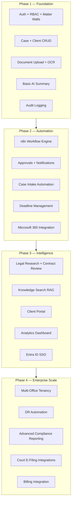
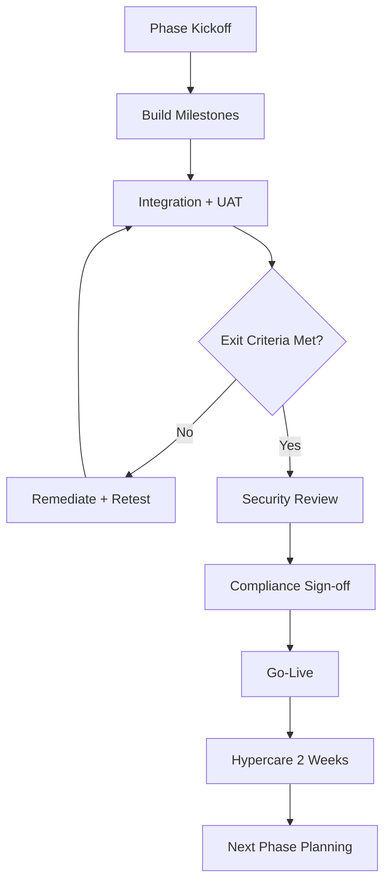
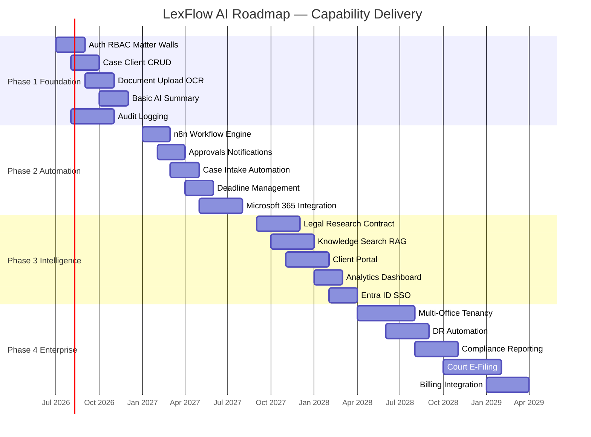

# Product Roadmap

**LexFlow AI** — Enterprise AI Automation Platform for Law Firms  
**Version:** 1.0  
**Status:** Draft — Pre-Implementation  
**Last Updated:** 2026-07-06

---

## Purpose

This document defines the **phased delivery plan** for LexFlow AI across four phases. It sequences capabilities, milestones, exit criteria, and dependencies to reduce delivery risk while delivering measurable value incrementally.

The roadmap aligns product priorities with architectural constraints: case-centric design, async AI, matter walls, and n8n orchestration boundaries.

---

## Scope

### In Scope

- Phase 1–4 timeline with months/quarters
- Milestones and exit criteria per phase
- Capability delivery mapping
- Dependencies and risk gates

### Out of Scope

- Sprint-level backlog (managed in project management tool)
- Resource allocation and headcount planning
- Contractual SLAs with vendors (see [success-metrics.md](./success-metrics.md))

---

## Responsibilities

| Role | Roadmap Responsibility |
|------|------------------------|
| **Product Owner** | Prioritize milestones; approve phase transitions |
| **Engineering Lead** | Validate feasibility; flag architectural dependencies |
| **Managing Partner (Sponsor)** | Approve phase scope and go-live gates |
| **Legal Operations** | UAT ownership per phase; workflow template authoring (Phase 2+) |
| **IT Administrator** | Infrastructure readiness gate before each production promotion |
| **Compliance Officer** | Sign-off on audit and AI governance before Phase 2 go-live |

---

## Architecture

Each phase extends the platform incrementally without compromising core architectural principles.

### Phase Architecture Additions

| Phase | New Infrastructure | New Bounded Contexts |
|-------|-------------------|---------------------|
| **Phase 1** | ECS (web, api, worker), RDS, S3, Redis, RabbitMQ | Identity, Case, Client, Document, AI (basic), Audit |
| **Phase 2** | n8n (private ECS), Amazon MQ scaling, SES | Workflow, Notifications, Approvals (expanded) |
| **Phase 3** | pgvector indexing pipeline, CloudFront analytics | AI (research, contract, assistants), Knowledge Search |
| **Phase 4** | DR region (us-west-2), multi-tenant schema, integration adapters | External integrations (court, billing) |

---

## Flow Diagrams

### Phase Gate Process

### Capability Delivery Timeline

---

## Phase 1 — Foundation (Months 1–4)

**Theme:** Establish the case-centric platform core with security, documents, basic AI, and audit.

**Target window:** Months 1–4 from project kickoff (e.g., July–October 2026)

### Milestones

| # | Milestone | Deliverables | Owner |
|---|-----------|--------------|-------|
| M1.1 | **Identity & Access** | JWT auth, RBAC, matter walls, admin user provisioning UI | Backend + Frontend |
| M1.2 | **Case & Client Core** | Case CRUD, client CRUD, case-client linking, assignment | Backend + Frontend |
| M1.3 | **Document Pipeline** | S3 upload, virus scan, OCR, version control, metadata | Backend + Workers |
| M1.4 | **Basic AI Summary** | Async document summary, attorney approval flow, prompt registry v1 | AI + Backend |
| M1.5 | **Audit Foundation** | Append-only audit log, 100% mutating API coverage | Backend |
| M1.6 | **Core Admin UI** | Dashboard shell, case hub, document viewer, admin settings | Frontend |
| M1.7 | **Infrastructure MVP** | ECS Fargate (web, api, worker), RDS Multi-AZ, S3, Redis, RabbitMQ | DevOps |

### Capabilities Delivered

| Capability | Maturity |
|------------|----------|
| Matter Management | Core |
| Client Management | Core |
| Document Processing | Core (OCR, no semantic search) |
| AI Summaries | Basic (single document) |
| Audit Logs | Core |
| Approvals | Basic (AI summary only) |

### Exit Criteria

- [ ] 50 internal users onboarded with RBAC verified
- [ ] Matter wall penetration test passed (zero cross-matter access)
- [ ] Document upload-to-searchable OCR < 10 minutes (p95)
- [ ] AI summary end-to-end async path demonstrated
- [ ] 100% mutating API calls produce audit log entries
- [ ] Platform availability ≥ 99.5% in staging (30-day window)
- [ ] Security review completed; no critical findings open

### Dependencies

- AWS account and VPC provisioned ([../05-operations/deployment-architecture.md](../05-operations/deployment-architecture.md))
- LLM provider contract (Azure OpenAI or OpenAI enterprise)
- Firm pilot practice area identified

### Risks

| Risk | Mitigation |
|------|------------|
| OCR quality on scanned filings | Pilot with representative document set early |
| Matter wall complexity | Property-based tests; external pen test in M1.1 |
| Async pipeline reliability | DLQ monitoring; idempotency keys from day one |

---

## Phase 2 — Automation (Months 5–8)

**Theme:** Workflow orchestration, approvals, notifications, intake automation, Microsoft 365.

**Target window:** Months 5–8 (e.g., November 2026 – February 2027)

### Milestones

| # | Milestone | Deliverables | Owner |
|---|-----------|--------------|-------|
| M2.1 | **n8n Integration** | Private n8n ECS, signed webhooks, workflow promotion CI/CD | Backend + DevOps |
| M2.2 | **Workflow Engine** | Event triggers, execution tracking, manual trigger UI | Backend + n8n |
| M2.3 | **Approval Workflows** | Multi-step approval chains, escalation, timeout | Backend + Frontend |
| M2.4 | **Notifications** | In-app + email (SES); Teams via n8n | Backend + Workers |
| M2.5 | **Case Intake Automation** | Web form, email trigger, conflict check orchestration | Backend + n8n |
| M2.6 | **Deadline Management** | Deadlines, reminders, calendar views | Backend + Frontend |
| M2.7 | **Microsoft 365** | Outlook email ingest, SharePoint sync (read/write) | n8n + Backend |

### Capabilities Delivered

| Capability | Maturity |
|------------|----------|
| Case Intake | Production |
| Workflow Automation | Production |
| Approvals | Full |
| Notifications | Production |
| Matter Management | Enhanced (deadlines, hearings) |

### Exit Criteria

- [ ] ≥ 3 workflow templates deployed and executed in production
- [ ] 80% of pilot matters use ≥ 1 automated workflow
- [ ] Approval chain end-to-end < 24 hours (p95) for standard requests
- [ ] Microsoft 365 integration sync verified with test mailbox/library
- [ ] n8n confirmed not publicly accessible (network scan + pen test)
- [ ] Case intake time reduced ≥ 40% vs. Phase 0 baseline
- [ ] Compliance Officer sign-off on audit completeness for workflows

### Dependencies

- Phase 1 exit criteria met
- Microsoft Graph API credentials and admin consent
- n8n workflow definitions in version control

### Risks

| Risk | Mitigation |
|------|------------|
| n8n workflow sprawl | Template approval gate; Operations Team ownership |
| M365 throttling | Batch sync; exponential backoff in n8n |
| Email intake parsing accuracy | Human review queue for ambiguous emails |

---

## Phase 3 — Intelligence (Months 9–12)

**Theme:** Advanced AI, knowledge search, client portal, analytics, enterprise identity.

**Target window:** Months 9–12 (e.g., March – June 2027)

### Milestones

| # | Milestone | Deliverables | Owner |
|---|-----------|--------------|-------|
| M3.1 | **Legal Research Assistant** | Async research, citation tracking, draft export | AI + Backend |
| M3.2 | **Contract Review** | Playbook engine, clause annotations, risk flags | AI + Backend |
| M3.3 | **Knowledge Search** | Hybrid full-text + pgvector RAG, matter-scoped | Backend + AI |
| M3.4 | **AI Assistants** | Case-scoped chat, SSE streaming, conversation history | AI + Frontend |
| M3.5 | **Client Portal** | Secure intake, document upload, status visibility | Frontend + Backend |
| M3.6 | **Analytics Dashboard** | Workflow throughput, AI usage, caseload metrics | Backend + Frontend |
| M3.7 | **Entra ID SSO** | OIDC integration, group-to-role mapping | Backend + IT |

### Capabilities Delivered

| Capability | Maturity |
|------------|----------|
| AI Summaries | Full (multi-doc, deposition) |
| Legal Research | Production |
| Contract Review | Production |
| Knowledge Search | Production |
| AI Assistants | Production |
| Client Management | Portal-enabled |

### Exit Criteria

- [ ] Document search < 2 seconds (p95) across 100K documents in pilot
- [ ] AI summary attorney approval rate > 85%
- [ ] Legal research citations flagged for verification
- [ ] Client portal UAT with ≥ 10 external users
- [ ] Entra ID SSO for ≥ 90% of internal users
- [ ] Analytics dashboard adopted by Managing Partner weekly review
- [ ] Platform availability ≥ 99.9% (30-day production window)

### Dependencies

- Phase 2 exit criteria met
- pgvector index pipeline operational
- Entra ID tenant configuration
- Client portal security review (external-facing)

### Risks

| Risk | Mitigation |
|------|------------|
| RAG retrieval quality | Evaluation harness; attorney feedback loop |
| Client portal security | WAF, rate limiting, separate auth realm |
| LLM cost overrun | Token metering, per-firm budgets, model tiering |

---

## Phase 4 — Enterprise Scale (Year 2+)

**Theme:** Multi-office tenancy, disaster recovery, advanced compliance, court and billing integrations.

**Target window:** Year 2 and beyond (e.g., Q3 2027 – Q2 2028)

### Milestones

| # | Milestone | Deliverables | Owner |
|---|-----------|--------------|-------|
| M4.1 | **Multi-Office Tenancy** | Office-level data isolation, cross-office reporting | Backend + DevOps |
| M4.2 | **DR Automation** | us-west-2 standby, automated failover runbooks, RPO ≤ 15 min | DevOps |
| M4.3 | **Advanced Compliance** | Scheduled compliance reports, data subject request automation | Backend + Compliance |
| M4.4 | **Court E-Filing** | Adapter pattern, n8n orchestration, attorney-confirmed submit | Backend + n8n |
| M4.5 | **Billing Integration** | Matter data export, time entry sync (read/write per vendor) | Backend + n8n |
| M4.6 | **Service Extraction Evaluation** | Metrics-driven decision on bounded context extraction | Architecture |

### Capabilities Delivered

| Capability | Maturity |
|------------|----------|
| All 13 capabilities | Enterprise-grade |
| Workflow Automation | Multi-office templates |
| Audit Logs | Advanced export and scheduling |
| Integrations | Court + billing adapters |

### Exit Criteria

- [ ] DR failover drill completed within RTO ≤ 4 hours
- [ ] Multi-office deployment with ≥ 2 offices in production
- [ ] Court e-filing pilot with ≥ 1 jurisdiction
- [ ] Billing integration sync verified with firm billing system
- [ ] Compliance reports generated on schedule without manual intervention
- [ ] 1,000+ concurrent users load test passed
- [ ] 50,000+ workflow executions/month sustained

### Dependencies

- Phase 3 exit criteria met
- DR region infrastructure ([../05-operations/disaster-recovery.md](../05-operations/disaster-recovery.md))
- Court system API access (jurisdiction-specific)
- Billing vendor API documentation

### Risks

| Risk | Mitigation |
|------|------------|
| Court API fragmentation | Adapter pattern; jurisdiction-by-jurisdiction rollout |
| Multi-tenancy data leakage | Schema-level isolation; penetration test |
| DR cost | Tiered DR — warm standby for critical paths only initially |

---

## Best Practices

1. **No phase skipping** — Each phase exit criteria gate the next; partial Phase 2 features do not ship without Phase 1 security baseline.
2. **Pilot before firm-wide** — Each phase launches to one practice area before broad rollout.
3. **Measure baselines in Phase 0** — Capture manual intake time and search latency before go-live.
4. **Align docs with delivery** — Update [capabilities.md](./capabilities.md) maturity table at each phase boundary.
5. **ADR before architecture changes** — Phase transitions that alter boundaries require ADR approval.
6. **Hypercare windows** — Two weeks of elevated support after each phase go-live.

---

## Tradeoffs

| Decision | Benefit | Cost |
|----------|---------|------|
| **4 phases over 18+ months** | Reduced risk; incremental value | Competitive pressure for faster AI features |
| **Client portal in Phase 3** | Security foundation first | Client self-service delayed |
| **Entra ID in Phase 3** | JWT sufficient for pilot | Enterprise SSO not day-one |
| **Court e-filing in Phase 4** | Complex jurisdiction adapters | Manual filing continues longer |
| **Modular monolith through Phase 3** | Operational simplicity | May defer scale optimizations |

---

## Future Improvements

| Item | Description |
|------|-------------|
| Continuous delivery maturity | Move from phase gates to weekly production releases (Phase 3+) |
| Practice-area packs | Pre-built workflow + AI templates sold as accelerators |
| Partner integrations marketplace | Third-party adapters beyond Phase 4 scope |
| AI model fine-tuning | Firm-specific models on approved corpus (Phase 4+) |
| Mobile native apps | iOS/Android for approvals and notifications |
| International expansion | GDPR-first deployment for EU firms |

---

## References

| Document | Path |
|----------|------|
| Product index | [README.md](./README.md) |
| Vision | [vision.md](./vision.md) |
| Capabilities | [capabilities.md](./capabilities.md) |
| Success metrics | [success-metrics.md](./success-metrics.md) |
| Non-goals | [non-goals.md](./non-goals.md) |
| High-level architecture | [../03-architecture/high-level-architecture.md](../03-architecture/high-level-architecture.md) |
| Deployment architecture | [../05-operations/deployment-architecture.md](../05-operations/deployment-architecture.md) |
| Disaster recovery | [../05-operations/disaster-recovery.md](../05-operations/disaster-recovery.md) |
| ADR-001 Modular monolith | [../13-decisions/001-modular-monolith.md](../13-decisions/001-modular-monolith.md) |
