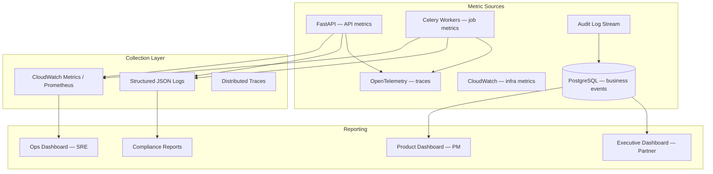
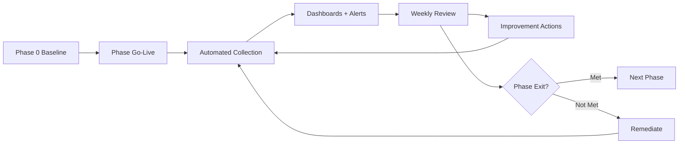
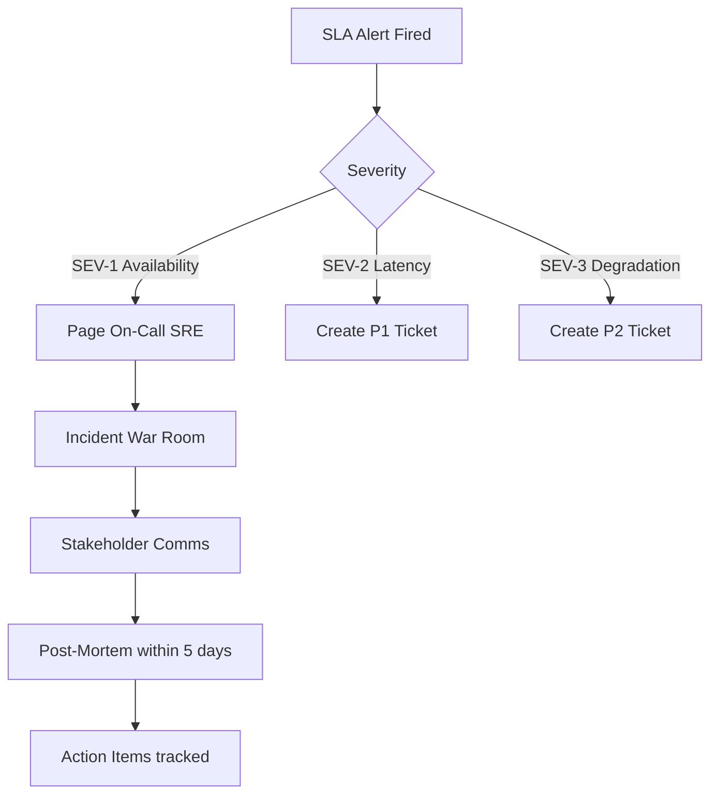

# Success Metrics

**LexFlow AI** — Enterprise AI Automation Platform for Law Firms  
**Version:** 1.0  
**Status:** Draft — Pre-Implementation  
**Last Updated:** 2026-07-06

---

## Purpose

This document defines **Key Performance Indicators (KPIs)**, **Service Level Agreements (SLAs)**, and the **measurement framework** for LexFlow AI. Metrics connect product vision to operational accountability and phase exit criteria in [roadmap.md](./roadmap.md).

Success is measured across four dimensions: **efficiency**, **quality**, **reliability**, and **adoption**.

---

## Scope

### In Scope

- Business KPIs with Year 1 targets
- Platform SLAs (availability, latency, recovery)
- AI governance metrics
- Security and compliance metrics
- Measurement methodology and reporting cadence

### Out of Scope

- Individual attorney billing targets
- Vendor LLM pricing optimization
- Firm revenue attribution modeling

---

## Responsibilities

| Role | Metric Ownership |
|------|------------------|
| **Product Owner** | Business KPIs (intake time, adoption, NPS) |
| **Engineering Lead** | Platform SLAs (latency, availability, error rates) |
| **SRE / DevOps** | Infrastructure SLAs, DR metrics, observability |
| **Compliance Officer** | Audit completeness, AI usage reporting |
| **Managing Partner** | Executive dashboard review; target approval |
| **AI Lead** | AI quality metrics (approval rate, citation accuracy) |

Reporting cadence: **weekly** operational dashboard, **monthly** executive summary, **quarterly** compliance report.

---

## Architecture

Metrics are collected across the platform stack without impacting request-path performance.

### Metric Categories

| Category | Examples | Primary Audience |
|----------|----------|------------------|
| **Business KPIs** | Intake time reduction, workflow adoption | Product, Managing Partner |
| **Platform SLAs** | Availability, API latency, queue depth | SRE, Engineering |
| **AI Quality** | Approval rate, edit distance, citation flags | AI Lead, Attorneys |
| **Security & Compliance** | Audit completeness, failed auth rate | Compliance, Security |
| **Adoption** | DAU/MAU, feature usage, NPS | Product, Operations |

---

## Flow Diagrams

### Measurement Lifecycle

### SLA Breach Escalation

---

## Key Performance Indicators (KPIs)

### Business Efficiency KPIs

| KPI | Definition | Baseline (Manual) | Year 1 Target | Phase |
|-----|------------|-------------------|---------------|-------|
| **Case intake cycle time** | Time from intake submission to case active status | 2–5 business days | ≤ 1 business day (60% reduction) | Phase 2 |
| **Document search time** | Time from query to first relevant result displayed | 5–15 minutes (manual file search) | < 2 seconds (p95) | Phase 3 |
| **First-pass summary time** | Attorney time to produce initial document summary | 2–4 hours | ≤ 30 minutes (with AI draft + review) | Phase 1 |
| **Workflow automation adoption** | % of eligible matters with ≥ 1 workflow execution | 0% | ≥ 80% | Phase 2 |
| **Deadline miss rate** | % of tracked deadlines missed due to platform notification failure | N/A | < 0.1% | Phase 2 |

### AI Quality KPIs

| KPI | Definition | Year 1 Target | Phase |
|-----|------------|---------------|-------|
| **AI summary approval rate** | % of AI summaries approved with minor edits only | > 90% | Phase 1 |
| **AI summary rejection rate** | % rejected and regenerated | < 10% | Phase 1 |
| **Attorney edit ratio** | Character-level edit distance / original length | < 30% median | Phase 1 |
| **Citation verification flag rate** | % of research citations flagged unverified | Tracked; target < 15% | Phase 3 |
| **Contract review critical flags** | Critical risk flags per contract review | Tracked (baseline establishment) | Phase 3 |
| **AI token cost per matter** | Total LLM cost / active matters per month | Within firm budget cap | Phase 1+ |

### Adoption KPIs

| KPI | Definition | Year 1 Target | Phase |
|-----|------------|---------------|-------|
| **Active users (MAU)** | Unique users with ≥ 1 action per month | ≥ 70% of licensed users | Phase 2 |
| **Daily active users (DAU/MAU)** | Stickiness ratio | > 0.4 | Phase 3 |
| **Client portal adoption** | % of new matters with client portal engagement | ≥ 50% | Phase 3 |
| **Net Promoter Score (NPS)** | Survey among attorneys and paralegals | > 40 | Phase 3 |
| **Feature utilization** | % users using ≥ 3 capabilities monthly | > 60% | Phase 3 |

### Security & Compliance KPIs

| KPI | Definition | Year 1 Target | Phase |
|-----|------------|---------------|-------|
| **Audit log completeness** | % of mutating API calls with audit entry | 100% | Phase 1 |
| **Matter wall violation attempts** | Unauthorized cross-matter access attempts blocked | 100% blocked; 0 successful | Phase 1 |
| **Failed authentication rate** | Failed logins / total login attempts | < 5%; alert on spike | Phase 1 |
| **AI invocation logging** | % of LLM calls with prompt history record | 100% | Phase 1 |
| **Data subject request SLA** | Time to fulfill GDPR/CCPA erasure/export | < 30 days | Phase 4 |
| **Security incident count** | Confirmed data breaches | 0 | All phases |

---

## Service Level Agreements (SLAs)

### Platform Availability

| SLA | Target | Measurement Window | Exclusions |
|-----|--------|-------------------|------------|
| **Platform uptime** | 99.9% (three nines) | Monthly | Scheduled maintenance (≤ 4 hrs/month, pre-announced) |
| **API availability** | 99.9% | Monthly | Health check endpoint `/health` |
| **Client portal availability** | 99.5% | Monthly | Phase 3+ |
| **n8n orchestrator availability** | 99.5% | Monthly | Internal only; workflow retry compensates |

**Downtime budget:** 99.9% = ≤ 43.8 minutes unplanned downtime per month.

### API Latency SLAs (Synchronous Path)

| Endpoint Class | p50 | p95 | p99 |
|----------------|-----|-----|-----|
| **Read — case list/detail** | < 100ms | < 300ms | < 500ms |
| **Read — document metadata** | < 100ms | < 300ms | < 500ms |
| **Write — case/document create** | < 200ms | < 500ms | < 1s |
| **Search — knowledge query** | < 500ms | < 2s | < 5s |
| **Auth — login/refresh** | < 200ms | < 500ms | < 1s |

Latency measured at ALB → API response, excluding client network.

### Async Processing SLAs

| Process | Target (p95) | Max (p99) | Phase |
|---------|--------------|-----------|-------|
| **Document OCR + index** | < 10 minutes | < 30 minutes | Phase 1 |
| **AI document summary** | < 5 minutes | < 15 minutes | Phase 1 |
| **Workflow trigger → n8n callback** | < 2 minutes | < 10 minutes | Phase 2 |
| **Legal research query** | < 10 minutes | < 30 minutes | Phase 3 |
| **Contract review** | < 15 minutes | < 45 minutes | Phase 3 |
| **Notification delivery** | < 1 minute | < 5 minutes | Phase 2 |
| **Audit log export (firm-wide, 1 year)** | < 4 hours | < 8 hours | Phase 3 |

### Recovery SLAs

| Metric | Target | Reference |
|--------|--------|-----------|
| **RPO (Recovery Point Objective)** | ≤ 15 minutes | [../05-operations/disaster-recovery.md](../05-operations/disaster-recovery.md) |
| **RTO (Recovery Time Objective)** | ≤ 4 hours | Phase 4 DR automation |
| **Backup verification** | Weekly automated restore test | Phase 2+ |
| **Incident response — SEV-1** | Acknowledge ≤ 15 min; resolve ≤ 4 hours | All phases |

### Queue Health SLAs

| Metric | Target | Alert Threshold |
|--------|--------|-----------------|
| **RabbitMQ queue depth (normal priority)** | < 1,000 messages | > 5,000 for 5 min |
| **Dead letter queue depth** | 0 sustained | > 10 messages |
| **Celery task failure rate** | < 1% | > 5% over 15 min |
| **Celery task retry rate** | < 5% | > 15% over 15 min |

---

## Measurement Methodology

### Baseline Capture (Phase 0)

Before Phase 1 go-live, capture manual process baselines:

| Process | Measurement Method |
|---------|-------------------|
| Case intake cycle time | Sample 20 matters; time from email receipt to active status |
| Document search | Timed attorney file search for 10 common queries |
| Summary production | Time 5 associates on first-pass summary tasks |
| Workflow adoption | 0% (no platform) |

### Instrumentation Requirements

| Component | Instrumentation |
|-----------|-----------------|
| FastAPI | Request duration histogram, status code counters, auth failure counter |
| Celery | Task duration, success/failure/retry counters per queue |
| PostgreSQL | Query duration (pg_stat_statements), connection pool metrics |
| AI calls | Token count, model, latency, caseId, userId in LLMUsage table |
| Audit | Completeness validator — nightly job compares API mutation log to audit table |
| Frontend | Core Web Vitals, API client error rates |

See [../05-operations/observability.md](../05-operations/observability.md) for full observability stack.

### Reporting Cadence

| Report | Audience | Frequency | Contents |
|--------|----------|-----------|----------|
| **Ops Health** | SRE, Engineering | Real-time dashboard | SLAs, queue depth, error rates |
| **Product Metrics** | Product Owner | Weekly | KPIs, adoption, feature usage |
| **Executive Summary** | Managing Partner | Monthly | Efficiency gains, NPS, availability |
| **Compliance Report** | Compliance Officer | Quarterly | Audit completeness, AI usage, access reports |
| **Phase Exit Scorecard** | All stakeholders | Per phase gate | Exit criteria checklist from [roadmap.md](./roadmap.md) |

---

## Best Practices

1. **Measure outcomes, not activity** — Prefer intake cycle time over "number of cases created."
2. **Establish baselines before claiming improvement** — Phase 0 measurement is mandatory.
3. **Separate SLAs by path** — Sync API and async processing have different targets.
4. **Alert on SLIs, not KPIs** — Operational alerts on latency and error rate; KPIs reviewed weekly.
5. **AI metrics include human feedback** — Approval/rejection rates matter more than token counts.
6. **Audit completeness is binary** — 99.9% is failure; target is 100%.
7. **Review metrics in post-mortems** — Every SEV-1 includes SLA impact assessment.

---

## Tradeoffs

| Decision | Benefit | Cost |
|----------|---------|------|
| **99.9% vs. 99.99% availability** | Achievable with Multi-AZ; reasonable cost | ~43 min/month downtime budget |
| **p95 vs. p99 SLA focus** | p95 reflects typical user experience | Edge cases may exceed target |
| **100% audit completeness** | Compliance defensibility | Storage and write-path overhead |
| **Attorney approval rate as quality proxy** | Aligns with human-in-the-loop | Subjective; practice-area variance |
| **NPS > 40 target** | Industry benchmark for B2B SaaS | Small pilot samples may skew early |

---

## Future Improvements

| Item | Phase | Description |
|------|-------|-------------|
| Real-time executive dashboard | Phase 3 | Live KPI streaming to Managing Partner view |
| AI quality auto-evaluation | Phase 3 | LLM-as-judge for summary quality scoring |
| Per-practice-area KPI breakdown | Phase 3 | Compare litigation vs. corporate metrics |
| Predictive SLA alerting | Phase 4 | ML on queue depth trends for proactive scaling |
| Customer success health score | Phase 4 | Composite score for firm adoption risk |
| Benchmark anonymized cross-firm | Phase 4+ | Industry comparison (requires consent) |
| SLA credit framework | Phase 4 | Contractual SLA credits for enterprise agreements |

---

## References

| Document | Path |
|----------|------|
| Product index | [README.md](./README.md) |
| Vision | [vision.md](./vision.md) |
| Roadmap | [roadmap.md](./roadmap.md) |
| Capabilities | [capabilities.md](./capabilities.md) |
| Observability | [../05-operations/observability.md](../05-operations/observability.md) |
| Disaster recovery | [../05-operations/disaster-recovery.md](../05-operations/disaster-recovery.md) |
| Deployment architecture | [../05-operations/deployment-architecture.md](../05-operations/deployment-architecture.md) |
| Compliance & data governance | [../04-security/compliance-data-governance.md](../04-security/compliance-data-governance.md) |
| AI architecture | [../03-architecture/ai-architecture.md](../03-architecture/ai-architecture.md) |

---

## KPI Summary Dashboard (Year 1 Targets)

| Dimension | Key Target |
|-----------|------------|
| **Efficiency** | 60% intake time reduction |
| **Performance** | < 2s search (p95) |
| **AI Quality** | > 90% summary approval rate |
| **Adoption** | 80% workflow adoption; NPS > 40 |
| **Reliability** | 99.9% uptime |
| **Compliance** | 100% audit completeness |
