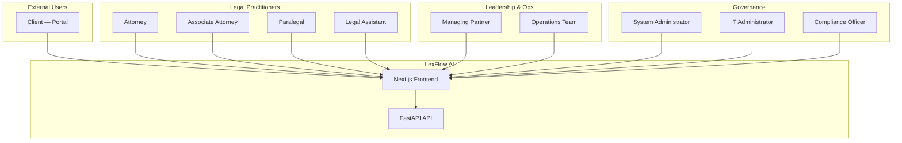
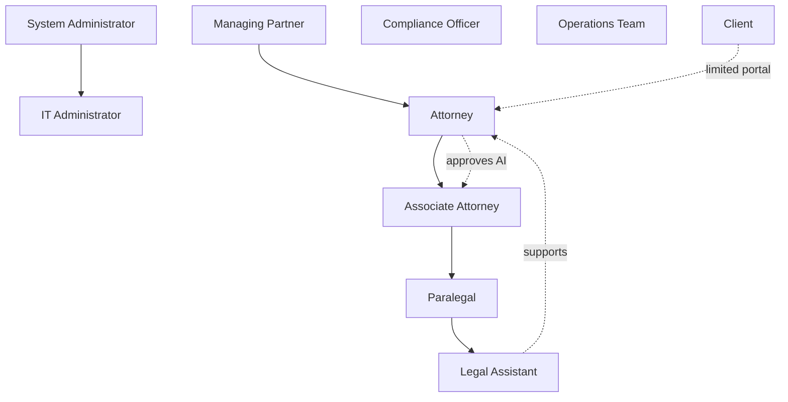
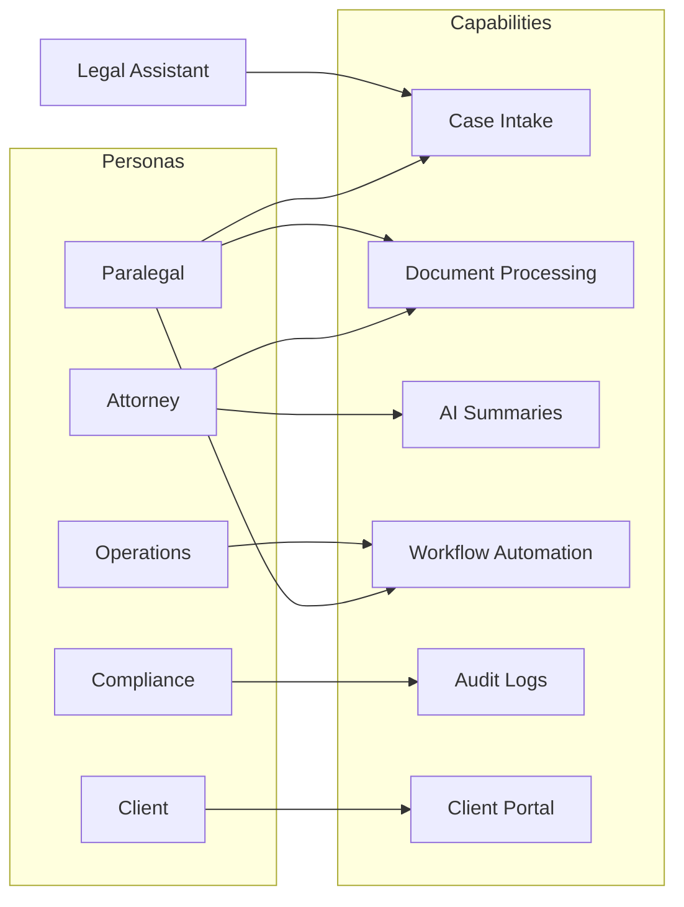
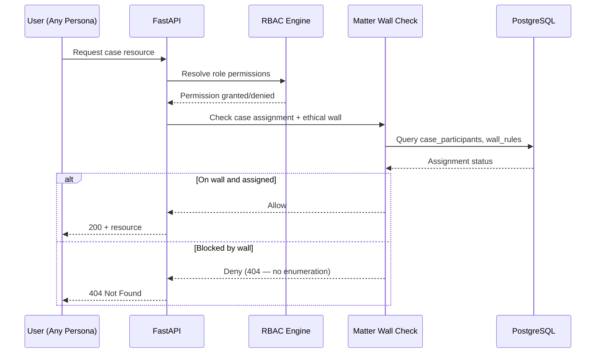

# User Personas

**LexFlow AI** — Enterprise AI Automation Platform for Law Firms  
**Version:** 1.0  
**Status:** Draft — Pre-Implementation  
**Last Updated:** 2026-07-06

---

## Purpose

This document defines the **ten user personas** LexFlow AI serves. Each persona includes goals, pain points, primary workflows, and permission boundaries. Personas drive RBAC design, UX prioritization, and acceptance criteria.

Authorization is enforced exclusively in FastAPI; personas here map directly to system roles defined in [../04-security/authentication-authorization.md](../04-security/authentication-authorization.md).

---

## Scope

### In Scope

- Ten firm-side and client-side user types
- Goals, pain points, and success criteria per persona
- Permission summary and matter wall behavior
- Primary workflows and LexFlow touchpoints

### Out of Scope

- Detailed permission matrix (see authentication doc)
- UI wireframes or screen specifications
- HR job descriptions or compensation models

---

## Responsibilities

| Persona Category | Platform Expectation |
|------------------|---------------------|
| **Legal practitioners** (Attorney, Associate, Paralegal, Legal Assistant) | Case work on assigned matters only |
| **Leadership** (Managing Partner) | Firm-wide visibility; policy approval |
| **Operations** (Operations Team) | Workflow templates, bulk operations, reporting |
| **Governance** (System Admin, IT Admin, Compliance Officer) | Configuration, infrastructure, audit |
| **External** (Client) | Portal access to own matters with firm-controlled visibility |

Product and engineering must validate every capability against at least one persona's goals before prioritization.

---

## Architecture

Personas interact with LexFlow through defined channels. No persona accesses n8n, RabbitMQ, or internal worker endpoints directly.

### Role Hierarchy

---

## Flow Diagrams

### Persona-to-Capability Map

### Matter Wall Access Flow

---

## Persona Definitions

### 1. System Administrator

| Attribute | Detail |
|-----------|--------|
| **Role ID** | `SystemAdministrator` |
| **Typical Title** | Legal Technology Administrator, Application Admin |
| **Primary Goal** | Configure firm-wide LexFlow settings, users, roles, and AI policies |
| **Pain Points** | Fragmented admin consoles; no single view of automation health; difficult user provisioning at scale |
| **Key Workflows** | User provisioning, role assignment, workflow template approval, AI prompt policy configuration, integration credential oversight (with IT) |
| **Success Criteria** | < 15 min to onboard a new user; zero unauthorized cross-matter access incidents |

**Permissions (summary):**

| Category | Access |
|----------|--------|
| Cases | Read/write firm-wide; create/delete |
| Documents | Full access on assigned and admin operations |
| AI | Request and approve on assigned matters |
| Workflows | Trigger and manage firm-wide |
| Admin | Users, config, integrations (shared with IT) |
| Audit | Read firm-wide |

---

### 2. Managing Partner

| Attribute | Detail |
|-----------|--------|
| **Role ID** | `ManagingPartner` |
| **Typical Title** | Managing Partner, Executive Committee Member |
| **Primary Goal** | Firm-wide visibility into caseload, workflow throughput, and compliance posture |
| **Pain Points** | No real-time view of bottlenecks; AI usage opaque; compliance reports require manual assembly |
| **Key Workflows** | Executive dashboard review, approve high-value workflow/AI policies, review compliance summaries |
| **Success Criteria** | Weekly dashboard review < 30 minutes; confidence in audit readiness |

**Permissions (summary):**

| Category | Access |
|----------|--------|
| Cases | Read firm-wide; write on assigned |
| Documents | Read firm-wide |
| AI | Request and approve on assigned |
| Workflows | Trigger assigned; view firm execution metrics |
| Admin | Policy approval (not user provisioning) |
| Audit | Read firm-wide |

---

### 3. Attorney

| Attribute | Detail |
|-----------|--------|
| **Role ID** | `Attorney` |
| **Typical Title** | Partner, Of Counsel, Senior Associate |
| **Primary Goal** | Manage cases efficiently; review AI-assisted work product; maintain client quality |
| **Pain Points** | Hours lost to document review and summarization; deadlines buried in email; no single case view |
| **Key Workflows** | Create cases, upload documents, request AI summaries, approve AI outputs, trigger workflows, manage deadlines and hearings |
| **Success Criteria** | 60% reduction in time spent on first-pass summarization; zero missed deadline due to platform notification failure |

**Permissions (summary):**

| Category | Access |
|----------|--------|
| Cases | Read/write on assigned matters |
| Documents | Full access on assigned |
| AI | Request and **approve** on assigned |
| Workflows | Trigger on assigned |
| Approvals | Decide on assigned |
| Audit | No firm-wide access |

---

### 4. Associate Attorney

| Attribute | Detail |
|-----------|--------|
| **Role ID** | `AssociateAttorney` |
| **Typical Title** | Associate, Junior Attorney |
| **Primary Goal** | Execute case work under supervising attorney; leverage AI for research and drafting |
| **Pain Points** | Repetitive research tasks; unclear approval requirements; version confusion on shared documents |
| **Key Workflows** | Document upload, AI summary requests, legal research queries, task completion, workflow triggers |
| **Success Criteria** | AI drafts require < 30% edit time before attorney submission; clear approval status visibility |

**Permissions (summary):**

| Category | Access |
|----------|--------|
| Cases | Read/write on assigned |
| Documents | Full access on assigned |
| AI | Request on assigned; **cannot approve** |
| Workflows | Trigger on assigned |
| Approvals | Cannot decide (submitter only) |
| Admin | None |

---

### 5. Paralegal

| Attribute | Detail |
|-----------|--------|
| **Role ID** | `Paralegal` |
| **Typical Title** | Paralegal, Senior Paralegal, Case Manager |
| **Primary Goal** | Organize case materials, execute standardized workflows, maintain timelines |
| **Pain Points** | Manual intake data entry; chasing attorneys for approvals; discovery document chaos |
| **Key Workflows** | Intake processing, document organization, discovery prep workflows, deadline tracking, note maintenance |
| **Success Criteria** | Intake-to-case creation < 1 hour; 80% of eligible matters use ≥ 1 workflow |

**Permissions (summary):**

| Category | Access |
|----------|--------|
| Cases | Read/write on assigned; create new matters |
| Documents | Read/write on assigned |
| AI | Request on assigned |
| Workflows | Trigger on assigned |
| Approvals | Submit for approval; cannot decide |
| Admin | None |

---

### 6. Legal Assistant

| Attribute | Detail |
|-----------|--------|
| **Role ID** | `LegalAssistant` |
| **Typical Title** | Legal Secretary, Legal Assistant, Administrative Assistant |
| **Primary Goal** | Support intake, scheduling, and document handling for assigned matters |
| **Pain Points** | Re-keying client information; filing organization; limited visibility into case status |
| **Key Workflows** | Client intake forms, document upload, task execution, hearing scheduling support |
| **Success Criteria** | Zero duplicate client records from intake; documents searchable within 5 minutes of upload |

**Permissions (summary):**

| Category | Access |
|----------|--------|
| Cases | Read/write on assigned; create matters |
| Documents | Read/write on assigned |
| AI | No request permission (configurable per firm) |
| Workflows | Trigger on assigned (limited templates) |
| Client portal | Assist with document collection |
| Admin | None |

---

### 7. Operations Team

| Attribute | Detail |
|-----------|--------|
| **Role ID** | `OperationsTeam` |
| **Typical Title** | Legal Operations Manager, Practice Operations, KM Team |
| **Primary Goal** | Design, deploy, and optimize firm-wide workflows and automation templates |
| **Pain Points** | Workflow sprawl across departments; no metrics on automation adoption; bulk data operations manual |
| **Key Workflows** | Workflow template authoring (with admin approval), bulk imports, adoption reporting, template versioning |
| **Success Criteria** | Template reuse across practice areas; measurable workflow completion rates |

**Permissions (summary):**

| Category | Access |
|----------|--------|
| Cases | Read firm-wide; write on assigned |
| Documents | Read firm-wide |
| Workflows | **Manage firm-wide** templates and triggers |
| AI | Request on assigned |
| Reporting | Workflow throughput, adoption metrics |
| Admin | None (config via System Admin) |

---

### 8. IT Administrator

| Attribute | Detail |
|-----------|--------|
| **Role ID** | `ITAdministrator` |
| **Typical Title** | IT Director, Cloud Engineer, Security Engineer |
| **Primary Goal** | Maintain infrastructure health, integrations, and security posture |
| **Pain Points** | Shadow IT automation; unclear AI data flows; integration credential sprawl |
| **Key Workflows** | Monitor ECS services, manage Entra ID integration, rotate secrets, incident response coordination |
| **Success Criteria** | 99.9% platform availability; zero public n8n exposure; integration uptime SLAs met |

**Permissions (summary):**

| Category | Access |
|----------|--------|
| Cases | No case data access (unless dual-role assigned) |
| Admin | User management, integration config, infrastructure monitoring |
| Audit | Infrastructure and access logs (via observability stack) |
| Workflows | No trigger access |
| Security | Secrets Manager, VPC, WAF configuration (via IaC) |

---

### 9. Compliance Officer

| Attribute | Detail |
|-----------|--------|
| **Role ID** | `ComplianceOfficer` |
| **Typical Title** | Chief Compliance Officer, Risk Manager, Privacy Officer |
| **Primary Goal** | Demonstrate regulatory compliance; monitor AI usage and data access |
| **Pain Points** | Incomplete audit trails; AI usage invisible; data subject requests manual |
| **Key Workflows** | Audit log search, AI usage reports, data access reports, retention/erasure request management |
| **Success Criteria** | 100% audit log completeness; AI report generation < 1 hour |

**Permissions (summary):**

| Category | Access |
|----------|--------|
| Cases | **Read firm-wide** (audit purpose) |
| Documents | Read metadata firm-wide; content per policy |
| AI | View prompt history and usage reports |
| Audit | **Full firm-wide read** |
| Admin | Retention policy configuration (with System Admin) |
| Mutations | **Read-only** — no case or document writes |

---

### 10. Client (Portal User)

| Attribute | Detail |
|-----------|--------|
| **Role ID** | `Client` |
| **Typical Title** | External client or corporate representative |
| **Primary Goal** | Submit intake information and documents; view case status updates |
| **Pain Points** | Opaque matter status; insecure document exchange via email; repeated information requests |
| **Key Workflows** | Portal login, intake form submission, secure document upload, milestone notifications |
| **Success Criteria** | Secure upload without email; status visibility within firm-configured bounds |

**Permissions (summary):**

| Category | Access |
|----------|--------|
| Cases | Read **own matters only** (firm-controlled fields) |
| Documents | Upload to assigned matters; download firm-shared documents |
| AI | No access |
| Workflows | Participate in client-facing intake workflows only |
| Notifications | Receive milestone and request notifications |
| Audit | Own actions logged; cannot view firm audit logs |

---

## Best Practices

1. **Assign minimum necessary role** — Users receive the lowest role that satisfies their job function; dual roles (e.g., Attorney + Managing Partner) are explicit assignments.
2. **Matter walls override roles** — Even firm-wide readers (Compliance) respect ethical walls where configured.
3. **Separate IT from case data** — IT Administrators manage infrastructure without default case access.
4. **Client portal is read-heavy** — Upload paths are scoped; clients never see internal notes or AI drafts.
5. **Approval chains mirror hierarchy** — Associates submit; Attorneys approve; see [capabilities.md](./capabilities.md#9-approvals).
6. **Persona validation in UAT** — Each release phase includes acceptance testing per primary persona workflows.

---

## Tradeoffs

| Decision | Benefit | Cost |
|----------|---------|------|
| **Ten distinct roles vs. fewer generic roles** | Precise UX and audit granularity | Complex permission matrix; onboarding friction |
| **404 on wall violation vs. 403** | Prevents matter enumeration | Users may not understand why resource is "missing" |
| **Client as full persona vs. anonymous upload** | Authenticated portal with audit trail | Client account management overhead |
| **Compliance read-only firm-wide** | Audit efficiency | Requires strict access reviews and logging |
| **Legal Assistant without AI by default** | Reduces risk of unsupervised AI use | Firm may request override via config |

---

## Future Improvements

| Item | Phase | Description |
|------|-------|-------------|
| External counsel persona | Phase 3 | Limited access for co-counsel on shared matters |
| Expert witness portal | Phase 4 | Deposition and document exchange role |
| Delegation / acting role | Phase 2 | Temporary permission elevation with audit |
| Persona analytics | Phase 3 | Usage patterns per role for UX optimization |
| Custom firm roles | Phase 4 | Configurable role templates beyond system defaults |
| Entra ID group sync | Phase 3 | Automatic role mapping from AD groups |

---

## References

| Document | Path |
|----------|------|
| Product index | [README.md](./README.md) |
| Vision | [vision.md](./vision.md) |
| Capabilities | [capabilities.md](./capabilities.md) |
| Authentication & authorization | [../04-security/authentication-authorization.md](../04-security/authentication-authorization.md) |
| Domain model | [../02-domain/domain-model.md](../02-domain/domain-model.md) |
| Security architecture | [../04-security/security-architecture.md](../04-security/security-architecture.md) |
| Compliance & data governance | [../04-security/compliance-data-governance.md](../04-security/compliance-data-governance.md) |
