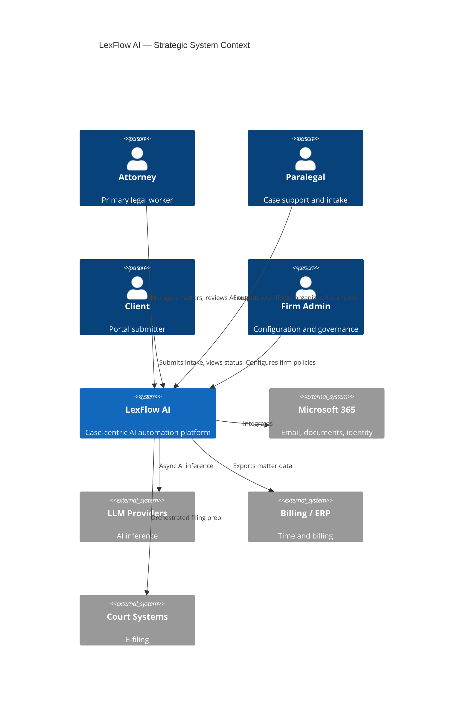
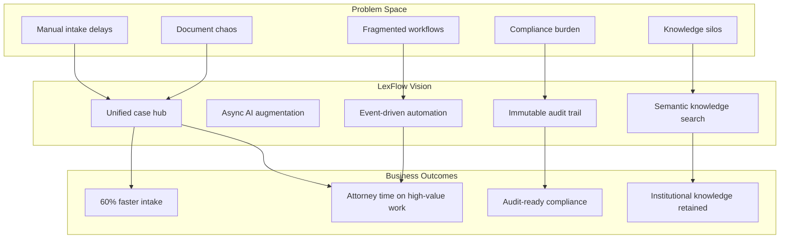
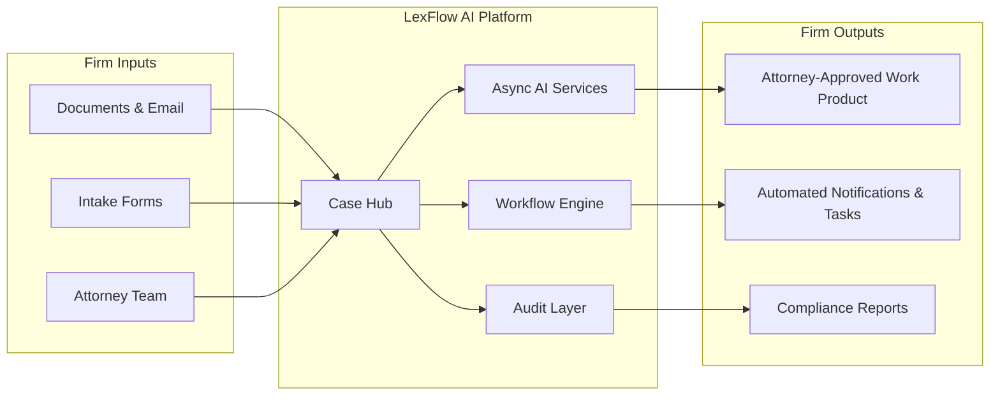

# Product Vision

**LexFlow AI** — Enterprise AI Automation Platform for Law Firms  
**Version:** 1.0  
**Status:** Draft — Pre-Implementation  
**Last Updated:** 2026-07-06

---

## Purpose

This document defines the **strategic north star** for LexFlow AI: the long-term vision, the problems it solves, and the value it delivers to large US law firms. It guides product prioritization, architectural decisions, and stakeholder alignment.

LexFlow AI exists to **augment legal professionals** — not replace them — by automating repetitive work while preserving attorney judgment, ethical walls, and compliance-grade audit trails.

---

## Scope

### In Scope

- Product vision statement and strategic pillars
- Problem statement with quantified pain points
- Value proposition for firm leadership, attorneys, and operations
- Target deployment profile and market positioning
- Relationship to technical architecture principles

### Out of Scope

- Feature specifications (see [capabilities.md](./capabilities.md))
- Delivery timelines (see [roadmap.md](./roadmap.md))
- Technical implementation details (see [../03-architecture/high-level-architecture.md](../03-architecture/high-level-architecture.md))

---

## Responsibilities

| Stakeholder | Responsibility |
|-------------|----------------|
| **Managing Partner / Firm Leadership** | Endorse vision; approve AI usage policies and investment |
| **Product Owner** | Maintain vision doc; resolve scope conflicts via [non-goals.md](./non-goals.md) |
| **Legal Operations** | Validate problem statement against firm workflows |
| **Engineering Leadership** | Ensure architecture implements vision principles (case-centric, async AI, matter walls) |
| **Compliance Officer** | Confirm vision aligns with ethical and regulatory obligations |

---

## Architecture

Vision translates into non-negotiable architectural constraints. LexFlow AI is built as an **event-driven, async-first, enterprise AWS deployment** with clear separation of concerns.

### Technology Stack (Vision-Aligned)

| Layer | Technology | Vision Rationale |
|-------|------------|------------------|
| Frontend | Next.js | Modern UX for attorneys; BFF pattern keeps logic server-side |
| API / Business Logic | FastAPI | Single source of truth for legal rules, RBAC, audit |
| Orchestration | n8n (private) | Connects Microsoft 365 and external systems without vendor lock-in |
| Messaging | RabbitMQ + Celery | Async automation; no blocking AI in request path |
| Data | PostgreSQL + pgvector | Case-centric system of record with semantic search |
| Cache | Redis | Performance without compromising audit integrity |
| Storage | S3 | Encrypted document binaries at scale |
| Compute | AWS ECS Fargate | Enterprise deployment inside firm VPC or dedicated AWS account |

### Strategic Pillars

1. **Case-centric design** — The legal matter is the aggregate root; all features attach to cases.
2. **Trust through transparency** — Immutable audit logs, human-in-the-loop AI, attorney approval gates.
3. **Enterprise security** — Matter walls, private n8n, encryption everywhere, no public automation surface.
4. **Open integration** — Microsoft 365 native; adapter pattern for billing, DMS, courts.
5. **Operational excellence** — 99.9% availability, observable async pipelines, disaster recovery readiness.

---

## Flow Diagrams

### Vision-to-Outcome Flow

### Value Delivery Model

---

## Problem Statement

Large US law firms (500–2,000+ attorneys) face systemic inefficiencies that generic SaaS tools fail to address because they lack **matter walls**, **legal-specific workflows**, and **audit-grade AI governance**.

| Pain Point | Current State | Business Impact |
|------------|---------------|-----------------|
| **Manual case intake** | Paralegals re-key data from emails and PDFs | 2–5 day matter opening delays; data entry errors; client frustration |
| **Document chaos** | Files scattered across email, SharePoint, local drives | Missed deadlines; version confusion; discovery risk |
| **Repetitive research** | Associates spend 10–20 hours/week on summarization | High billable leakage; associate burnout |
| **Workflow fragmentation** | Approvals stuck in email chains | No audit trail; bottlenecks invisible to management |
| **Compliance burden** | Proving access, AI usage, and data handling | Regulatory exposure; ethics committee scrutiny |
| **Knowledge silos** | Institutional knowledge walks out the door | Reinvention cost; inconsistent work product quality |

### Root Causes

1. **Tool sprawl** — Point solutions for DMS, billing, intake, and AI do not share a case-centric data model.
2. **AI without governance** — Consumer AI tools bypass matter walls and create ethics violations.
3. **Synchronous expectations** — Blocking AI calls degrade UX and violate enterprise reliability targets.
4. **Automation without audit** — Workflow tools lack immutable logs required for legal defensibility.

LexFlow AI addresses these root causes with a **unified, auditable, AI-augmented platform** built for deployment inside the firm's security boundary.

---

## Value Proposition

### For Firm Leadership

| Value | Description |
|-------|-------------|
| **Operational efficiency** | Reduce non-billable hours on intake, document organization, and routine summarization |
| **Risk reduction** | Matter walls, audit logs, and human-in-the-loop AI minimize ethics and data breach exposure |
| **Competitive differentiation** | Faster matter turnaround and consistent work product quality |
| **Investment protection** | Open architecture integrates with existing Microsoft 365, billing, and DMS investments |

### For Attorneys and Paralegals

| Value | Description |
|-------|-------------|
| **Time reclamation** | AI drafts summaries and research; attorneys review and approve |
| **Single case hub** | One place for documents, tasks, deadlines, workflows, and AI outputs |
| **Confidence in AI** | Every AI output is logged, scoped to authorized matters, and requires approval before client delivery |
| **Workflow automation** | Trigger standardized processes (discovery prep, filing checklists) without leaving the case context |

### For IT and Compliance

| Value | Description |
|-------|-------------|
| **Private deployment** | AWS ECS in firm-controlled account; n8n never public |
| **Identity integration** | Microsoft Entra ID SSO roadmap |
| **Complete audit trail** | 100% of mutating API calls and AI invocations logged |
| **Data sovereignty** | Documents in encrypted S3; embeddings in firm PostgreSQL |

### Competitive Positioning

| Dimension | LexFlow AI | Typical Alternative |
|-----------|------------|---------------------|
| Architecture | Event-driven, async-first, enterprise AWS | Monolithic multi-tenant SaaS |
| AI approach | Human-in-the-loop, auditable, firm-controlled prompts | Black-box AI |
| Automation | n8n orchestration + FastAPI business logic | Vendor-locked workflows |
| Security | Matter walls, immutable audit, private deployment | Shared tenant, limited walls |
| Integration | Open adapter pattern, Microsoft 365 native | Closed ecosystem |

---

## Best Practices

1. **Lead with outcomes, not features** — When presenting LexFlow internally, anchor on intake time reduction and audit readiness, not "we have AI."
2. **Emphasize augmentation** — Position AI as a drafting assistant requiring attorney review; this aligns with ABA guidance and firm ethics policies.
3. **Deploy profile matters** — Target firms with 500+ attorneys, Microsoft 365, and existing billing/DMS; see [user-personas.md](./user-personas.md).
4. **Pilot on one practice area** — Litigation or corporate transactional workflows validate value before firm-wide rollout.
5. **Measure from day one** — Baseline manual intake time and document search latency before go-live; see [success-metrics.md](./success-metrics.md).

---

## Tradeoffs

| Choice | Rationale | Tradeoff |
|--------|-----------|----------|
| **Enterprise private deployment vs. SaaS** | Firms require data control and matter walls | Higher initial infrastructure cost; firm IT involvement |
| **Human-in-the-loop AI vs. full automation** | Legal ethics and malpractice risk | Slower output than consumer AI tools |
| **Modular monolith vs. microservices** | Reduce operational complexity at launch | May require service extraction at extreme scale |
| **n8n for orchestration vs. custom engine** | Faster integration development; version-controlled workflows | Operational dependency on n8n; strict boundary enforcement required |
| **Single PostgreSQL vs. polyglot persistence** | Simpler transactions, audit, and matter wall enforcement | Vertical scaling limits; may partition later |

---

## Future Improvements

| Initiative | Horizon | Description |
|------------|---------|-------------|
| Multi-firm SaaS offering | Year 3+ | Hosted variant for mid-size firms (requires tenancy model) |
| Practice-area accelerators | Phase 3 | Pre-built workflow templates for litigation, M&A, regulatory |
| Predictive analytics | Phase 4 | Matter outcome modeling (advisory only, attorney-validated) |
| Voice intake | Phase 4 | Secure voice-to-matter for client intake calls |
| Partner ecosystem | Phase 4 | Certified integrators for regional court systems |
| Vision refresh cadence | Annual | Executive review aligned with firm strategic planning |

---

## References

| Document | Path |
|----------|------|
| Product index | [README.md](./README.md) |
| User personas | [user-personas.md](./user-personas.md) |
| Core capabilities | [capabilities.md](./capabilities.md) |
| Delivery roadmap | [roadmap.md](./roadmap.md) |
| Success metrics | [success-metrics.md](./success-metrics.md) |
| Non-goals | [non-goals.md](./non-goals.md) |
| High-level architecture | [../03-architecture/high-level-architecture.md](../03-architecture/high-level-architecture.md) |
| AI architecture | [../03-architecture/ai-architecture.md](../03-architecture/ai-architecture.md) |
| Security architecture | [../04-security/security-architecture.md](../04-security/security-architecture.md) |
| ADR-002: n8n orchestration only | [../13-decisions/002-n8n-orchestration-only.md](../13-decisions/002-n8n-orchestration-only.md) |
| ADR-004: Async AI processing | [../13-decisions/004-async-ai-processing.md](../13-decisions/004-async-ai-processing.md) |

---

## Vision Statement

> **LexFlow AI is the enterprise legal automation platform that frees attorneys to practice law — by automating intake, documents, workflows, and AI-assisted research within a case-centric, audit-ready, ethically bounded system designed for the world's most demanding law firms.**
