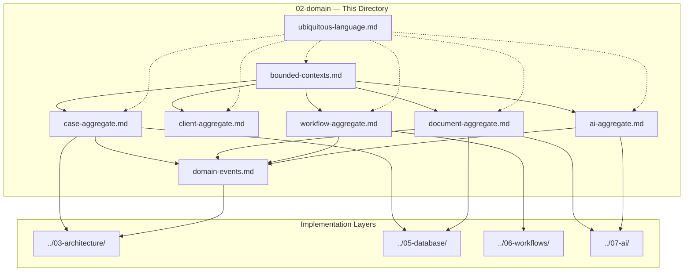
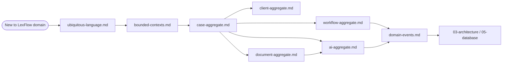
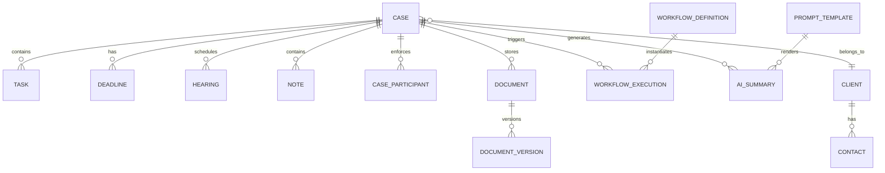

# Domain Layer — Documentation Index

**LexFlow AI** — Domain-Driven Design Reference  
**Version:** 1.0  
**Status:** Draft — Pre-Implementation  
**Last Updated:** 2026-07-06

---

## Purpose

This directory is the authoritative domain layer documentation for LexFlow AI. It defines bounded contexts, aggregates, invariants, state machines, domain events, and ubiquitous language for the legal automation platform.

Engineers, architects, and product stakeholders use these documents to align on **what the system means** before implementing **how it behaves** in application code.

---

## Scope

| In Scope | Out of Scope |
|----------|--------------|
| Bounded context boundaries and context map | REST API endpoint definitions |
| Aggregate roots, entities, value objects | SQL migration scripts |
| Domain invariants and state machines | n8n workflow JSON |
| Domain event catalog and payloads | UI component specifications |
| Ubiquitous language glossary | Infrastructure and deployment |

The **Case** aggregate is the central organizing principle. All other aggregates either belong to a Case, reference a Case, or support firm-wide operations (identity, workflow templates, audit).

---

## Responsibilities

| Audience | Use This Directory To |
|----------|----------------------|
| Backend engineers | Implement domain logic with correct invariants and event emission |
| Architects | Review context boundaries, integration patterns, and evolution path |
| Product / legal ops | Validate terminology and business rules match firm practice |
| Security / compliance | Understand matter walls, approval gates, and audit touchpoints |
| AI engineers | Understand case-scoped AI aggregates and approval requirements |

---

## Architecture

LexFlow AI follows **Domain-Driven Design (DDD)** within a **modular monolith**. Each bounded context maps to a Python package under `services/` and a PostgreSQL schema. Contexts communicate via domain events (transactional outbox → RabbitMQ), never via direct cross-schema writes.

### Document Map

| Document | Description | Primary Diagrams |
|----------|-------------|------------------|
| [bounded-contexts.md](./bounded-contexts.md) | All 8 bounded contexts, context map, integration relationships | Context map, integration topology |
| [case-aggregate.md](./case-aggregate.md) | Case aggregate root, child entities, invariants, status state machine | State diagram, ER diagram, sequence |
| [client-aggregate.md](./client-aggregate.md) | Client aggregate, contacts, portal linkage | ER diagram, sequence |
| [document-aggregate.md](./document-aggregate.md) | Document aggregate, versioning, OCR lifecycle | State diagram, ER diagram, sequence |
| [workflow-aggregate.md](./workflow-aggregate.md) | WorkflowDefinition, WorkflowExecution, step tracking | State diagram, sequence |
| [ai-aggregate.md](./ai-aggregate.md) | AISummary, PromptTemplate, human-in-the-loop | State diagram, sequence |
| [domain-events.md](./domain-events.md) | Full event catalog with envelopes and payloads | Event flow, routing topology |
| [ubiquitous-language.md](./ubiquitous-language.md) | Firm-wide glossary — terms, anti-patterns, examples | — |

---

## Flow Diagrams

### Domain Layer Reading Order

### Case-Centric Aggregate Relationships

---

## Best Practices

1. **Start with ubiquitous language** — Read [ubiquitous-language.md](./ubiquitous-language.md) before implementing any feature; mismatched terms cause integration bugs across contexts.
2. **Respect aggregate boundaries** — Modify child entities (Task, DocumentVersion) through their aggregate root or an application service that enforces invariants.
3. **Emit events on state change** — Every meaningful domain transition produces a domain event written to the transactional outbox in the same database transaction.
4. **Case is the authorization scope** — Matter wall checks occur before any Case-scoped operation; see [case-aggregate.md](./case-aggregate.md).
5. **Keep n8n out of domain decisions** — Workflow orchestration triggers are domain events; legal and authorization decisions remain in FastAPI domain services.
6. **Version aggregates optimistically** — Case, Client, Document, and WorkflowDefinition carry a `version` field; reject stale writes with HTTP 409.
7. **Document invariants in tests** — Each invariant listed in aggregate docs should have a corresponding unit test once implementation begins.

---

## Tradeoffs

| Decision | Benefit | Cost |
|----------|---------|------|
| Case as central aggregate | Single authorization scope; intuitive for attorneys | Cross-case reporting requires read models |
| Child entities inside Case aggregate | Strong consistency for tasks, deadlines, notes | Large Case graphs may need lazy loading |
| Separate Client aggregate | Clean client portal and CRM boundaries | Client–Case consistency enforced at application layer |
| Separate Document aggregate | Independent OCR/versioning lifecycle | Must validate `caseId` and case status on every write |
| Event-driven cross-context integration | Loose coupling; async scalability | Eventual consistency; idempotent handlers required |
| Human-in-the-loop AI summaries | Ethical compliance; attorney accountability | Slower time-to-value for AI outputs |

---

## Future Improvements

| Phase | Improvement |
|-------|-------------|
| Phase 2 | Extract read models (CQRS) for dashboards and firm-wide search |
| Phase 2 | Formalize Anti-Corruption Layers for billing and DMS integrations |
| Phase 3 | Sub-domain for Conflict Check as dedicated bounded context |
| Phase 3 | Event versioning schema registry with backward compatibility |
| Phase 4 | Extract Document Processing to independent service if OCR volume warrants |
| Ongoing | Domain model validation tooling — generate OpenAPI/event schemas from domain specs |

---

## References

### Within This Directory

- [bounded-contexts.md](./bounded-contexts.md)
- [case-aggregate.md](./case-aggregate.md)
- [client-aggregate.md](./client-aggregate.md)
- [document-aggregate.md](./document-aggregate.md)
- [workflow-aggregate.md](./workflow-aggregate.md)
- [ai-aggregate.md](./ai-aggregate.md)
- [domain-events.md](./domain-events.md)
- [ubiquitous-language.md](./ubiquitous-language.md)

### Cross-References

| Path | Relevance |
|------|-----------|
| [../03-architecture/](../03-architecture/) | System containers, async paths, modular monolith layout |
| [../05-database/](../05-database/) | PostgreSQL schemas, indexes, retention per aggregate |
| [../06-workflows/](../06-workflows/) | n8n orchestration contracts triggered by domain events |
| [../07-ai/](../07-ai/) | LLM providers, prompt registry, RAG pipeline |
| [../product-overview.md](../product-overview.md) | Vision, personas, capabilities |
| [../domain-model.md](../domain-model.md) | Legacy consolidated domain reference (superseded by this directory) |
| [../event-driven-architecture.md](../event-driven-architecture.md) | Outbox pattern, RabbitMQ topology, saga patterns |
| [../13-decisions/001-modular-monolith.md](../13-decisions/001-modular-monolith.md) | Modular monolith decision |
| [../13-decisions/004-async-ai-processing.md](../13-decisions/004-async-ai-processing.md) | Async AI processing decision |
