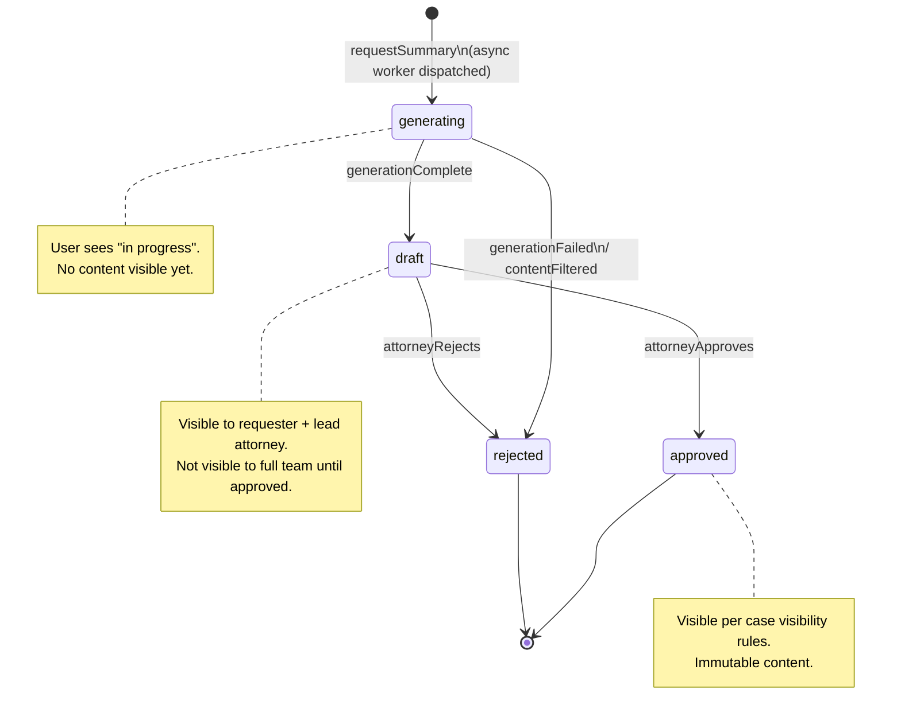
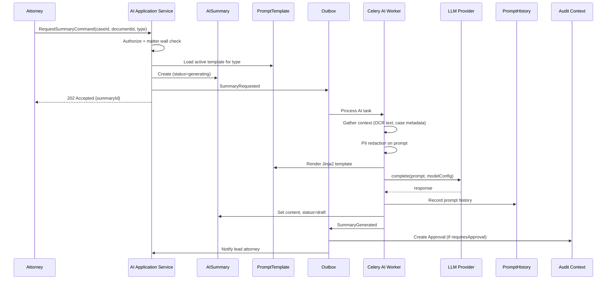
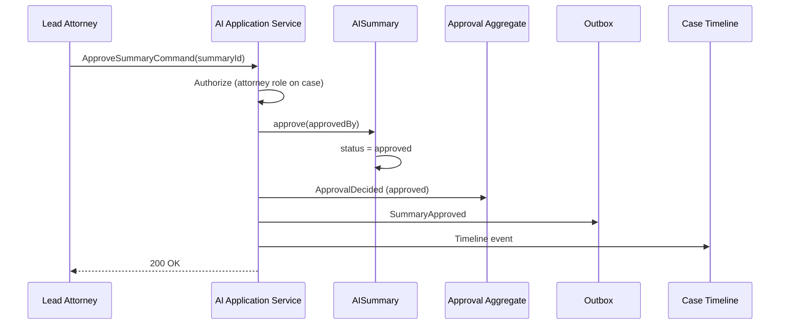
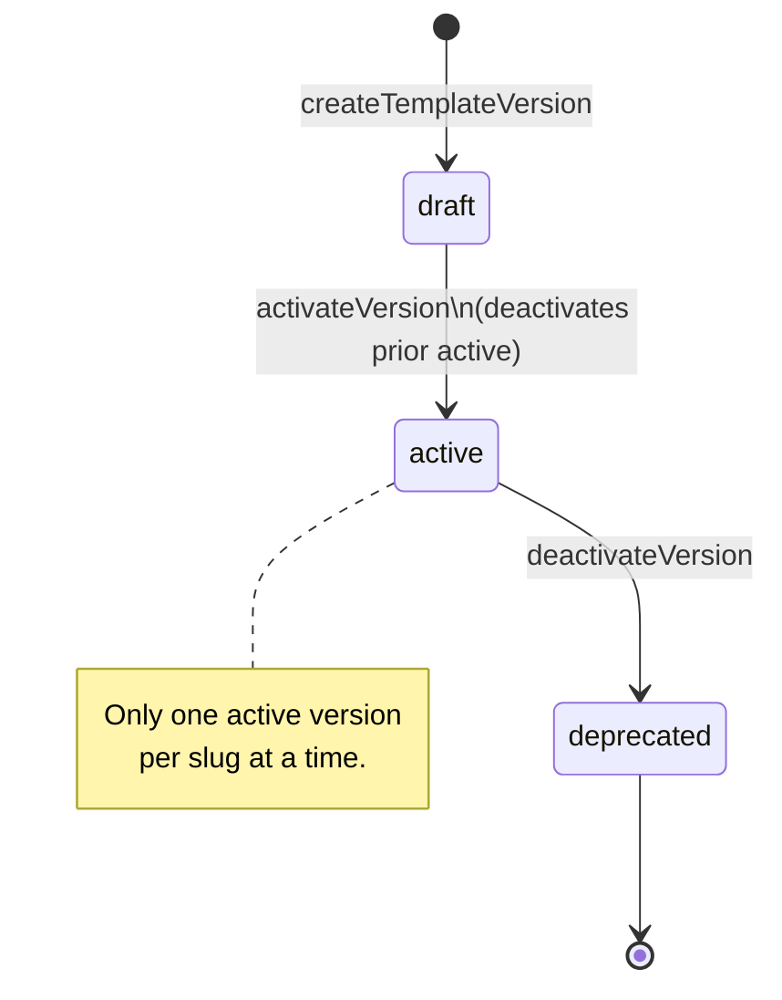

# AI Aggregate

**LexFlow AI** — AI & Knowledge Domain  
**Version:** 1.0  
**Status:** Draft — Pre-Implementation  
**Last Updated:** 2026-07-06

---

## Purpose

The AI & Knowledge bounded context manages AI-generated legal work product, versioned prompt templates, and the audit trail of all LLM interactions. The **AISummary** aggregate enforces human-in-the-loop governance — attorney approval is required before AI outputs become visible to the broader case team. The **PromptTemplate** aggregate provides versioned, auditable prompt management.

---

## Scope

| In Scope | Out of Scope |
|----------|--------------|
| AISummary aggregate and approval lifecycle | LLM provider SDK implementation |
| PromptTemplate aggregate and versioning | Vector embedding algorithms |
| PromptHistory and LLMUsage (supporting entities) | Document OCR pipeline |
| Summary type taxonomy | n8n orchestration |
| Human-in-the-loop invariants | Frontend chat UI components |

---

## Responsibilities

| Aggregate / Entity | Responsibilities |
|--------------------|------------------|
| **AISummary** | Store AI-generated text; track approval status; link to case and optional document |
| **PromptTemplate** | Versioned Jinja2 templates; model configuration; approval requirements per template |
| **PromptHistory** | Immutable log of every LLM call (redacted prompt + response) |
| **LLMUsage** | Aggregated token usage and cost tracking per firm/user/case |

---

## Architecture

### AISummary Aggregate

```
AISummary (Aggregate Root)
├── id: SummaryId (UUID)
├── caseId: CaseId                         ← required; matter wall scope
├── documentId: DocumentId | null          ← null for case-level summaries
├── summaryType: SummaryType (enum)
├── content: string                        ← generated text (may be JSON-structured)
├── model: string                          ← e.g., gpt-4o, claude-3-5-sonnet
├── promptVersion: string                  ← e.g., document-summary-v1
├── status: SummaryStatus (enum)
├── approvedBy: UserId | null
├── approvedAt: datetime | null
├── rejectedBy: UserId | null
├── rejectionReason: string | null
├── tokenCount: int
├── correlationId: UUID
└── createdAt: datetime
```

### PromptTemplate Aggregate

```
PromptTemplate (Aggregate Root)
├── id: PromptTemplateId (UUID)
├── name: string                           ← human-readable name
├── slug: string                           ← unique identifier
├── version: int                           ← monotonically increasing per slug
├── template: string                       ← Jinja2 template body
├── modelConfig: JSON                      ← temperature, max_tokens, provider, model
├── requiresApproval: boolean              ← human review before team visibility
├── isActive: boolean                      ← only one active version per slug
├── createdAt: datetime
└── createdBy: UserId
```

### Supporting Entities

```
PromptHistory (Entity — append-only)
├── id: UUID
├── caseId: CaseId
├── userId: UserId
├── promptTemplateId: PromptTemplateId
├── renderedPrompt: string                 ← PII-redacted copy
├── response: string
├── model: string
├── provider: Provider (enum)
├── inputTokens: int
├── outputTokens: int
├── latencyMs: int
├── status: PromptStatus (enum)
├── correlationId: UUID
└── createdAt: datetime

LLMUsage (Entity — aggregated)
├── id: UUID
├── firmId: FirmId
├── userId: UserId
├── caseId: CaseId
├── provider: string
├── model: string
├── inputTokens: bigint
├── outputTokens: bigint
├── estimatedCostUsd: decimal
├── periodStart: date
└── createdAt: datetime
```

### Entity Relationship Diagram

```mermaid
erDiagram
    AI_SUMMARIES {
        uuid id PK
        uuid case_id FK
        uuid document_id FK
        enum summary_type
        text content
        varchar model
        varchar prompt_version
        enum status
        uuid approved_by FK
        uuid rejected_by FK
        text rejection_reason
        int token_count
        uuid correlation_id
    }

    PROMPT_TEMPLATES {
        uuid id PK
        varchar name
        varchar slug
        int version
        text template
        jsonb model_config
        boolean requires_approval
        boolean is_active
        uuid created_by FK
    }

    PROMPT_HISTORY {
        uuid id PK
        uuid case_id FK
        uuid user_id FK
        uuid prompt_template_id FK
        text rendered_prompt
        text response
        varchar model
        enum provider
        int input_tokens
        int output_tokens
        int latency_ms
        enum status
        uuid correlation_id
    }

    LLM_USAGE {
        uuid id PK
        uuid firm_id FK
        uuid user_id FK
        uuid case_id FK
        varchar provider
        varchar model
        bigint input_tokens
        bigint output_tokens
        decimal estimated_cost_usd
        date period_start
    }

    CASES ||--o{ AI_SUMMARIES : generates
    DOCUMENTS ||--o{ AI_SUMMARIES : "optional source"
    PROMPT_TEMPLATES ||--o{ PROMPT_HISTORY : renders
    PROMPT_TEMPLATES ||--o{ AI_SUMMARIES : "prompt_version ref"
    CASES ||--o{ PROMPT_HISTORY : scopes
```



### Enumerations

| Enum | Values |
|------|--------|
| `SummaryType` | `case_overview`, `document_summary`, `deposition_summary`, `contract_review`, `legal_research` |
| `SummaryStatus` | `generating`, `draft`, `approved`, `rejected` |
| `Provider` | `openai`, `azure_openai`, `anthropic`, `ollama` |
| `PromptStatus` | `success`, `error`, `filtered` |

---

## Flow Diagrams

### AISummary Status State Machine



### AI Summary Generation Sequence



### Attorney Approval Sequence



### PromptTemplate Versioning



---

## Invariants

| # | Invariant | Enforcement |
|---|-----------|-------------|
| 1 | Every AISummary must have a valid `caseId` | Creation factory |
| 2 | Matter wall authorization required before any AI operation on a case | Application service |
| 3 | A Summary cannot transition to `approved` without an authorized attorney action | `approve()` method |
| 4 | `approvedBy` and `approvedAt` set only on `approved` status | State transition guard |
| 5 | `rejectedBy` and `rejectionReason` set only on `rejected` status | State transition guard |
| 6 | Approved summaries are immutable — no content edits | No update path on approved status |
| 7 | Only one `isActive = true` PromptTemplate per `slug` | Activation deactivates prior version |
| 8 | PromptTemplate `version` is monotonically increasing per slug | Creation factory |
| 9 | All LLM calls recorded in PromptHistory before returning to user | Worker pipeline |
| 10 | `renderedPrompt` in PromptHistory is PII-redacted | PII redaction pipeline |
| 11 | AI inference is never synchronous in the HTTP request path | API returns 202 |
| 12 | `documentId` must reference a `ready` document in the same case | Validation on creation |
| 13 | Token usage aggregated into LLMUsage for compliance reporting | Meter service |

---

## Summary Types

| Type | Trigger | Input Context | Approval Required | Template Slug |
|------|---------|---------------|-------------------|---------------|
| `case_overview` | User request | Case metadata + document summaries + timeline | Yes | `case-overview-v1` |
| `document_summary` | User request or `DocumentProcessed` | Document OCR text + case context | Yes | `document-summary-v1` |
| `deposition_summary` | User request | Deposition transcript OCR text | Yes | `deposition-summary-v1` |
| `contract_review` | User request | Contract OCR + firm playbook rules | Yes | `contract-review-v1` |
| `legal_research` | User request | Research question + RAG chunks from case documents | Yes | `legal-research-v1` |

Case-scoped AI chat (assistant) uses `PromptHistory` directly without an AISummary aggregate — responses are never auto-shared externally and do not require approval for internal use.

---

## Best Practices

1. **Always async** — Return 202 with `summaryId`; poll status endpoint for completion.
2. **Scope retrieval to case** — RAG queries filter by `caseId` and respect matter walls before embedding search.
3. **Version prompts, not strings** — Reference `promptVersion` slug in summaries for reproducibility.
4. **Redact PII before LLM** — SSN, account numbers, minor names redacted in `renderedPrompt`.
5. **Validate LLM output** — JSON schema validation for structured summaries; reject malformed responses.
6. **Append disclaimer to research outputs** — "AI-generated research requiring attorney verification."
7. **Meter every call** — Token counts flow to LLMUsage for cost governance and compliance reports.
8. **Never auto-send AI output to clients** — Approval + separate document send workflow required.

---

## Tradeoffs

| Decision | Benefit | Cost |
|----------|---------|------|
| Human-in-the-loop approval | Ethical compliance; attorney accountability | Slower time-to-value |
| Separate AISummary aggregate | Clear approval lifecycle | Extra entity vs storing in PromptHistory |
| PromptTemplate versioning | Reproducibility; A/B testing | Multiple versions to manage |
| Async-only inference | Responsive API; no timeout issues | Polling/WebSocket needed for UX |
| PII redaction before LLM | Reduced data exposure to providers | Redaction may remove legally relevant context |
| PromptHistory append-only | Complete audit trail | High volume; monthly partitioning required |
| Chat without AISummary | Faster internal assistant UX | Less structured governance on chat responses |

---

## Future Improvements

| Improvement | Description |
|-------------|-------------|
| Prompt A/B testing | Route percentage of requests to draft template versions |
| Summary diff view | Show attorney edits between draft and approved content |
| Firm playbook management | Structured storage for contract review rules per practice area |
| Multi-model ensemble | Compare outputs from multiple providers for high-risk reviews |
| Confidence scoring | LLM self-reported confidence surfaced to attorney |
| Citation verification | Automated check that cited document passages exist in case |
| Cost budgets per case | Block AI requests when case LLM budget exceeded |
| Feedback loop | Attorney ratings on summaries improve prompt selection |

---

## References

- [bounded-contexts.md](./bounded-contexts.md) — AI & Knowledge context
- [case-aggregate.md](./case-aggregate.md) — Case scoping and matter walls
- [document-aggregate.md](./document-aggregate.md) — Document source for summaries
- [domain-events.md](./domain-events.md) — `SummaryGenerated`, `SummaryApproved`, `EmbeddingCompleted`
- [ubiquitous-language.md](./ubiquitous-language.md) — Summary vs Report terminology
- [../07-ai/](../07-ai/) — Provider abstraction, RAG, safety pipeline
- [../05-database/](../05-database/) — `ai` schema tables
- [../03-architecture/](../03-architecture/) — Async AI processing path
- [../13-decisions/004-async-ai-processing.md](../13-decisions/004-async-ai-processing.md) — Async AI ADR
