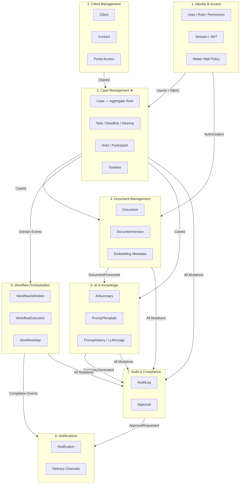
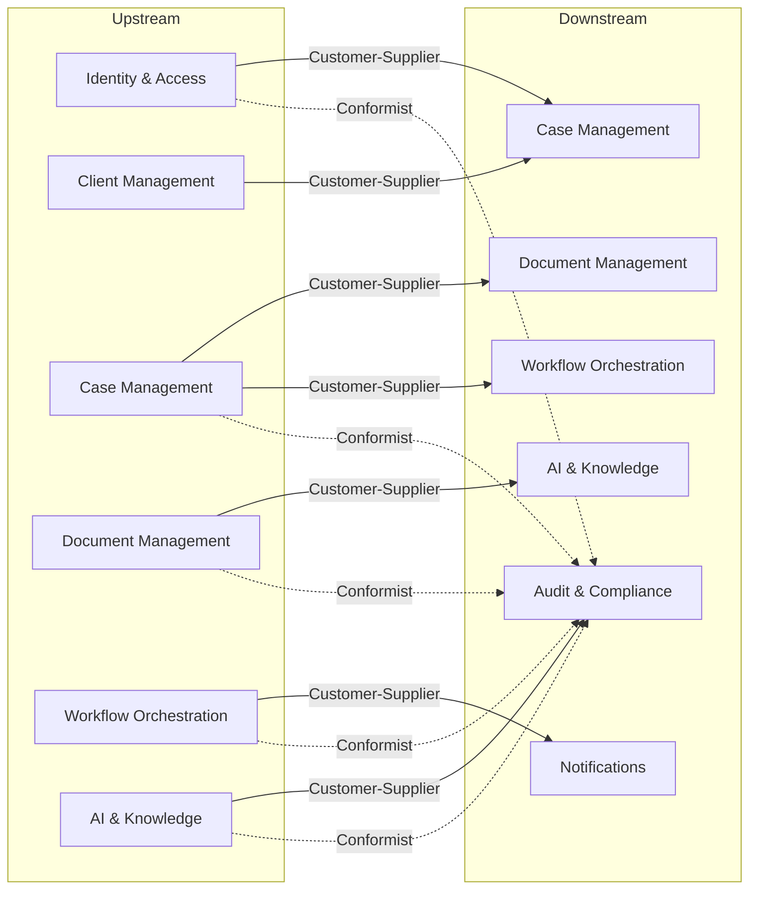
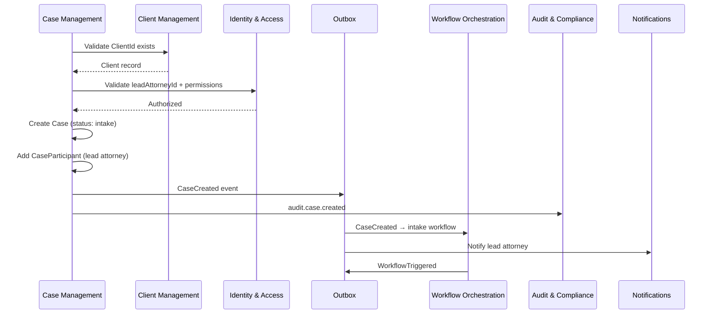
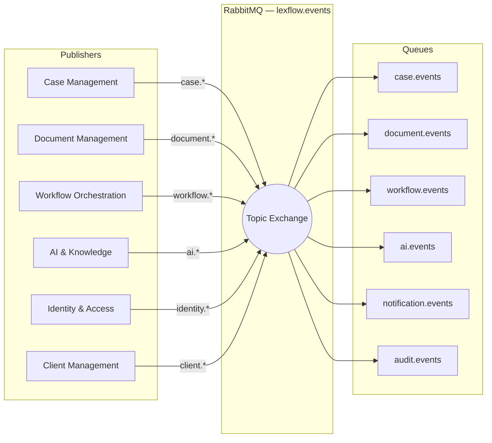

# Bounded Contexts

**LexFlow AI** — Context Map & Integration Patterns  
**Version:** 1.0  
**Status:** Draft — Pre-Implementation  
**Last Updated:** 2026-07-06

---

## Purpose

This document defines the eight bounded contexts of LexFlow AI, their ownership boundaries, integration relationships, and the context map that governs how domains interact. Bounded contexts prevent a single unified model from collapsing under the complexity of legal practice, security, and automation.

---

## Scope

| In Scope | Out of Scope |
|----------|--------------|
| Eight bounded context definitions | API route implementations |
| Context map and DDD relationship types | Database migration files |
| Published and consumed domain events per context | n8n workflow node configuration |
| Schema ownership (`identity`, `cases`, `documents`, etc.) | Frontend state management |

---

## Responsibilities

Each bounded context owns a distinct subdomain of legal automation. No context may write directly to another context's tables. Integration occurs through:

1. **Foreign key references** (read-only across context boundaries at query time)
2. **Domain events** (transactional outbox → RabbitMQ)
3. **Application services** that coordinate multi-context operations within a single transaction where required

| Context | Owns | Does Not Own |
|---------|------|--------------|
| Identity & Access | Users, roles, permissions, sessions, matter wall policy engine | Case data, client records |
| Case Management | Cases, tasks, deadlines, hearings, notes, participants, timeline | Client master data, document binaries |
| Client Management | Clients, contacts, portal linkage | Case lifecycle, matter walls |
| Document Management | Documents, versions, embeddings metadata, OCR state | AI summary content, workflow execution |
| Workflow Orchestration | Workflow definitions, executions, steps | Business authorization decisions |
| AI & Knowledge | Summaries, prompt templates, prompt history, LLM usage | Document storage, case status |
| Audit & Compliance | Audit logs, approvals | Domain entity mutations |
| Notifications | Notification records, delivery state | Workflow logic, AI inference |

---

## Architecture

### The Eight Bounded Contexts

★ **Case Management** is the central context. All case-scoped features reference the Case aggregate.

### Context Map (DDD Relationships)

| Upstream | Downstream | Relationship | Integration Mechanism |
|----------|------------|--------------|----------------------|
| Identity & Access | Case Management | Customer-Supplier | `UserId` references; RBAC + matter wall checks before case access |
| Client Management | Case Management | Customer-Supplier | `ClientId` on Case; `ClientCreated` event for intake workflows |
| Case Management | Document Management | Customer-Supplier | `CaseId` on Document; `CaseStatusChanged` may block uploads |
| Case Management | Workflow Orchestration | Customer-Supplier | Case domain events trigger workflow executions |
| Document Management | AI & Knowledge | Customer-Supplier | `DocumentProcessed` triggers embedding and summary eligibility |
| Case Management | AI & Knowledge | Customer-Supplier | `CaseId` scopes all AI operations; case context in prompts |
| Workflow Orchestration | Notifications | Customer-Supplier | `WorkflowCompleted` / `WorkflowFailed` trigger notifications |
| AI & Knowledge | Audit & Compliance | Customer-Supplier | `SummaryGenerated` creates approval requests when required |
| All contexts | Audit & Compliance | Conformist | Every mutating operation emits audit events; no upstream influence on audit schema |

### Schema Mapping

| Bounded Context | PostgreSQL Schema | Primary Tables |
|-----------------|-------------------|----------------|
| Identity & Access | `identity` | `firms`, `users`, `roles`, `permissions`, `user_roles`, `role_permissions`, `refresh_tokens` |
| Case Management | `cases` | `cases`, `case_participants`, `tasks`, `deadlines`, `hearings`, `notes`, `case_timeline_events` |
| Client Management | `cases` | `clients` (shared schema; separate aggregate boundary) |
| Document Management | `documents` | `documents`, `document_versions`, `document_embeddings` |
| Workflow Orchestration | `workflows` | `workflow_definitions`, `workflow_executions`, `workflow_steps` |
| AI & Knowledge | `ai` | `ai_summaries`, `prompt_templates`, `prompt_history`, `llm_usage` |
| Audit & Compliance | `audit` | `audit_logs`, `approvals` |
| Notifications | `shared` | `notifications` |
| Cross-cutting | `shared` | `outbox_events`, `idempotency_keys` |

---

## Flow Diagrams

### Context Integration — Case Creation

### Event Routing by Context

---

## Context Detail

### 1. Identity & Access

**Core concern:** Who can access what, and under which firm tenancy.

- Authenticates users via JWT (future: Microsoft Entra ID OIDC)
- Manages RBAC roles and permissions
- Provides matter wall enforcement API consumed by all case-scoped contexts
- Publishes: `UserCreated`, `RoleAssigned`, `UserDeactivated`
- Does not store case or client data

### 2. Client Management

**Core concern:** Master record for individuals and organizations receiving legal services.

- Owns `Client` aggregate and organization `Contact` entities
- Links clients to portal `UserId` for self-service access
- Publishes: `ClientCreated`, `ClientUpdated`, `ClientPortalEnabled`
- Referenced by Case via `ClientId` — Client cannot be hard-deleted while active Cases exist

### 3. Case Management ★

**Core concern:** The legal matter — central hub for all case work.

- Owns `Case` aggregate root and child entities (Task, Deadline, Hearing, Note, CaseParticipant)
- Maintains denormalized `case_timeline_events` for fast UI rendering
- Enforces case status state machine and matter wall invariants
- Publishes: `CaseCreated`, `CaseStatusChanged`, `TaskCreated`, `TaskCompleted`, `DeadlineApproaching`, `DeadlineMissed`, `CaseParticipantAdded`
- See [case-aggregate.md](./case-aggregate.md)

### 4. Document Management

**Core concern:** Secure file lifecycle — upload, versioning, OCR, search indexing.

- Owns `Document` aggregate and `DocumentVersion` entities
- Stores binaries in S3; metadata and OCR text in PostgreSQL
- Publishes: `DocumentUploaded`, `DocumentProcessed`, `DocumentVersionCreated`, `DocumentArchived`
- See [document-aggregate.md](./document-aggregate.md)

### 5. Workflow Orchestration

**Core concern:** Durable execution records for automated multi-step processes.

- Owns `WorkflowDefinition` (template) and `WorkflowExecution` (instance)
- FastAPI decides **if** a workflow runs; n8n executes **how** external calls are made
- Publishes: `WorkflowTriggered`, `WorkflowCompleted`, `WorkflowFailed`, `WorkflowCancelled`
- See [workflow-aggregate.md](./workflow-aggregate.md)

### 6. AI & Knowledge

**Core concern:** AI-assisted legal work product with human-in-the-loop governance.

- Owns `AISummary`, `PromptTemplate`, `PromptHistory`, `LLMUsage`
- All inference is async; outputs require attorney approval for team-visible summaries
- Publishes: `SummaryGenerated`, `SummaryApproved`, `SummaryRejected`, `EmbeddingCompleted`, `ResearchCompleted`
- See [ai-aggregate.md](./ai-aggregate.md)

### 7. Audit & Compliance

**Core concern:** Immutable record of who did what, when, and why.

- Append-only `audit_logs` — application role has INSERT only
- Owns `Approval` aggregate for human authorization gates
- Publishes: `ApprovalRequested`, `ApprovalDecided`, `ApprovalExpired`
- Consumes audit events from all contexts (Conformist relationship)

### 8. Notifications

**Core concern:** Delivering timely alerts across in-app, email, and Teams channels.

- Owns `Notification` records and delivery state
- Consumes events from Case, Workflow, AI, and Audit contexts
- Publishes: `NotificationSent`, `NotificationFailed`
- Does not decide **who** should be notified — upstream contexts specify recipients

---

## Best Practices

1. **One context, one package** — Map each context to `services/{context_name}/` in the monorepo; no cross-package domain imports.
2. **Publish events, don't call across contexts** — Use domain events for side effects; reserve synchronous cross-context calls for read validation only.
3. **Shared schema ≠ shared model** — `clients` table lives in `cases` schema but Client Management owns the aggregate; Case Management only holds a `ClientId` reference.
4. **Matter wall is cross-cutting policy** — Identity provides the enforcement mechanism; Case Management owns participant membership.
5. **Audit is conformist** — Never let Audit & Compliance influence upstream domain models; it records what happened.
6. **Name events by aggregate** — `{Aggregate}{Action}` in past tense: `CaseCreated`, not `CreateCase`.
7. **Document context relationships in ADRs** — Extracting a context to a microservice requires a new ADR.

---

## Tradeoffs

| Decision | Benefit | Cost |
|----------|---------|------|
| Modular monolith (8 contexts, 1 deployable) | Low operational overhead; transactional consistency within a request | Harder to scale individual contexts independently |
| Client in `cases` schema | Simpler joins for case dashboards | Blurs schema boundary; requires discipline |
| Notifications as separate context | Clean delivery abstraction | Extra hop through event bus |
| Conformist Audit relationship | Immutable, unbiased audit trail | Audit cannot request upstream model changes |
| Case events drive workflows | Loose coupling to n8n | Eventual consistency for automation side effects |

---

## Future Improvements

| Improvement | Context | Rationale |
|-------------|---------|-----------|
| Extract Identity to dedicated service | Identity & Access | Entra ID SSO + multi-firm tenancy complexity |
| Conflict Check bounded context | New context | External conflict systems deserve ACL isolation |
| CQRS read models | Case Management | Firm-wide dashboards without overloading Case aggregate |
| Event schema registry | Cross-cutting | Versioned payloads with backward compatibility |
| Notification preferences context | Notifications | User channel opt-in/opt-out per event type |
| Billing integration ACL | New context | Anti-corruption layer for ERP systems |

---

## References

- [case-aggregate.md](./case-aggregate.md) — Central aggregate detail
- [domain-events.md](./domain-events.md) — Full event catalog
- [ubiquitous-language.md](./ubiquitous-language.md) — Term definitions per context
- [../03-architecture/](../03-architecture/) — Modular monolith container diagram
- [../05-database/](../05-database/) — Schema-per-context table definitions
- [../06-workflows/](../06-workflows/) — n8n orchestration triggered by Workflow context events
- [../07-ai/](../07-ai/) — AI bounded context implementation detail
- [../event-driven-architecture.md](../event-driven-architecture.md) — Outbox and RabbitMQ topology
- [../13-decisions/001-modular-monolith.md](../13-decisions/001-modular-monolith.md) — Modular monolith ADR
- [../13-decisions/003-postgresql-single-database.md](../13-decisions/003-postgresql-single-database.md) — Single database ADR
