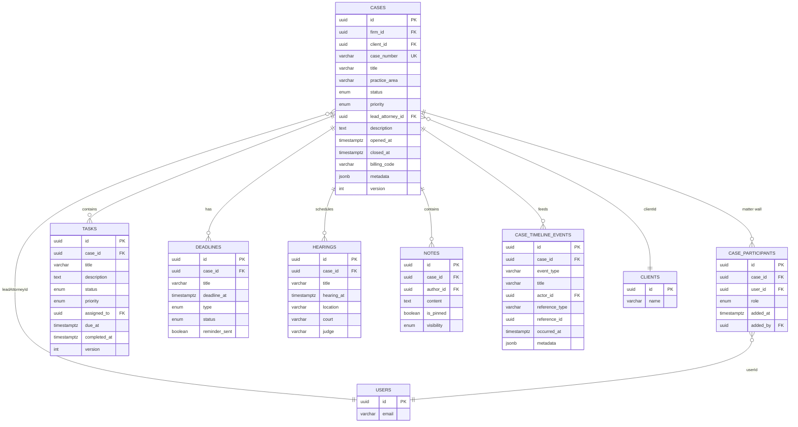
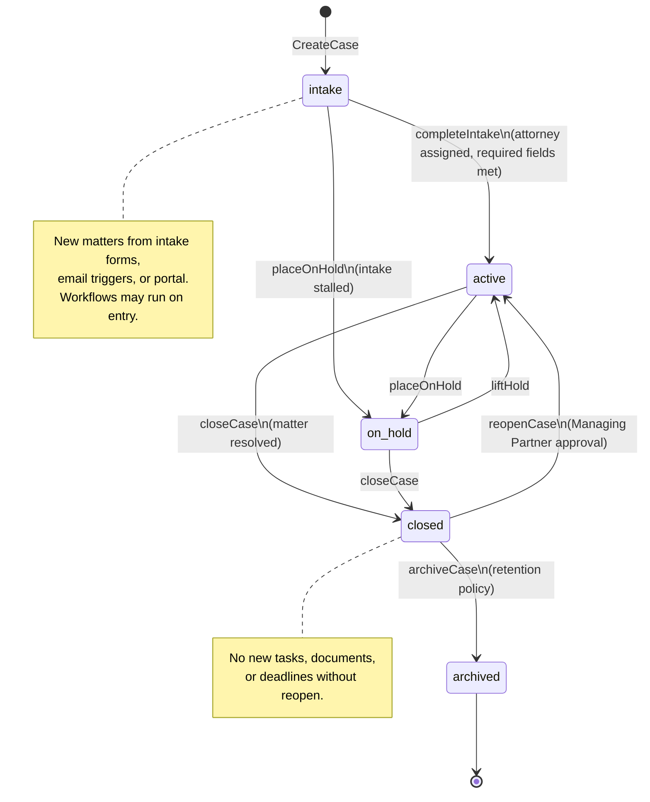
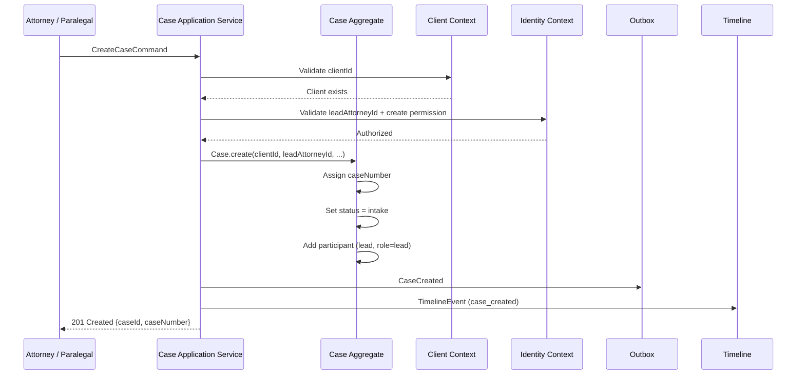
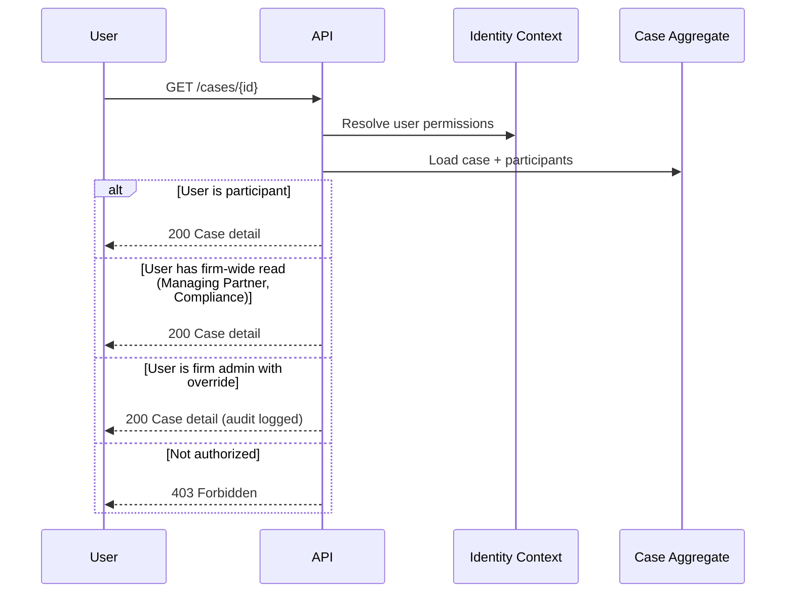

# Case Aggregate

**LexFlow AI** — Central Aggregate Root  
**Version:** 1.0  
**Status:** Draft — Pre-Implementation  
**Last Updated:** 2026-07-06

---

## Purpose

The **Case** aggregate is the central organizing entity in LexFlow AI. A Case represents a legal matter (matter) handled by the firm. All case-scoped work — documents, tasks, deadlines, hearings, notes, workflows, and AI summaries — anchors to a Case.

This document defines the Case aggregate structure, invariants, state machine, child entities, and integration boundaries.

---

## Scope

| In Scope | Out of Scope |
|----------|--------------|
| Case aggregate root and child entities | Client master data (see [client-aggregate.md](./client-aggregate.md)) |
| Case status state machine | Document OCR pipeline internals |
| Matter wall (participant) rules | Workflow n8n execution |
| Task, Deadline, Hearing, Note entities | AI prompt templates |
| Timeline event denormalization | User authentication |

---

## Responsibilities

| Responsibility | Owner Within Aggregate |
|----------------|------------------------|
| Case lifecycle (intake → active → closed → archived) | Case (root) |
| Matter wall membership | CaseParticipant (child) |
| Work item tracking | Task (child) |
| Legal deadline tracking and reminder eligibility | Deadline (child) |
| Court appearance scheduling | Hearing (child) |
| Internal case communication | Note (child) |
| UI timeline feed | TimelineEvent (child, denormalized) |

The Case aggregate does **not** own Client records, Document binaries, WorkflowExecution instances, or AISummary content. It holds foreign key references and receives domain events from those contexts.

---

## Architecture

### Aggregate Structure

```
Case (Aggregate Root)
├── id: CaseId (UUID)
├── firmId: FirmId
├── clientId: ClientId                    ← reference to Client aggregate
├── caseNumber: CaseNumber (value object) ← firm-unique, immutable
├── title: string
├── practiceArea: PracticeArea (enum)
├── status: CaseStatus (enum)
├── priority: Priority (enum)
├── leadAttorneyId: UserId                ← reference to Identity context
├── description: string | null
├── openedAt: datetime
├── closedAt: datetime | null
├── billingCode: string | null
├── metadata: JSON
├── version: int                          ← optimistic concurrency
├── createdAt: datetime
├── updatedAt: datetime
├── deletedAt: datetime | null            ← soft delete
│
├── participants: CaseParticipant[]       ← matter wall
├── tasks: Task[]
├── deadlines: Deadline[]
├── hearings: Hearing[]
├── notes: Note[]
└── timelineEvents: TimelineEvent[]     ← denormalized read model
```

### Entity Relationship Diagram



### Child Entity Summary

| Entity | Key Fields | Lifecycle |
|--------|------------|-----------|
| **CaseParticipant** | userId, role (`lead`, `associate`, `paralegal`, `observer`) | Added/removed while case is not archived |
| **Task** | title, status, assignedTo, dueAt, completedAt | `pending` → `in_progress` → `completed` / `cancelled` |
| **Deadline** | title, deadlineAt, type, status | `upcoming` → `met` / `missed` / `extended` |
| **Hearing** | title, hearingAt, location, court, judge | Created/updated; no complex state machine |
| **Note** | content, authorId, visibility (`team`, `attorneys_only`, `private`) | Created/updated; soft-delete supported |
| **TimelineEvent** | eventType, title, occurredAt, referenceType, referenceId | Append-only; populated by domain event handlers |

### Value Objects

| Value Object | Validation Rules |
|--------------|------------------|
| `CaseNumber` | Firm-configured pattern (e.g., `YYYY-NNNNN`); unique per `firmId` |
| `PracticeArea` | Enum: `litigation`, `corporate`, `ip`, `regulatory`, `employment`, `real_estate`, `other` |
| `CaseStatus` | Enum: `intake`, `active`, `on_hold`, `closed`, `archived` |
| `Priority` | Enum: `low`, `normal`, `high`, `urgent` |
| `ParticipantRole` | Enum: `lead`, `associate`, `paralegal`, `observer` |

---

## Flow Diagrams

### Case Status State Machine



### Allowed Transitions

| From | To | Guard | Actor |
|------|----|-------|-------|
| `intake` | `active` | Lead attorney assigned; required intake fields complete | Attorney, Paralegal |
| `intake` | `on_hold` | — | Attorney, Managing Partner |
| `active` | `on_hold` | — | Lead Attorney, Managing Partner |
| `on_hold` | `active` | — | Lead Attorney, Managing Partner |
| `active` | `closed` | No pending approvals blocking closure (configurable) | Lead Attorney, Managing Partner |
| `on_hold` | `closed` | Same as above | Lead Attorney, Managing Partner |
| `closed` | `active` | Managing Partner approval recorded | Managing Partner |
| `closed` | `archived` | Retention period elapsed or manual archive | System (scheduled), Compliance Officer |

### Case Creation Sequence



### Matter Wall Access Check



---

## Invariants

These rules must hold at all times. Violations are rejected at the domain layer.

| # | Invariant | Enforcement |
|---|-----------|-------------|
| 1 | A Case must have exactly one `clientId` and one `leadAttorneyId` at creation | `Case.create()` factory |
| 2 | `caseNumber` is immutable after assignment | Reject updates to `caseNumber` field |
| 3 | `caseNumber` is unique within a firm | Database unique index `(firm_id, case_number)` |
| 4 | Status transitions follow the defined state machine | `Case.transitionStatus()` validates allowed transitions |
| 5 | Only participants (or authorized firm roles) may access case data | Matter wall check in application service |
| 6 | A `closed` or `archived` Case cannot have new Tasks, Documents, or Deadlines added | Guard in `addTask()`, cross-context validation for documents |
| 7 | A `closed` Case cannot be modified except via `reopenCase` or `archiveCase` | Status guard on mutating operations |
| 8 | Lead attorney must be a CaseParticipant with role `lead` | Enforced on creation and lead attorney change |
| 9 | `closedAt` is set when status becomes `closed`; cleared on reopen | Domain method side effect |
| 10 | `version` increments on every successful mutation | Optimistic concurrency control |
| 11 | TimelineEvents are append-only | No update/delete application paths |
| 12 | Soft-deleted cases (`deletedAt` set) are excluded from default queries | Repository filter |

---

## Best Practices

1. **Load Case with participants for authorization** — Always resolve matter wall before returning case data or allowing mutations.
2. **Emit `CaseStatusChanged` on every transition** — Downstream workflows (archive, billing export) depend on accurate status events.
3. **Use TimelineEvent for UI, not source of truth** — Timeline is denormalized; rebuild from domain events if corrupted.
4. **Keep metadata schema documented** — `metadata` JSONB is firm-extensible; publish a JSON Schema per practice area.
5. **Assign case numbers atomically** — Use a firm-scoped sequence or database lock to prevent duplicate case numbers under concurrency.
6. **Validate deadline dates in firm timezone** — Store UTC; display in firm/office timezone.
7. **Reopen requires audit trail** — `reopenCase` must record approver, reason, and emit `CaseStatusChanged`.

---

## Tradeoffs

| Decision | Benefit | Cost |
|----------|---------|------|
| Case owns Tasks/Deadlines as children | Strong consistency; single transaction for case + task creation | Large aggregate graph; potential performance on full load |
| Timeline as denormalized child | Fast UI rendering without event replay | Dual-write risk; requires reconciliation job |
| Matter wall via participants table | Simple, auditable membership | Re-authorization on every request (mitigated by Redis cache) |
| `intake` as initial status | Supports incomplete intake workflows | Extra transition before `active` |
| Closed case blocks new documents | Prevents post-resolution data drift | Requires explicit reopen for late-arriving documents |
| Soft delete on cases | GDPR erasure flexibility | Complicates unique constraints and search |

---

## Future Improvements

| Improvement | Description |
|-------------|-------------|
| Case templates | Pre-configured task/deadline sets per practice area on creation |
| Ethical wall sub-entity | Formal conflict wall beyond participant list (multi-party litigation) |
| Case merge / split | Combine or divide matters with event-sourced history |
| CQRS dashboard projection | Read model for firm-wide caseload without loading full aggregates |
| Configurable closure checklist | Firm-defined required steps before `closed` transition |
| Case tagging / labeling | Flexible categorization beyond `practiceArea` enum |
| Sub-matter hierarchy | Parent/child case relationships for complex litigation |

---

## References

- [bounded-contexts.md](./bounded-contexts.md) — Case Management context boundaries
- [client-aggregate.md](./client-aggregate.md) — Client reference on Case
- [document-aggregate.md](./document-aggregate.md) — Documents linked via `caseId`
- [workflow-aggregate.md](./workflow-aggregate.md) — Workflows triggered by case events
- [ai-aggregate.md](./ai-aggregate.md) — AI summaries scoped to case
- [domain-events.md](./domain-events.md) — `CaseCreated`, `CaseStatusChanged`, etc.
- [ubiquitous-language.md](./ubiquitous-language.md) — Case, Matter, Matter Wall terms
- [../05-database/](../05-database/) — `cases` schema table definitions
- [../03-architecture/](../03-architecture/) — Authorization and matter wall architecture
- [../06-workflows/](../06-workflows/) — Intake and case-close workflows
