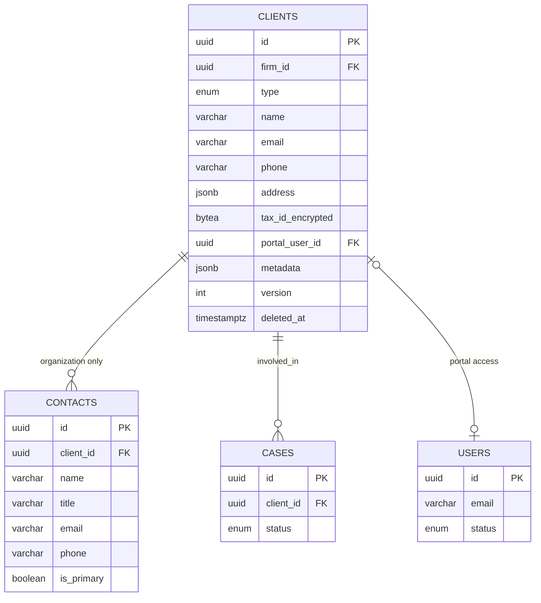
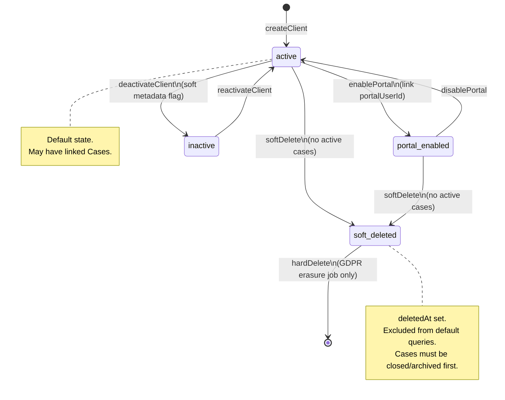
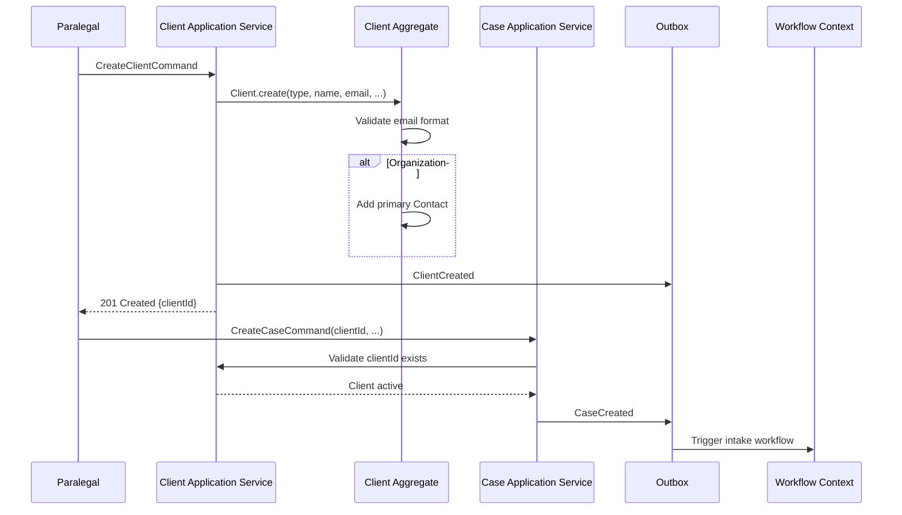
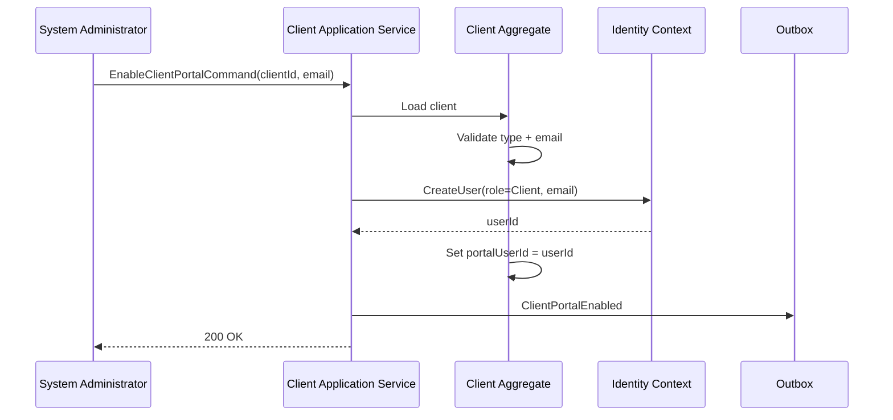

# Client Aggregate

**LexFlow AI** — Client Management Domain  
**Version:** 1.0  
**Status:** Draft — Pre-Implementation  
**Last Updated:** 2026-07-06

---

## Purpose

The **Client** aggregate represents an individual or organization receiving legal services from the firm. It is the master record for client identity, contact information, portal access, and organizational contacts. Cases reference Clients via `clientId` but do not embed client data.

---

## Scope

| In Scope | Out of Scope |
|----------|--------------|
| Client aggregate root structure | Case lifecycle and matter walls |
| Individual vs organization client types | Document storage |
| Contact entities for organizations | Billing and invoicing |
| Client portal user linkage | Conflict check execution |
| Client invariants and lifecycle | AI summaries |

---

## Responsibilities

| Responsibility | Detail |
|----------------|--------|
| Master client record | Single source of truth for client name, contact info, address |
| Client type management | Distinguish `individual` vs `organization` with different validation rules |
| Organization contacts | Store multiple contacts (general counsel, billing contact) for organizations |
| Portal access linkage | Link `portalUserId` to Identity context for client self-service |
| Referential integrity | Prevent hard-delete while active Cases reference the client |
| Custom metadata | Firm-extensible `metadata` JSONB for CRM fields |

---

## Architecture

### Aggregate Structure

```
Client (Aggregate Root)
├── id: ClientId (UUID)
├── firmId: FirmId
├── type: ClientType (individual | organization)
├── name: string
├── email: Email (value object)
├── phone: PhoneNumber (value object) | null
├── address: Address (value object) | null
├── taxIdEncrypted: bytes | null          ← application-layer encryption
├── portalUserId: UserId | null           ← Identity context reference
├── metadata: JSON
├── version: int
├── createdAt: datetime
├── updatedAt: datetime
├── deletedAt: datetime | null
│
└── contacts: Contact[]                   ← organizations only
```

```
Contact (Entity — child of organization Client)
├── id: ContactId (UUID)
├── clientId: ClientId
├── name: string
├── title: string | null                  ← e.g., "General Counsel"
├── email: Email
├── phone: PhoneNumber | null
├── isPrimary: boolean
├── createdAt: datetime
└── updatedAt: datetime
```

### Entity Relationship Diagram



### Value Objects

| Value Object | Validation |
|--------------|------------|
| `Email` | RFC 5322 format; stored lowercased; unique per firm (configurable) |
| `PhoneNumber` | E.164 format (`+1XXXXXXXXXX`) |
| `Address` | Structured: `{ street, city, state, zip, country }` |
| `ClientType` | Enum: `individual`, `organization` |

---

## Flow Diagrams

### Client Lifecycle State



### Client Creation and Case Linking



### Portal Enablement



---

## Invariants

| # | Invariant | Enforcement |
|---|-----------|-------------|
| 1 | A Client must belong to exactly one firm (`firmId`) | Creation factory |
| 2 | `name` is required and non-empty | Field validation |
| 3 | `email` must be valid per `Email` value object | Field validation |
| 4 | Organization clients may have zero or more Contacts; individual clients have no Contacts | Aggregate method guard |
| 5 | At most one Contact per organization client may have `isPrimary = true` | Domain method on contact add/update |
| 6 | A Client linked to active Cases (`status` in `intake`, `active`, `on_hold`) cannot be hard-deleted | Application service checks case count |
| 7 | A Client with `deletedAt` set cannot be linked to new Cases | Case creation validation |
| 8 | `portalUserId` must reference a User with role `Client` in Identity context | Portal enablement flow |
| 9 | `taxIdEncrypted` is write-only via application encryption service; never returned in API responses | API layer |
| 10 | `version` increments on every successful mutation | Optimistic concurrency |

---

## Best Practices

1. **Search before create** — Intake workflows should search for existing clients by email/name before creating duplicates.
2. **Normalize email on write** — Lowercase and trim; display original casing from `name` field only.
3. **Encrypt tax ID at application layer** — Use AWS KMS envelope encryption; store ciphertext in `tax_id_encrypted`.
4. **Soft delete, never hard delete in normal operations** — Hard delete reserved for GDPR erasure jobs with compliance approval.
5. **Emit `ClientUpdated` on material changes** — Name, email, or address changes should trigger audit and downstream sync (billing, DMS).
6. **Keep contacts in aggregate** — Load and save contacts with client; do not treat contacts as independent aggregates.
7. **Portal user is optional** — Not every client needs portal access; enable explicitly after conflict/engagement checks.

---

## Tradeoffs

| Decision | Benefit | Cost |
|----------|---------|------|
| Separate Client aggregate from Case | Clean CRM boundary; reusable across matters | No transactional guarantee client+case in one aggregate |
| Contacts as child entities | Consistent with organization model | Cannot share contacts across clients |
| `clients` table in `cases` schema | Efficient joins for case dashboards | Schema boundary less pure |
| Encrypted tax ID in aggregate | PCI-adjacent sensitivity handled | Application-layer encryption complexity |
| Soft delete only in normal flow | Reversible; audit-friendly | Orphaned references if not validated |
| Portal user in Identity context | Centralized auth | Cross-context setup for portal enablement |

---

## Future Improvements

| Improvement | Description |
|-------------|-------------|
| Client deduplication service | Fuzzy match on name/email during intake |
| Client relationship graph | Parent/subsidiary organization links |
| External CRM sync | Bi-directional sync with firm CRM via ACL |
| Client communication preferences | Channel opt-in per client (email, portal, mail) |
| Conflict check status on Client | Track last conflict check date and result |
| Client engagement scoring | Aggregate matter history for business development |
| Multi-language client records | International client support |

---

## References

- [bounded-contexts.md](./bounded-contexts.md) — Client Management context
- [case-aggregate.md](./case-aggregate.md) — Cases reference `clientId`
- [domain-events.md](./domain-events.md) — `ClientCreated`, `ClientUpdated`, `ClientPortalEnabled`
- [ubiquitous-language.md](./ubiquitous-language.md) — Client vs Customer terminology
- [../05-database/](../05-database/) — `clients` table schema
- [../03-architecture/](../03-architecture/) — Identity integration for portal users
- [../06-workflows/](../06-workflows/) — Intake workflows consuming `ClientCreated`
