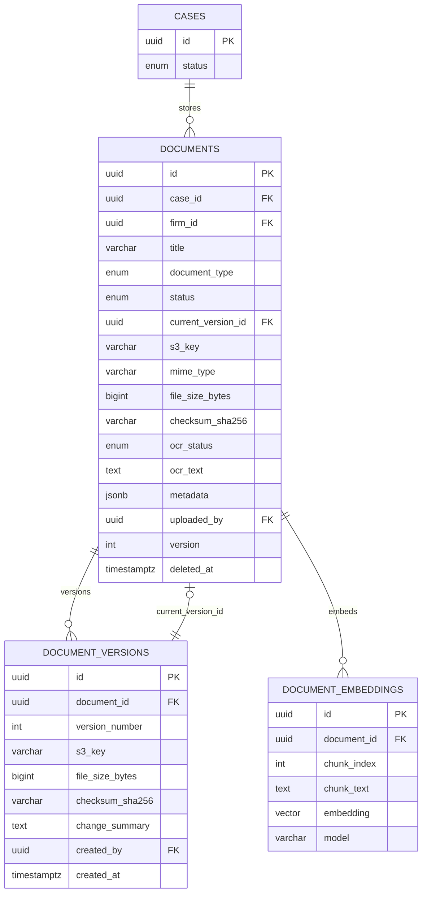
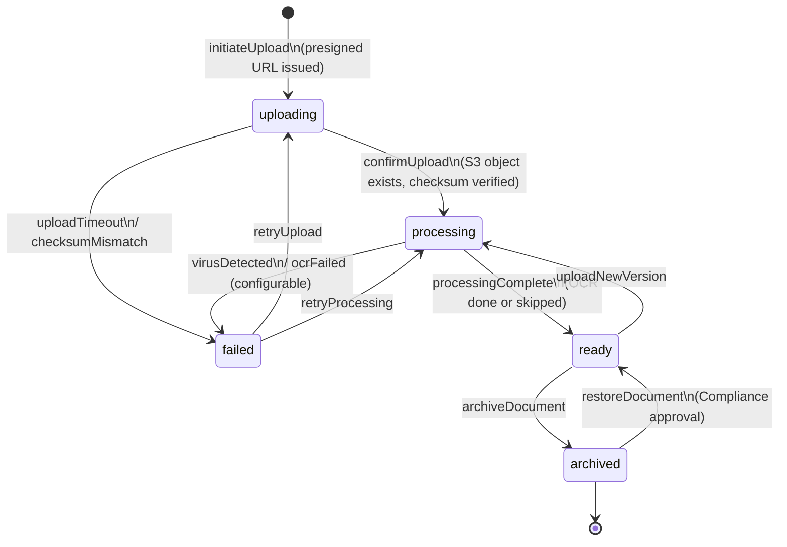
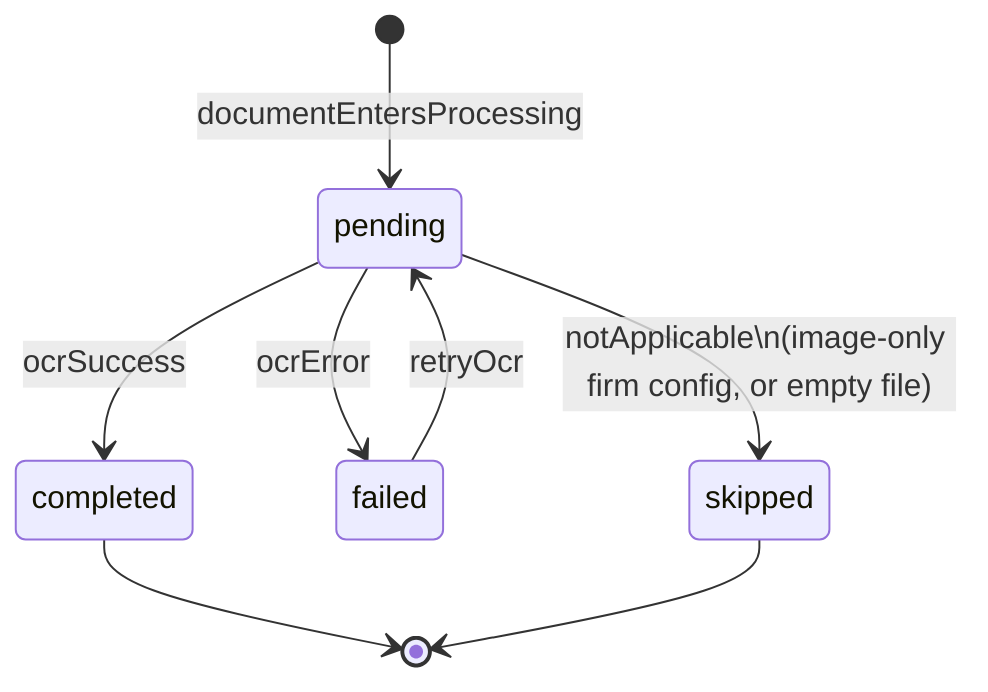
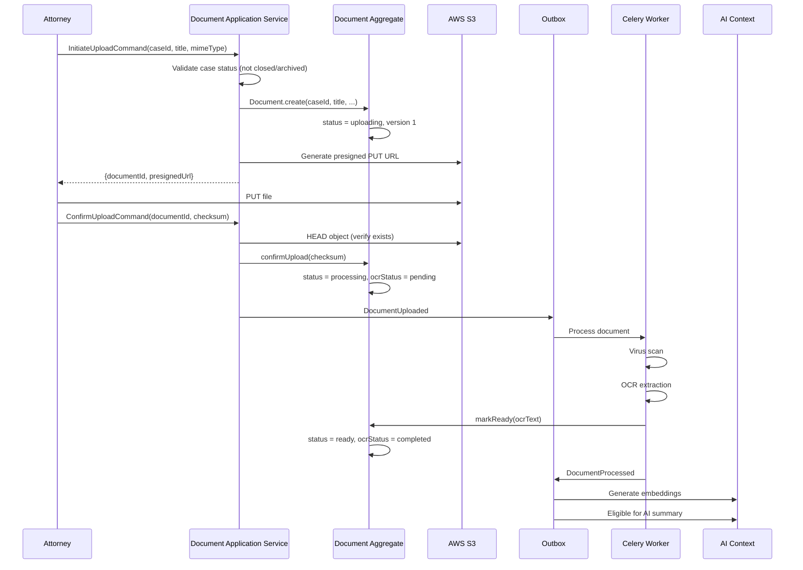
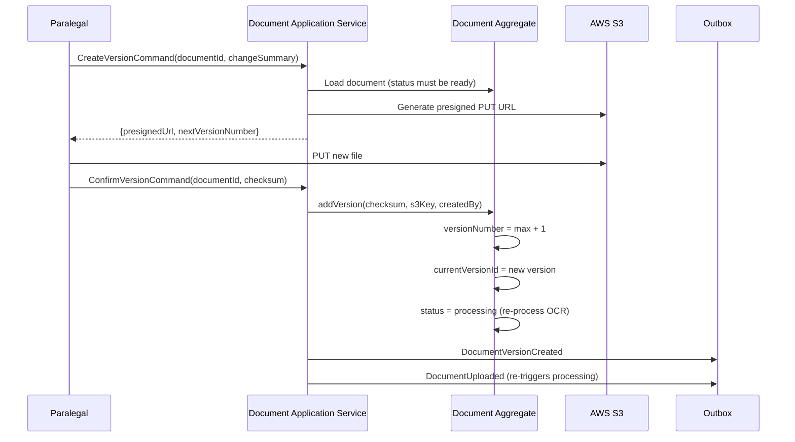

# Document Aggregate

**LexFlow AI** — Document Management Domain  
**Version:** 1.0  
**Status:** Draft — Pre-Implementation  
**Last Updated:** 2026-07-06

---

## Purpose

The **Document** aggregate manages the lifecycle of files associated with legal cases — from upload through versioning, virus scanning, OCR extraction, and search indexing. It is a separate aggregate from Case because documents have an independent processing pipeline, versioning model, and storage architecture (S3 + PostgreSQL metadata).

---

## Scope

| In Scope | Out of Scope |
|----------|--------------|
| Document aggregate root and versioning | Case lifecycle (see [case-aggregate.md](./case-aggregate.md)) |
| Document status and OCR lifecycle | AI summary generation logic |
| S3 storage references and checksums | n8n SharePoint sync workflow internals |
| Document type classification | Full-text search query implementation |
| Embedding metadata (reference only) | Prompt template management |

---

## Responsibilities

| Responsibility | Detail |
|----------------|--------|
| File metadata | Title, type, MIME type, size, checksum |
| Version management | Monotonically increasing versions with immutable history |
| Storage coordination | S3 key management per version; current version pointer |
| Processing pipeline state | `uploading` → `processing` → `ready` / `failed` |
| OCR lifecycle | Track OCR status and store extracted text |
| Case linkage | Every document belongs to exactly one Case via `caseId` |
| Integrity verification | SHA-256 checksum per version |

---

## Architecture

### Aggregate Structure

```
Document (Aggregate Root)
├── id: DocumentId (UUID)
├── caseId: CaseId                         ← Case aggregate reference
├── firmId: FirmId                         ← denormalized for partition queries
├── title: string
├── documentType: DocumentType (enum)
├── status: DocumentStatus (enum)
├── currentVersionId: VersionId            ← pointer to latest version
├── s3Key: string                          ← current version S3 path (denormalized)
├── mimeType: string
├── fileSizeBytes: long
├── checksumSha256: SHA256                 ← current version checksum
├── ocrStatus: OCRStatus (enum)
├── ocrText: string | null
├── metadata: JSON                         ← tags, custom fields
├── uploadedBy: UserId
├── version: int                           ← optimistic concurrency on document metadata
├── createdAt: datetime
├── updatedAt: datetime
├── deletedAt: datetime | null
│
└── versions: DocumentVersion[]
```

```
DocumentVersion (Entity)
├── id: VersionId (UUID)
├── documentId: DocumentId
├── versionNumber: int                     ← monotonically increasing, starts at 1
├── s3Key: string
├── fileSizeBytes: long
├── checksumSha256: SHA256
├── changeSummary: string | null
├── createdBy: UserId
└── createdAt: datetime
```

### Entity Relationship Diagram



### Enumerations

| Enum | Values |
|------|--------|
| `DocumentType` | `pleading`, `contract`, `evidence`, `correspondence`, `invoice`, `other` |
| `DocumentStatus` | `uploading`, `processing`, `ready`, `failed`, `archived` |
| `OCRStatus` | `pending`, `completed`, `failed`, `skipped` |

---

## Flow Diagrams

### Document Status State Machine



### OCR Status State Machine



### Document Upload and Processing Sequence



### Version Creation Sequence



---

## Invariants

| # | Invariant | Enforcement |
|---|-----------|-------------|
| 1 | Every Document must reference a valid `caseId` | Creation validation against Case context |
| 2 | Documents cannot be added to `closed` or `archived` Cases | Application service checks case status |
| 3 | Version numbers are monotonically increasing starting at 1 | `addVersion()` computes `max(versionNumber) + 1` |
| 4 | `currentVersionId` always points to the highest `versionNumber` | Updated atomically in `addVersion()` |
| 5 | Document versions are immutable once created | No update/delete paths on `DocumentVersion` |
| 6 | Each version has a unique `(documentId, versionNumber)` pair | Database unique constraint |
| 7 | `checksumSha256` on document root reflects current version | Updated on version change |
| 8 | `s3Key` on document root reflects current version S3 path | Updated on version change |
| 9 | Soft-deleted documents excluded from search and case document lists | Repository filter on `deletedAt` |
| 10 | `version` (optimistic lock) on Document increments on metadata mutations | Concurrency control |
| 11 | Archived documents are read-only | Status guard on mutating operations |
| 12 | OCR text corresponds to current version only | Re-extract on new version upload |

---

## Versioning Model

### Rules

| Rule | Detail |
|------|--------|
| Initial upload | Creates Document + DocumentVersion (versionNumber = 1) |
| New version | Appends immutable DocumentVersion; updates current pointer |
| History retention | All versions retained indefinitely; S3 lifecycle moves old versions to Infrequent Access |
| Download | Default returns current version; explicit version number returns historical |
| Change summary | Optional human-readable note per version ("Revised per partner comments") |
| Re-processing | New version triggers OCR and embedding regeneration |

### Version Comparison (Future)

```
DocumentVersion
├── ... existing fields ...
└── diffFromPrevious: JSON | null    ← Phase 3: structural diff for contracts
```

---

## Best Practices

1. **Presigned URLs for upload/download** — Never proxy file bytes through FastAPI; use S3 presigned URLs with short TTL.
2. **Verify checksum client-side and server-side** — Client computes SHA-256; server verifies against S3 object on confirm.
3. **Emit `DocumentUploaded` only after S3 confirm** — Prevents phantom documents in processing pipeline.
4. **Idempotent confirm upload** — Use `Idempotency-Key` header; return same document on retry.
5. **OCR text is case-scoped sensitive data** — Apply same matter wall authorization as document metadata.
6. **Classify document type at upload** — Improves search, workflow routing, and AI prompt selection.
7. **Archive, don't delete** — Legal documents require retention; soft delete for erroneous uploads only.
8. **Regenerate embeddings on version change** — Stale embeddings produce incorrect RAG results.

---

## Tradeoffs

| Decision | Benefit | Cost |
|----------|---------|------|
| Separate Document aggregate from Case | Independent processing pipeline; clear versioning | Cross-aggregate validation on every write |
| Immutable version history | Audit-grade provenance; legal defensibility | Storage growth; S3 costs |
| Denormalized current version fields on root | Fast list queries without version join | Must keep in sync on version add |
| OCR text in PostgreSQL | Full-text search without S3 round-trip | Large text columns; encryption consideration |
| Async processing pipeline | Non-blocking upload UX | Eventual consistency for `ready` status |
| Embeddings as separate table (not in aggregate) | Vector index managed independently | Eventual consistency with document content |

---

## Future Improvements

| Improvement | Description |
|-------------|-------------|
| Branching versions | Named branches for collaborative drafting (Phase 4) |
| Document locking | Check-out/check-in for exclusive edit (SharePoint sync) |
| Redaction tracking | Version-level redaction log for privilege review |
| Automated classification | ML-based document type detection on upload |
| Duplicate detection | Checksum-based dedup within a case |
| External DMS sync | Bi-directional sync with iManage, NetDocuments |
| Litigation hold flag | Prevent archive/delete during hold period |
| Content encryption per document | Client-matter-specific KMS keys |

---

## References

- [bounded-contexts.md](./bounded-contexts.md) — Document Management context
- [case-aggregate.md](./case-aggregate.md) — Parent case linkage and status guards
- [ai-aggregate.md](./ai-aggregate.md) — AI summaries triggered by `DocumentProcessed`
- [domain-events.md](./domain-events.md) — `DocumentUploaded`, `DocumentProcessed`, `DocumentVersionCreated`
- [ubiquitous-language.md](./ubiquitous-language.md) — Document vs Attachment terminology
- [../05-database/](../05-database/) — `documents` schema tables
- [../07-ai/](../07-ai/) — Embedding generation and RAG pipeline
- [../06-workflows/](../06-workflows/) — Document upload notification workflow
- [../03-architecture/](../03-architecture/) — S3 storage and async processing path
