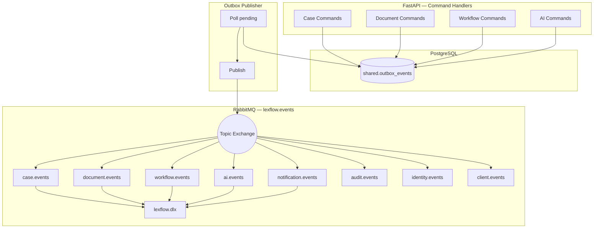
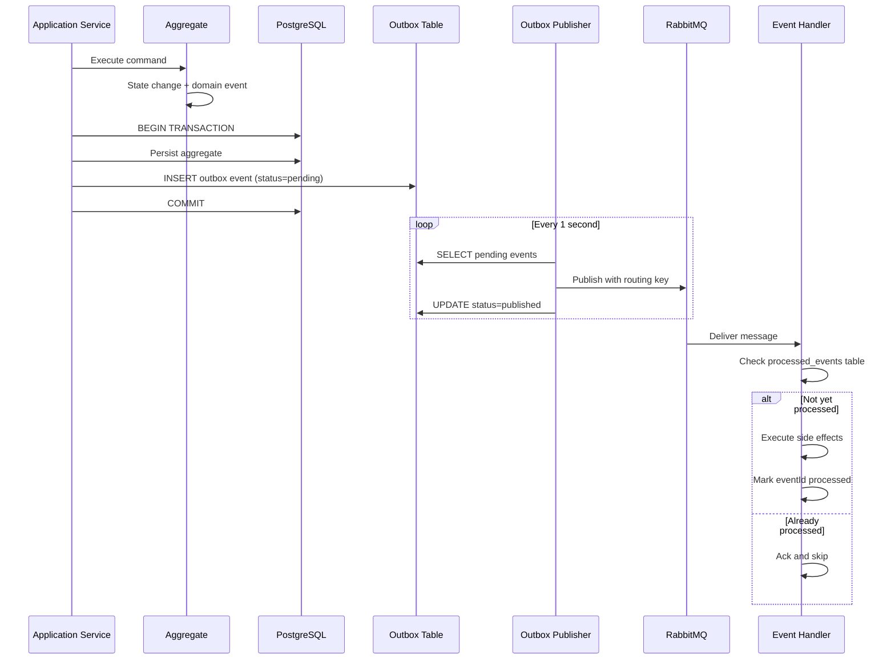
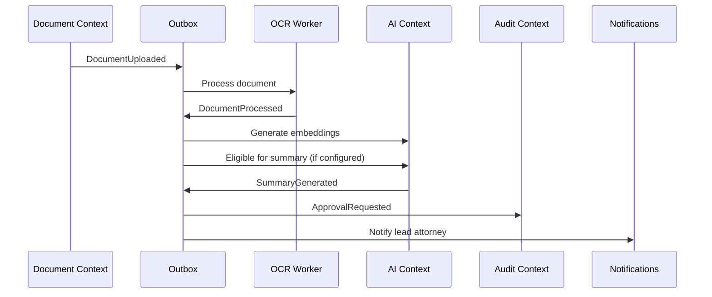

# Domain Events

**LexFlow AI** — Event Catalog & Payload Specifications  
**Version:** 1.0  
**Status:** Draft — Pre-Implementation  
**Last Updated:** 2026-07-06

---

## Purpose

This document is the authoritative catalog of domain events in LexFlow AI. Every meaningful state change in a bounded context produces a domain event written to the transactional outbox (`shared.outbox_events`) and published to RabbitMQ. Event consumers must be idempotent.

---

## Scope

| In Scope | Out of Scope |
|----------|--------------|
| Event naming conventions and envelope schema | RabbitMQ broker installation |
| Full payload specifications per event | Celery task implementation code |
| Routing keys and consumer mapping | n8n webhook payload formats |
| Causation and correlation tracking | Infrastructure monitoring alerts |

---

## Responsibilities

| Role | Responsibility |
|------|----------------|
| Aggregate / Application Service | Emit events within the same DB transaction as state change |
| Outbox Publisher | Poll pending events; publish to RabbitMQ; mark published |
| Event Handlers (Celery Workers) | Consume events idempotently; trigger side effects |
| Audit Context | Record all events in `audit.audit_logs` (Conformist) |

---

## Architecture

### Event Envelope Schema

All events share a standard envelope. The `payload` field contains event-specific data.

```json
{
  "eventId": "550e8400-e29b-41d4-a716-446655440000",
  "eventType": "CaseCreated",
  "aggregateType": "Case",
  "aggregateId": "660e8400-e29b-41d4-a716-446655440001",
  "firmId": "770e8400-e29b-41d4-a716-446655440002",
  "occurredAt": "2026-07-06T14:30:00.000Z",
  "correlationId": "880e8400-e29b-41d4-a716-446655440003",
  "causationId": "990e8400-e29b-41d4-a716-446655440004",
  "version": 1,
  "actorId": "aa0e8400-e29b-41d4-a716-446655440005",
  "actorType": "user",
  "payload": {}
}
```

| Field | Type | Required | Description |
|-------|------|----------|-------------|
| `eventId` | UUID | Yes | Unique event identifier; used for idempotent consumption |
| `eventType` | string | Yes | PascalCase past-tense: `CaseCreated` |
| `aggregateType` | string | Yes | Aggregate root name: `Case`, `Document`, etc. |
| `aggregateId` | UUID | Yes | ID of the aggregate that emitted the event |
| `firmId` | UUID | Yes | Tenant scope |
| `occurredAt` | ISO 8601 | Yes | UTC timestamp of domain state change |
| `correlationId` | UUID | Yes | Traces related events across a business operation |
| `causationId` | UUID | No | `eventId` of the event that caused this event |
| `version` | int | Yes | Envelope schema version (currently `1`) |
| `actorId` | UUID | No | User who initiated; null for system/scheduled events |
| `actorType` | enum | Yes | `user`, `system`, `worker`, `n8n` |
| `payload` | object | Yes | Event-specific data (schemas below) |

### Naming Convention

```
{AggregateRoot}{Action}   — PascalCase, past tense
Examples: CaseCreated, DocumentUploaded, SummaryApproved
```

### Messaging Topology



---

## Flow Diagrams

### Event Publication Sequence



### Cross-Context Event Chain — Document Upload to AI Summary



---

## Event Catalog

### Identity & Access Events

| Event | Routing Key | Consumers |
|-------|-------------|-----------|
| `UserCreated` | `identity.user_created` | Audit, Notification |
| `RoleAssigned` | `identity.role_assigned` | Audit |
| `UserDeactivated` | `identity.user_deactivated` | Audit, Notification |

#### `UserCreated`

```json
{
  "payload": {
    "userId": "uuid",
    "firmId": "uuid",
    "email": "attorney@firm.com",
    "firstName": "Jane",
    "lastName": "Smith",
    "title": "Associate Attorney",
    "roles": ["AssociateAttorney"]
  }
}
```

#### `RoleAssigned`

```json
{
  "payload": {
    "userId": "uuid",
    "roleId": "uuid",
    "roleName": "Attorney",
    "assignedBy": "uuid"
  }
}
```

#### `UserDeactivated`

```json
{
  "payload": {
    "userId": "uuid",
    "deactivatedBy": "uuid",
    "reason": "employment_terminated"
  }
}
```

---

### Client Management Events

| Event | Routing Key | Consumers |
|-------|-------------|-----------|
| `ClientCreated` | `client.created` | Audit, Workflow |
| `ClientUpdated` | `client.updated` | Audit |
| `ClientPortalEnabled` | `client.portal_enabled` | Audit, Notification |

#### `ClientCreated`

```json
{
  "payload": {
    "clientId": "uuid",
    "firmId": "uuid",
    "type": "organization",
    "name": "Acme Corporation",
    "email": "contact@acme.com",
    "phone": "+12025551234"
  }
}
```

#### `ClientUpdated`

```json
{
  "payload": {
    "clientId": "uuid",
    "changedFields": ["email", "address"],
    "previousValues": {
      "email": "old@acme.com"
    },
    "newValues": {
      "email": "new@acme.com"
    }
  }
}
```

#### `ClientPortalEnabled`

```json
{
  "payload": {
    "clientId": "uuid",
    "portalUserId": "uuid",
    "email": "contact@acme.com"
  }
}
```

---

### Case Management Events

| Event | Routing Key | Consumers |
|-------|-------------|-----------|
| `CaseCreated` | `case.created` | Workflow, Notification, Audit, Timeline |
| `CaseStatusChanged` | `case.status_changed` | Workflow, Timeline, Audit |
| `CaseParticipantAdded` | `case.participant_added` | Notification, Audit |
| `CaseParticipantRemoved` | `case.participant_removed` | Audit |
| `TaskCreated` | `case.task_created` | Notification, Timeline |
| `TaskCompleted` | `case.task_completed` | Timeline, Audit |
| `TaskCancelled` | `case.task_cancelled` | Notification, Timeline |
| `DeadlineCreated` | `case.deadline_created` | Timeline, Audit |
| `DeadlineApproaching` | `case.deadline_approaching` | Notification, Workflow |
| `DeadlineMissed` | `case.deadline_missed` | Notification |
| `DeadlineMet` | `case.deadline_met` | Timeline, Audit |
| `HearingScheduled` | `case.hearing_scheduled` | Notification, Timeline |
| `NoteCreated` | `case.note_created` | Timeline, Audit |

#### `CaseCreated`

```json
{
  "payload": {
    "caseId": "uuid",
    "clientId": "uuid",
    "leadAttorneyId": "uuid",
    "caseNumber": "2026-00142",
    "title": "Acme Corp v. State — Regulatory Appeal",
    "practiceArea": "regulatory",
    "status": "intake",
    "priority": "normal"
  }
}
```

#### `CaseStatusChanged`

```json
{
  "payload": {
    "caseId": "uuid",
    "caseNumber": "2026-00142",
    "oldStatus": "active",
    "newStatus": "closed",
    "changedBy": "uuid",
    "reason": "Matter resolved — final judgment entered"
  }
}
```

#### `CaseParticipantAdded`

```json
{
  "payload": {
    "caseId": "uuid",
    "userId": "uuid",
    "role": "paralegal",
    "addedBy": "uuid"
  }
}
```

#### `CaseParticipantRemoved`

```json
{
  "payload": {
    "caseId": "uuid",
    "userId": "uuid",
    "role": "associate",
    "removedBy": "uuid"
  }
}
```

#### `TaskCreated`

```json
{
  "payload": {
    "caseId": "uuid",
    "taskId": "uuid",
    "title": "Prepare discovery response",
    "assignedTo": "uuid",
    "dueAt": "2026-08-15T17:00:00.000Z",
    "priority": "high",
    "createdBy": "uuid"
  }
}
```

#### `TaskCompleted`

```json
{
  "payload": {
    "caseId": "uuid",
    "taskId": "uuid",
    "title": "Prepare discovery response",
    "completedBy": "uuid",
    "completedAt": "2026-08-10T14:22:00.000Z"
  }
}
```

#### `TaskCancelled`

```json
{
  "payload": {
    "caseId": "uuid",
    "taskId": "uuid",
    "cancelledBy": "uuid",
    "reason": "Discovery scope narrowed"
  }
}
```

#### `DeadlineCreated`

```json
{
  "payload": {
    "caseId": "uuid",
    "deadlineId": "uuid",
    "title": "File response to motion to dismiss",
    "deadlineAt": "2026-09-01T23:59:59.000Z",
    "type": "filing"
  }
}
```

#### `DeadlineApproaching`

```json
{
  "payload": {
    "caseId": "uuid",
    "deadlineId": "uuid",
    "title": "File response to motion to dismiss",
    "deadlineAt": "2026-09-01T23:59:59.000Z",
    "hoursRemaining": 48,
    "threshold": "48h"
  }
}
```

#### `DeadlineMissed`

```json
{
  "payload": {
    "caseId": "uuid",
    "deadlineId": "uuid",
    "title": "File response to motion to dismiss",
    "deadlineAt": "2026-09-01T23:59:59.000Z",
    "leadAttorneyId": "uuid"
  }
}
```

#### `DeadlineMet`

```json
{
  "payload": {
    "caseId": "uuid",
    "deadlineId": "uuid",
    "title": "File response to motion to dismiss",
    "metAt": "2026-08-30T16:45:00.000Z",
    "markedBy": "uuid"
  }
}
```

#### `HearingScheduled`

```json
{
  "payload": {
    "caseId": "uuid",
    "hearingId": "uuid",
    "title": "Motion hearing — dismissal",
    "hearingAt": "2026-10-15T09:00:00.000Z",
    "location": "US District Court, Room 412",
    "court": "N.D. Georgia",
    "judge": "Hon. Sarah Johnson"
  }
}
```

#### `NoteCreated`

```json
{
  "payload": {
    "caseId": "uuid",
    "noteId": "uuid",
    "authorId": "uuid",
    "visibility": "attorneys_only",
    "contentPreview": "Discussed strategy with client re: settlement..."
  }
}
```

---

### Document Management Events

| Event | Routing Key | Consumers |
|-------|-------------|-----------|
| `DocumentUploaded` | `document.uploaded` | Workflow, Timeline, OCR Worker |
| `DocumentProcessed` | `document.processed` | AI (embeddings), Timeline |
| `DocumentVersionCreated` | `document.version_created` | Timeline, Audit |
| `DocumentArchived` | `document.archived` | Audit, Timeline |
| `DocumentFailed` | `document.failed` | Notification |

#### `DocumentUploaded`

```json
{
  "payload": {
    "caseId": "uuid",
    "documentId": "uuid",
    "title": "Motion to Dismiss — Draft v1",
    "documentType": "pleading",
    "mimeType": "application/pdf",
    "fileSizeBytes": 245760,
    "checksumSha256": "a3b2c1...",
    "uploadedBy": "uuid",
    "versionNumber": 1
  }
}
```

#### `DocumentProcessed`

```json
{
  "payload": {
    "caseId": "uuid",
    "documentId": "uuid",
    "title": "Motion to Dismiss — Draft v1",
    "documentType": "pleading",
    "ocrStatus": "completed",
    "ocrTextLength": 12450,
    "pageCount": 15
  }
}
```

#### `DocumentVersionCreated`

```json
{
  "payload": {
    "caseId": "uuid",
    "documentId": "uuid",
    "versionId": "uuid",
    "versionNumber": 2,
    "changeSummary": "Revised per partner comments",
    "createdBy": "uuid",
    "checksumSha256": "d4e5f6..."
  }
}
```

#### `DocumentArchived`

```json
{
  "payload": {
    "caseId": "uuid",
    "documentId": "uuid",
    "archivedBy": "uuid",
    "reason": "Superseded by final filed version"
  }
}
```

#### `DocumentFailed`

```json
{
  "payload": {
    "caseId": "uuid",
    "documentId": "uuid",
    "failureStage": "virus_scan",
    "errorMessage": "Malware detected: Trojan.Generic",
    "retryable": false
  }
}
```

---

### Workflow Orchestration Events

| Event | Routing Key | Consumers |
|-------|-------------|-----------|
| `WorkflowTriggered` | `workflow.triggered` | Celery Worker (n8n invoke) |
| `WorkflowCompleted` | `workflow.completed` | Notification, Timeline, Audit |
| `WorkflowFailed` | `workflow.failed` | Notification, DLQ alert |
| `WorkflowCancelled` | `workflow.cancelled` | Audit |

#### `WorkflowTriggered`

```json
{
  "payload": {
    "executionId": "uuid",
    "workflowDefinitionId": "uuid",
    "workflowSlug": "intake-new-client-v1",
    "caseId": "uuid",
    "triggeredBy": "uuid",
    "triggerType": "event",
    "correlationId": "uuid",
    "inputPayload": {
      "clientName": "Acme Corporation",
      "practiceArea": "regulatory"
    }
  }
}
```

#### `WorkflowCompleted`

```json
{
  "payload": {
    "executionId": "uuid",
    "workflowSlug": "intake-new-client-v1",
    "caseId": "uuid",
    "correlationId": "uuid",
    "durationMs": 4520,
    "outputPayload": {
      "sharepointFolderUrl": "https://firm.sharepoint.com/sites/matters/2026-00142",
      "emailSent": true
    },
    "stepsCompleted": 3
  }
}
```

#### `WorkflowFailed`

```json
{
  "payload": {
    "executionId": "uuid",
    "workflowSlug": "intake-new-client-v1",
    "caseId": "uuid",
    "correlationId": "uuid",
    "errorMessage": "SMTP connection refused at step send-welcome-email",
    "failedStep": "send-welcome-email",
    "retryable": true,
    "retryCount": 0
  }
}
```

#### `WorkflowCancelled`

```json
{
  "payload": {
    "executionId": "uuid",
    "workflowSlug": "discovery-request-v1",
    "caseId": "uuid",
    "cancelledBy": "uuid",
    "reason": "Discovery scope changed"
  }
}
```

---

### AI & Knowledge Events

| Event | Routing Key | Consumers |
|-------|-------------|-----------|
| `SummaryRequested` | `ai.summary_requested` | Celery AI Worker |
| `SummaryGenerated` | `ai.summary_generated` | Approval, Notification, Timeline |
| `SummaryApproved` | `ai.summary_approved` | Timeline, Audit |
| `SummaryRejected` | `ai.summary_rejected` | Notification |
| `EmbeddingCompleted` | `ai.embedding_completed` | Audit (informational) |
| `ResearchCompleted` | `ai.research_completed` | Approval, Notification |

#### `SummaryRequested`

```json
{
  "payload": {
    "summaryId": "uuid",
    "caseId": "uuid",
    "documentId": "uuid",
    "summaryType": "document_summary",
    "requestedBy": "uuid",
    "promptVersion": "document-summary-v1"
  }
}
```

#### `SummaryGenerated`

```json
{
  "payload": {
    "summaryId": "uuid",
    "caseId": "uuid",
    "documentId": "uuid",
    "summaryType": "document_summary",
    "model": "gpt-4o",
    "promptVersion": "document-summary-v1",
    "tokenCount": 1842,
    "requiresApproval": true,
    "contentPreview": "This motion argues that the court lacks jurisdiction..."
  }
}
```

#### `SummaryApproved`

```json
{
  "payload": {
    "summaryId": "uuid",
    "caseId": "uuid",
    "summaryType": "document_summary",
    "approvedBy": "uuid",
    "approvedAt": "2026-07-06T15:10:00.000Z"
  }
}
```

#### `SummaryRejected`

```json
{
  "payload": {
    "summaryId": "uuid",
    "caseId": "uuid",
    "summaryType": "document_summary",
    "rejectedBy": "uuid",
    "rejectionReason": "Inaccurate characterization of jurisdictional argument"
  }
}
```

#### `EmbeddingCompleted`

```json
{
  "payload": {
    "documentId": "uuid",
    "caseId": "uuid",
    "chunkCount": 42,
    "model": "text-embedding-3-small",
    "durationMs": 3200
  }
}
```

#### `ResearchCompleted`

```json
{
  "payload": {
    "summaryId": "uuid",
    "caseId": "uuid",
    "summaryType": "legal_research",
    "query": "What is the standard for summary judgment in this circuit?",
    "citationCount": 8,
    "model": "gpt-4o",
    "tokenCount": 4521,
    "requiresApproval": true
  }
}
```

---

### Audit & Compliance Events

| Event | Routing Key | Consumers |
|-------|-------------|-----------|
| `ApprovalRequested` | `audit.approval_requested` | Notification |
| `ApprovalDecided` | `audit.approval_decided` | Workflow (unblock), Notification |
| `ApprovalExpired` | `audit.approval_expired` | Notification |

#### `ApprovalRequested`

```json
{
  "payload": {
    "approvalId": "uuid",
    "caseId": "uuid",
    "approvalType": "ai_summary",
    "referenceType": "ai_summary",
    "referenceId": "uuid",
    "requestedBy": "uuid",
    "approverId": "uuid",
    "expiresAt": "2026-07-13T15:10:00.000Z"
  }
}
```

#### `ApprovalDecided`

```json
{
  "payload": {
    "approvalId": "uuid",
    "caseId": "uuid",
    "approvalType": "ai_summary",
    "referenceType": "ai_summary",
    "referenceId": "uuid",
    "status": "approved",
    "decidedBy": "uuid",
    "decisionNote": "Accurate summary, minor formatting edits made"
  }
}
```

#### `ApprovalExpired`

```json
{
  "payload": {
    "approvalId": "uuid",
    "caseId": "uuid",
    "approvalType": "document_send",
    "referenceId": "uuid",
    "approverId": "uuid",
    "expiredAt": "2026-07-13T17:00:00.000Z"
  }
}
```

---

### Notification Events

| Event | Routing Key | Consumers |
|-------|-------------|-----------|
| `NotificationRequested` | `notification.requested` | Notification Handler |
| `NotificationSent` | `notification.sent` | Audit |
| `NotificationFailed` | `notification.failed` | DLQ alert |

#### `NotificationRequested`

```json
{
  "payload": {
    "notificationId": "uuid",
    "userId": "uuid",
    "caseId": "uuid",
    "channel": "email",
    "title": "New task assigned: Prepare discovery response",
    "body": "You have been assigned a high-priority task due August 15.",
    "metadata": {
      "taskId": "uuid",
      "sourceEvent": "TaskCreated"
    }
  }
}
```

#### `NotificationSent`

```json
{
  "payload": {
    "notificationId": "uuid",
    "userId": "uuid",
    "channel": "email",
    "sentAt": "2026-07-06T14:31:05.000Z",
    "providerMessageId": "ses-abc123"
  }
}
```

#### `NotificationFailed`

```json
{
  "payload": {
    "notificationId": "uuid",
    "userId": "uuid",
    "channel": "teams",
    "errorMessage": "Webhook returned 503",
    "retryable": true
  }
}
```

---

## Best Practices

1. **Same transaction** — Aggregate persistence and outbox insert must be atomic.
2. **Idempotent handlers** — Store processed `eventId` in `shared.processed_events`; skip duplicates.
3. **Payload minimalism** — Include IDs and changed fields; avoid embedding full aggregate state.
4. **Never include secrets** — No tokens, passwords, or encryption keys in event payloads.
5. **Correlation propagation** — Pass `correlationId` from HTTP request through all emitted events.
6. **Causation tracking** — Set `causationId` to the triggering event's `eventId` for chains.
7. **Version envelope** — Increment envelope `version` only for breaking schema changes; use new event types for new behaviors.
8. **Routing key consistency** — `{domain}.{action_snake_case}` matches event category.
9. **Timeline projection** — Case timeline handler subscribes to multiple routing keys; maps to `case_timeline_events`.
10. **Test events in isolation** — Unit test handlers with fixture payloads from this catalog.

---

## Tradeoffs

| Decision | Benefit | Cost |
|----------|---------|------|
| Transactional outbox | Guaranteed delivery; no dual-write problem | Up to 1s publication latency |
| Topic exchange routing | Flexible consumer subscription | Routing key discipline required |
| Fat event payloads (IDs + context) | Handlers need fewer DB lookups | Larger messages; stale data risk |
| Past-tense event names | Clear semantics (something happened) | Verbose compared to command naming |
| Separate notification events | Decoupled delivery | Extra hop in the chain |
| processed_events dedup table | Simple idempotency | Table growth; cleanup job needed |

---

## Future Improvements

| Improvement | Description |
|-------------|-------------|
| Event schema registry | JSON Schema per eventType with CI validation |
| Event versioning | `payloadVersion` field for backward-compatible evolution |
| Event replay tooling | Rebuild projections from `audit.domain_events` archive |
| CloudEvents compliance | Adopt CloudEvents 1.0 envelope standard |
| Dead letter inspection UI | Ops dashboard for failed event processing |
| Event-driven analytics | Stream events to data warehouse for BI |

---

## References

- [bounded-contexts.md](./bounded-contexts.md) — Event publishers per context
- [case-aggregate.md](./case-aggregate.md) — Case event sources
- [document-aggregate.md](./document-aggregate.md) — Document event sources
- [workflow-aggregate.md](./workflow-aggregate.md) — Workflow event sources
- [ai-aggregate.md](./ai-aggregate.md) — AI event sources
- [../03-architecture/](../03-architecture/) — Event-driven architecture overview
- [../event-driven-architecture.md](../event-driven-architecture.md) — Outbox publisher, saga patterns
- [../13-decisions/006-transactional-outbox.md](../13-decisions/006-transactional-outbox.md) — Outbox ADR
