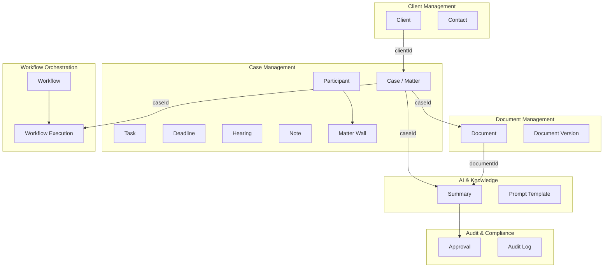
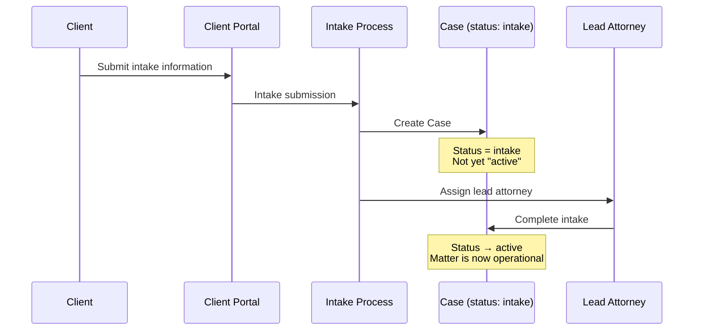

# Ubiquitous Language

**LexFlow AI** — Domain Glossary  
**Version:** 1.0  
**Status:** Draft — Pre-Implementation  
**Last Updated:** 2026-07-06

---

## Purpose

This glossary defines the shared vocabulary used across all bounded contexts, documentation, APIs, UI labels, and team communication for LexFlow AI. Consistent language prevents integration defects, UI confusion, and misaligned requirements between legal stakeholders and engineering teams.

---

## Scope

| In Scope | Out of Scope |
|----------|--------------|
| Domain terms with precise definitions | Generic software engineering jargon |
| Anti-patterns (terms to avoid) | External system proprietary terminology |
| Context-specific term ownership | Marketing copy and sales language |
| Examples in legal practice context | Programming language keywords |

---

## Responsibilities

| Audience | How to Use This Glossary |
|----------|--------------------------|
| Engineers | Name database tables, API fields, events, and code entities using these terms |
| Product / legal ops | Validate UI labels and workflow descriptions match domain language |
| Technical writers | Source of truth for documentation terminology |
| New team members | Required reading before first contribution |

When a term appears in multiple contexts with different meanings, the **bounded context** column identifies the authoritative definition.

---

## Architecture

### Term Relationship Map

---

## Flow Diagrams

### Intake Terminology Flow

---

## Core Glossary

### A

| Term | Bounded Context | Definition | NOT Called | Example |
|------|-----------------|------------|------------|---------|
| **Approval** | Audit & Compliance | An explicit human authorization gate before a sensitive action proceeds (AI output publication, document send, workflow step). Records who decided, when, and why. | Sign-off, OK, Authorization | Lead attorney approves an AI document summary before it appears to the paralegal team |
| **Archive** | Case Management | Terminal state for resolved cases moved to long-term retention. No new work permitted without reopen. | Delete, Remove, Purge | A closed case from 2019 is archived per the firm's 7-year retention policy |
| **Associate Attorney** | Identity & Access | A licensed attorney working on cases under supervision. Role: `AssociateAttorney`. | Junior lawyer (informal) | An associate assigned as a case participant with role `associate` |
| **Audit Log** | Audit & Compliance | Immutable, append-only record of significant system actions. Includes actor, action, resource, timestamp, and before/after state. | Log file, History, Activity feed | Compliance officer searches audit logs for all document views on a case |
| **AISummary** | AI & Knowledge | Domain aggregate storing AI-generated text linked to a case. Requires attorney approval before team visibility (configurable). | Report, Analysis, AI output | AI generates a deposition summary; status is `draft` until attorney approves |

### B

| Term | Bounded Context | Definition | NOT Called | Example |
|------|-----------------|------------|------------|---------|
| **Bounded Context** | Architecture | A DDD module with its own model, ubiquitous language, and data ownership. LexFlow has eight bounded contexts. | Module, Service, Package | Document Management is a bounded context separate from Case Management |
| **Billing Code** | Case Management | Firm-internal code linking a case to the billing system. Stored on Case; not a billing system of record. | Matter code (acceptable alternate), Invoice number | Case `2026-00142` has billing code `LIT-SMITH-001` |

### C

| Term | Bounded Context | Definition | NOT Called | Example |
|------|-----------------|------------|------------|---------|
| **Case** | Case Management | The central aggregate — a legal matter handled by the firm. Contains tasks, deadlines, hearings, notes, and participant list. Synonymous with **Matter** in legal practice. | Ticket, Issue, Project, Engagement | "Acme Corp v. State — Regulatory Appeal" is a Case |
| **Matter** | Case Management | Synonym for **Case** used in legal practice. Both terms are acceptable in UI; code and APIs use `Case`. | — | Managing partner asks "How many active matters do we have?" |
| **Case Number** | Case Management | Firm-unique identifier for a case (e.g., `2026-00142`). Immutable after assignment. Value object. | Matter ID (acceptable in UI), Ticket number | Paralegal searches for case number `2026-00142` |
| **Case Participant** | Case Management | A user assigned to a case with a defined role. Enforces the matter wall. | Member, Assignee, Team member | Paralegal Jane Doe is a participant with role `paralegal` |
| **Client** | Client Management | An individual or organization receiving legal services from the firm. Master record; cases reference via `clientId`. | Customer, Account, Contact (for organizations) | Acme Corporation is a client with type `organization` |
| **Client Portal** | Client Management | Self-service interface for clients to submit intake information, upload documents, and view case status. | Client app, External portal | Client logs into portal to check case status updates |
| **Contact** | Client Management | A person associated with an organization client (e.g., general counsel). Child entity of organization Client. | User, Client (for individuals) | John Smith, General Counsel, is a contact on Acme Corporation |
| **Contract Review** | AI & Knowledge | AI capability analyzing contract clauses against firm playbooks. Output is advisory; requires attorney approval. | Contract analysis, AI review | AI flags a non-standard indemnification clause in a vendor agreement |
| **Correlation ID** | Cross-cutting | UUID tracing a business operation across services, events, and logs. | Request ID (related but distinct), Trace ID | A document upload and its OCR processing share one correlation ID |

### D

| Term | Bounded Context | Definition | NOT Called | Example |
|------|-----------------|------------|------------|---------|
| **Deadline** | Case Management | A date-bound legal or internal obligation on a case. Types: filing, discovery, statute of limitations, internal, other. Tracked with reminders. | Due date (for tasks), Reminder, Calendar event | Filing deadline for response to motion: September 1, 2026 |
| **Document** | Document Management | A file associated with a case. Has type classification, versioning, and OCR text. Stored in S3 with metadata in PostgreSQL. | Attachment, File, Asset | A PDF pleading uploaded to case `2026-00142` |
| **Document Version** | Document Management | An immutable snapshot of a document at a point in time. Version numbers increase monotonically. | Revision, Edit, Copy | Version 2 of the motion created after partner comments |
| **Document Type** | Document Management | Classification enum: pleading, contract, evidence, correspondence, invoice, other. | Category, Tag, Label | A discovery response is classified as `evidence` |

### E

| Term | Bounded Context | Definition | NOT Called | Example |
|------|-----------------|------------|------------|---------|
| **Embedding** | AI & Knowledge | Vector representation of a document text chunk stored in pgvector for semantic search. Not a domain aggregate. | Vector, Index, Token | 42 embedding chunks generated for a 15-page contract |
| **Execution** | Workflow Orchestration | A single run of a workflow definition. Tracks status, input/output, steps. Aggregate: `WorkflowExecution`. | Run, Job, Instance (acceptable) | The intake workflow runs once when a new case is created — one execution |

### F

| Term | Bounded Context | Definition | NOT Called | Example |
|------|-----------------|------------|------------|---------|
| **Firm** | Identity & Access | The law firm tenant. All data is scoped by `firmId`. Future multi-firm support. | Organization, Company, Tenant (technical) | Freeman Mathis & Gary LLP is a firm |
| **Firm-Wide** | Cross-cutting | Operations scoped to the entire firm, not a specific case. Workflow executions may have null `caseId`. | Global, System-wide | Operations team runs a bulk data import workflow |

### H

| Term | Bounded Context | Definition | NOT Called | Example |
|------|-----------------|------------|------------|---------|
| **Hearing** | Case Management | A scheduled court appearance on a case. Includes date, location, court, and judge. | Meeting, Appointment, Event | Motion hearing scheduled for October 15 in Room 412 |
| **Human-in-the-Loop** | AI & Knowledge | Design principle requiring attorney review and approval before AI outputs become official work product. | Manual review, QA | AI summary sits in `draft` status until lead attorney approves |

### I

| Term | Bounded Context | Definition | NOT Called | Example |
|------|-----------------|------------|------------|---------|
| **Intake** | Case Management | The initial case creation process and the `intake` status. Case is not yet fully operational. | Onboarding, Registration, Enrollment | New matter from web form starts in `intake` status |
| **Idempotency Key** | Cross-cutting | Client-provided key ensuring duplicate API requests produce the same result. Prevents double workflow triggers. | Duplicate key, Request token | UI sends idempotency key to prevent double-click on "Run Workflow" |

### L

| Term | Bounded Context | Definition | NOT Called | Example |
|------|-----------------|------------|------------|---------|
| **Lead Attorney** | Case Management | The primary responsible attorney on a case. Required at creation. Must be a participant with role `lead`. | Partner (may or may not be), Owner, Responsible attorney | Sarah Johnson is lead attorney on case `2026-00142` |
| **Legal Research** | AI & Knowledge | AI-assisted research producing a draft memo with citations. Requires attorney verification. Never auto-submitted. | AI search, Google for lawyers | Associate requests research on summary judgment standard in the 11th Circuit |
| **LLM Usage** | AI & Knowledge | Aggregated token consumption and cost tracking per firm, user, case, and period. Entity, not aggregate. | API usage, Token count | Compliance report shows 2.4M tokens consumed in Q2 |

### M

| Term | Bounded Context | Definition | NOT Called | Example |
|------|-----------------|------------|------------|---------|
| **Matter Wall** | Case Management | Access restriction ensuring only assigned participants (and authorized firm roles) can view case data. Ethical wall for conflicts. | Permission group, Access control list, Firewall | Paralegal on Case A cannot see documents on Case B |
| **Managing Partner** | Identity & Access | Firm leadership role with firm-wide case visibility and authority to reopen closed cases. Role: `ManagingPartner`. | Admin, Boss, Partner (generic) | Managing partner approves reopening a closed case |

### N

| Term | Bounded Context | Definition | NOT Called | Example |
|------|-----------------|------------|------------|---------|
| **Note** | Case Management | Internal text entry on a case with visibility controls (team, attorneys only, private). | Comment, Memo, Journal entry | Attorney adds a private note about settlement strategy |
| **Notification** | Notifications | A delivered alert to a user via in-app, email, or Teams channel. | Alert, Message, Email (when channel is broader) | Paralegal receives in-app notification for new task assignment |

### O

| Term | Bounded Context | Definition | NOT Called | Example |
|------|-----------------|------------|------------|---------|
| **OCR** | Document Management | Optical Character Recognition — text extraction from uploaded documents. Status tracked on Document. | Text extraction, Scanning, Parsing | OCR completes on uploaded PDF; text available for search and AI |
| **Outbox** | Cross-cutting | Transactional outbox table (`shared.outbox_events`) ensuring reliable event publication. | Message queue, Event store | Case creation writes `CaseCreated` to outbox in same transaction |

### P

| Term | Bounded Context | Definition | NOT Called | Example |
|------|-----------------|------------|------------|---------|
| **Participant** | Case Management | See **Case Participant**. Shorthand used in conversation. | Member, User on case | "Add Sarah as a participant on this matter" |
| **Paralegal** | Identity & Access | Legal professional supporting attorneys. Role: `Paralegal`. Common case participant role. | Legal assistant (related role), Secretary | Paralegal organizes discovery documents and runs workflows |
| **Practice Area** | Case Management | Legal specialty classification: litigation, corporate, IP, regulatory, employment, real estate, other. | Department, Team, Group | Case classified under practice area `litigation` |
| **Prompt Template** | AI & Knowledge | Versioned Jinja2 template defining AI instructions, model configuration, and approval requirements. Aggregate root. | Prompt, System message, Instruction | `document-summary-v1` template generates structured document summaries |
| **Prompt History** | AI & Knowledge | Immutable log of every LLM interaction: redacted prompt, response, tokens, latency. Append-only. | Chat log, Conversation, AI log | Every case assistant chat message recorded in prompt history |

### R

| Term | Bounded Context | Definition | NOT Called | Example |
|------|-----------------|------------|------------|---------|
| **RBAC** | Identity & Access | Role-Based Access Control. Users assigned roles; roles grant permissions. Enforced in FastAPI before domain handlers. | Permissions (component of RBAC), ACL | Attorney role grants `case:write:assigned` permission |

### S

| Term | Bounded Context | Definition | NOT Called | Example |
|------|-----------------|------------|------------|---------|
| **Summary** | AI & Knowledge | AI-generated text output stored as an AISummary. Requires human review before use in legal work product. | Report, Analysis, Brief, Memo (in UI) | Document summary highlights key arguments in a motion |
| **Slug** | Workflow Orchestration | URL-safe unique identifier for a workflow definition (e.g., `intake-new-client-v1`). | ID, Name, Key | Developer references workflow by slug in event handlers |
| **Statute of Limitations** | Case Management | A deadline type indicating a legal time limit for filing claims. Critical priority for reminders. | SOL (acceptable abbreviation), Time limit | System tracks statute of limitations deadline with escalating reminders |

### T

| Term | Bounded Context | Definition | NOT Called | Example |
|------|-----------------|------------|------------|---------|
| **Task** | Case Management | A completable work item on a case with assignee, due date, and status. Child entity of Case. | Todo, Action item, Ticket | "Prepare discovery response" assigned to paralegal, due August 15 |
| **Timeline** | Case Management | Chronological feed of case events displayed in the UI. Denormalized from `case_timeline_events`. | Activity feed, History, Log | Timeline shows document upload, task completion, and hearing scheduled |
| **Trigger** | Workflow Orchestration | The mechanism that starts a workflow: manual (user action), event (domain event), or schedule (cron). | Start, Launch, Execute | `CaseCreated` event triggers the intake workflow |

### W

| Term | Bounded Context | Definition | NOT Called | Example |
|------|-----------------|------------|------------|---------|
| **Workflow** | Workflow Orchestration | An automated sequence of steps orchestrated by n8n, triggered by FastAPI. Definition (template) vs Execution (instance). | Automation, Bot, Script, Flow | Intake workflow creates SharePoint folder and sends welcome email |
| **Workflow Definition** | Workflow Orchestration | A reusable workflow template with slug, trigger type, and n8n reference. Aggregate root. | Template, Blueprint, Config | `intake-new-client-v1` is a workflow definition |
| **Workflow Execution** | Workflow Orchestration | A single instance of a workflow run with status, payloads, and step records. Aggregate root. | Run, Job, Process instance | One execution created when intake workflow runs for a new case |

---

## Anti-Patterns — Terms to Avoid

| Avoid | Use Instead | Reason |
|-------|-------------|--------|
| Ticket | Case | Legal professionals think in matters, not support tickets |
| Customer | Client | Legal relationship is attorney-client, not vendor-customer |
| Attachment | Document | Documents have versioning, OCR, and classification |
| Bot | Workflow | Workflows are firm-configured automations, not chatbots |
| Report (for AI output) | Summary | Summaries require approval; reports imply finality |
| Sign-off | Approval | Approval is a domain entity with audit trail |
| Permission group | Matter Wall | Matter wall is an ethical concept, not just RBAC |
| File | Document | File is a storage concept; Document is a domain entity |
| Project | Case | Cases have legal lifecycle, not project management semantics |
| Account | Client | CRM term; conflicts with financial/billing meaning |
| Automation (as noun for workflow) | Workflow | Too generic; workflow implies orchestration with audit |
| AI output (in UI) | Summary or Draft | Emphasizes human review requirement |
| Delete (for cases) | Archive or Close | Legal records require retention; soft delete only |
| Member | Participant | Participant implies defined role on a matter |
| Global search | Knowledge Search | Scoped to authorized cases; not internet-wide |

---

## Context-Specific Disambiguation

| Term | Context A | Context B |
|------|-----------|-----------|
| **Version** | Document Version (immutable file snapshot) | Optimistic concurrency `version` integer on aggregates |
| **Status** | Case status (`intake`, `active`, `closed`) | Document status (`uploading`, `processing`, `ready`) — always qualify |
| **Approval** | AISummary approval (attorney reviews AI text) | Workflow approval (authorization gate for automation step) |
| **Portal** | Client Portal (external client access) | Attorney portal (internal — just "LexFlow AI") |
| **Template** | Prompt Template (AI instructions) | Workflow Definition template (automation blueprint) |
| **Active** | Case status (operational matter) | WorkflowDefinition `isActive` (available for triggering) |
| **Draft** | AISummary status (generated, pending approval) | PromptTemplate draft version (not yet activated) |

---

## Best Practices

1. **Use glossary terms in code** — Python classes: `Case`, `Document`, `WorkflowExecution`; not `Matter`, `File`, `WorkflowRun`.
2. **UI may use legal synonyms** — Display "Matter" in attorney-facing UI if firm prefers; API field remains `case`.
3. **Qualify ambiguous terms** — Say "document status" not just "status" in multi-aggregate conversations.
4. **Event names use aggregate terms** — `CaseCreated`, not `MatterCreated` or `IntakeCompleted`.
5. **Onboard with this glossary** — New engineers read this before first PR; product reviews UI labels against it.
6. **Update on domain changes** — New aggregates or capabilities require glossary additions in the same PR.
7. **Avoid abbreviations in APIs** — Use `statute_of_limitations` not `sol` in enum values; abbreviations acceptable in UI.

---

## Tradeoffs

| Decision | Benefit | Cost |
|----------|---------|------|
| Case in code, Matter in UI | Technical consistency; legal familiarity | Dual terminology to maintain |
| Strict anti-patterns list | Prevents semantic drift | May feel rigid to non-engineers |
| Context-specific disambiguation | Reduces ambiguity | Longer glossary entries |
| English-only terms | US law firm deployment focus | International expansion needs translation guide |
| Attorney approval as first-class term | Reinforces human-in-the-loop culture | Longer than "review" in UI labels |

---

## Future Improvements

| Improvement | Description |
|-------------|-------------|
| i18n glossary | Translated terms for multi-jurisdiction expansion |
| Firm-customizable labels | Allow firms to override UI synonyms (Matter vs Case) |
| Glossary lint tool | CI check that API field names match glossary terms |
| Practice area sub-glossaries | Litigation-specific vs corporate-specific terms |
| Visual glossary | Illustrated guide for non-technical stakeholders |
| Term change log | Track glossary changes with rationale per version |

---

## References

- [bounded-contexts.md](./bounded-contexts.md) — Context ownership of terms
- [case-aggregate.md](./case-aggregate.md) — Case, Task, Deadline, Matter Wall
- [client-aggregate.md](./client-aggregate.md) — Client, Contact, Portal
- [document-aggregate.md](./document-aggregate.md) — Document, Version, OCR
- [workflow-aggregate.md](./workflow-aggregate.md) — Workflow, Execution, Trigger
- [ai-aggregate.md](./ai-aggregate.md) — Summary, Prompt Template, Human-in-the-Loop
- [domain-events.md](./domain-events.md) — Event naming conventions
- [../product-overview.md](../product-overview.md) — User personas and capabilities
- [../03-architecture/](../03-architecture/) — Technical architecture terms
