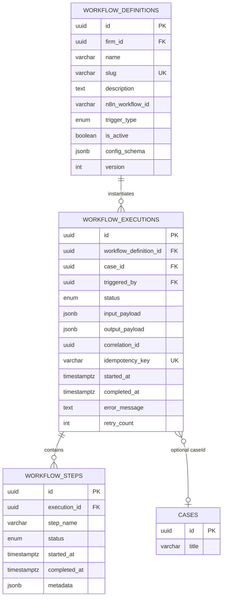
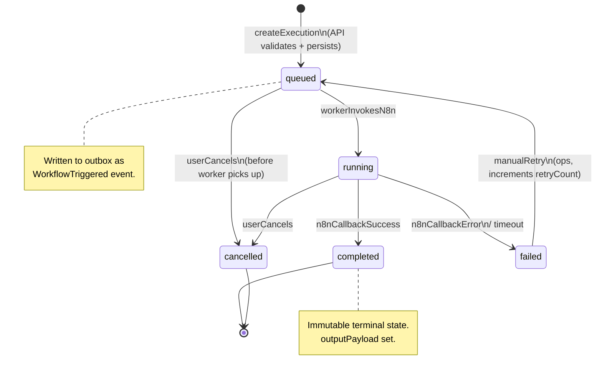
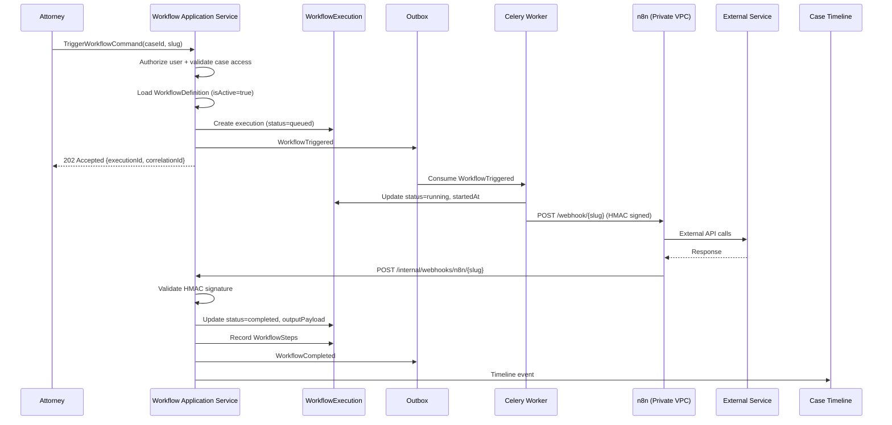
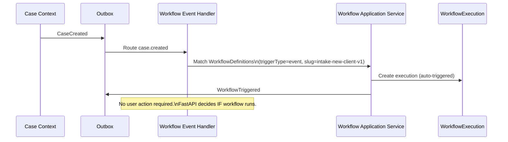

# Workflow Aggregate

**LexFlow AI** — Workflow Orchestration Domain  
**Version:** 1.0  
**Status:** Draft — Pre-Implementation  
**Last Updated:** 2026-07-06

---

## Purpose

The Workflow bounded context manages **WorkflowDefinition** (reusable automation templates) and **WorkflowExecution** (individual runs). FastAPI owns all decisions about whether a workflow should run, what input it receives, and how results are interpreted. n8n is the external orchestration engine that executes HTTP calls — it does not contain legal or authorization logic.

---

## Scope

| In Scope | Out of Scope |
|----------|--------------|
| WorkflowDefinition aggregate | n8n node configuration and JSON |
| WorkflowExecution aggregate and steps | Business authorization rules (Identity context) |
| Execution state machine | Case lifecycle management |
| Idempotency and correlation tracking | External API credentials management |
| Input/output payload contracts | Notification delivery |

---

## Responsibilities

| Aggregate | Responsibilities |
|-----------|------------------|
| **WorkflowDefinition** | Register firm/system workflow templates; map to n8n workflow IDs; define trigger types and configurable parameters |
| **WorkflowExecution** | Record each workflow run; track status, steps, payloads; enforce immutability on terminal states |
| **WorkflowStep** | Child entity capturing per-step timing and metadata from n8n callbacks |

---

## Architecture

### WorkflowDefinition Aggregate

```
WorkflowDefinition (Aggregate Root)
├── id: WorkflowDefinitionId (UUID)
├── firmId: FirmId | null              ← null = system template
├── name: string
├── slug: string                       ← unique identifier (e.g., intake-new-client-v1)
├── description: string
├── n8nWorkflowId: string              ← reference to n8n deployed workflow
├── triggerType: TriggerType (enum)
├── isActive: boolean
├── configSchema: JSON                 ← JSON Schema for user-configurable parameters
├── version: int
└── createdAt: datetime
```

### WorkflowExecution Aggregate

```
WorkflowExecution (Aggregate Root)
├── id: ExecutionId (UUID)
├── workflowDefinitionId: WorkflowDefinitionId
├── caseId: CaseId | null              ← nullable for firm-wide workflows
├── triggeredBy: UserId | null         ← null for event/schedule triggers
├── status: ExecutionStatus (enum)
├── inputPayload: JSON                 ← sanitized input sent to n8n
├── outputPayload: JSON | null         ← result from n8n callback
├── correlationId: UUID                ← distributed tracing
├── idempotencyKey: string | null
├── startedAt: datetime | null
├── completedAt: datetime | null
├── errorMessage: string | null
├── retryCount: int
├── createdAt: datetime
│
└── steps: WorkflowStep[]
```

```
WorkflowStep (Entity)
├── id: StepId (UUID)
├── executionId: ExecutionId
├── stepName: string
├── status: StepStatus (enum)
├── startedAt: datetime | null
├── completedAt: datetime | null
└── metadata: JSON
```

### Entity Relationship Diagram



### Enumerations

| Enum | Values |
|------|--------|
| `TriggerType` | `manual`, `event`, `schedule` |
| `ExecutionStatus` | `queued`, `running`, `completed`, `failed`, `cancelled` |
| `StepStatus` | `pending`, `running`, `completed`, `failed`, `skipped` |

---

## Flow Diagrams

### WorkflowExecution State Machine



### End-to-End Workflow Sequence



### Event-Triggered Workflow



---

## Invariants

| # | Invariant | Enforcement |
|---|-----------|-------------|
| 1 | `slug` is unique per firm (or globally for system templates) | Database unique constraint |
| 2 | Only `isActive = true` definitions can create new executions | Application service guard |
| 3 | `WorkflowExecution` in `completed`, `failed`, or `cancelled` is immutable | No update paths except audit metadata |
| 4 | `idempotencyKey` is unique when provided | Database unique partial index |
| 5 | `correlationId` is set on every execution for tracing | Creation factory |
| 6 | `inputPayload` is sanitized — no raw secrets, PII minimized | Payload builder service |
| 7 | Manual triggers require an authenticated `triggeredBy` user | API command validation |
| 8 | Event triggers may have `triggeredBy = null` | Allowed for system-initiated runs |
| 9 | `retryCount` increments only on explicit manual retry | Retry command |
| 10 | n8n callback must reference a valid `executionId` in `running` state | Callback handler validation |
| 11 | `outputPayload` is set only on `completed` status | State transition guard |
| 12 | `errorMessage` is set only on `failed` status | State transition guard |

---

## WorkflowDefinition Catalog (Initial)

| Slug | Trigger | Case Required | Description |
|------|---------|---------------|-------------|
| `intake-new-client-v1` | Event: `CaseCreated` | Yes | SharePoint folder, welcome email, attorney notification |
| `document-upload-notify-v1` | Event: `DocumentUploaded` | Yes | Notify case team, sync to SharePoint |
| `deadline-reminder-v1` | Schedule: daily | Yes | Send approaching deadline reminders |
| `ai-summary-notify-v1` | Event: `SummaryGenerated` | Yes | Notify lead attorney, create approval request |
| `case-close-archive-v1` | Event: `CaseStatusChanged(closed)` | Yes | Archive documents, export audit, notify billing |
| `discovery-request-v1` | Manual | Yes | Generate discovery package, send via Outlook |
| `conflict-check-v1` | Event: `CaseCreated` | Yes | Query external conflict system |

See [../06-workflows/](../06-workflows/) for n8n webhook contracts and promotion pipeline.

---

## Best Practices

1. **FastAPI decides, n8n executes** — Never move authorization or legal logic into n8n nodes.
2. **Return 202 immediately** — Workflow trigger APIs are async; return `executionId` and `correlationId`.
3. **HMAC-sign all n8n communication** — Both trigger and callback payloads verified with shared secrets.
4. **Store sanitized input/output** — Strip credentials, tokens, and unnecessary PII from persisted payloads.
5. **Use idempotency keys for manual triggers** — Prevent duplicate executions from UI double-clicks.
6. **Record steps from n8n callback** — `steps[]` array in callback populates `WorkflowStep` entities.
7. **Version workflow definitions** — New slug suffix (`-v2`) rather than mutating active definitions.
8. **Deactivate, don't delete** — Set `isActive = false` on deprecated definitions; preserve execution history.

---

## Tradeoffs

| Decision | Benefit | Cost |
|----------|---------|------|
| Separate Definition and Execution aggregates | Clean template vs instance separation | Two aggregates to manage |
| n8n as orchestrator (not owner) | Security, audit, business logic in FastAPI | Network hop; n8n availability dependency |
| Immutable terminal executions | Audit-grade execution history | Cannot amend completed output |
| JSON payloads for input/output | Flexible per-workflow contracts | Schema validation needed per slug |
| Optional `caseId` on execution | Supports firm-wide scheduled workflows | Weaker case-scoped authorization without explicit checks |
| Manual retry resets to `queued` | Simple recovery model | No automatic compensation/saga rollback |

---

## Future Improvements

| Improvement | Description |
|-------------|-------------|
| Workflow execution DAG | Multi-definition chained workflows with dependencies |
| Parallel step tracking | n8n sub-workflow step granularity |
| Workflow analytics | Execution duration, failure rate per slug dashboard |
| User-configurable parameters | UI form generated from `configSchema` JSON Schema |
| Workflow approval gate | Managing Partner approval before activating firm-wide workflows |
| Compensation workflows | Automated rollback steps on partial failure |
| Workflow simulation mode | Dry-run against staging n8n without side effects |

---

## References

- [bounded-contexts.md](./bounded-contexts.md) — Workflow Orchestration context
- [case-aggregate.md](./case-aggregate.md) — Case events trigger workflows
- [domain-events.md](./domain-events.md) — `WorkflowTriggered`, `WorkflowCompleted`, `WorkflowFailed`
- [ubiquitous-language.md](./ubiquitous-language.md) — Workflow vs Automation terms
- [../06-workflows/](../06-workflows/) — n8n integration, webhook contracts, promotion
- [../03-architecture/](../03-architecture/) — Async path and Celery worker architecture
- [../05-database/](../05-database/) — `workflows` schema tables
- [../13-decisions/002-n8n-orchestration-only.md](../13-decisions/002-n8n-orchestration-only.md) — n8n orchestration ADR
