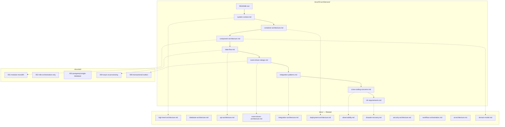

# Architecture Documentation — LexFlow AI

**LexFlow AI** — Enterprise AI Automation Platform for Law Firms  
**Version:** 1.0  
**Status:** Draft — Pre-Implementation  
**Last Updated:** 2026-07-06

---

## Purpose

This folder is the **canonical architecture reference** for LexFlow AI. It provides layered C4 views, data-flow models, event-driven design, integration patterns, cross-cutting concerns, and non-functional requirements (NFRs) for engineers, architects, security reviewers, and SRE teams.

The architecture follows a strict separation of concerns:

```
Frontend → FastAPI → Queue → Worker → n8n → External Systems
```

**n8n is private, orchestration-only, and contains no business logic.** All domain rules, authorization, and audit live in FastAPI and shared Python service modules.

---

## Scope

| In Scope | Out of Scope |
|----------|--------------|
| System context and stakeholder boundaries | Detailed API endpoint catalogs |
| Container and component topology | Database column-level schema |
| Synchronous and asynchronous data flows | Terraform module internals |
| Event-driven messaging (outbox, RabbitMQ) | UI component library details |
| Integration adapter patterns | Penetration test procedures |
| Cross-cutting platform concerns | Individual ADR rationale (see `adr/`) |
| Scale, HA, DR NFR targets | Sprint-level implementation tasks |

---

## Responsibilities

| Audience | Use This Folder To |
|----------|-------------------|
| **Solution Architects** | Validate boundaries, integration contracts, and evolution path |
| **Backend Engineers** | Understand FastAPI module layout, async paths, and event contracts |
| **Frontend Engineers** | Know what the UI may and may not call; async UX patterns |
| **DevOps / SRE** | Plan capacity, HA topology, observability hooks, DR alignment |
| **Security Reviewers** | Trace trust boundaries, data flows, and external exposure |
| **Product / Legal Ops** | Understand automation scope and human-in-the-loop gates |

---

## Architecture

LexFlow AI is deployed as a **modular monolith** on AWS ECS Fargate with schema-separated PostgreSQL, private n8n orchestration, and RabbitMQ-backed async processing. See [ADR-001](../13-decisions/001-modular-monolith.md) and [ADR-002](../13-decisions/002-n8n-orchestration-only.md).

```mermaid
flowchart LR
    subgraph L1["Level 1 — System Context"]
        SC[system-context.md]
    end

    subgraph L2["Level 2 — Containers"]
        CA[container-architecture.md]
    end

    subgraph L3["Level 3 — Components"]
        CO[component-architecture.md]
    end

    subgraph Flows["Behavioral Views"]
        DF[data-flow.md]
        ED[event-driven-design.md]
        IP[integration-patterns.md]
        CC[cross-cutting-concerns.md]
    end

    subgraph NFR["Quality Attributes"]
        NFRD[nfr-requirements.md]
    end

    SC --> CA --> CO
    CO --> DF
    DF --> ED
    ED --> IP
    IP --> CC
    CC --> NFRD
```



---

## Document Index

| # | Document | C4 Level / Type | Description |
|---|----------|-----------------|-------------|
| 1 | [system-context.md](./system-context.md) | C4 Level 1 | Users, external systems, trust boundaries |
| 2 | [container-architecture.md](./container-architecture.md) | C4 Level 2 | Deployable containers, data stores, network zones |
| 3 | [component-architecture.md](./component-architecture.md) | C4 Level 3 | FastAPI bounded contexts, workers, shared packages |
| 4 | [data-flow.md](./data-flow.md) | Behavioral | Sync reads/writes vs async automation paths |
| 5 | [event-driven-design.md](./event-driven-design.md) | Behavioral | Transactional outbox, RabbitMQ topology, sagas |
| 6 | [integration-patterns.md](./integration-patterns.md) | Behavioral | Adapter pattern, Microsoft 365, external APIs |
| 7 | [cross-cutting-concerns.md](./cross-cutting-concerns.md) | Platform | Idempotency, caching, tracing, retries, audit |
| 8 | [nfr-requirements.md](./nfr-requirements.md) | Quality | 1,000+ users, 50K workflows/month, HA, DR |

---

## Reading Order by Role

| Role | Recommended Path |
|------|------------------|
| **New Engineer** | README → system-context → container-architecture → component-architecture → data-flow |
| **Backend Engineer** | component-architecture → event-driven-design → cross-cutting-concerns → [database-architecture](../database-architecture.md) |
| **Frontend Engineer** | system-context → data-flow (sync section) → [api-architecture](../api-architecture.md) |
| **DevOps / SRE** | container-architecture → nfr-requirements → [deployment-architecture](../deployment-architecture.md) → [disaster-recovery](../disaster-recovery.md) |
| **Security Reviewer** | system-context → container-architecture → integration-patterns → [security-architecture](../security-architecture.md) |
| **Integration Engineer** | integration-patterns → event-driven-design → [workflow-orchestration](../workflow-orchestration.md) |

---

## Flow Diagrams — Documentation Map



---

## Best Practices

1. **Read top-down** — Start at C4 Level 1 and drill into behavioral views only when needed.
2. **Treat FastAPI as the authority** — n8n, queues, and workers are execution infrastructure, not domain owners.
3. **Cross-reference, don't duplicate** — This folder defines *structure and flow*; sibling docs define *implementation detail*.
4. **Update diagrams with code** — Architectural changes require diagram updates in the same PR once development begins.
5. **Record breaking changes in ADRs** — New integration boundaries or messaging contracts need an ADR before merge.

---

## Tradeoffs

| Decision | Benefit | Cost |
|----------|---------|------|
| Dedicated `03-architecture/` folder | Clear separation from API/DB/ops docs; easier onboarding | Some overlap with [high-level-architecture.md](../high-level-architecture.md) — mitigated by cross-links |
| C4 layering in separate files | Each audience reads only what they need | Readers must follow index to see full picture |
| Behavioral views separate from C4 | Sync/async and event flows are first-class | Additional maintenance when topology changes |

---

## Future Improvements

| Phase | Enhancement |
|-------|-------------|
| Phase 1 (MVP) | Add runtime sequence diagrams from first production traces |
| Phase 2 | Dynamic architecture portal (Backstage / Structurizr) generated from this folder |
| Phase 3 | Per-bounded-context component drill-downs as services are extracted |
| Phase 4 | Capacity model spreadsheets linked from [nfr-requirements.md](./nfr-requirements.md) |

---

## References

| Document | Relationship |
|----------|--------------|
| [../README.md](../README.md) | Master documentation index |
| [../high-level-architecture.md](../high-level-architecture.md) | Executive summary — superseded for detail by this folder |
| [../product-overview.md](../product-overview.md) | Vision, users, capabilities |
| [../domain-model.md](../domain-model.md) | Aggregates, bounded contexts, domain events |
| [../folder-structure.md](../folder-structure.md) | Monorepo layout mapping to components |
| [../13-decisions/README.md](../13-decisions/README.md) | Architecture Decision Records |

---

## Conventions

- All documents include: Purpose, Scope, Responsibilities, Architecture, Mermaid diagrams, Best Practices, Tradeoffs, Future Improvements, References.
- Diagram types used: C4 context/container/component, sequence, flowchart, ER (referenced from database doc).
- Version and last-updated date appear in each document header.
- **No executable code** in this folder — pseudocode and configuration tables only where essential.
