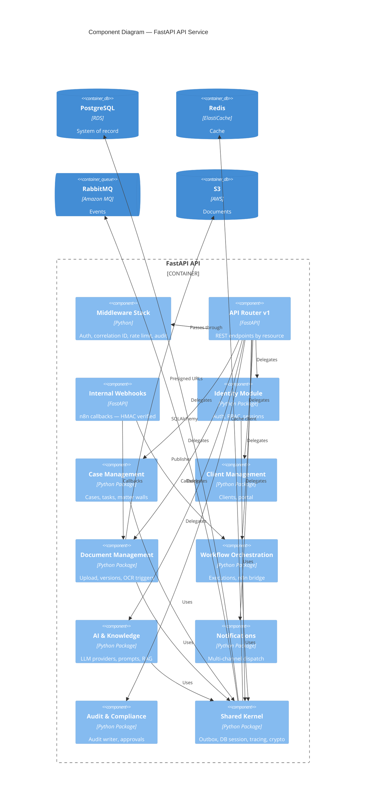
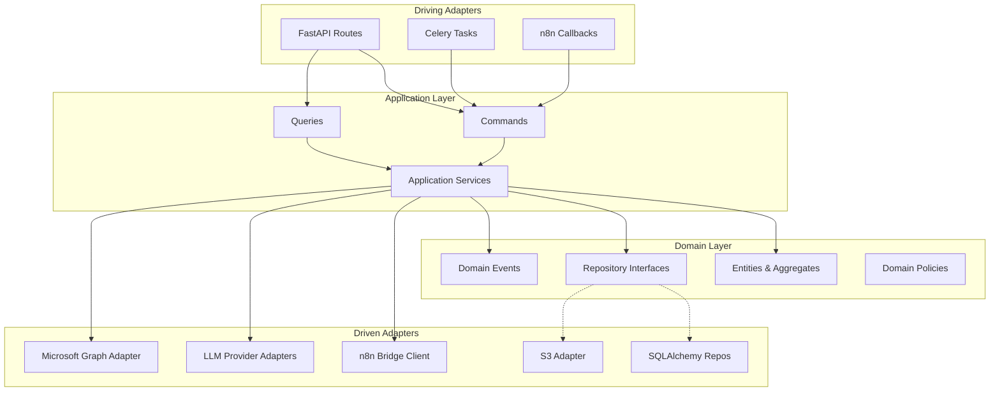
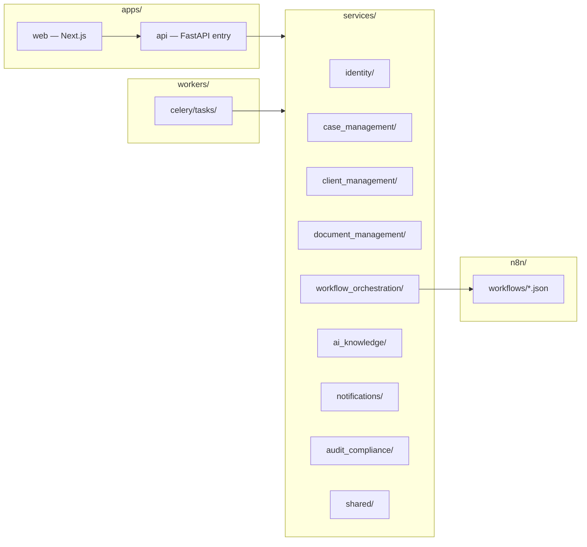
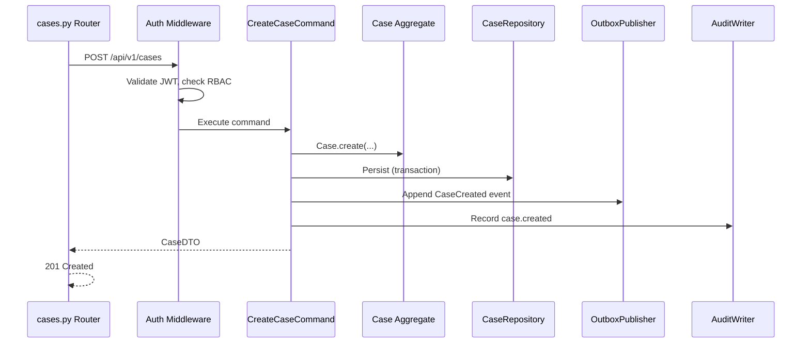
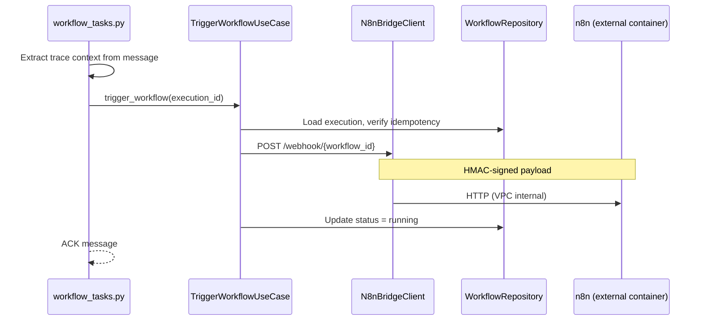
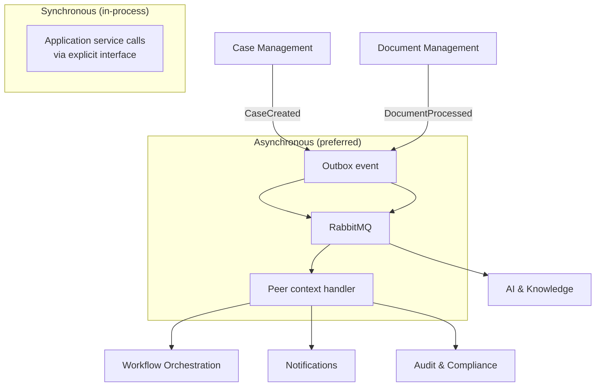
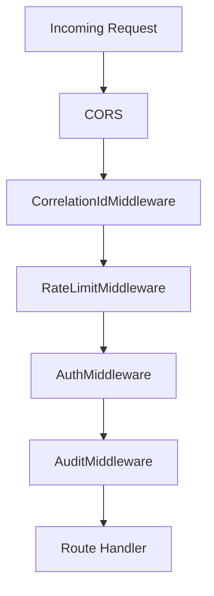

# Component Architecture — C4 Level 3

**LexFlow AI** — FastAPI Modules & Internal Components  
**Version:** 1.0  
**Status:** Draft — Pre-Implementation  
**Last Updated:** 2026-07-06

---

## Purpose

This document describes LexFlow AI at **C4 Level 3 (Components)** — the internal structure of the FastAPI application, shared Python service modules, Celery worker tasks, and their interactions. It defines where business logic lives and how bounded contexts communicate.

**Core principle:** All business logic resides in `services/` Python packages. FastAPI `apps/api` is a thin HTTP adapter. Workers import the same use cases. n8n has zero domain components.

---

## Scope

| In Scope | Out of Scope |
|----------|--------------|
| Bounded context modules and hexagonal layers | SQL migration files |
| FastAPI middleware and router organization | React component hierarchy |
| Worker task mapping to use cases | n8n node-level graphs |
| Shared cross-cutting packages | OpenAPI operation-level catalog |

---

## Responsibilities

### Layer Responsibility Model

| Layer | Location | Responsibility |
|-------|----------|----------------|
| **API Adapters** | `apps/api/src/api/v1/` | HTTP translation, auth middleware, request/response DTOs |
| **Application** | `services/{context}/application/` | Use cases (commands/queries), orchestration, transaction boundaries |
| **Domain** | `services/{context}/domain/` | Entities, value objects, domain events, repository interfaces |
| **Infrastructure** | `services/{context}/infrastructure/` | SQLAlchemy repos, S3, external adapters, n8n bridge client |
| **Workers** | `workers/celery/tasks/` | Message consumption, retry, calls into application layer |
| **Shared** | `services/shared/` | Outbox, database session, tracing, security utilities |

### Bounded Context Ownership

| Bounded Context | Owns | Publishes Events |
|-----------------|------|------------------|
| **Identity & Access** | Users, roles, permissions, sessions | `UserProvisioned`, `RoleAssigned` |
| **Case Management** | Cases, participants, tasks, deadlines, timeline | `CaseCreated`, `TaskCompleted`, `DeadlineApproaching` |
| **Client Management** | Clients, contacts, portal linkage | `ClientCreated`, `ClientUpdated` |
| **Document Management** | Documents, versions, OCR state, S3 keys | `DocumentUploaded`, `DocumentProcessed` |
| **Workflow Orchestration** | Definitions, executions, n8n bridge | `WorkflowTriggered`, `WorkflowCompleted` |
| **AI & Knowledge** | Prompts, summaries, embeddings, LLM metering | `SummaryGenerated`, `EmbeddingCreated` |
| **Notifications** | In-app, email, Teams dispatch | `NotificationSent` |
| **Audit & Compliance** | Immutable audit log, approvals | `AuditEntryRecorded`, `ApprovalRequested` |

---

## Architecture

### C4 Component Diagram — FastAPI Application

### Hexagonal Architecture per Bounded Context

### Monorepo Component Map

---

## Flow Diagrams

### Command Flow — Create Case

### Worker Component — Workflow Trigger

### Inter-Context Communication

---

## FastAPI Module Structure

| Module | Router Prefix | Key Components |
|--------|---------------|----------------|
| Identity | `/auth`, `/users`, `/roles` | `AuthService`, `PermissionResolver`, `TokenService` |
| Cases | `/cases`, `/tasks`, `/deadlines` | `CreateCase`, `AssignParticipant`, `MatterWallPolicy` |
| Clients | `/clients` | `CreateClient`, `LinkPortalUser` |
| Documents | `/documents`, `/uploads` | `UploadDocument`, `CreateVersion`, `OcrTrigger` |
| Workflows | `/workflows` | `TriggerWorkflow`, `N8nBridgeClient`, `ExecutionTracker` |
| AI | `/ai`, `/summaries` | `GenerateSummary`, `LLMProviderFactory`, `PromptRegistry` |
| Notifications | `/notifications` | `DispatchNotification`, channel adapters |
| Approvals | `/approvals` | `RequestApproval`, `DecideApproval` |
| Internal | `/internal/webhooks` | `N8nCallbackHandler`, HMAC verifier |
| Admin | `/admin` | Firm settings, integration config |

### Middleware Stack (Order)

---

## Worker Task Mapping

| Celery Task | Queue | Use Case | Bounded Context |
|-------------|-------|----------|-----------------|
| `document.process` | `document.process.normal` | `ProcessDocumentCommand` | Document Management |
| `document.ocr` | `document.process.normal` | `RunOcrCommand` | Document Management |
| `workflow.trigger` | `workflow.trigger.normal` | `TriggerWorkflowCommand` | Workflow Orchestration |
| `workflow.callback` | `workflow.callback.high` | `CompleteWorkflowCommand` | Workflow Orchestration |
| `ai.summarize` | `ai.inference.normal` | `GenerateSummaryCommand` | AI & Knowledge |
| `ai.embed` | `ai.embed.low` | `CreateEmbeddingsCommand` | AI & Knowledge |
| `notify.dispatch` | `notification.dispatch.normal` | `DispatchNotificationCommand` | Notifications |
| `outbox.publish` | `system.outbox.high` | `PublishPendingEvents` | Shared |
| `maintenance.cleanup` | `system.maintenance.low` | TTL cleanup jobs | Shared |

---

## Best Practices

1. **Import direction: API → Application → Domain** — Domain never imports infrastructure or FastAPI.
2. **One use case per command class** — `CreateCaseCommand`, not `CaseService.doEverything()`.
3. **Repository interfaces in domain** — SQLAlchemy implementations in infrastructure only.
4. **Workers call use cases, not repositories directly** — Preserves transaction and event boundaries.
5. **Internal webhooks are separate router** — Excluded from public OpenAPI; HMAC required.
6. **Cross-context calls via events** — Avoid synchronous coupling between bounded contexts except read-only queries through explicit query interfaces.
7. **Shared kernel stays minimal** — Only truly cross-cutting utilities in `services/shared/`.

---

## Tradeoffs

| Decision | Benefit | Cost |
|----------|---------|------|
| Modular monolith (all contexts in one API) | Single deploy, ACID cross-context transactions | Scaling requires scaling entire API tier |
| Hexagonal per context | Testable domain, swappable adapters | Boilerplate vs anemic CRUD |
| Celery tasks as driving adapters | Reuses application layer | Task serialization constraints on command DTOs |
| Internal webhooks for n8n | Clear callback contract | Additional HMAC key management |
| pgvector in same DB as domain | Simpler ops, join embeddings to documents | Embedding search load competes with OLTP |

---

## Future Improvements

| Phase | Enhancement |
|-------|-------------|
| Phase 2 | CQRS read models for case search and dashboards |
| Phase 3 | Extract `ai_knowledge` to standalone service with dedicated GPU tasks |
| Phase 3 | API versioning `/api/v2` with parallel component packages |
| Phase 4 | Event sourcing for workflow execution aggregate |
| Phase 4 | GraphQL read API for frontend (BFF remains thin) |

---

## References

| Document | Description |
|----------|-------------|
| [README.md](./README.md) | Architecture folder index |
| [container-architecture.md](./container-architecture.md) | C4 Level 2 |
| [data-flow.md](./data-flow.md) | Sync/async paths through components |
| [event-driven-design.md](./event-driven-design.md) | Outbox and event handlers |
| [../folder-structure.md](../folder-structure.md) | Monorepo directory layout |
| [../domain-model.md](../domain-model.md) | Aggregates and domain events |
| [../api-architecture.md](../api-architecture.md) | REST conventions |
| [../ai-architecture.md](../ai-architecture.md) | AI component detail |
| [../workflow-orchestration.md](../workflow-orchestration.md) | n8n bridge contracts |
| [../13-decisions/001-modular-monolith.md](../13-decisions/001-modular-monolith.md) | Modular monolith |
| [../13-decisions/004-async-ai-processing.md](../13-decisions/004-async-ai-processing.md) | Async AI path |
