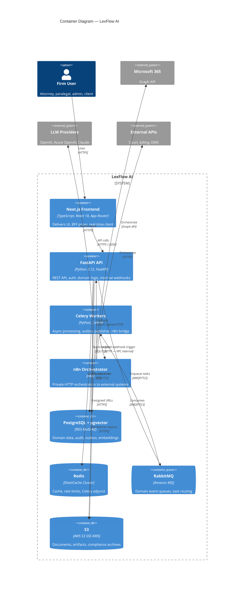
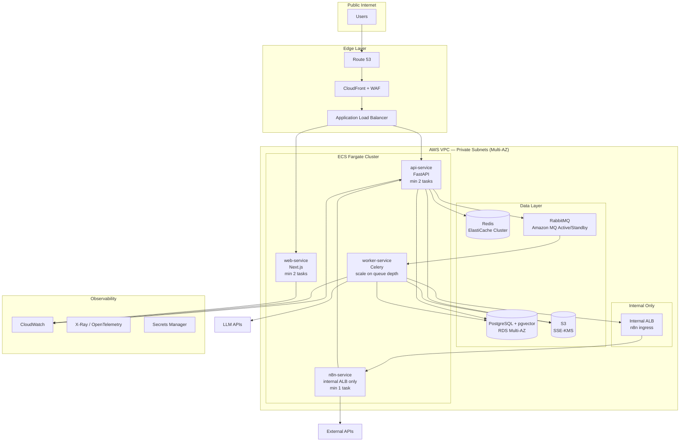
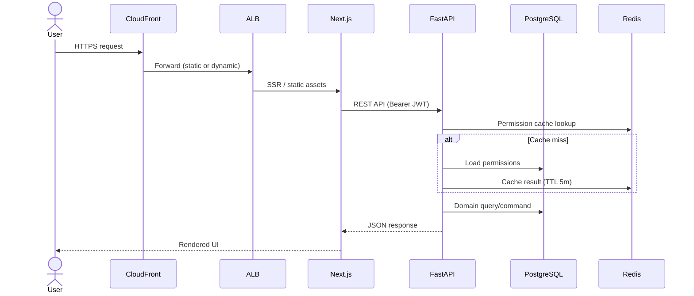
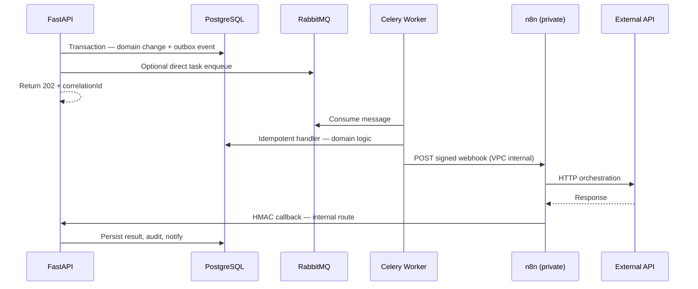
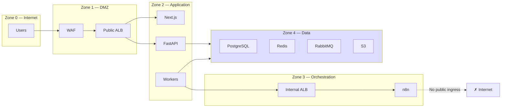

# Container Architecture — C4 Level 2

**LexFlow AI** — Enterprise AI Automation Platform for Law Firms  
**Version:** 1.0  
**Status:** Draft — Pre-Implementation  
**Last Updated:** 2026-07-06

---

## Purpose

This document describes LexFlow AI at **C4 Level 2 (Containers)** — the deployable runtime units, data stores, messaging infrastructure, and network zones that compose the platform. It bridges system context (Level 1) and FastAPI module design (Level 3).

---

## Scope

| In Scope | Out of Scope |
|----------|--------------|
| ECS Fargate services and their responsibilities | FastAPI route handlers and use cases |
| Data stores (PostgreSQL, Redis, S3, RabbitMQ) | Table-level schema (see database-architecture) |
| Network zones (public edge, private VPC) | Terraform module variables |
| Container-to-container communication patterns | Frontend component tree |
| n8n placement and access restrictions | n8n workflow node configuration |

---

## Responsibilities

### Container Responsibility Matrix

| Container | Primary Responsibilities | Does NOT |
|-----------|-------------------------|----------|
| **Next.js Frontend** | UI rendering, client state, token refresh UX, SSE/WebSocket client | Business rules, direct n8n/queue access, secrets |
| **FastAPI API** | AuthZ, validation, domain commands/queries, outbox writes, internal webhooks | Long-running AI inference in request path |
| **Celery Workers** | Async task execution, outbox publishing, n8n invocation, AI jobs | HTTP API surface for users |
| **n8n Orchestrator** | External HTTP orchestration, retries, payload transforms | Business logic, PostgreSQL writes, public exposure |
| **PostgreSQL** | System of record, outbox, audit, workflow state | Cache, message broker |
| **Redis** | Cache, rate limits, Celery result backend, distributed locks | Authoritative domain state |
| **RabbitMQ** | Durable async messaging, DLQ routing | Business logic execution |
| **S3** | Document binaries, export artifacts, log archives | Structured relational queries |

---

## Architecture

### C4 Container Diagram

### Deployment Topology

---

## Flow Diagrams

### Request Routing — Public Path

### Async Job Routing — Private Path

### Network Security Zones

---

## Container Specifications

| Container | Runtime | Scaling Trigger | Min Tasks | Health Check |
|-----------|---------|-----------------|-----------|--------------|
| Next.js | Node 20, ECS Fargate | CPU > 70%, request count | 2 | `GET /api/health` |
| FastAPI | Python 3.12, ECS Fargate | CPU > 70%, p95 latency | 2 | `GET /api/v1/health` |
| Celery Workers | Python 3.12, ECS Fargate | RabbitMQ queue depth | 2 | Celery inspect ping |
| n8n | n8n official image | Manual (Phase 3: HA) | 1 | `GET /healthz` via internal ALB |

### Data Store Specifications

| Store | Instance Class (initial) | HA Mode | Encryption |
|-------|-------------------------|---------|------------|
| PostgreSQL | db.r6g.xlarge | Multi-AZ synchronous | RDS KMS at rest, TLS in transit |
| Redis | cache.r6g.large × 2 shards | Cluster mode, 2 replicas/shard | ElastiCache encryption |
| RabbitMQ | mq.m5.large | Active/standby | TLS, auth via Secrets Manager |
| S3 | Standard + IA lifecycle | Cross-region replication | SSE-KMS |

---

## Communication Contracts

| From | To | Protocol | Auth |
|------|-----|----------|------|
| Browser | Next.js / FastAPI | HTTPS, TLS 1.2+ | JWT Bearer |
| Next.js | FastAPI | HTTPS (server-side) | Service token or user JWT forward |
| FastAPI | PostgreSQL | SQL over TLS | IAM auth via Secrets Manager creds |
| FastAPI | RabbitMQ | AMQP over TLS | Broker credentials |
| Worker | n8n | HTTP (VPC private) | HMAC-signed payload + shared secret |
| n8n | FastAPI | HTTP (internal route) | HMAC signature verification |
| Worker | LLM providers | HTTPS | API keys from Secrets Manager |

---

## Best Practices

1. **Stateless containers** — All durable state in PostgreSQL, S3, or RabbitMQ; containers are horizontally replaceable.
2. **n8n behind internal ALB only** — Security groups deny all public ingress to n8n tasks.
3. **Separate ECS services per container type** — Independent scaling policies for API vs workers vs web.
4. **PgBouncer between API/workers and RDS** — Connection pooling in transaction mode; max 100 connections per API task.
5. **Secrets never in container images** — AWS Secrets Manager injected at task startup.
6. **Version-controlled n8n workflows** — Git is source of truth; sandbox promotion via CI/CD.

---

## Tradeoffs

| Decision | Benefit | Cost |
|----------|---------|------|
| ECS Fargate over EKS | Lower operational overhead for modular monolith | Less granular orchestration than Kubernetes |
| Single PostgreSQL (schema-separated) | ACID transactions across bounded contexts | Vertical scaling ceiling — read replicas for relief |
| Amazon MQ (RabbitMQ) over SQS | Topic routing, DLQ, priority queues native | Higher cost than SQS; broker is managed SPOF (active/standby) |
| n8n single instance (Phase 1) | Simpler ops, sufficient for 50K workflows/month | Brief pause on task restart — workflows retry |
| Redis for cache + Celery adjunct | Unified infra component | Redis outage affects rate limits, not domain data |

---

## Future Improvements

| Phase | Enhancement |
|-------|-------------|
| Phase 2 | Dedicated worker pools per queue domain (document, AI, workflow) |
| Phase 3 | n8n HA — 2+ tasks behind internal ALB with sticky execution IDs |
| Phase 3 | RDS read replica routing for dashboards and search |
| Phase 4 | Extract AI bounded context to independent ECS service if GPU/isolation needed |
| Phase 4 | Multi-region active-passive with automated DNS failover |

---

## References

| Document | Description |
|----------|-------------|
| [README.md](./README.md) | Architecture folder index |
| [system-context.md](./system-context.md) | C4 Level 1 |
| [component-architecture.md](./component-architecture.md) | C4 Level 3 — FastAPI modules |
| [data-flow.md](./data-flow.md) | Sync and async behavioral flows |
| [../deployment-architecture.md](../deployment-architecture.md) | Terraform, CI/CD, ECS details |
| [../database-architecture.md](../database-architecture.md) | Schema and data store design |
| [../workflow-orchestration.md](../workflow-orchestration.md) | n8n contracts and promotion |
| [../disaster-recovery.md](../disaster-recovery.md) | HA and failover procedures |
| [../13-decisions/001-modular-monolith.md](../13-decisions/001-modular-monolith.md) | Modular monolith decision |
| [../13-decisions/003-postgresql-single-database.md](../13-decisions/003-postgresql-single-database.md) | Single database decision |
