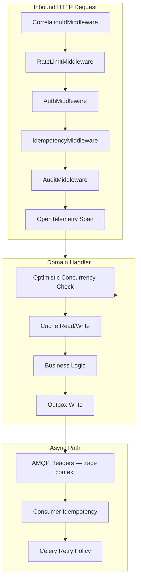
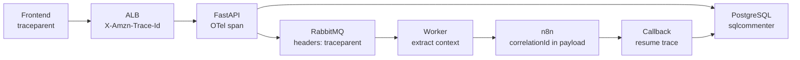
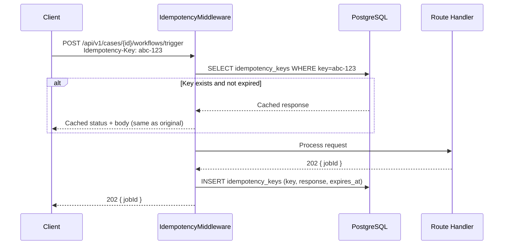
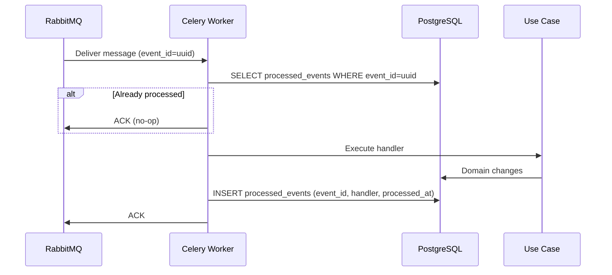
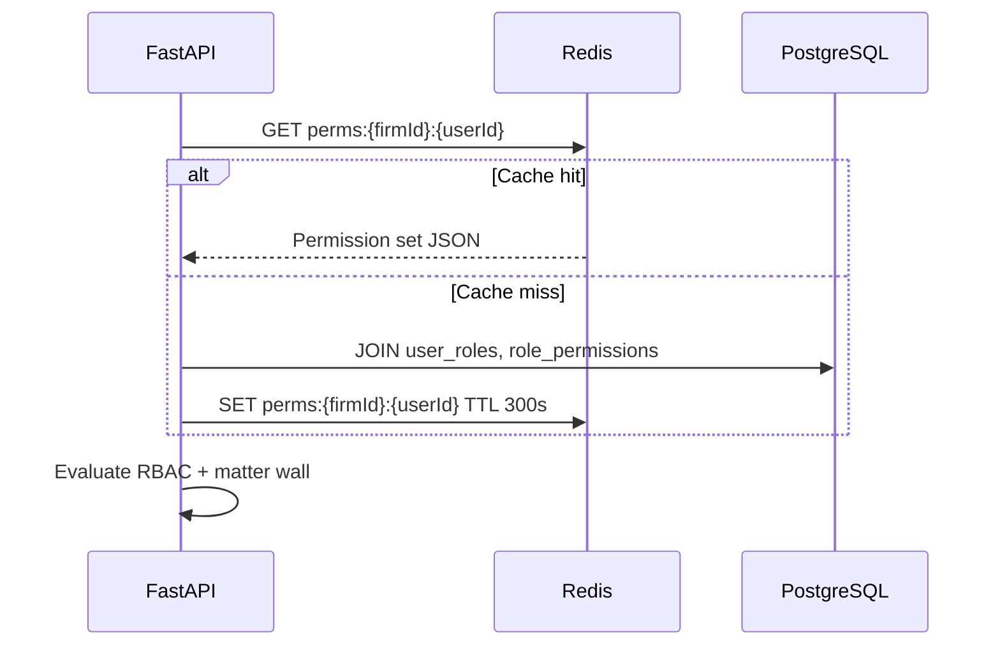
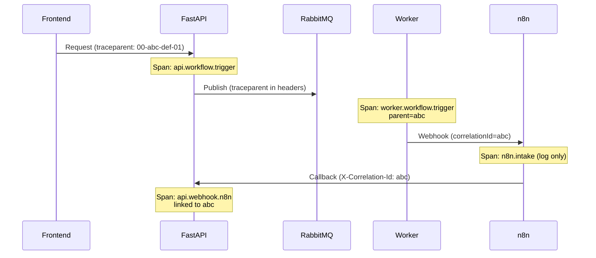
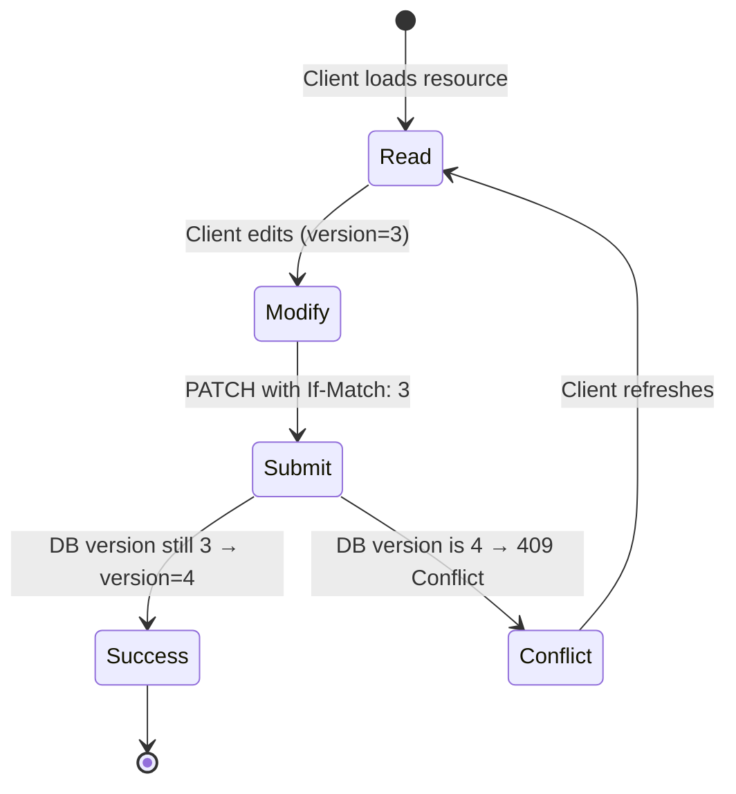

# Cross-Cutting Concerns

**LexFlow AI** — Idempotency, Caching, Tracing & Platform Patterns  
**Version:** 1.0  
**Status:** Draft — Pre-Implementation  
**Last Updated:** 2026-07-06

---

## Purpose

This document defines **platform-wide patterns** that span all bounded contexts and runtime containers — idempotency, caching, distributed tracing, structured logging, retry policies, optimistic concurrency, rate limiting, and audit. These concerns are implemented once in `services/shared/` and middleware, then consumed consistently across sync and async paths.

---

## Scope

| In Scope | Out of Scope |
|----------|--------------|
| Idempotency key handling (API and consumer) | Per-endpoint rate limit values |
| Redis caching strategy and TTLs | CloudWatch dashboard JSON |
| OpenTelemetry trace propagation | Log aggregation pipeline Terraform |
| Retry and DLQ policies | Feature flag vendor selection |
| Optimistic concurrency (ETags) | PII redaction regex implementation |

---

## Responsibilities

| Concern | Owner Component | Applies To |
|---------|----------------|------------|
| **Idempotency** | API middleware + worker dedup table | All mutating POST/PUT/PATCH; all queue consumers |
| **Caching** | Redis via shared cache client | Permissions, reference data, read-heavy queries |
| **Distributed Tracing** | OpenTelemetry SDK + ADOT sidecar | Frontend → API → Queue → Worker → n8n callback |
| **Structured Logging** | Shared logging processor | All containers |
| **Retry** | Celery config + n8n HTTP nodes | Transient failures only |
| **Optimistic Concurrency** | Domain aggregates + API ETag middleware | Cases, Documents, Tasks |
| **Rate Limiting** | Redis sliding window middleware | Per-user, per-firm API limits |
| **Audit** | Audit middleware + domain hooks | All mutations and sensitive reads |
| **Correlation** | CorrelationIdMiddleware | All HTTP and AMQP messages |

---

## Architecture

### Cross-Cutting Concern Map



### Trace Propagation Topology



---

## Flow Diagrams

### Idempotency — API Request



### Idempotency — Queue Consumer



### Caching — Permission Resolution



### Distributed Tracing — End-to-End Span



### Optimistic Concurrency



---

## Concern Specifications

### Idempotency

| Layer | Mechanism | TTL / Scope |
|-------|-----------|-------------|
| **HTTP API** | `Idempotency-Key` header → `shared.idempotency_keys` table | 24 hours |
| **Workflow executions** | `idempotency_key` column on `workflow_executions` | Per unique user action |
| **Queue consumers** | `processed_events(event_id, handler_name)` | 30 days |
| **n8n callbacks** | `execution_id` + `step_id` composite key | Permanent (audit) |

**Required on:** All `POST` endpoints that trigger async work, payment-adjacent operations, and external integrations.

### Caching

| Cache Key Pattern | Data | TTL | Invalidation |
|-------------------|------|-----|--------------|
| `perms:{firmId}:{userId}` | Permission set | 5 min | Role change event |
| `case:{caseId}:summary` | Case detail (partial) | 60s | Case update event |
| `firm:{firmId}:config` | Firm settings | 15 min | Admin config change |
| `ref:practice_areas` | Reference data | 1 hour | Deploy / admin update |
| `secrets:{key}:cache` | Secrets Manager values | 5 min | Rotation event |

**Rules:**
- Cache is **never** authoritative — always fall back to PostgreSQL.
- Matter-wall-sensitive data uses short TTL or bypass cache.
- Redis outage degrades to direct DB reads — no availability impact.

### Distributed Tracing

| Attribute | Set On | Purpose |
|-----------|--------|---------|
| `service.name` | All spans | Container identification |
| `correlationId` | All spans | Business correlation |
| `userId` | API and worker spans | User attribution |
| `firmId` | All spans | Tenant isolation in queries |
| `caseId` | When applicable | Matter-level drill-down |
| `workflowExecutionId` | Workflow spans | Automation tracing |

**Sampling:** 10% production (100% on errors); 100% staging/dev.

**Backend:** ADOT sidecar → AWS X-Ray + CloudWatch Application Signals.

### Retry Policies

| Component | Max Retries | Backoff | DLQ |
|-----------|-------------|---------|-----|
| Celery tasks (transient) | 5 | Exponential 2^n, max 300s | Yes |
| Celery tasks (permanent) | 0 | — | Immediate DLQ |
| Outbox publisher | 5 | Exponential, 1s base | status=failed + alert |
| n8n HTTP nodes | 3 | Fixed 5s | Error branch → callback with failure |
| LLM provider | 2 | 1s, 3s | Circuit breaker opens |

### Rate Limiting

| Scope | Limit | Window | Storage |
|-------|-------|--------|---------|
| Per user | 300 requests | 1 minute | Redis sliding window |
| Per firm | 5,000 requests | 1 minute | Redis |
| Auth endpoints | 10 attempts | 1 minute | Redis |
| AI endpoints | 20 requests | 1 minute | Redis (cost control) |

Response: `429 Too Many Requests` with `Retry-After` header.

### Structured Logging

```json
{
  "timestamp": "2026-07-06T08:00:00.123Z",
  "level": "INFO",
  "service": "api",
  "message": "Workflow triggered",
  "correlationId": "550e8400-e29b-41d4-a716-446655440000",
  "userId": "user-uuid",
  "firmId": "firm-uuid",
  "caseId": "case-uuid",
  "duration_ms": 45
}
```

**PII redaction:** Passwords, tokens, SSN, full document content, LLM prompt/response bodies.

### Audit

| Trigger | Audit Action | Actor Type |
|---------|-------------|------------|
| Case create/update | `case.created`, `case.updated` | `user` |
| Document view (privileged) | `document.viewed` | `user` |
| Workflow trigger | `workflow.triggered` | `user` |
| Worker processing | `document.processed` | `worker` |
| n8n callback | `workflow.step_completed` | `n8n` |
| AI generation | `ai.summary_generated` | `worker` |

Audit log is **append-only** — no UPDATE/DELETE for application roles.

---

## Best Practices

1. **Generate correlation ID at edge** — Middleware creates if absent; never reuse across unrelated operations.
2. **Idempotency keys are client-generated UUIDs** — Server rejects malformed keys (400).
3. **Cache permission sets, not authorization decisions** — Matter wall checks always evaluate fresh against case participants.
4. **Propagate trace context through AMQP headers** — Never rely solely on payload fields.
5. **Classify errors as transient vs permanent** — Only transient errors retry; permanent go to DLQ immediately.
6. **Use ETags for all mutable aggregates** — Return `ETag: {version}` on GET; require `If-Match` on PATCH.
7. **Audit reads of privileged documents** — Not just mutations.
8. **Feature flags for gradual rollout** — Cross-cutting middleware checks flags before enabling new paths.

---

## Tradeoffs

| Decision | Benefit | Cost |
|----------|---------|------|
| DB-backed idempotency vs Redis | Durable across Redis failover | Additional PostgreSQL writes |
| 5-minute permission cache | 80%+ reduction in permission JOINs | Stale permissions up to 5 min — mitigated by event invalidation |
| 10% trace sampling | Lower observability overhead | May miss intermittent issues — 100% on errors |
| Sliding window rate limit | Accurate burst control | Redis dependency for limits |
| Append-only audit | Compliance integrity | Storage growth — partitioned by month |
| correlationId separate from traceId | Business-friendly support queries | Two identifiers to propagate |

---

## Future Improvements

| Phase | Enhancement |
|-------|-------------|
| Phase 2 | Automatic cache invalidation via domain event subscriptions |
| Phase 2 | Request coalescing for duplicate in-flight idempotency keys |
| Phase 3 | eBPF-based network tracing for n8n → external calls |
| Phase 3 | Adaptive rate limits based on firm tier |
| Phase 4 | Audit log cryptographic chaining (tamper evidence) |
| Phase 4 | Full OpenTelemetry metrics exemplars linked to traces |

---

## References

| Document | Description |
|----------|-------------|
| [README.md](./README.md) | Architecture folder index |
| [data-flow.md](./data-flow.md) | Sync/async paths using these concerns |
| [event-driven-design.md](./event-driven-design.md) | Consumer idempotency, DLQ |
| [../observability.md](../observability.md) | Logging, tracing, metrics detail |
| [../api-architecture.md](../api-architecture.md) | Idempotency-Key, ETag conventions |
| [../database-architecture.md](../database-architecture.md) | idempotency_keys, audit_logs schema |
| [../security-architecture.md](../security-architecture.md) | Rate limiting, audit controls |
| [../authentication-authorization.md](../authentication-authorization.md) | Permission resolution |
| [nfr-requirements.md](./nfr-requirements.md) | Scale targets for caching and tracing |
