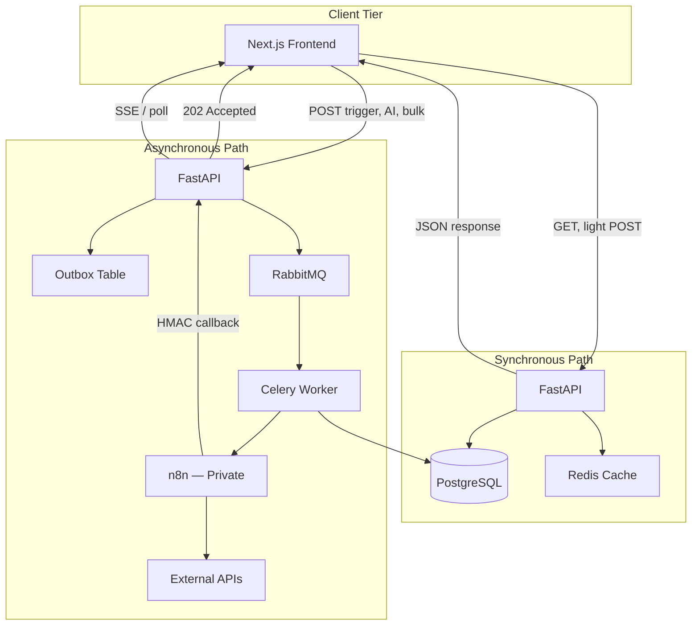
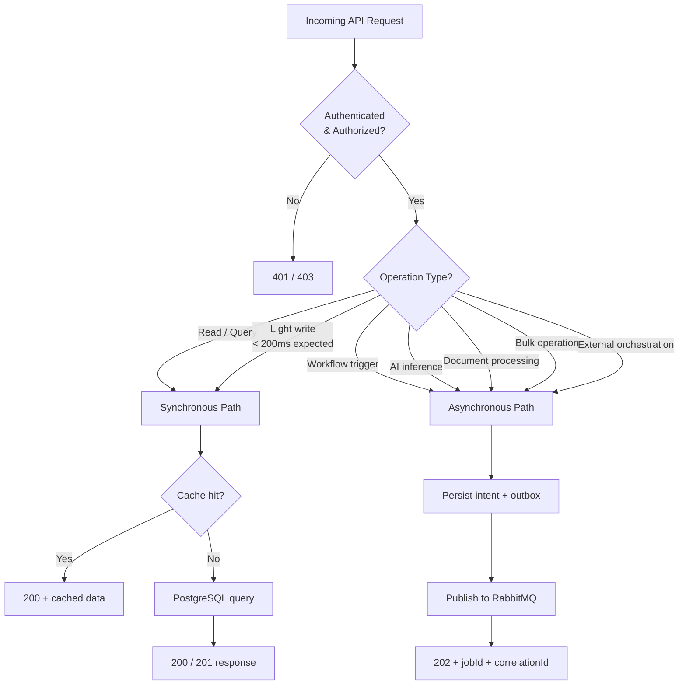
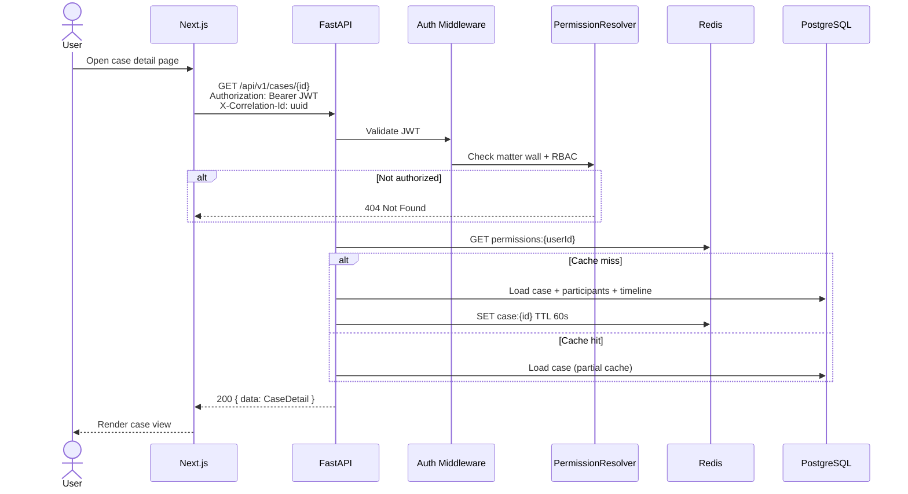
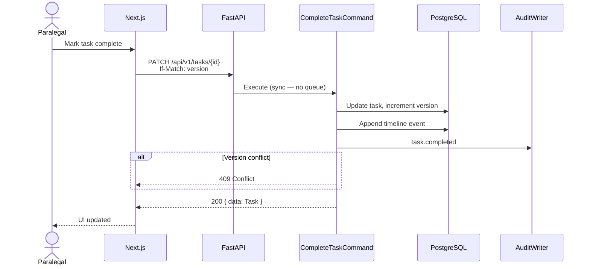
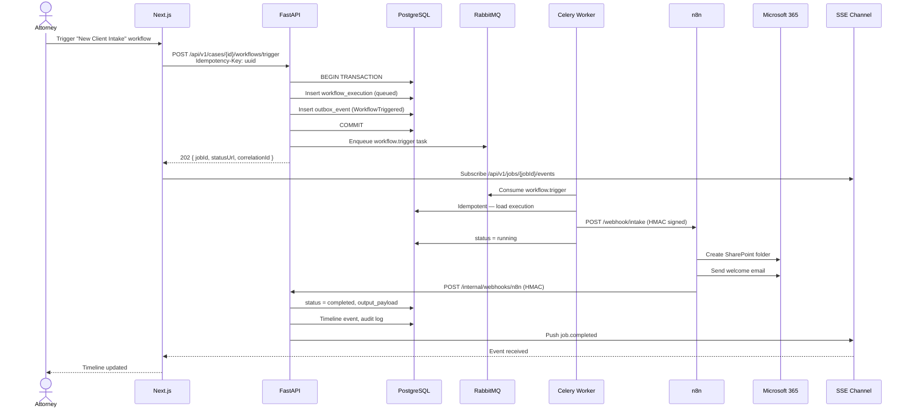
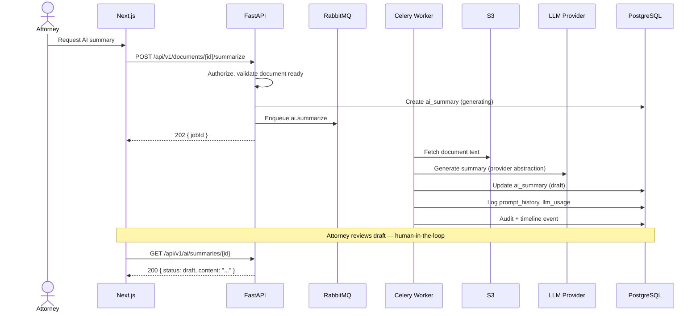
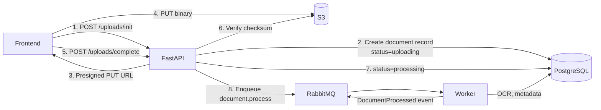
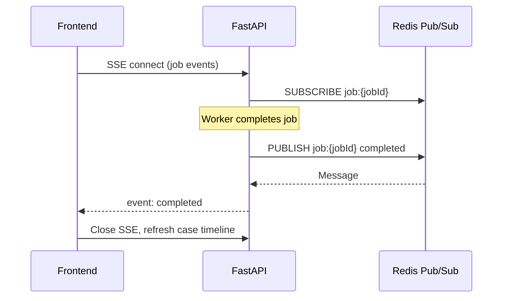

# Data Flow Architecture

**LexFlow AI** — Synchronous & Asynchronous Paths  
**Version:** 1.0  
**Status:** Draft — Pre-Implementation  
**Last Updated:** 2026-07-06

---

## Purpose

This document describes **how data moves through LexFlow AI** — distinguishing synchronous paths (immediate user feedback) from asynchronous paths (automation, AI, workflows). It defines the canonical pipeline:

```
Frontend → FastAPI → Queue → Worker → n8n → External
```

All paths enforce authentication and authorization at FastAPI before any domain handler executes.

---

## Scope

| In Scope | Out of Scope |
|----------|--------------|
| Sync read/write request flows | Database query optimization |
| Async job lifecycle (202 → completion) | n8n workflow node graphs |
| Real-time update delivery (SSE/WebSocket) | Frontend state management internals |
| Document upload flow (presigned S3) | CDN cache invalidation rules |
| AI inference async pipeline | LLM prompt templates |

---

## Responsibilities

| Path Type | When Used | Response Pattern | Authority |
|-----------|-----------|------------------|-----------|
| **Synchronous** | Reads, lightweight writes, auth, config | 200/201 immediate JSON | FastAPI + PostgreSQL/Redis |
| **Asynchronous** | Workflows, AI, OCR, bulk ops, notifications | 202 + job polling/SSE | FastAPI initiates; Worker executes |
| **Callback** | n8n completion, external webhooks | Internal HMAC endpoint | FastAPI persists final state |
| **Real-time push** | Job completion, notifications | SSE/WebSocket/polling | FastAPI → Frontend |

### Path Ownership Rules

| Rule | Enforcement |
|------|-------------|
| Frontend never calls n8n, RabbitMQ, or workers | Network + no credentials in browser |
| Frontend never calls LLM providers | No API keys client-side |
| All mutations audited | Audit middleware + domain handlers |
| Async jobs return correlation ID | Middleware generates if absent |
| n8n never writes to PostgreSQL | Architecture + no DB credentials in n8n |

---

## Architecture

### Dual-Path Overview



### Path Selection Decision Tree



---

## Flow Diagrams

### Synchronous Path — Case Detail Read



### Synchronous Path — Lightweight Write



### Asynchronous Path — Workflow Trigger (Canonical)



### Asynchronous Path — AI Document Summary



### Document Upload Data Flow



---

## Real-Time Update Patterns

| Pattern | Use Case | Implementation |
|---------|----------|----------------|
| **SSE** | Job status, notifications | `GET /api/v1/jobs/{id}/events` — preferred |
| **WebSocket** | Bidirectional case collaboration (Phase 2) | FastAPI WebSocket endpoint |
| **Polling** | Fallback for restrictive proxies | `GET /api/v1/jobs/{id}` every 3s with backoff |



---

## Data Flow Classification

| Flow | Classification | Encryption | Retention |
|------|----------------|------------|-----------|
| Case metadata (sync) | Confidential | TLS in transit, RDS at rest | Per case lifecycle |
| Document binary (S3) | Privileged | SSE-KMS | 7+ years post-close |
| AI prompt/response (async) | Work product | TLS + optional field encryption | 3 years (prompt_history) |
| Workflow payload (queue) | Confidential | TLS (AMQP), no PII in headers | Transient — 7 day TTL |
| n8n callback payload | Confidential | HMAC + TLS | Persisted in workflow_executions |
| Audit entries | Compliance | Append-only, immutable | 7 years minimum |

---

## Best Practices

1. **Default to async for anything > 500ms** — Protect API latency percentiles and user experience.
2. **Return 202 with status URL** — Never block HTTP on LLM or external API calls.
3. **Propagate correlation ID end-to-end** — Frontend generates or accepts `X-Correlation-Id`; workers and n8n include it.
4. **Idempotency-Key on all async triggers** — Prevents duplicate workflow executions from double-clicks.
5. **Presigned S3 uploads** — Binary data never transits API containers.
6. **Human-in-the-loop gate before external send** — AI drafts stay internal until attorney approval.
7. **Matter wall check before every data flow** — Even async workers verify case access for triggered_by user.

---

## Tradeoffs

| Decision | Benefit | Cost |
|----------|---------|------|
| 202 + polling/SSE vs WebSocket everywhere | Simpler infra, proxy-friendly | Slight delay vs push-native WS |
| Outbox + direct enqueue | Faster worker pickup for urgent tasks | Dual publish path — must stay consistent |
| Sync path for light writes | Immediate UI feedback | Risk of scope creep — monitor p95 latency |
| n8n in async path only | Clean security boundary | Additional hop vs direct Graph API from worker |
| S3 presigned upload | Scales to large files | Client must handle upload retry |

---

## Future Improvements

| Phase | Enhancement |
|-------|-------------|
| Phase 2 | WebSocket for collaborative case editing |
| Phase 2 | GraphQL subscriptions for real-time dashboards |
| Phase 3 | Change Data Capture (CDC) for analytics pipeline |
| Phase 3 | Priority lanes — urgent deadline workflows preempt bulk jobs |
| Phase 4 | Event-driven read model projection for sub-100ms search |

---

## References

| Document | Description |
|----------|-------------|
| [README.md](./README.md) | Architecture folder index |
| [system-context.md](./system-context.md) | C4 Level 1 |
| [container-architecture.md](./container-architecture.md) | C4 Level 2 |
| [component-architecture.md](./component-architecture.md) | C4 Level 3 |
| [event-driven-design.md](./event-driven-design.md) | Outbox and RabbitMQ detail |
| [cross-cutting-concerns.md](./cross-cutting-concerns.md) | Idempotency, tracing |
| [../api-architecture.md](../api-architecture.md) | REST conventions, 202 pattern |
| [../ai-architecture.md](../ai-architecture.md) | AI async pipeline |
| [../workflow-orchestration.md](../workflow-orchestration.md) | n8n webhook contracts |
| [../13-decisions/004-async-ai-processing.md](../13-decisions/004-async-ai-processing.md) | Async AI decision |
