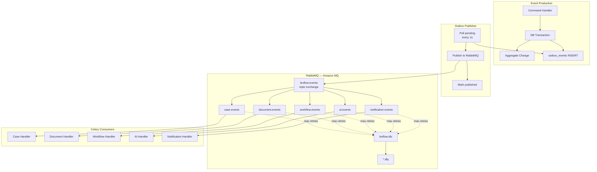
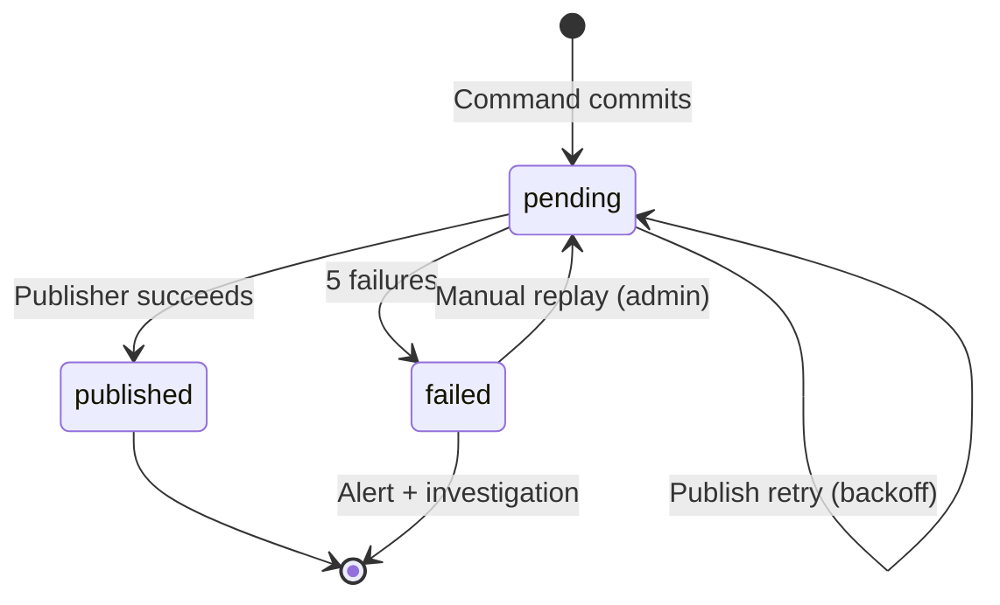
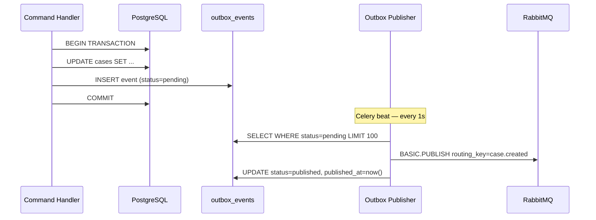
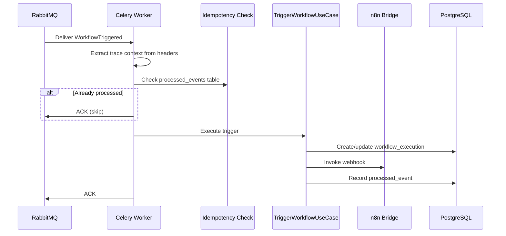
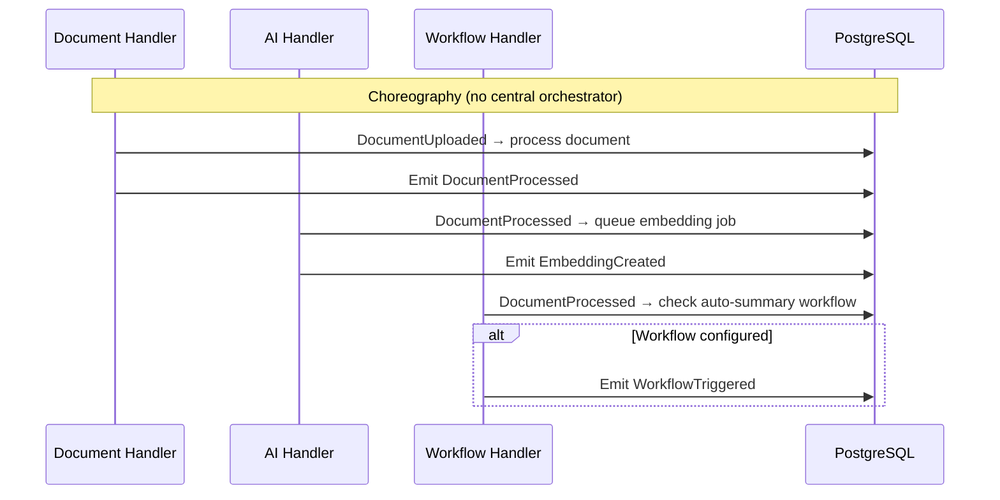
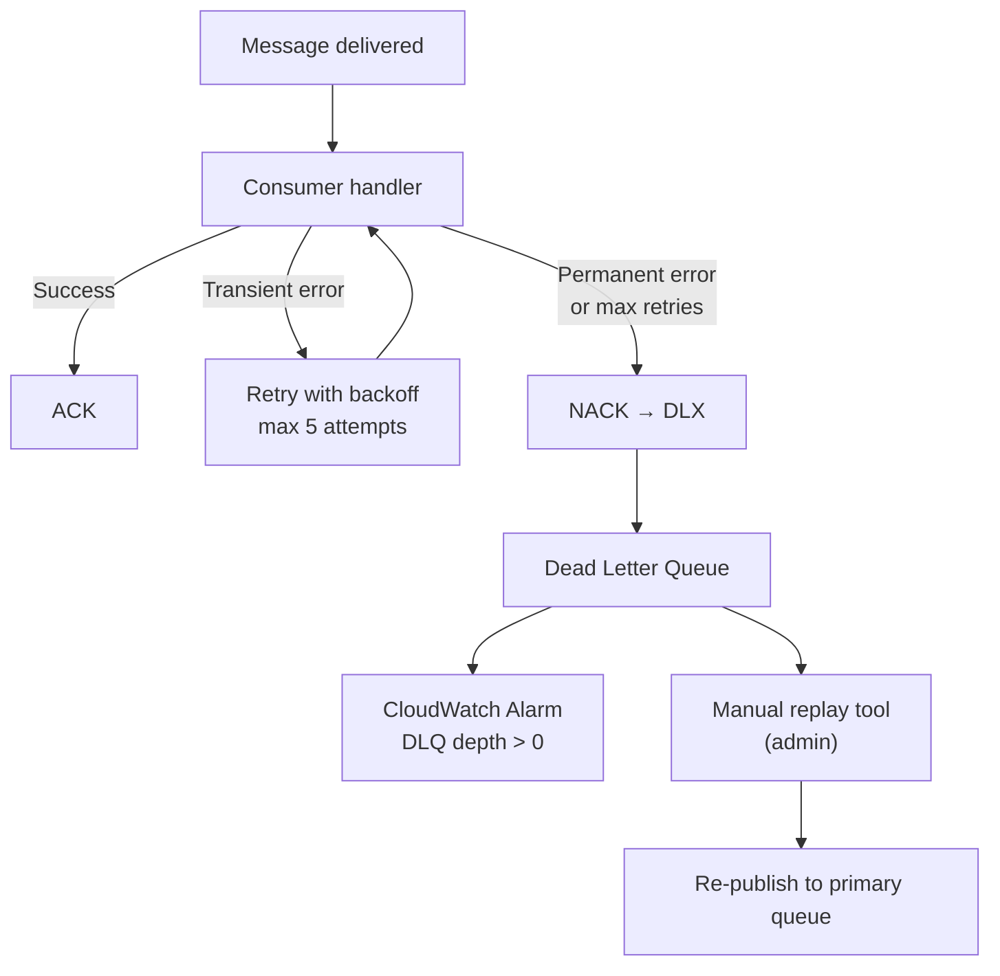
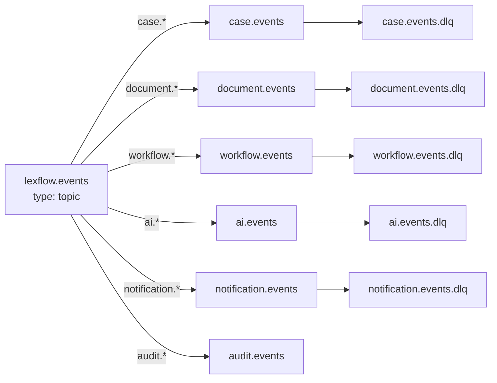
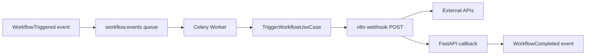

# Event-Driven Design

**LexFlow AI** — Outbox Pattern, RabbitMQ & Domain Events  
**Version:** 1.0  
**Status:** Draft — Pre-Implementation  
**Last Updated:** 2026-07-06

---

## Purpose

This document defines the **event-driven architecture** for LexFlow AI — how domain events are produced reliably, routed through RabbitMQ, consumed by Celery workers, and coordinated across bounded contexts. The transactional **outbox pattern** ensures at-least-once delivery without dual-write inconsistencies.

---

## Scope

| In Scope | Out of Scope |
|----------|--------------|
| Outbox table design and publisher lifecycle | Full event catalog payloads (see event-driven-architecture.md) |
| RabbitMQ exchange, queue, DLQ topology | Amazon MQ broker sizing Terraform |
| Consumer idempotency and retry policies | Saga compensation implementation code |
| Event routing keys and naming conventions | Frontend event subscription |
| Integration with n8n trigger path | Kafka / Kinesis alternatives |

---

## Responsibilities

| Component | Responsibility |
|-----------|----------------|
| **Command Handlers** | Persist aggregate change + outbox row in single DB transaction |
| **Outbox Publisher** | Poll pending events, publish to RabbitMQ, mark published |
| **RabbitMQ** | Durable routing, DLQ, priority queues |
| **Event Handlers (Workers)** | Idempotent consumption, invoke application use cases |
| **Workflow Orchestration** | Translate `WorkflowTriggered` events to n8n invocations |
| **Audit & Compliance** | Subscribe to all domain events for immutable audit stream |

### Delivery Guarantees

| Guarantee | Mechanism |
|-----------|-----------|
| **At-least-once delivery** | Outbox + durable queues + consumer ACK after processing |
| **Ordering (per aggregate)** | Single queue partition key = aggregate_id (Phase 2) |
| **No lost events** | Outbox persisted in same transaction as domain change |
| **Poison message isolation** | DLQ after max retries + alerting |

---

## Architecture

### Event Pipeline Overview



### Outbox State Machine



---

## Flow Diagrams

### Transactional Outbox — Write Path



### Event Consumption — Workflow Triggered



### Saga Pattern — Document Upload to AI Summary



### Dead Letter Queue Flow



---

## RabbitMQ Topology

### Exchange and Queue Layout



### Queue Configuration

| Property | Value | Rationale |
|----------|-------|-----------|
| Durable | `true` | Survive broker restart |
| Auto-delete | `false` | Queues are permanent infrastructure |
| Message TTL | 7 days | Prevent unbounded growth |
| Max length | 100,000 | Backpressure signal at 80% |
| Dead letter exchange | `lexflow.dlx` | Poison message isolation |
| Prefetch count | 10 per consumer | Balance throughput and fairness |
| Delivery mode | Persistent | Survive broker crash |

### Routing Key Convention

```
{domain}.{action}

Examples:
  case.created
  case.status_changed
  document.uploaded
  document.processed
  workflow.triggered
  workflow.completed
  ai.summary_generated
  notification.dispatch_requested
  audit.entry_recorded
```

---

## Event Catalog Summary

| Domain | Key Events | Primary Consumers |
|--------|------------|-------------------|
| **Case** | `CaseCreated`, `TaskCompleted`, `DeadlineApproaching` | Workflow, Notification, Timeline, Audit |
| **Document** | `DocumentUploaded`, `DocumentProcessed` | AI (embeddings), Workflow, Timeline |
| **Workflow** | `WorkflowTriggered`, `WorkflowCompleted`, `WorkflowFailed` | Notification, Timeline, Audit |
| **AI** | `SummaryGenerated`, `EmbeddingCreated` | Notification, Approval, Audit |
| **Notification** | `NotificationDispatchRequested` | Email, Teams, in-app channels |

Full payload schemas: [../event-driven-architecture.md](../event-driven-architecture.md).

---

## Outbox Table Schema

| Column | Type | Purpose |
|--------|------|---------|
| `id` | UUID PK | Event identifier |
| `aggregate_type` | VARCHAR | e.g., `Case`, `Document` |
| `aggregate_id` | UUID | Partition key for ordering |
| `event_type` | VARCHAR | e.g., `CaseCreated` |
| `payload` | JSONB | Serialized domain event |
| `status` | ENUM | `pending`, `published`, `failed` |
| `created_at` | TIMESTAMPTZ | Insert time |
| `published_at` | TIMESTAMPTZ | Publish confirmation |

**Index:** `(status, created_at) WHERE status = 'pending'`

See [../database-architecture.md](../database-architecture.md) for full schema context.

---

## n8n Integration via Events

n8n is **not** an event consumer. The Workflow Orchestration bounded context translates events to n8n webhook calls:



This preserves the rule: **n8n orchestrates HTTP; FastAPI owns state and events.**

---

## Best Practices

1. **Always outbox with domain writes** — Never publish to RabbitMQ outside a committed transaction.
2. **Idempotent consumers** — `processed_events(event_id)` table or natural key dedup.
3. **Small event payloads** — Include IDs and deltas; hydrate details in consumer if needed.
4. **Version event schemas** — `schemaVersion` field in payload; consumers handle N and N-1.
5. **Monitor DLQ depth** — Alert on any message in DLQ; zero tolerance in production.
6. **Propagate trace context in AMQP headers** — `traceparent`, `correlationId`.
7. **Choreography over orchestration** — Prefer domain events triggering peer handlers; reserve sagas for multi-step compensations.
8. **Never put business logic in n8n** — n8n reacts to decisions already made by FastAPI.

---

## Tradeoffs

| Decision | Benefit | Cost |
|----------|---------|------|
| Transactional outbox vs direct publish | Consistency guaranteed | Publisher lag (≤1s poll interval) |
| RabbitMQ vs SQS/SNS | Topic routing, priority, DLQ native | Higher operational cost (Amazon MQ) |
| At-least-once vs exactly-once | Simpler consumers with idempotency | Duplicate processing possible — must dedup |
| Choreography vs orchestrator saga | Loose coupling between contexts | Harder to visualize end-to-end flow |
| Celery vs raw aio-pika consumers | Mature retry, routing, monitoring | Heavier worker footprint |

---

## Future Improvements

| Phase | Enhancement |
|-------|-------------|
| Phase 2 | Per-aggregate ordering via consistent-hash exchange |
| Phase 2 | Event schema registry with compatibility checks in CI |
| Phase 3 | Outbox relay as dedicated sidecar (lower latency than beat poll) |
| Phase 3 | Saga orchestrator for multi-day approval workflows |
| Phase 4 | Event sourcing for Case aggregate (full replay capability) |
| Phase 4 | Analytics pipeline via CDC from outbox_events |

---

## References

| Document | Description |
|----------|-------------|
| [README.md](./README.md) | Architecture folder index |
| [data-flow.md](./data-flow.md) | Async path using events |
| [component-architecture.md](./component-architecture.md) | Event handlers per bounded context |
| [../event-driven-architecture.md](../event-driven-architecture.md) | Full event catalog and saga detail |
| [../database-architecture.md](../database-architecture.md) | outbox_events schema |
| [../workflow-orchestration.md](../workflow-orchestration.md) | n8n trigger from workflow events |
| [cross-cutting-concerns.md](./cross-cutting-concerns.md) | Idempotency and tracing |
| [../13-decisions/006-transactional-outbox.md](../13-decisions/006-transactional-outbox.md) | Outbox ADR |
| [../observability.md](../observability.md) | Queue depth metrics and alerting |
