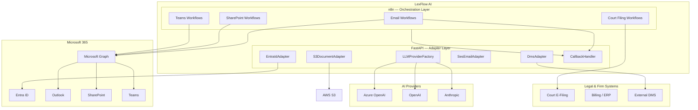
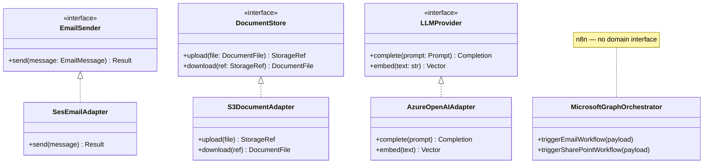
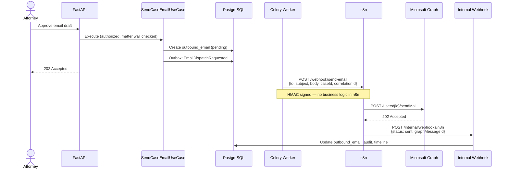
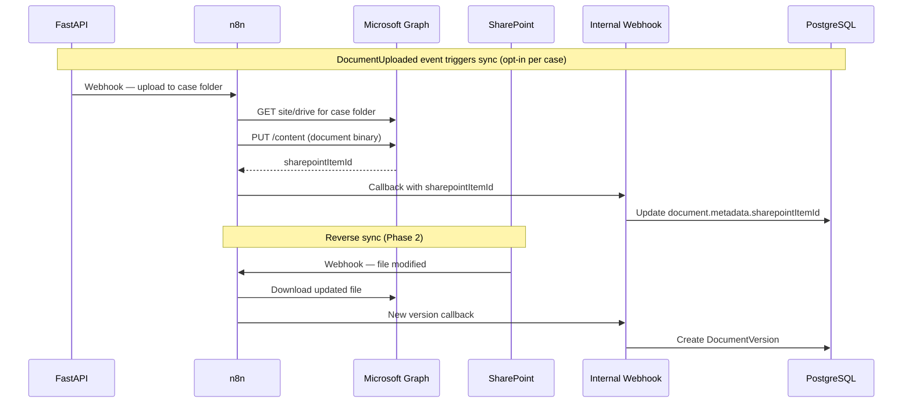
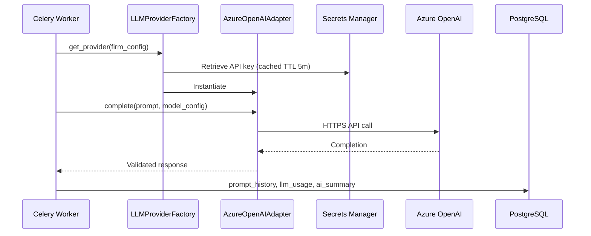
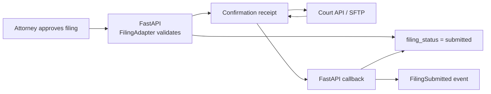
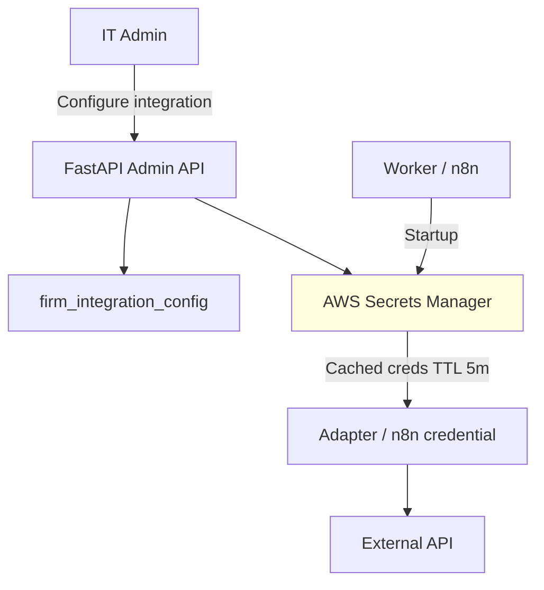

# Integration Patterns

**LexFlow AI** — Adapters, Microsoft 365 & External Systems  
**Version:** 1.0  
**Status:** Draft — Pre-Implementation  
**Last Updated:** 2026-07-06

---

## Purpose

This document defines **how LexFlow AI integrates with external systems** using the adapter pattern in FastAPI (business logic and credentials) and n8n (HTTP orchestration). It establishes clear boundaries for Microsoft 365, AI providers, court systems, billing, and document management platforms.

**Core principle:** FastAPI adapters own authorization decisions and data mapping; n8n executes approved HTTP sequences without business rules.

---

## Scope

| In Scope | Out of Scope |
|----------|--------------|
| Adapter pattern structure and responsibilities | Microsoft Graph API reference documentation |
| Microsoft 365 integration phases | OAuth consent UI wireframes |
| Credential management via Secrets Manager | Per-court API specifications |
| n8n vs FastAPI integration split | Vendor contract negotiations |
| Retry, circuit breaker, and callback patterns | n8n workflow JSON internals |

---

## Responsibilities

### Integration Tier Responsibilities

| Tier | Integrations | Owns |
|------|-------------|------|
| **FastAPI Adapters** | LLM providers, S3, SES, Entra ID, DMS read/write | Business rules, data mapping, credential retrieval, audit |
| **n8n Orchestrator** | Microsoft Graph, court e-filing, billing webhooks | HTTP sequencing, retries, payload transforms |
| **FastAPI Internal Webhooks** | n8n callbacks, external system callbacks | HMAC verification, state persistence, event emission |

### Adapter Pattern Layers

| Layer | Responsibility |
|-------|----------------|
| **Port (Interface)** | Domain-defined contract — `EmailSender`, `DocumentStore`, `LLMProvider` |
| **Adapter (Infrastructure)** | Concrete implementation — `MicrosoftGraphEmailAdapter`, `S3DocumentStore` |
| **Facade (Application)** | Use case selects adapter via factory based on firm configuration |
| **Orchestration (n8n)** | Executes pre-approved HTTP step sequences from signed payloads |

---

## Architecture

### Integration Landscape

### Adapter Pattern — Structural View

---

## Flow Diagrams

### Microsoft 365 — Send Case Email via n8n

### Microsoft 365 — SharePoint Document Sync

### LLM Provider — Direct FastAPI Adapter

### Court E-Filing — Adapter + n8n (Phase 4)

---

## Microsoft 365 Integration Phases

| Phase | Capability | Orchestrated By | Auth Model |
|-------|------------|-----------------|------------|
| **Phase 2** | Send email, Teams notification | n8n | App-only (client credentials) |
| **Phase 2** | SharePoint folder create/upload | n8n | App-only |
| **Phase 2** | Calendar event for hearings | n8n | Delegated (user context) |
| **Phase 3** | Entra ID SSO | FastAPI adapter | OIDC authorization code |
| **Phase 3** | Inbox intake (new matter emails) | n8n (scheduled) | App-only + firm mailbox |
| **Phase 3** | Bidirectional SharePoint sync | n8n + callbacks | App-only + webhooks |

### Microsoft Graph Scope Matrix

| Operation | Graph Permission | Adapter Location |
|-----------|-----------------|------------------|
| Send mail | `Mail.Send` | n8n workflow |
| Read mail | `Mail.Read` | n8n scheduled workflow |
| Upload file | `Sites.ReadWrite.All` | n8n workflow |
| Teams message | `ChannelMessage.Send` | n8n workflow |
| User profile (SSO) | `openid`, `profile`, `email` | FastAPI EntraIdAdapter |

**Credentials:** `{firm-slug}-microsoft-graph` in AWS Secrets Manager.

---

## Integration Decision Matrix

| Criteria | FastAPI Adapter | n8n Orchestration |
|----------|-----------------|-------------------|
| Requires business rule evaluation | ✓ | ✗ |
| Needs matter wall / RBAC check | ✓ | ✗ |
| Multi-step HTTP with retries | ○ (prefer n8n) | ✓ |
| LLM / AI inference | ✓ | ✗ |
| Credential rotation via Secrets Manager | ✓ (both) | ✓ (both) |
| Long-running external polling | ○ | ✓ |
| Must appear in audit trail before call | ✓ | ✗ (callback records result) |
| Vendor has webhook callback | Callback to FastAPI | n8n receives, forwards to FastAPI |

---

## Credential & Configuration Management

| Secret Key Pattern | Used By | Rotation |
|-------------------|---------|----------|
| `{firm}-microsoft-graph` | n8n, FastAPI | 90 days automatic |
| `{firm}-openai-api-key` | FastAPI AI adapter | Manual on compromise |
| `{firm}-n8n-hmac-secret` | FastAPI ↔ n8n | 180 days |
| `{firm}-court-efiling` | n8n | Per court policy |

---

## Error Handling & Resilience

| Pattern | Application | Configuration |
|---------|-------------|---------------|
| **Retry with backoff** | n8n HTTP nodes, Celery tasks | 3 retries, exponential 2^n seconds |
| **Circuit breaker** | FastAPI LLM adapters | Open after 5 failures in 60s; half-open after 30s |
| **Timeout** | All external HTTP | Connect 5s, read 30s (LLM: 120s) |
| **Fallback provider** | LLM factory | Secondary provider if primary circuit open |
| **DLQ** | Failed integration events | RabbitMQ DLQ + PagerDuty alert |
| **Compensation** | Failed SharePoint upload | Mark document sync_status=failed; notify attorney |

---

## Best Practices

1. **Ports in domain, adapters in infrastructure** — Domain defines `EmailSender`; SES/Graph implementations are swappable.
2. **Firm-configurable integrations** — No hard-coded vendor endpoints; config in `firm_integration_config`.
3. **Never store credentials in n8n JSON repo** — Reference Secrets Manager credential IDs only.
4. **Signed payloads to n8n** — HMAC over body; include `correlationId`, `firmId`, `caseId`, `approvedBy`.
5. **Callbacks always through internal webhook** — n8n never writes directly to PostgreSQL.
6. **Audit before and after external calls** — `integration.invoked` and `integration.completed` audit entries.
7. **PII minimization in n8n payloads** — Send IDs and content references; n8n fetches content only when required.
8. **Test adapters with contract tests** — Mock external APIs; n8n workflows validated in staging sandbox.

---

## Tradeoffs

| Decision | Benefit | Cost |
|----------|---------|------|
| n8n for Microsoft 365 | Fast iteration on Graph workflows | Split debugging across two systems |
| Direct FastAPI for LLM | Centralized prompt governance | Workers bear latency and retry complexity |
| Adapter pattern vs inline HTTP | Testable, swappable integrations | Interface boilerplate per vendor |
| App-only Graph permissions | Service-level automation without user session | Broader permission scope — security review required |
| Opt-in SharePoint sync per case | Data minimization | Configuration overhead for attorneys |

---

## Future Improvements

| Phase | Enhancement |
|-------|-------------|
| Phase 2 | Microsoft 365 integration MVP — email, SharePoint, Teams |
| Phase 3 | Entra ID SSO replaces local auth |
| Phase 3 | Integration health dashboard per firm |
| Phase 4 | Court e-filing adapters per jurisdiction (federal, state) |
| Phase 4 | iManage / NetDocuments bidirectional DMS adapters |
| Phase 4 | Billing system real-time matter sync via event streaming |

---

## References

| Document | Description |
|----------|-------------|
| [README.md](./README.md) | Architecture folder index |
| [system-context.md](./system-context.md) | External system actors |
| [data-flow.md](./data-flow.md) | Async integration flows |
| [event-driven-design.md](./event-driven-design.md) | Integration events |
| [../integration-architecture.md](../integration-architecture.md) | Detailed integration catalog |
| [../workflow-orchestration.md](../workflow-orchestration.md) | n8n contracts and promotion |
| [../authentication-authorization.md](../authentication-authorization.md) | Entra ID roadmap |
| [../ai-architecture.md](../ai-architecture.md) | LLM adapter detail |
| [../security-architecture.md](../security-architecture.md) | Credential and network security |
| [../13-decisions/002-n8n-orchestration-only.md](../13-decisions/002-n8n-orchestration-only.md) | n8n boundary decision |
