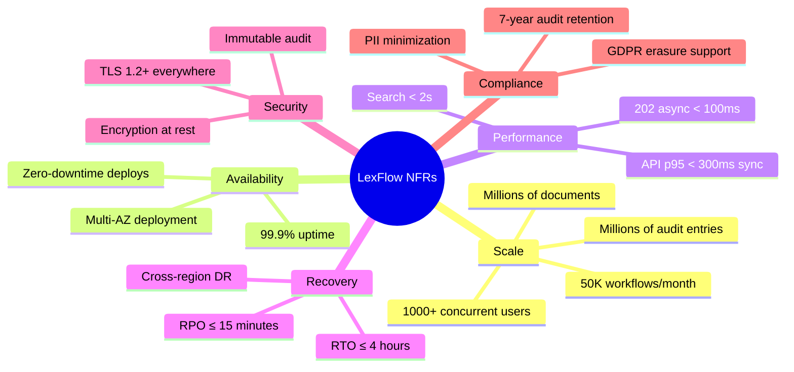
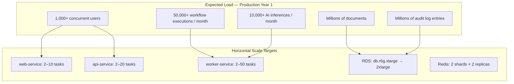
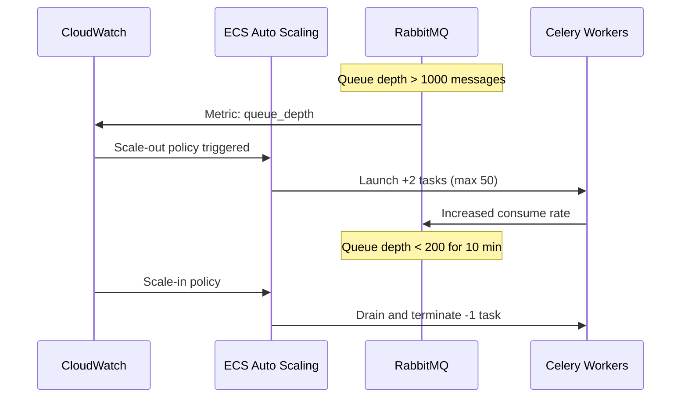
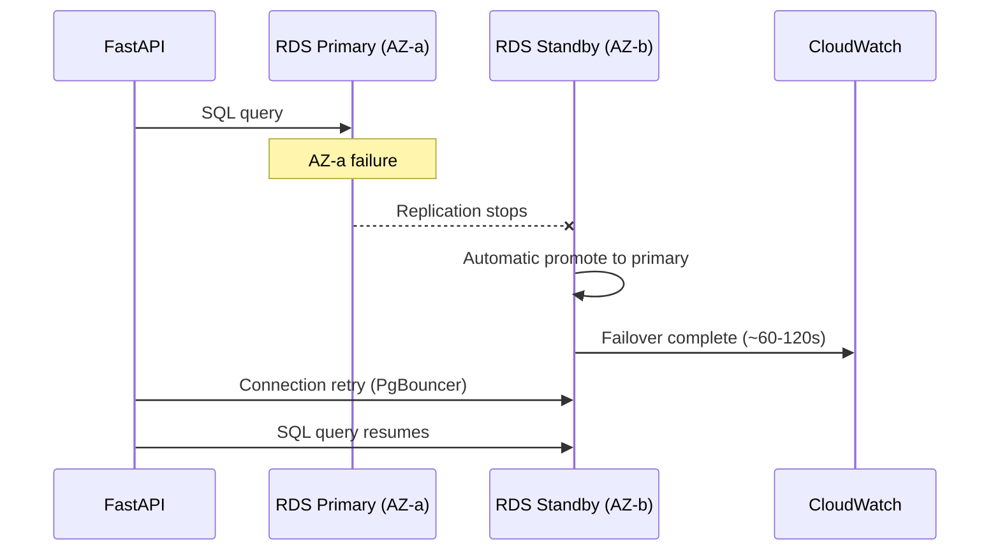
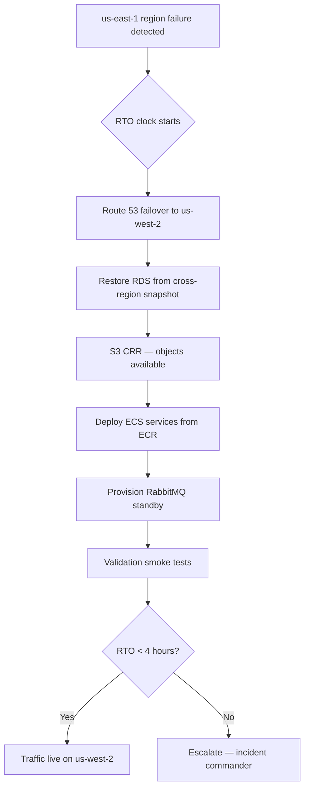
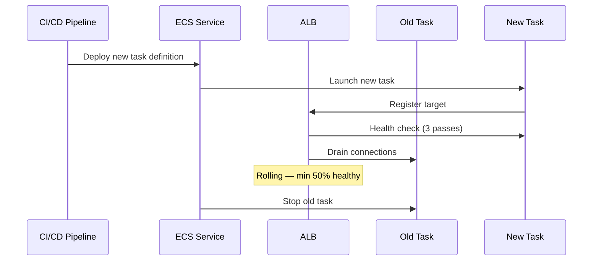
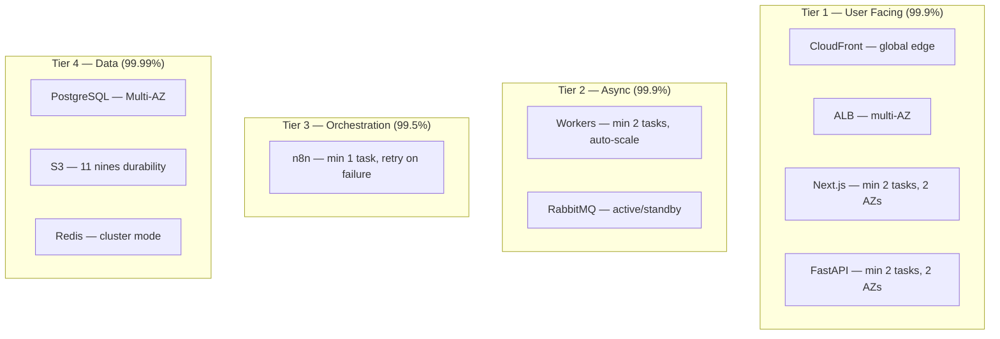

# Non-Functional Requirements

**LexFlow AI** — Scale, Availability, Disaster Recovery & Quality Attributes  
**Version:** 1.0  
**Status:** Draft — Pre-Implementation  
**Last Updated:** 2026-07-06

---

## Purpose

This document defines **non-functional requirements (NFRs)** for LexFlow AI — the quality attributes, capacity targets, availability objectives, and disaster recovery parameters that architecture and infrastructure must satisfy. These NFRs govern design decisions across all containers and bounded contexts.

---

## Scope

| In Scope | Out of Scope |
|----------|--------------|
| Capacity targets (users, workflows, documents) | Cost optimization spreadsheets |
| Availability and uptime objectives | SLA legal language |
| RPO/RTO disaster recovery targets | Insurance and liability terms |
| Performance latency budgets | Individual endpoint benchmarks (see testing-strategy) |
| Scalability and elasticity model | Vendor pricing negotiations |
| Security NFR summary | Full threat model (see security-architecture) |

---

## Responsibilities

| Role | NFR Responsibility |
|------|-------------------|
| **Solution Architect** | Validate designs meet NFR targets before approval |
| **Backend Engineer** | Implement latency budgets, idempotency, connection pooling |
| **DevOps / SRE** | Provision capacity, monitoring, alerting, DR runbooks |
| **QA / Performance Engineer** | Load test against targets in testing-strategy |
| **Security Team** | Verify security NFRs in security-architecture |
| **Product Owner** | Prioritize NFR tradeoffs when cost/conflict arises |

---

## Architecture

### NFR Quality Attribute Model

### Capacity Topology

---

## Flow Diagrams

### Scaling Response — Queue Depth

### HA Failover — RDS Multi-AZ

### DR Failover — Region Level

### Zero-Downtime Deployment

---

## NFR Targets

### Scale & Capacity

| Metric | Target | Measurement | Scaling Response |
|--------|--------|-------------|------------------|
| **Concurrent users** | 1,000+ | ALB active connections + session count | Scale web + api tasks |
| **Daily active users** | 3,000+ | Unique JWT subjects per 24h | — |
| **Workflow executions** | 50,000+ / month (~1,700/day) | `workflow_executions` count | Scale worker tasks on queue depth |
| **Peak workflow rate** | 200 / hour | Executions created per hour | Priority queue for urgent |
| **Documents stored** | Millions | S3 object count + `documents` rows | S3 unlimited; RDS read replicas |
| **Document upload size** | Up to 500 MB per file | S3 multipart upload | Presigned URL — bypasses API |
| **Audit log entries** | Millions (append-only) | `audit.audit_logs` count | Monthly partitioning |
| **AI inferences** | 10,000+ / month | `prompt_history` count | Dedicated `ai.inference` worker pool |
| **API requests** | 10M+ / month | ALB request count | Scale api tasks on CPU/p95 |

### Performance

| Operation | Target (p95) | Path | Notes |
|-----------|-------------|------|-------|
| Case list (paginated) | < 200ms | Sync | Cached permissions |
| Case detail | < 300ms | Sync | Timeline denormalized |
| Document metadata | < 200ms | Sync | — |
| Full-text search | < 2s | Sync | Read replica + tsvector |
| Semantic search | < 3s | Sync | pgvector HNSW |
| Workflow trigger | < 100ms (202) | Async | Persist + enqueue only |
| AI summary request | < 100ms (202) | Async | Worker bears LLM latency (30–120s total) |
| n8n callback processing | < 500ms | Internal | Persist + notify |
| Permission check | < 10ms | Sync | Redis cache hit |

### Availability

| Metric | Target |
|--------|--------|
| **Uptime** | 99.9% (≤ 8.76 hours downtime / year) |
| **Planned maintenance** | Zero-downtime rolling deploys only |
| **Unplanned failover — AZ** | < 2 minutes (ALB + RDS Multi-AZ) |
| **Unplanned failover — region** | < 4 hours (manual DR) |
| **Data durability** | 99.999999999% (11 nines — S3 + RDS) |

### Disaster Recovery

| Metric | Target | Implementation |
|--------|--------|----------------|
| **RPO** | ≤ 15 minutes | RDS continuous backup + transaction logs; S3 CRR real-time |
| **RTO** | ≤ 4 hours | Documented DR runbook; quarterly drill |
| **Backup frequency — RDS** | Continuous + daily snapshot | 35-day retention |
| **Backup frequency — S3** | Versioning + CRR | Cross-region us-east-1 → us-west-2 |
| **Backup frequency — RabbitMQ** | Daily (Amazon MQ) | 7-day retention |

### Security NFRs

| Requirement | Target |
|-------------|--------|
| Encryption in transit | TLS 1.2+ on all connections |
| Encryption at rest | RDS KMS, S3 SSE-KMS, ElastiCache encryption |
| Authentication | JWT with ≤ 15 min access token TTL |
| Authorization | RBAC + matter walls — 100% endpoint coverage |
| Audit coverage | 100% of mutations; privileged reads logged |
| n8n exposure | Zero public ingress |
| Secret storage | AWS Secrets Manager only — zero secrets in code/repo |
| Vulnerability patching | Critical CVEs within 72 hours |

### Compliance NFRs

| Requirement | Target |
|-------------|--------|
| Audit log retention | 7 years minimum |
| Case data retention | 7+ years post-close (configurable) |
| GDPR erasure | ≤ 30 days to complete erasure job |
| PII in logs | Zero — automated redaction |
| AI output audit | 100% of LLM calls logged with case linkage |

---

## Component HA Matrix

| Component | HA Strategy | Failure Impact | Mitigation |
|-----------|-------------|----------------|------------|
| CloudFront | Global edge | None | Automatic |
| ALB | Multi-AZ | None | Health-checked failover |
| ECS (web, api) | Min 2 tasks, 2 AZs | None for single task loss | ALB routing |
| ECS (worker) | Min 2, scale on depth | Queue backlog ~60s | Auto-scale policy |
| ECS (n8n) | Min 1, auto-restart | Workflow pause | Celery retry on timeout |
| RDS PostgreSQL | Multi-AZ sync replication | ~60–120s failover | PgBouncer reconnect |
| ElastiCache Redis | 2 shards × 2 replicas | Cache miss storm | Degrade to DB |
| Amazon MQ | Active/standby | ~30s failover | Durable queues |
| S3 | Cross-region replication | Transparent | CRR to us-west-2 |

---

## Load Testing Requirements

| Scenario | Target | Tool | Frequency |
|----------|--------|------|-----------|
| 1,000 concurrent users browsing | p95 < 300ms, 0% errors | k6 / Locust | Pre-release |
| 200 workflows / hour burst | Queue depth recovers < 10 min | k6 + custom | Pre-release |
| 100 concurrent document uploads | No API timeout | k6 | Quarterly |
| RDS failover during load | < 2 min recovery | Chaos engineering | Annual |
| Region DR drill | RTO < 4 hours | Manual runbook | Quarterly |

See [../testing-strategy.md](../testing-strategy.md).

---

## Monitoring & Alerting Thresholds

| Metric | Warning | Critical | Action |
|--------|---------|----------|--------|
| API p95 latency | > 500ms | > 1s | Scale api tasks |
| Error rate (5xx) | > 1% | > 5% | Page on-call |
| RabbitMQ queue depth | > 5,000 | > 20,000 | Scale workers |
| DLQ message count | > 0 | > 10 | Investigate immediately |
| RDS CPU | > 70% | > 85% | Scale instance class |
| RDS storage | > 70% | > 85% | Provision IOPS / storage |
| Redis memory | > 70% | > 85% | Add shard |
| ECS task health | < 100% healthy | < 50% healthy | Page on-call |
| n8n callback failures | > 5/hour | > 20/hour | Check n8n + external APIs |

See [../observability.md](../observability.md).

---

## Best Practices

1. **Design for horizontal scale first** — All application containers are stateless; scale out before scale up.
2. **Load test before every major release** — Validate against 1,000 user and 200 workflow/hour targets.
3. **Quarterly DR drills** — Measure actual RTO; update runbook with findings.
4. **Monthly partition management** — Audit and prompt_history tables partitioned by month.
5. **Connection pooling mandatory** — PgBouncer between all app tiers and RDS.
6. **Circuit breakers on external dependencies** — Prevent cascade failures at scale.
7. **Capacity planning review quarterly** — Compare actual growth vs projections; adjust auto-scale bounds.
8. **n8n retry as safety net** — Accept 99.5% n8n tier; workers implement timeout + retry.

---

## Tradeoffs

| Decision | Benefit | Cost |
|----------|---------|------|
| 99.9% vs 99.99% availability | Achievable with managed AWS services | ~8.76h downtime budget — n8n is weakest link |
| Multi-AZ vs multi-region active-active | Simpler, lower cost | 4-hour RTO for region failure |
| Scale workers on queue depth vs schedule | Cost-efficient — scale down overnight | Cold-start latency ~60s for new tasks |
| Single RDS vs sharded databases | Operational simplicity to 50K workflows/month | Vertical scaling ceiling ~Phase 4 |
| 10% trace sampling at scale | Lower observability cost | May miss rare latency outliers |
| n8n single instance (Phase 1) | Meets 50K workflows/month at lower ops cost | Brief automation pause on restart |

---

## Future Improvements

| Phase | NFR Enhancement |
|-------|-----------------|
| Phase 2 | Read replica routing — offload search and dashboards |
| Phase 2 | Dedicated worker pools — isolate AI from workflow latency |
| Phase 3 | n8n HA — 2+ instances, 99.9% orchestration tier |
| Phase 3 | Automated DR failover — Route 53 health check triggers runbook |
| Phase 4 | Multi-region active-passive with < 1 hour RTO |
| Phase 4 | 10,000+ concurrent users — extract services, RDS read fleet |
| Phase 4 | 500K workflows/month — evaluate dedicated workflow service |

---

## References

| Document | Description |
|----------|-------------|
| [README.md](./README.md) | Architecture folder index |
| [container-architecture.md](./container-architecture.md) | Container HA topology |
| [cross-cutting-concerns.md](./cross-cutting-concerns.md) | Caching, tracing at scale |
| [../high-level-architecture.md](../high-level-architecture.md) | Executive NFR summary |
| [../deployment-architecture.md](../deployment-architecture.md) | AWS, ECS, Terraform sizing |
| [../disaster-recovery.md](../disaster-recovery.md) | DR runbooks, RPO/RTO procedures |
| [../observability.md](../observability.md) | Metrics, alerting detail |
| [../security-architecture.md](../security-architecture.md) | Security NFR controls |
| [../testing-strategy.md](../testing-strategy.md) | Load test plans |
| [../compliance-data-governance.md](../compliance-data-governance.md) | Retention policies |
| [../database-architecture.md](../database-architecture.md) | Partitioning, indexing at scale |
