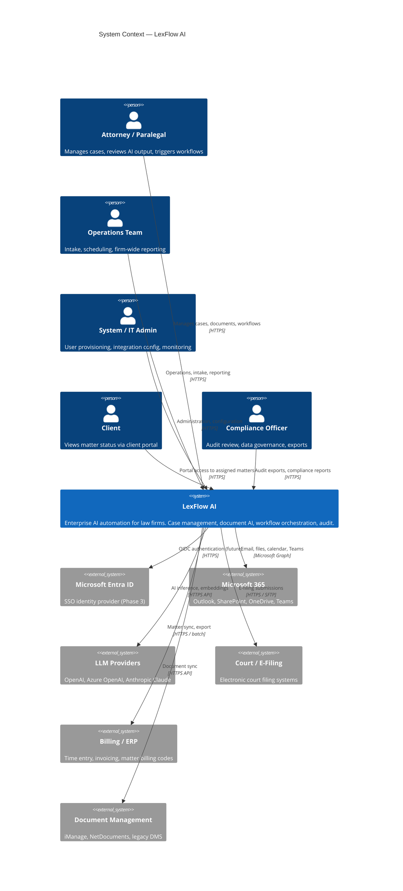
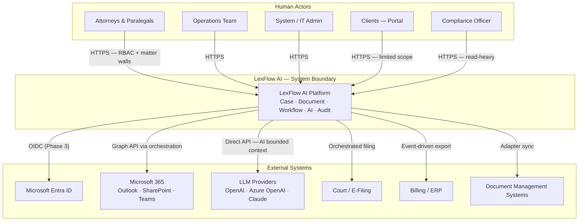
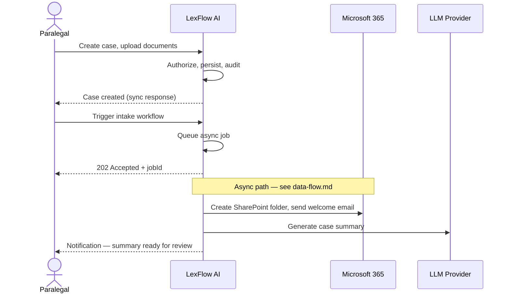
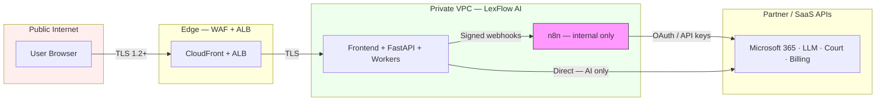

# System Context — C4 Level 1

**LexFlow AI** — Enterprise AI Automation Platform for Law Firms  
**Version:** 1.0  
**Status:** Draft — Pre-Implementation  
**Last Updated:** 2026-07-06

---

## Purpose

This document defines the **system context** for LexFlow AI at C4 Level 1. It identifies who uses the platform, which external systems it interacts with, and the high-level responsibilities of the LexFlow AI boundary. It is the entry point for stakeholder alignment, security scoping, and integration planning.

---

## Scope

| In Scope | Out of Scope |
|----------|--------------|
| Human actors and their goals | Internal container topology |
| External software systems and data exchange | API endpoint specifications |
| Trust boundaries and data classification at the perimeter | Network security group rules |
| Primary user journeys at context level | UI wireframes |

---

## Responsibilities

### LexFlow AI Platform (System Under Design)

| Responsibility | Owner |
|----------------|-------|
| Case and matter lifecycle management | LexFlow AI |
| Document ingestion, versioning, and AI-assisted analysis | LexFlow AI |
| Workflow orchestration triggers and state tracking | LexFlow AI |
| Role-based and matter-wall authorization | LexFlow AI |
| Immutable audit trail for legal compliance | LexFlow AI |
| Client portal for limited matter visibility | LexFlow AI |

### Explicitly External

| Responsibility | Owner |
|----------------|-------|
| Legal judgment and attorney work product decisions | Human attorneys |
| Authoritative court filing acceptance | Court / e-filing systems |
| Firm financial ledger of record | Billing / ERP |
| Identity provider directory (future) | Microsoft Entra ID |
| LLM model training and hosting | AI providers |

---

## Architecture

### C4 System Context Diagram

### Alternative Flowchart View

---

## Flow Diagrams

### Primary User Journey — Case Intake to Automation

### Trust Boundary Summary

---

## Actor Profiles

| Actor | Primary Goals | Access Pattern |
|-------|---------------|----------------|
| **Attorney / Paralegal** | Manage matters, review AI drafts, meet deadlines | Daily, high write volume on assigned cases |
| **Operations Team** | Intake, calendaring, firm dashboards | Daily, cross-case read, limited write |
| **System / IT Admin** | User provisioning, integration credentials, health | Weekly, admin APIs |
| **Client** | View status, upload requested documents | Occasional, portal-scoped |
| **Compliance Officer** | Audit trails, exports, retention verification | Periodic, read-only + export |

---

## Data Classification at the Perimeter

| Data Type | Classification | Crosses Boundary To |
|-----------|----------------|---------------------|
| Case metadata | Confidential — attorney-client | Internal only; billing export sanitized |
| Document binaries | Confidential — privileged | S3 (encrypted); optional SharePoint sync |
| AI prompts / responses | Confidential — work product | LLM providers under DPA; logged internally |
| Audit logs | Compliance — immutable | Internal; compliance export only |
| User credentials | Restricted | Entra ID (future); never to n8n or LLM |

---

## Best Practices

1. **Never expose n8n to users** — All human interaction terminates at LexFlow AI; n8n is invisible infrastructure.
2. **Treat 404 as authorization** — Matter walls mean unauthorized users see "not found," not "forbidden," at the API layer.
3. **Human-in-the-loop for client-facing AI** — Attorneys approve AI-generated content before external delivery.
4. **Firm-configurable integrations** — Each external system connection is opt-in per firm or per case.
5. **Audit every perimeter crossing** — External API calls initiated by LexFlow are logged with correlation IDs.

---

## Tradeoffs

| Decision | Benefit | Cost |
|----------|---------|------|
| Single platform boundary for all firm users | Unified audit, RBAC, matter walls | Large blast radius — mitigated by HA/DR design |
| n8n for Microsoft 365 orchestration | Rapid integration iteration without API deploys | Split observability — mitigated by correlation IDs |
| Direct LLM calls from FastAPI (not n8n) | Centralized prompt governance, metering, PII controls | API service bears LLM latency/retries in worker tier |
| Client portal in same system | Shared auth model, matter walls | Stricter security review for external users |

---

## Future Improvements

| Phase | Enhancement |
|-------|-------------|
| Phase 2 | Microsoft 365 deep integration — inbox intake, SharePoint sync |
| Phase 3 | Entra ID SSO replaces local credentials |
| Phase 3 | Multi-firm tenancy with firm-level system context diagrams |
| Phase 4 | Court e-filing adapters per jurisdiction |
| Phase 4 | Conflict-check system integration at intake |

---

## References

| Document | Description |
|----------|-------------|
| [README.md](./README.md) | Architecture folder index |
| [container-architecture.md](./container-architecture.md) | C4 Level 2 — internal containers |
| [../product-overview.md](../product-overview.md) | Vision, users, success metrics |
| [../domain-model.md](../domain-model.md) | Bounded contexts and aggregates |
| [../security-architecture.md](../security-architecture.md) | Threat model and controls |
| [../authentication-authorization.md](../authentication-authorization.md) | JWT, RBAC, matter walls |
| [../compliance-data-governance.md](../compliance-data-governance.md) | GDPR, retention, classification |
| [../13-decisions/002-n8n-orchestration-only.md](../13-decisions/002-n8n-orchestration-only.md) | n8n boundary decision |
