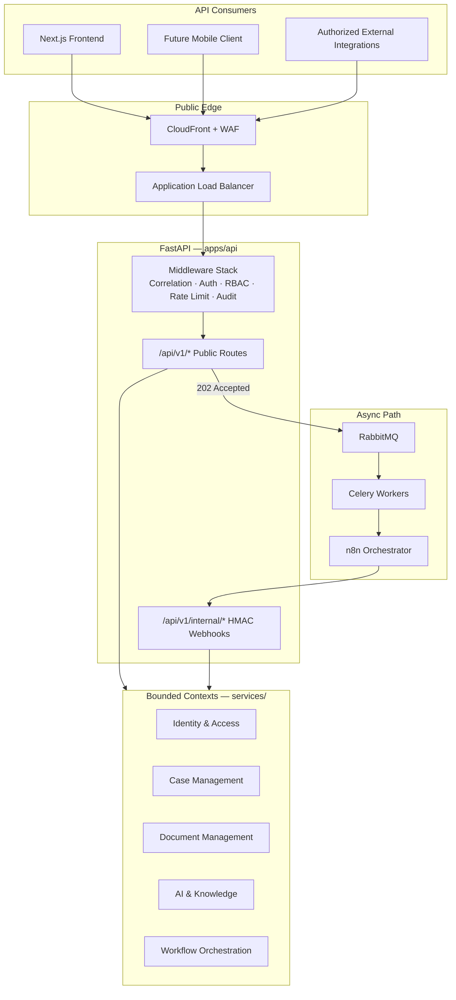
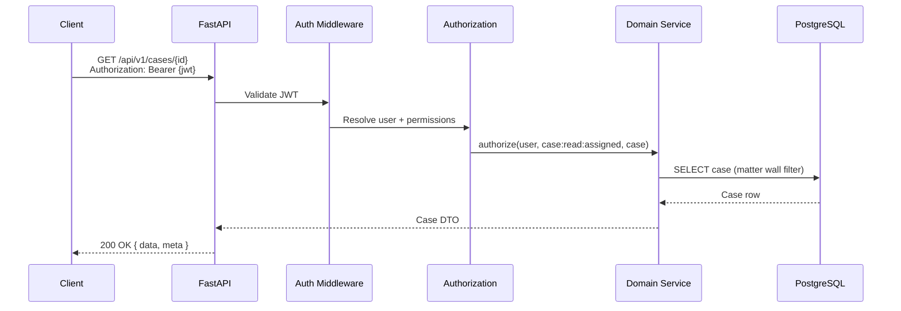
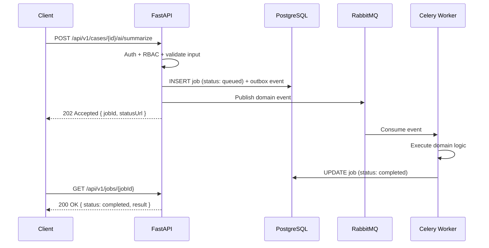

# LexFlow AI — REST API Documentation

**LexFlow AI** — FastAPI REST API Reference Index  
**Version:** 1.0  
**Status:** Draft — Pre-Implementation  
**Last Updated:** 2026-07-06

---

## Purpose

This directory is the authoritative reference for the LexFlow AI **public and internal REST API** surface. It defines how clients, integrations, and internal orchestrators (n8n) interact with the FastAPI backend.

Engineers use these documents to implement API routes, generate OpenAPI clients, review security posture, and validate integration contracts before code changes ship.

---

## Scope

| In Scope | Out of Scope |
|----------|--------------|
| REST conventions, envelopes, and error formats | Frontend UI component design |
| Authentication and authorization contracts | Database schema DDL (see [Database Architecture](../database-architecture.md)) |
| Resource endpoint specifications with JSON examples | n8n workflow node configuration |
| Async job patterns (202 Accepted) | LLM prompt template content |
| API versioning strategy | Infrastructure Terraform |
| Internal n8n webhook contracts | Business domain rules beyond API contracts |

**Base URL (production):** `https://api.lexflow.{firm-domain}/api/v1`  
**OpenAPI spec:** `/api/v1/openapi.json` (disabled in production UI; spec exported in CI)

---

## Responsibilities

| Stakeholder | Responsibility |
|-------------|----------------|
| **Backend engineers** | Implement routes per these specs; keep OpenAPI in sync |
| **Frontend engineers** | Consume typed client generated from OpenAPI; never bypass auth |
| **Security reviewers** | Validate auth, RBAC, matter walls, and internal webhook HMAC |
| **Integration engineers** | Follow presigned upload, async AI, and workflow trigger patterns |
| **DevOps / SRE** | Enforce rate limits, TLS, WAF rules aligned with API tiers |
| **Technical writers** | Maintain examples and cross-references when endpoints change |

The FastAPI layer is the **sole enforcement point** for authentication and authorization. No other tier (frontend, n8n, workers) makes access decisions on behalf of the API.

---

## Architecture

LexFlow AI exposes a **versioned REST API** from a modular monolith FastAPI application. Public routes live under `/api/v1`. Internal n8n callbacks live under `/api/v1/internal/` and are excluded from the public OpenAPI spec.

### Middleware Stack (Request Order)

1. **Correlation ID** — Assign or propagate `X-Correlation-Id`
2. **Authentication** — Validate JWT access token (except `/auth/*`, `/health`)
3. **Authorization** — RBAC + matter wall checks per route policy
4. **Rate Limiting** — Redis-backed per-user and per-IP limits
5. **Audit** — Log mutating operations with actor, resource, and outcome
6. **Exception Handler** — Map domain errors to RFC 7807 Problem Details

See [High-Level Architecture](../high-level-architecture.md) for container-level context.

---

## Document Map

| Document | Description |
|----------|-------------|
| [rest-standards.md](./rest-standards.md) | REST conventions, response envelope, pagination, idempotency |
| [authentication.md](./authentication.md) | JWT access tokens, refresh rotation, login flows |
| [authorization-rbac.md](./authorization-rbac.md) | RBAC matrix, matter walls, permission resolution |
| [endpoints-cases.md](./endpoints-cases.md) | Case CRUD, participants, tasks, timeline |
| [endpoints-documents.md](./endpoints-documents.md) | Presigned S3 upload, confirm, download, search |
| [endpoints-ai.md](./endpoints-ai.md) | Async AI endpoints, 202 pattern, job polling |
| [endpoints-workflows.md](./endpoints-workflows.md) | Workflow trigger, execution status, cancellation |
| [error-handling.md](./error-handling.md) | RFC 7807 error types, HTTP status code mapping |
| [versioning.md](./versioning.md) | `/api/v1` strategy, deprecation, breaking change policy |
| [webhooks-internal.md](./webhooks-internal.md) | n8n HMAC callbacks, payload schemas |

---

## Flow Diagrams

### Typical Synchronous Read

### Typical Async Write (AI / Workflow)

---

## Best Practices

1. **Always send `Authorization: Bearer`** on authenticated routes; refresh via httpOnly cookie, not localStorage for refresh tokens.
2. **Include `X-Correlation-Id`** on all requests for support and distributed tracing.
3. **Use `Idempotency-Key`** on POST/PUT/PATCH that trigger side effects (workflow trigger, case create).
4. **Send `If-Match`** with the resource `version` on updates to enable optimistic concurrency.
5. **Poll `statusUrl`** or subscribe to SSE for async operations — never block the UI waiting on LLM or workflow completion.
6. **Treat 404 on case resources as "not found or not accessible"** — do not attempt to distinguish for security.
7. **Generate TypeScript client from OpenAPI** — do not hand-craft fetch calls for domain resources.

---

## Tradeoffs

| Decision | Benefit | Cost |
|----------|---------|------|
| Uniform response envelope | Predictable client parsing | Slightly larger payloads vs raw resources |
| RFC 7807 errors | Standard, machine-readable errors | More verbose than plain `{ "error": "..." }` |
| 202 for all AI/workflows | Resilient, scalable async path | Frontend must handle job status UX |
| Matter wall → 404 | Prevents case ID enumeration | Harder debugging for misconfigured participants |
| Internal webhooks separate namespace | Reduced attack surface | Two auth models to maintain (JWT vs HMAC) |
| Offset pagination default | Simple for admin UIs | Cursor pagination required for audit logs at scale |

---

## Future Improvements

| Phase | Enhancement |
|-------|-------------|
| Phase 2 | GraphQL read API for dashboard aggregations (BFF-only, not public) |
| Phase 2 | SSE streaming for case-scoped AI chat (full response still persisted async) |
| Phase 3 | Microsoft Entra ID OIDC login endpoints |
| Phase 3 | Webhook subscriptions for external firm integrations (outbound) |
| Phase 4 | gRPC internal service extraction if bounded contexts split |

---

## References

### Within LexFlow Docs

| Document | Path |
|----------|------|
| Domain model (Case, Document aggregates) | [../02-domain/domain-model.md](../domain-model.md) |
| Security architecture & threat model | [../08-security/security-architecture.md](../security-architecture.md) |
| Authentication & authorization overview | [../08-security/authentication-authorization.md](../authentication-authorization.md) |
| Workflow orchestration (n8n patterns) | [../06-workflows/workflow-orchestration.md](../workflow-orchestration.md) |
| AI architecture (async processing) | [../ai-architecture.md](../ai-architecture.md) |
| API architecture (legacy flat doc) | [../api-architecture.md](../api-architecture.md) |
| High-level architecture | [../high-level-architecture.md](../high-level-architecture.md) |

### Architecture Decision Records

| ADR | Topic |
|-----|-------|
| [ADR-004](../13-decisions/004-async-ai-processing.md) | All AI via async worker path |
| [ADR-005](../13-decisions/005-jwt-authentication.md) | JWT + refresh token authentication |

### External Standards

- [OpenAPI 3.1](https://spec.openapis.org/oas/v3.1.0)
- [RFC 7807 — Problem Details for HTTP APIs](https://datatracker.ietf.org/doc/html/rfc7807)
- [RFC 9110 — HTTP Semantics](https://datatracker.ietf.org/doc/html/rfc9110)

---

## Conventions

- All paths in this directory are relative to `/api/v1` unless prefixed with `/internal/`.
- JSON field names use **camelCase** in API responses (Python models serialize via Pydantic alias).
- Timestamps are **ISO 8601 UTC** (`2026-07-06T08:00:00Z`).
- UUIDs are **RFC 4122** string format.
- Breaking API changes require a new version prefix and an ADR — see [versioning.md](./versioning.md).
