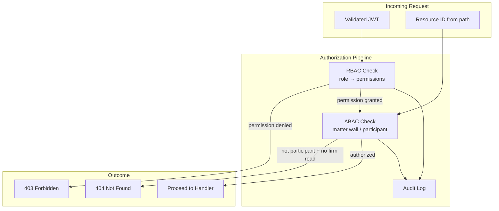
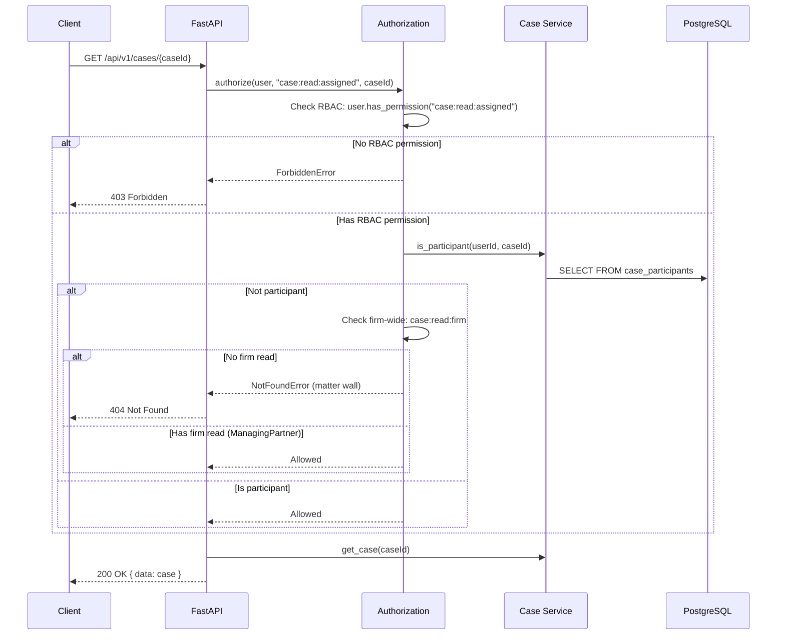
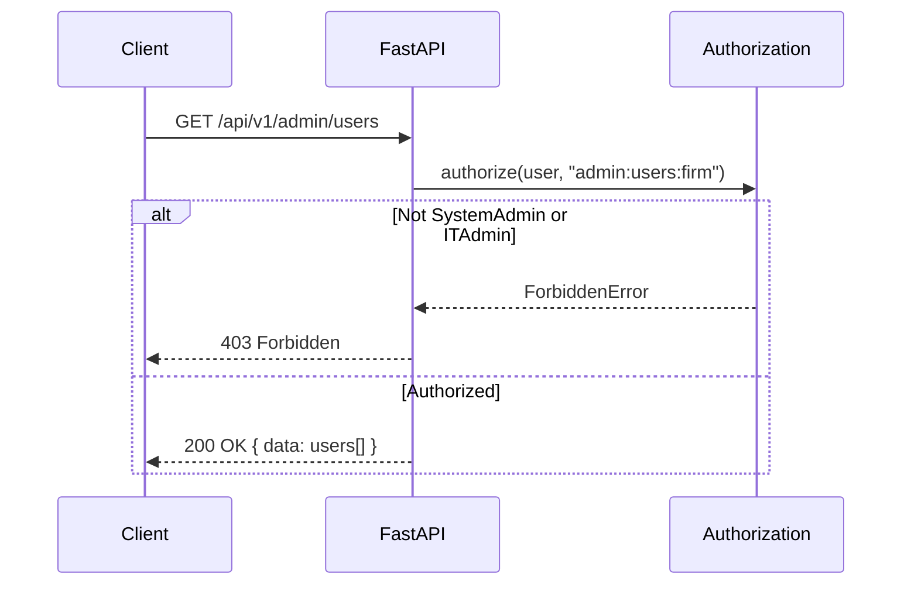
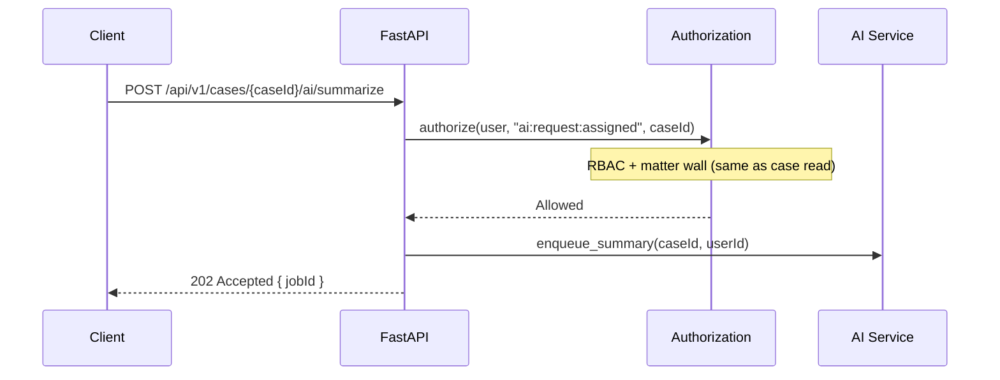

# Authorization & RBAC

**LexFlow AI** — Role-Based Access Control & Matter Walls  
**Version:** 1.0  
**Status:** Draft — Pre-Implementation  
**Last Updated:** 2026-07-06

---

## Purpose

Define how LexFlow AI authorizes authenticated users to perform actions on API resources. Authorization combines **Role-Based Access Control (RBAC)** for firm-wide permissions with **Attribute-Based Access Control (ABAC)** via **matter walls** for case-level ethical boundaries.

---

## Scope

| In Scope | Out of Scope |
|----------|--------------|
| System roles and permission matrix | JWT token issuance (see [authentication.md](./authentication.md)) |
| Permission naming convention | Admin UI for role management |
| Matter wall rules and participant roles | Entra ID group mapping (Phase 3) |
| Authorization middleware flow | Database schema for roles (see [Database Architecture](../database-architecture.md)) |
| API behavior on denial (403 vs 404) | Client portal limited visibility rules (summary in security docs) |

Authorization is enforced **exclusively on the FastAPI backend**. The frontend reflects permissions for UX but never enforces security.

---

## Responsibilities

| Component | Responsibility |
|-----------|----------------|
| **Authorization middleware** | Evaluate permission + resource scope before handler |
| **Identity service** | Resolve user roles and cached permission set |
| **Case service** | Verify participant membership for matter wall |
| **Audit service** | Log every access decision (allow and deny) |
| **Route handlers** | Declare required permission via dependency injection |
| **Frontend** | Hide/disable UI elements based on `/users/me` permissions — not security |

---

## Architecture



### Permission Format

Permissions follow `{resource}:{action}:{scope}`:

| Segment | Examples |
|---------|----------|
| `resource` | `case`, `document`, `ai`, `workflow`, `audit`, `admin` |
| `action` | `read`, `write`, `create`, `delete`, `trigger`, `approve`, `manage`, `decide` |
| `scope` | `assigned`, `firm`, `own` |

Example: `document:read:assigned` — read documents on cases where the user is a participant.

---

## Flow Diagrams

### Case Resource Access (Matter Wall)



### Admin Endpoint (RBAC Only)



### AI Request Authorization



---

## System Roles

| Role | Description |
|------|-------------|
| `SystemAdministrator` | Full firm configuration, user management |
| `ManagingPartner` | Firm-wide dashboards, policy approval, all case read |
| `Attorney` | Full case operations on assigned matters |
| `AssociateAttorney` | Case operations on assigned matters (no admin) |
| `Paralegal` | Task/document operations on assigned matters |
| `LegalAssistant` | Intake, document upload, task execution on assigned matters |
| `OperationsTeam` | Workflow management, bulk operations, reporting |
| `ITAdministrator` | Infrastructure monitoring, integration config |
| `ComplianceOfficer` | Read-only audit access across firm |
| `Client` | Portal access to own cases (limited visibility) |

---

## Permission Matrix

| Permission | SysAdmin | MngPartner | Attorney | Associate | Paralegal | LegalAsst | Ops | ITAdmin | Compliance | Client |
|------------|:--------:|:----------:|:--------:|:---------:|:---------:|:---------:|:---:|:-------:|:----------:|:------:|
| `case:read:assigned` | ✓ | ✓ | ✓ | ✓ | ✓ | ✓ | ✓ | | ✓ | ✓ |
| `case:read:firm` | ✓ | ✓ | | | | | ✓ | | ✓ | |
| `case:write:assigned` | ✓ | ✓ | ✓ | ✓ | ✓ | ✓ | | | | |
| `case:create` | ✓ | ✓ | ✓ | ✓ | ✓ | ✓ | ✓ | | | |
| `case:delete` | ✓ | ✓ | | | | | | | | |
| `document:read:assigned` | ✓ | ✓ | ✓ | ✓ | ✓ | ✓ | ✓ | | ✓ | ✓ |
| `document:write:assigned` | ✓ | ✓ | ✓ | ✓ | ✓ | ✓ | | | | ✓ |
| `document:download:assigned` | ✓ | ✓ | ✓ | ✓ | ✓ | ✓ | | | ✓ | ✓ |
| `ai:request:assigned` | ✓ | ✓ | ✓ | ✓ | ✓ | | | | | |
| `ai:approve:assigned` | ✓ | ✓ | ✓ | | | | | | | |
| `workflow:trigger:assigned` | ✓ | ✓ | ✓ | ✓ | ✓ | ✓ | ✓ | | | |
| `workflow:manage:firm` | ✓ | ✓ | | | | | ✓ | | | |
| `approval:decide:assigned` | ✓ | ✓ | ✓ | | | | | | | |
| `audit:read:firm` | ✓ | ✓ | | | | | | | ✓ | |
| `admin:users:firm` | ✓ | | | | | | | ✓ | | |
| `admin:config:firm` | ✓ | | | | | | | ✓ | | |

---

## Endpoint Permission Map

| Endpoint Group | Required Permission |
|----------------|---------------------|
| `GET /cases`, `GET /cases/{id}` | `case:read:assigned` (+ matter wall) |
| `POST /cases` | `case:create` |
| `PATCH /cases/{id}` | `case:write:assigned` (+ matter wall) |
| `POST /cases/{id}/participants` | `case:write:assigned` + participant role `lead` |
| `GET /cases/{id}/documents` | `document:read:assigned` (+ matter wall) |
| `POST /cases/{id}/documents` | `document:write:assigned` (+ matter wall) |
| `POST /cases/{id}/ai/*` | `ai:request:assigned` (+ matter wall) |
| `POST /ai/summaries/{id}/approve` | `ai:approve:assigned` (+ matter wall) |
| `POST /cases/{id}/workflows/trigger` | `workflow:trigger:assigned` (+ matter wall) |
| `GET /workflows/definitions` | `workflow:trigger:assigned` |
| `GET /admin/users` | `admin:users:firm` |
| `GET /cases/{id}/audit-logs` | `audit:read:firm` OR participant with case read |

---

## Matter Walls

Matter walls enforce **ethical walls** and **conflict boundaries** — critical for law firm operations.

### Rules

1. A user can access a case only if they are a **participant** on that case.
2. `ManagingPartner` and `ComplianceOfficer` bypass matter walls for **read** access via `case:read:firm`.
3. `SystemAdministrator` bypasses matter walls for **admin operations only** — not document content or AI summaries.
4. Unauthorized case access returns **404 Not Found** (not 403) to prevent case ID enumeration.
5. Adding/removing participants requires `case:write:assigned` **and** participant role `lead` on the case.

### Participant Roles (Case-Level)

| Role | Capabilities |
|------|-------------|
| `lead` | Full case management; add/remove participants |
| `associate` | Read/write case data; cannot manage participants |
| `paralegal` | Tasks, documents, notes — no AI approval |
| `observer` | Read-only (e.g., supervising partner) |

### Matter Wall vs RBAC Decision Tree

```
Request for case-scoped resource
  │
  ├─ User lacks RBAC permission → 403 Forbidden
  │
  └─ User has RBAC permission (scope: assigned)
       │
       ├─ User is case participant → Allow
       │
       ├─ User has case:read:firm → Allow (read only)
       │
       └─ Otherwise → 404 Not Found
```

---

## Permission Resolution (Pseudocode)

```python
def authorize(user: User, permission: str, resource: Resource | None = None) -> None:
    # 1. RBAC — does user's role grant this permission?
    if not user.has_permission(permission):
        audit_log.record(user, permission, resource, outcome="denied_rbac")
        raise ForbiddenError()

    # 2. ABAC — matter wall for case-scoped resources
    if resource and resource.type == "case":
        scope = parse_scope(permission)  # assigned | firm | own
        if scope == "assigned":
            if not user.is_participant(resource.case_id):
                if not user.has_permission(f"case:read:firm"):
                    audit_log.record(user, permission, resource, outcome="denied_matter_wall")
                    raise NotFoundError()  # 404 — not 403

    # 3. Log successful access
    audit_log.record(user, permission, resource, outcome="allowed")
```

### Permission Cache

Resolved permission sets are cached in Redis with a **5-minute TTL**, invalidated on:
- Role assignment change
- User deactivation
- Explicit admin cache flush

---

## Client Portal Restrictions

Clients with the `Client` role have additional restrictions beyond RBAC:

| Resource | Client Access |
|----------|---------------|
| Own cases (status) | Read |
| Document upload to own case | Write |
| Internal notes | **Denied** (404) |
| AI summaries | **Denied** (404) |
| Workflow triggers | **Denied** (403) |
| Other clients' cases | **Denied** (404) |

---

## Best Practices

1. **Declare permissions at the route level** — use FastAPI dependencies, not inline checks in handlers.
2. **Never trust role claims from the client** — always resolve from PostgreSQL.
3. **Use 404 for matter wall denials** on case-scoped GET — consistent across all case endpoints.
4. **Use 403 for firm-wide RBAC denials** — admin endpoints, workflow management.
5. **Audit denials** — failed authorization attempts are security-relevant events.
6. **Test permission matrix in integration tests** — one test per role × critical endpoint.
7. **Document required permission in OpenAPI** — `security` and description fields.

---

## Tradeoffs

| Decision | Benefit | Cost |
|----------|---------|------|
| RBAC + ABAC (not RBAC alone) | Ethical walls for legal compliance | Two-layer check on every case request |
| 404 on matter wall | Prevents enumeration attacks | Harder support debugging |
| Permissions not in JWT | Immediate revocation of role changes | Redis/DB lookup per request |
| Participant roles separate from system roles | Fine-grained case leadership | More complex participant management |
| Firm-wide read for partners/compliance | Oversight without per-case assignment | Broad access — audit critical |

---

## Future Improvements

| Phase | Enhancement |
|-------|-------------|
| Phase 2 | Custom firm-defined roles (subset of permissions) |
| Phase 3 | Entra ID security group → role mapping |
| Phase 3 | Office/department-scoped ABAC (`office:atlanta`) |
| Phase 4 | Dynamic policy engine (OPA/Cedar) if rules exceed matrix complexity |
| Phase 4 | Time-bound access grants (temporary matter wall override with approval) |

---

## References

- [authentication.md](./authentication.md) — Identity verification before authorization
- [endpoints-cases.md](./endpoints-cases.md) — Case endpoints with permission notes
- [error-handling.md](./error-handling.md) — 403 vs 404 behavior
- [../02-domain/domain-model.md](../domain-model.md) — Case aggregate, participants, matter wall invariant
- [../08-security/authentication-authorization.md](../authentication-authorization.md) — Full auth architecture
- [../08-security/security-architecture.md](../security-architecture.md) — Privilege escalation threat model
- [../08-security/compliance-data-governance.md](../compliance-data-governance.md) — Audit requirements
