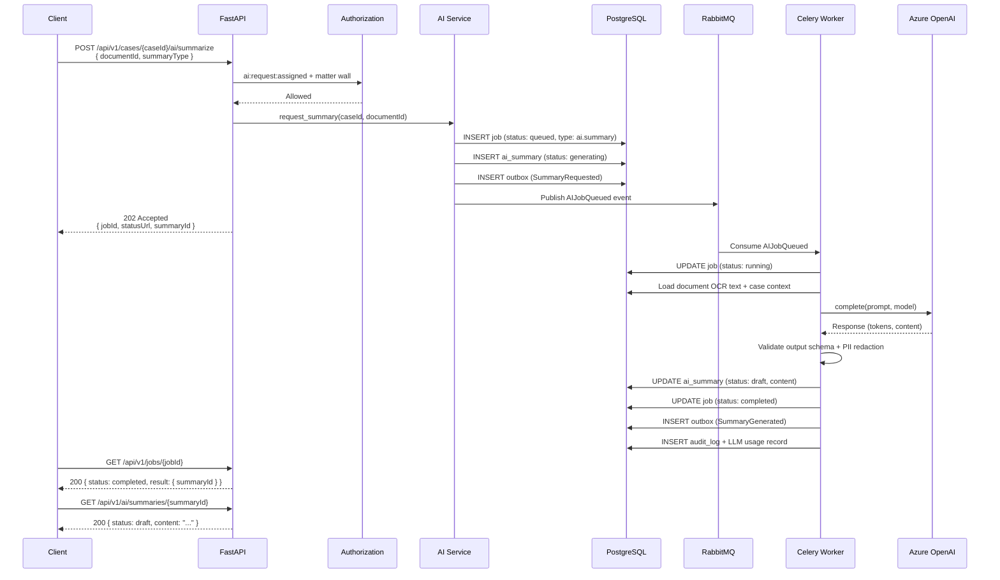
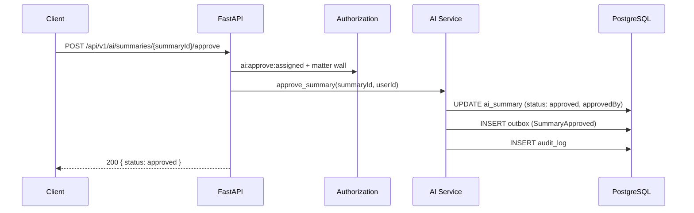
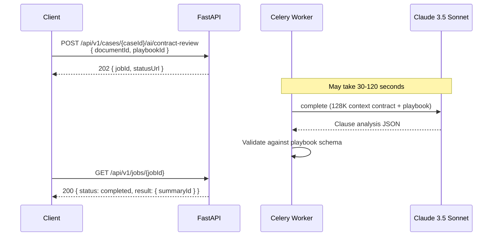

# AI Endpoints

**LexFlow AI** — Async AI REST API  
**Version:** 1.0  
**Status:** Draft — Pre-Implementation  
**Last Updated:** 2026-07-06

---

## Purpose

Document the REST API for **AI capabilities** — summarization, legal research, contract review, and case-scoped chat. All AI operations follow the **async 202 Accepted pattern** per [ADR-004](../13-decisions/004-async-ai-processing.md): the API never blocks on LLM provider latency.

---

## Scope

| In Scope | Out of Scope |
|----------|--------------|
| AI request endpoints (202 pattern) | LLM provider configuration |
| Job status polling (`/jobs/{id}`) | Prompt template content |
| Summary list, approve, reject | Embedding pipeline internals |
| AI output retrieval | Model selection logic (see [AI Architecture](../ai-architecture.md)) |
| Rate limits for AI endpoints | Human-in-the-loop UI flows |

**Base paths:** `/api/v1/cases/{caseId}/ai/*`, `/api/v1/ai/*`, `/api/v1/jobs/{id}`

---

## Responsibilities

| Layer | Responsibility |
|-------|----------------|
| **AI router** | Accept requests, validate input, return 202 |
| **AI service** | Enqueue jobs, manage summary lifecycle |
| **Authorization** | `ai:request:assigned`, `ai:approve:assigned` + matter wall |
| **Celery AI worker** | Call LLM provider, validate output, persist result |
| **Audit service** | Log all prompts and responses (S3 archive) |
| **Approval service** | Gate approved summaries before team visibility |

---

## Architecture

```mermaid
flowchart TB
    subgraph API["FastAPI — AI Router"]
        REQ[POST /ai/*]
        LIST[GET summaries]
        APPROVE[POST approve/reject]
        JOB[GET /jobs/{id}]
    end

    subgraph Async["Async Path"]
        DB[(PostgreSQL — jobs, summaries)]
        MQ[RabbitMQ]
        W[Celery AI Worker]
    end

    subgraph LLM["LLM Providers"]
        AZURE[Azure OpenAI]
        CLAUDE[Anthropic Claude]
    end

    REQ --> DB
    REQ --> MQ
    MQ --> W
    W --> LLM
    W --> DB
    JOB --> DB
    LIST --> DB
    APPROVE --> DB
```

### Job Status Lifecycle

| Status | Description |
|--------|-------------|
| `queued` | Accepted; waiting for worker |
| `running` | Worker calling LLM provider |
| `completed` | Result persisted |
| `failed` | Provider error or validation failure |
| `cancelled` | User cancelled before completion |

### Summary Status Lifecycle

| Status | Description |
|--------|-------------|
| `generating` | Job in progress |
| `draft` | Generated; awaiting attorney approval |
| `approved` | Visible to case team |
| `rejected` | Rejected by attorney; not visible |

---

## Flow Diagrams

### Request AI Summary (202 Async Pattern)



### Approve Summary



### Contract Review (Long-Running)



---

## Endpoints

### POST `/cases/{caseId}/ai/summarize`

Request AI summary of a document or case overview.

**Permission:** `ai:request:assigned` + matter wall

**Request:**

```json
{
  "documentId": "d1e2f3a4-b5c6-7890-def1-234567890abc",
  "summaryType": "document"
}
```

| `summaryType` | Description |
|---------------|-------------|
| `document` | Single document summary (requires `documentId`) |
| `case_overview` | Executive case summary (uses all documents + notes) |

**Response (202):**

```json
{
  "data": {
    "jobId": "j1a2b3c4-d5e6-7890-abcd-ef1234567890",
    "summaryId": "s1a2b3c4-d5e6-7890-abcd-ef1234567890",
    "status": "queued",
    "statusUrl": "/api/v1/jobs/j1a2b3c4-d5e6-7890-abcd-ef1234567890"
  },
  "meta": {
    "requestId": "550e8400-e29b-41d4-a716-446655440000",
    "timestamp": "2026-07-06T08:00:00Z"
  }
}
```

**Preconditions:**
- Document must be in `ready` status (OCR complete) for `document` type
- Case must have at least one processed document for `case_overview`

---

### GET `/cases/{caseId}/ai/summaries`

List AI summaries for a case.

**Permission:** `case:read:assigned` + matter wall

**Query parameters:** `status`, `summaryType`, `page`, `pageSize`

**Response (200):**

```json
{
  "data": [
    {
      "id": "s1a2b3c4-d5e6-7890-abcd-ef1234567890",
      "caseId": "c1d2e3f4-a5b6-7890-cdef-123456789012",
      "documentId": "d1e2f3a4-b5c6-7890-def1-234567890abc",
      "documentTitle": "Master Services Agreement",
      "summaryType": "document",
      "status": "approved",
      "model": "gpt-4o",
      "promptVersion": "document-summary-v1",
      "requestedBy": "b2c3d4e5-f6a7-8901-bcde-f12345678901",
      "approvedBy": "b2c3d4e5-f6a7-8901-bcde-f12345678901",
      "tokenCount": 4521,
      "createdAt": "2026-07-05T15:00:00Z",
      "approvedAt": "2026-07-05T16:30:00Z"
    }
  ],
  "meta": { "requestId": "...", "timestamp": "...", "pagination": { "..." } }
}
```

Note: `draft` and `rejected` summaries are visible only to the requester and attorneys with `ai:approve:assigned`.

---

### GET `/ai/summaries/{summaryId}`

Get summary detail including content.

**Permission:** `case:read:assigned` + matter wall + summary visibility rules

**Response (200):**

```json
{
  "data": {
    "id": "s1a2b3c4-d5e6-7890-abcd-ef1234567890",
    "caseId": "c1d2e3f4-a5b6-7890-cdef-123456789012",
    "documentId": "d1e2f3a4-b5c6-7890-def1-234567890abc",
    "summaryType": "document",
    "status": "draft",
    "content": {
      "executiveSummary": "This Master Services Agreement between Acme Corp and Smith LLC establishes...",
      "keyParties": ["Acme Corp", "Smith LLC"],
      "keyDates": [
        { "date": "2026-01-01", "description": "Effective date" },
        { "date": "2027-01-01", "description": "Initial term expiration" }
      ],
      "obligations": [
        "Acme Corp shall provide cloud infrastructure services",
        "Smith LLC shall pay monthly fees of $25,000"
      ],
      "riskFlags": [
        "Unlimited indemnification clause in Section 8.2",
        "Automatic renewal without notice period"
      ]
    },
    "disclaimer": "AI-generated summary requiring attorney review. Not legal advice.",
    "model": "gpt-4o",
    "promptVersion": "document-summary-v1",
    "requestedBy": "d3e4f5a6-b7c8-9012-cdef-123456789012",
    "approvedBy": null,
    "tokenCount": 4521,
    "createdAt": "2026-07-05T15:00:00Z"
  },
  "meta": { "requestId": "...", "timestamp": "..." }
}
```

---

### POST `/ai/summaries/{summaryId}/approve`

Approve AI summary for team visibility.

**Permission:** `ai:approve:assigned` + matter wall

**Request:**

```json
{
  "decisionNote": "Reviewed and accurate. Approved for team."
}
```

**Response (200):**

```json
{
  "data": {
    "id": "s1a2b3c4-d5e6-7890-abcd-ef1234567890",
    "status": "approved",
    "approvedBy": "b2c3d4e5-f6a7-8901-bcde-f12345678901",
    "approvedAt": "2026-07-06T08:00:00Z"
  },
  "meta": { "requestId": "...", "timestamp": "..." }
}
```

---

### POST `/ai/summaries/{summaryId}/reject`

Reject AI summary.

**Permission:** `ai:approve:assigned` + matter wall

**Request:**

```json
{
  "reason": "Summary mischaracterizes indemnification scope in Section 8."
}
```

**Response (200):**

```json
{
  "data": {
    "id": "s1a2b3c4-d5e6-7890-abcd-ef1234567890",
    "status": "rejected",
    "rejectedBy": "b2c3d4e5-f6a7-8901-bcde-f12345678901",
    "rejectedAt": "2026-07-06T08:00:00Z",
    "rejectionReason": "Summary mischaracterizes indemnification scope in Section 8."
  },
  "meta": { "requestId": "...", "timestamp": "..." }
}
```

---

### POST `/cases/{caseId}/ai/research`

Legal research query (async).

**Permission:** `ai:request:assigned` + matter wall

**Request:**

```json
{
  "query": "What are the elements of a negligence claim under Georgia law in premises liability cases?",
  "includeCaseContext": true,
  "documentIds": ["d1e2f3a4-b5c6-7890-def1-234567890abc"]
}
```

**Response (202):**

```json
{
  "data": {
    "jobId": "j2b3c4d5-e6f7-8901-bcde-f12345678901",
    "summaryId": "s2b3c4d5-e6f7-8901-bcde-f12345678901",
    "status": "queued",
    "statusUrl": "/api/v1/jobs/j2b3c4d5-e6f7-8901-bcde-f12345678901"
  },
  "meta": { "requestId": "...", "timestamp": "..." }
}
```

Research output includes source citations from RAG-retrieved document chunks and always appends the disclaimer: *"This is AI-generated research requiring attorney verification."*

---

### POST `/cases/{caseId}/ai/contract-review`

Contract review against firm playbook (async).

**Permission:** `ai:request:assigned` + matter wall

**Request:**

```json
{
  "documentId": "d1e2f3a4-b5c6-7890-def1-234567890abc",
  "playbookId": "corporate-msa-v1"
}
```

**Response (202):** Same job envelope as summarize.

**Result content (when completed):**

```json
{
  "clauseAnalysis": [
    {
      "section": "8.2 Indemnification",
      "riskLevel": "high",
      "finding": "Unlimited indemnification without cap",
      "recommendation": "Add liability cap consistent with playbook Rule 4.2",
      "playbookRule": "Rule 4.2 — Indemnification Cap"
    }
  ],
  "missingProvisions": ["Force majeure", "Data breach notification"],
  "nonStandardTerms": ["Automatic renewal without 90-day notice"]
}
```

---

### POST `/cases/{caseId}/ai/chat`

Case-scoped AI assistant message (async).

**Permission:** `ai:request:assigned` + matter wall

**Request:**

```json
{
  "message": "What is the effective date of the MSA and who are the parties?",
  "conversationId": "conv1a2b3c4-d5e6-7890-abcd-ef1234567890"
}
```

| Field | Description |
|-------|-------------|
| `conversationId` | Optional — omit to start new conversation; include to continue |
| `message` | User message (max 4000 chars) |

**Response (202):**

```json
{
  "data": {
    "jobId": "j3c4d5e6-f7a8-9012-cdef-123456789012",
    "conversationId": "conv1a2b3c4-d5e6-7890-abcd-ef1234567890",
    "messageId": "msg1a2b3c4-d5e6-7890-abcd-ef1234567890",
    "status": "queued",
    "statusUrl": "/api/v1/jobs/j3c4d5e6-f7a8-9012-cdef-123456789012"
  },
  "meta": { "requestId": "...", "timestamp": "..." }
}
```

Chat responses are scoped strictly to the current case's documents and notes. No approval required for internal chat; responses are never auto-shared externally.

---

### GET `/jobs/{jobId}`

Poll async job status (shared across AI, documents, workflows).

**Permission:** Job must belong to current user or accessible case

**Response (200) — In Progress:**

```json
{
  "data": {
    "id": "j1a2b3c4-d5e6-7890-abcd-ef1234567890",
    "type": "ai.summary",
    "status": "running",
    "progress": 60,
    "createdAt": "2026-07-06T08:00:00Z",
    "startedAt": "2026-07-06T08:00:05Z",
    "completedAt": null
  },
  "meta": { "requestId": "...", "timestamp": "..." }
}
```

**Response (200) — Completed:**

```json
{
  "data": {
    "id": "j1a2b3c4-d5e6-7890-abcd-ef1234567890",
    "type": "ai.summary",
    "status": "completed",
    "progress": 100,
    "result": {
      "summaryId": "s1a2b3c4-d5e6-7890-abcd-ef1234567890",
      "resultUrl": "/api/v1/ai/summaries/s1a2b3c4-d5e6-7890-abcd-ef1234567890"
    },
    "createdAt": "2026-07-06T08:00:00Z",
    "startedAt": "2026-07-06T08:00:05Z",
    "completedAt": "2026-07-06T08:00:45Z",
    "durationMs": 40000
  },
  "meta": { "requestId": "...", "timestamp": "..." }
}
```

**Response (200) — Failed:**

```json
{
  "data": {
    "id": "j1a2b3c4-d5e6-7890-abcd-ef1234567890",
    "type": "ai.summary",
    "status": "failed",
    "error": {
      "code": "llm_provider_error",
      "message": "Azure OpenAI rate limit exceeded.",
      "retryable": true
    },
    "createdAt": "2026-07-06T08:00:00Z",
    "completedAt": "2026-07-06T08:00:10Z"
  },
  "meta": { "requestId": "...", "timestamp": "..." }
}
```

---

## Polling vs SSE

| Method | Use Case |
|--------|----------|
| **Polling** `GET /jobs/{id}` | Default; poll every 2–5 seconds with exponential backoff |
| **SSE** `GET /api/v1/events/stream` | Real-time push for `summary.generated`, `job.completed` events |

Recommended client pattern:

```
POST /ai/summarize → 202
  → poll GET /jobs/{id} every 3s (max 60 attempts)
  → on completed: GET /ai/summaries/{summaryId}
```

---

## Rate Limits

| Endpoint | Limit |
|----------|-------|
| All `/ai/*` POST endpoints | 20 req/min per user |
| `GET /jobs/{id}` | 60 req/min per user |
| `GET /ai/summaries/*` | 100 req/min per user |

---

## Best Practices

1. **Never expect synchronous AI responses** — always handle 202 and poll.
2. **Check document status before summarize** — document must be `ready`.
3. **Implement exponential backoff on job polling** — avoid hammering the API.
4. **Display disclaimer on all AI content** — required for legal compliance.
5. **Require attorney approval workflow in UI** — `draft` summaries are not team-visible.
6. **Include `conversationId` for chat continuity** — server maintains case-scoped context.
7. **Handle `retryable: true` failures** — offer user a retry button that re-POSTs.

---

## Tradeoffs

| Decision | Benefit | Cost |
|----------|---------|------|
| 202 for all AI (ADR-004) | Resilient, scalable, auditable | Polling UX complexity |
| Approval gate on summaries | Legal compliance, quality control | Extra step for attorneys |
| Case-scoped RAG only | Matter wall enforced at retrieval | Cannot cross-reference other cases |
| Job polling vs WebSocket | Simple, stateless | Higher request volume during waits |
| Structured JSON output | Parseable UI rendering | Prompt engineering overhead |

---

## Future Improvements

| Phase | Enhancement |
|-------|-------------|
| Phase 2 | SSE token streaming for case chat (full response still persisted async) |
| Phase 2 | Batch summarize (`POST /cases/{id}/ai/summarize/bulk`) |
| Phase 3 | Custom firm playbooks via admin API |
| Phase 3 | AI cost dashboard per case/attorney |
| Phase 4 | Fine-tuned models per practice area |

---

## References

- [endpoints-cases.md](./endpoints-cases.md) — Case-scoped AI paths
- [endpoints-documents.md](./endpoints-documents.md) — Document prerequisites
- [authorization-rbac.md](./authorization-rbac.md) — `ai:request`, `ai:approve` permissions
- [rest-standards.md](./rest-standards.md) — 202 Accepted envelope
- [error-handling.md](./error-handling.md) — Job failure error codes
- [../ai-architecture.md](../ai-architecture.md) — LLM providers, prompts, RAG, safety
- [../02-domain/domain-model.md](../domain-model.md) — AISummary aggregate
- [ADR-004](../13-decisions/004-async-ai-processing.md) — Async AI decision
