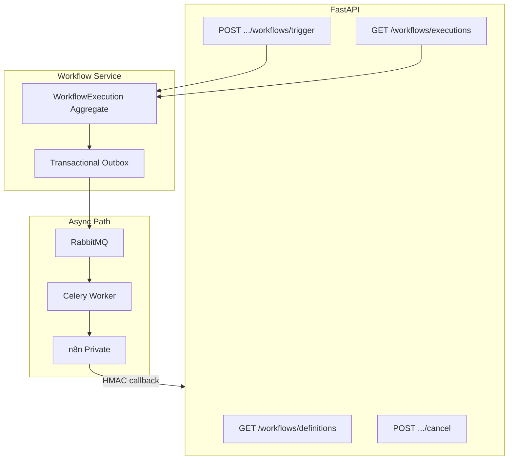
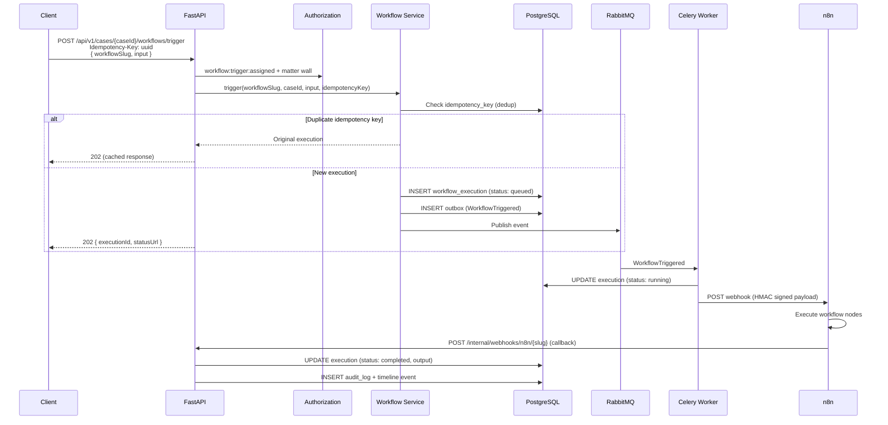
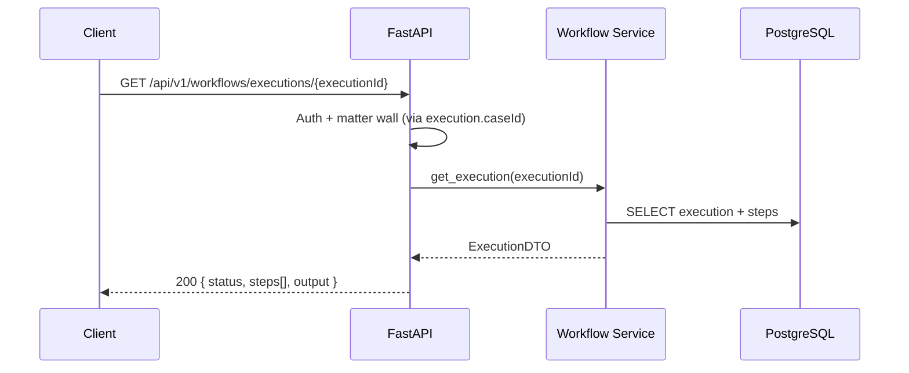
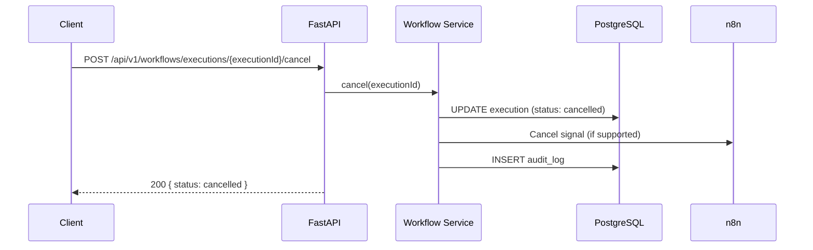

# Workflow Endpoints

**LexFlow AI** — Workflow Trigger & Execution API  
**Version:** 1.0  
**Status:** Draft — Pre-Implementation  
**Last Updated:** 2026-07-06

---

## Purpose

Document the REST API for **workflow orchestration** — listing available workflows, triggering executions on cases, monitoring execution status, and cancelling running workflows. Business logic and authorization remain in FastAPI; n8n executes external orchestration only.

---

## Scope

| In Scope | Out of Scope |
|----------|--------------|
| Workflow definition listing | n8n workflow JSON editing |
| Manual workflow trigger (202) | Event-triggered workflows (automatic via domain events) |
| Execution status and step detail | n8n node-level configuration |
| Execution cancellation | Workflow promotion pipeline (see [../06-workflows/workflow-orchestration.md](../workflow-orchestration.md)) |
| Idempotent trigger | Internal n8n callbacks (see [webhooks-internal.md](./webhooks-internal.md)) |

**Base paths:** `/api/v1/workflows/*`, `/api/v1/cases/{caseId}/workflows/*`

---

## Responsibilities

| Layer | Responsibility |
|-------|----------------|
| **Workflow router** | HTTP binding, trigger acceptance |
| **Workflow service** | Execution lifecycle, state persistence |
| **Authorization** | `workflow:trigger:assigned`, `workflow:manage:firm` |
| **Celery worker** | Invoke n8n webhook with signed payload |
| **n8n** | External API calls, retries, callbacks |
| **Internal webhook handler** | Process n8n completion callbacks |

See [../06-workflows/workflow-orchestration.md](../workflow-orchestration.md) for the full n8n integration architecture.

---

## Architecture



### Execution Status Lifecycle

| Status | Description |
|--------|-------------|
| `queued` | Created by API; awaiting worker |
| `running` | Worker invoked n8n; n8n executing |
| `completed` | n8n callback received with success |
| `failed` | n8n callback error or timeout |
| `cancelled` | User cancelled before completion |

---

## Flow Diagrams

### Trigger Workflow on Case



### Poll Execution Status



### Cancel Running Execution



---

## Endpoints

### GET `/workflows/definitions`

List available workflow definitions.

**Permission:** `workflow:trigger:assigned`

**Query parameters:** `triggerType`, `isActive`, `search`

**Response (200):**

```json
{
  "data": [
    {
      "id": "wf1a2b3c4-d5e6-7890-abcd-ef1234567890",
      "name": "New Client Intake",
      "slug": "intake-new-client-v1",
      "description": "Create SharePoint folder, send welcome email, notify lead attorney.",
      "triggerType": "manual",
      "isActive": true,
      "configSchema": {
        "type": "object",
        "properties": {
          "sendWelcomeEmail": { "type": "boolean", "default": true },
          "createSharePointFolder": { "type": "boolean", "default": true }
        }
      },
      "estimatedDurationSeconds": 120
    },
    {
      "id": "wf2b3c4d5-e6f7-8901-bcde-f12345678901",
      "name": "Discovery Request Package",
      "slug": "discovery-request-v1",
      "description": "Generate discovery document package and send via Outlook.",
      "triggerType": "manual",
      "isActive": true,
      "configSchema": {
        "type": "object",
        "properties": {
          "documentIds": { "type": "array", "items": { "type": "string", "format": "uuid" } },
          "recipientEmail": { "type": "string", "format": "email" }
        },
        "required": ["documentIds", "recipientEmail"]
      },
      "estimatedDurationSeconds": 300
    }
  ],
  "meta": {
    "requestId": "550e8400-e29b-41d4-a716-446655440000",
    "timestamp": "2026-07-06T08:00:00Z"
  }
}
```

---

### POST `/cases/{caseId}/workflows/trigger`

Trigger a workflow on a case.

**Permission:** `workflow:trigger:assigned` + matter wall

**Headers:**

```http
Idempotency-Key: 7c9e6679-7425-40de-944b-e07fc1f90ae7
```

**Request:**

```json
{
  "workflowSlug": "intake-new-client-v1",
  "input": {
    "sendWelcomeEmail": true,
    "createSharePointFolder": true,
    "clientEmail": "contact@acme.com"
  }
}
```

**Response (202):**

```json
{
  "data": {
    "executionId": "ex1a2b3c4-d5e6-7890-abcd-ef1234567890",
    "workflowSlug": "intake-new-client-v1",
    "caseId": "c1d2e3f4-a5b6-7890-cdef-123456789012",
    "status": "queued",
    "statusUrl": "/api/v1/workflows/executions/ex1a2b3c4-d5e6-7890-abcd-ef1234567890",
    "correlationId": "550e8400-e29b-41d4-a716-446655440000"
  },
  "meta": {
    "requestId": "550e8400-e29b-41d4-a716-446655440000",
    "timestamp": "2026-07-06T08:00:00Z"
  }
}
```

**Validation:**
- `workflowSlug` must match an active definition
- `input` validated against definition's `configSchema`
- Case must not be `archived`

**Errors:**
- `422` — Input fails JSON schema validation
- `404` — Unknown workflow slug or case not accessible

---

### GET `/workflows/executions`

List workflow executions (filtered by accessible cases).

**Permission:** `workflow:trigger:assigned`

**Query parameters:**

| Parameter | Description |
|-----------|-------------|
| `caseId` | Filter by case |
| `workflowSlug` | Filter by workflow |
| `status` | `queued`, `running`, `completed`, `failed`, `cancelled` |
| `triggeredBy` | User UUID or `me` |
| `createdAfter` | ISO 8601 datetime |
| `page`, `pageSize` | Pagination |

**Response (200):**

```json
{
  "data": [
    {
      "id": "ex1a2b3c4-d5e6-7890-abcd-ef1234567890",
      "workflowSlug": "intake-new-client-v1",
      "workflowName": "New Client Intake",
      "caseId": "c1d2e3f4-a5b6-7890-cdef-123456789012",
      "caseTitle": "Smith v. Acme Corp",
      "status": "completed",
      "triggeredBy": "b2c3d4e5-f6a7-8901-bcde-f12345678901",
      "triggeredByName": "Jane Attorney",
      "correlationId": "550e8400-e29b-41d4-a716-446655440000",
      "createdAt": "2026-07-06T08:00:00Z",
      "startedAt": "2026-07-06T08:00:02Z",
      "completedAt": "2026-07-06T08:02:15Z",
      "durationMs": 135000
    }
  ],
  "meta": {
    "requestId": "...",
    "timestamp": "...",
    "pagination": { "page": 1, "pageSize": 25, "totalItems": 8, "totalPages": 1 }
  }
}
```

---

### GET `/workflows/executions/{executionId}`

Get execution detail with step breakdown.

**Permission:** `workflow:trigger:assigned` + matter wall on execution's case

**Response (200):**

```json
{
  "data": {
    "id": "ex1a2b3c4-d5e6-7890-abcd-ef1234567890",
    "workflowSlug": "intake-new-client-v1",
    "workflowName": "New Client Intake",
    "caseId": "c1d2e3f4-a5b6-7890-cdef-123456789012",
    "status": "completed",
    "inputPayload": {
      "sendWelcomeEmail": true,
      "createSharePointFolder": true,
      "clientEmail": "contact@acme.com"
    },
    "outputPayload": {
      "sharepointFolderUrl": "https://firm.sharepoint.com/sites/Cases/Smith-v-Acme",
      "emailSent": true,
      "externalReferenceId": "ext-123"
    },
    "steps": [
      {
        "name": "create-sharepoint-folder",
        "status": "completed",
        "startedAt": "2026-07-06T08:00:05Z",
        "completedAt": "2026-07-06T08:00:07Z",
        "durationMs": 1200
      },
      {
        "name": "send-welcome-email",
        "status": "completed",
        "startedAt": "2026-07-06T08:00:08Z",
        "completedAt": "2026-07-06T08:00:09Z",
        "durationMs": 800
      },
      {
        "name": "notify-lead-attorney",
        "status": "completed",
        "startedAt": "2026-07-06T08:00:09Z",
        "completedAt": "2026-07-06T08:00:10Z",
        "durationMs": 400
      }
    ],
    "triggeredBy": "b2c3d4e5-f6a7-8901-bcde-f12345678901",
    "correlationId": "550e8400-e29b-41d4-a716-446655440000",
    "retryCount": 0,
    "createdAt": "2026-07-06T08:00:00Z",
    "startedAt": "2026-07-06T08:00:02Z",
    "completedAt": "2026-07-06T08:02:15Z"
  },
  "meta": {
    "requestId": "550e8400-e29b-41d4-a716-446655440000",
    "timestamp": "2026-07-06T08:00:00Z"
  }
}
```

**Response (200) — Failed execution:**

```json
{
  "data": {
    "id": "ex2b3c4d5-e6f7-8901-bcde-f12345678901",
    "workflowSlug": "discovery-request-v1",
    "status": "failed",
    "error": {
      "step": "send-via-outlook",
      "message": "Microsoft Graph API returned 503 Service Unavailable",
      "retryable": true
    },
    "steps": [
      { "name": "generate-package", "status": "completed", "durationMs": 45000 },
      { "name": "send-via-outlook", "status": "failed", "durationMs": 60000 }
    ],
    "retryCount": 3
  },
  "meta": { "..." }
}
```

---

### POST `/workflows/executions/{executionId}/cancel`

Cancel a running execution.

**Permission:** `workflow:trigger:assigned` + matter wall + execution must be `queued` or `running`

**Request:**

```json
{
  "reason": "Triggered in error — wrong case selected."
}
```

**Response (200):**

```json
{
  "data": {
    "id": "ex1a2b3c4-d5e6-7890-abcd-ef1234567890",
    "status": "cancelled",
    "cancelledBy": "b2c3d4e5-f6a7-8901-bcde-f12345678901",
    "cancelledAt": "2026-07-06T08:01:00Z",
    "cancellationReason": "Triggered in error — wrong case selected."
  },
  "meta": { "requestId": "...", "timestamp": "..." }
}
```

**Errors:**
- `409 Conflict` — Execution already `completed`, `failed`, or `cancelled`

---

## Workflow Catalog (Initial)

| Slug | Trigger | Description |
|------|---------|-------------|
| `intake-new-client-v1` | Manual / Event: `CaseCreated` | SharePoint folder, welcome email, attorney notification |
| `document-upload-notify-v1` | Event: `DocumentUploaded` | Notify case team, sync to SharePoint |
| `deadline-reminder-v1` | Schedule: daily | Query approaching deadlines, send reminders |
| `ai-summary-notify-v1` | Event: `SummaryGenerated` | Notify lead attorney, create approval request |
| `case-close-archive-v1` | Event: `CaseStatusChanged(closed)` | Archive documents, export audit, notify billing |
| `discovery-request-v1` | Manual | Generate discovery package, send via Outlook |
| `conflict-check-v1` | Event: `CaseCreated` | External conflict system query |

Event-triggered workflows are invoked automatically by domain event handlers — not via this API. Manual triggers use `POST .../workflows/trigger`.

---

## Timeout Policy

| Stage | Timeout | Action |
|-------|---------|--------|
| Queue wait | 5 minutes | Mark failed; alert ops |
| n8n execution | 30 minutes (per workflow config) | n8n error callback → failed |
| External API (n8n node) | 60 seconds | n8n retry (3 attempts) |
| Callback to FastAPI | 30 seconds | n8n retry callback |

---

## Best Practices

1. **Always send `Idempotency-Key` on trigger** — prevents duplicate SharePoint folders or emails on retry.
2. **Validate `input` against `configSchema` client-side** — reduces 422 errors.
3. **Poll `statusUrl` or subscribe to SSE** — workflow completion appears in case timeline.
4. **Store `correlationId`** — links API request, worker, n8n, and callback in logs.
5. **Do not trigger workflows on archived cases** — API returns 422.
6. **Use `GET /workflows/definitions` to populate UI** — never hardcode workflow slugs in frontend.

---

## Tradeoffs

| Decision | Benefit | Cost |
|----------|---------|------|
| 202 async trigger | Non-blocking; n8n can run minutes | Status polling required |
| Idempotency on trigger | Safe retries | 24-hour dedup storage |
| Steps in execution detail | Operational visibility | Depends on n8n callback granularity |
| Manual + event triggers | Flexible automation | Two code paths to maintain |
| Business logic in FastAPI only | Auditable, testable | n8n stays "dumb pipe" |

---

## Future Improvements

- Workflow execution retry API (`POST /executions/{id}/retry`) for ops team
- Workflow scheduling via API (`POST /cases/{id}/workflows/schedule`)
- Real-time step progress via SSE (`workflow.step.completed` events)
- Workflow execution analytics dashboard endpoint
- Dry-run mode (`?dryRun=true`) validating input without execution

---

## References

- [webhooks-internal.md](./webhooks-internal.md) — n8n callback contract
- [endpoints-cases.md](./endpoints-cases.md) — Case trigger context
- [authorization-rbac.md](./authorization-rbac.md) — Workflow permissions
- [rest-standards.md](./rest-standards.md) — 202 envelope, idempotency
- [../06-workflows/workflow-orchestration.md](../workflow-orchestration.md) — n8n architecture
- [../02-domain/domain-model.md](../domain-model.md) — WorkflowExecution aggregate
- [ADR-002](../13-decisions/002-n8n-orchestration-only.md) — n8n as orchestrator only
