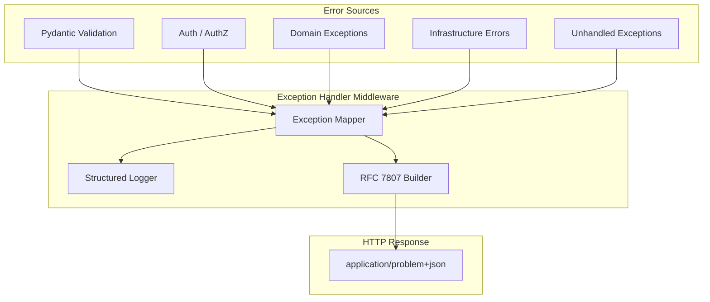
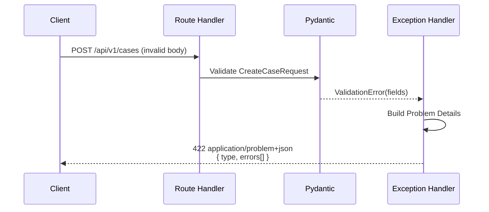
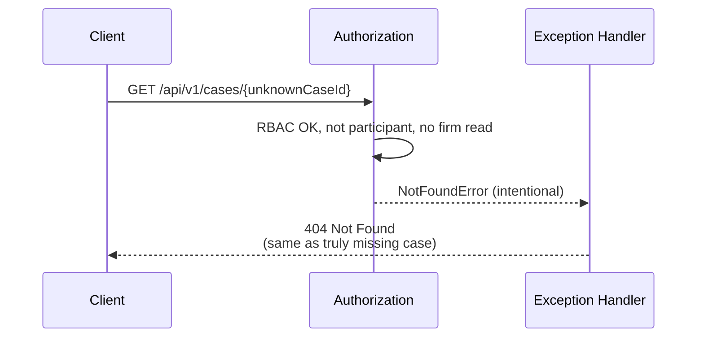
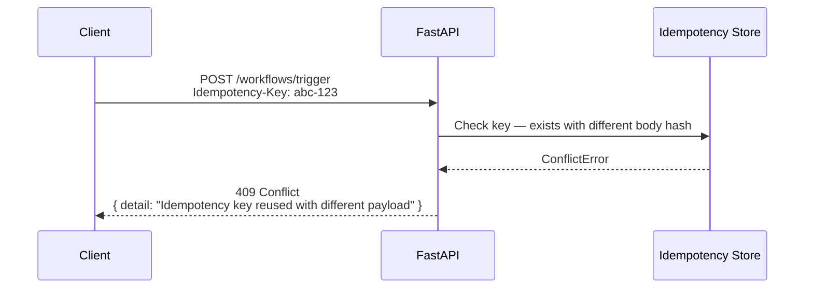

# Error Handling

**LexFlow AI** — API Error Types & HTTP Status Codes  
**Version:** 1.0  
**Status:** Draft — Pre-Implementation  
**Last Updated:** 2026-07-06

---

## Purpose

Define the complete error handling strategy for the LexFlow AI REST API — including RFC 7807 Problem Details format, HTTP status code mapping, domain-specific error types, and client handling guidance.

---

## Scope

| In Scope | Out of Scope |
|----------|--------------|
| Public API error format and status codes | Worker/Celery internal exception hierarchy |
| Error type URI registry | n8n workflow error nodes |
| Field-level validation errors | Infrastructure alerting rules |
| Client retry guidance | Log aggregation queries (see [Observability](../observability.md)) |
| Internal webhook error responses | Frontend error boundary UI |

---

## Responsibilities

| Component | Responsibility |
|-----------|----------------|
| **Global exception handler** | Map all exceptions to RFC 7807 responses |
| **Pydantic validation** | Produce field-level `errors[]` on 422 |
| **Domain exceptions** | Typed errors from bounded context services |
| **Authorization layer** | Emit 403 or 404 per matter wall policy |
| **Rate limiter** | Emit 429 with `Retry-After` header |
| **Clients** | Parse `type` URI and `errors[]`; implement retry logic |

---

## Architecture



All errors include `meta.requestId` for correlation with server logs and distributed traces.

---

## Flow Diagrams

### Validation Error Flow



### Matter Wall Denial Flow



### Idempotency Conflict



---

## RFC 7807 Problem Details Format

Every error response uses `Content-Type: application/problem+json`.

### Required Fields

```json
{
  "type": "https://lexflow.ai/errors/{error-type}",
  "title": "Short Human-Readable Title",
  "status": 422,
  "detail": "Specific explanation of this occurrence.",
  "instance": "/api/v1/cases/c1d2e3f4-...",
  "meta": {
    "requestId": "550e8400-e29b-41d4-a716-446655440000",
    "timestamp": "2026-07-06T08:00:00Z"
  }
}
```

### Field-Level Validation Extension (422 only)

```json
{
  "errors": [
    {
      "field": "title",
      "message": "Title is required.",
      "code": "required"
    },
    {
      "field": "practiceArea",
      "message": "Must be one of: litigation, corporate, ...",
      "code": "invalid_enum"
    }
  ]
}
```

### Field Error Codes

| Code | Description |
|------|-------------|
| `required` | Field is required but missing |
| `invalid_format` | Wrong type or format (UUID, email, date) |
| `invalid_enum` | Value not in allowed set |
| `too_short` / `too_long` | String length violation |
| `out_of_range` | Numeric value outside bounds |
| `invalid_state_transition` | Domain state machine violation |

---

## HTTP Status Code Reference

| Code | Name | When to Use | Error Type URI |
|------|------|-------------|----------------|
| **400** | Bad Request | Malformed JSON, invalid query parameter type | `.../bad-request` |
| **401** | Unauthorized | Missing, expired, or invalid JWT | `.../unauthorized` |
| **403** | Forbidden | Authenticated but RBAC denied (non-case resources) | `.../forbidden` |
| **404** | Not Found | Resource missing OR matter wall denial on case resources | `.../not-found` |
| **409** | Conflict | Version mismatch, idempotency key conflict, invalid cancel | `.../conflict` |
| **422** | Unprocessable Entity | Valid JSON but business/validation rules failed | `.../validation-error` |
| **429** | Too Many Requests | Rate limit exceeded | `.../rate-limited` |
| **500** | Internal Server Error | Unhandled exception | `.../internal-error` |
| **503** | Service Unavailable | Dependency down, maintenance mode | `.../service-unavailable` |

### Success Codes (Reference)

| Code | Usage |
|------|-------|
| **200** | Successful GET, PUT, PATCH |
| **201** | Resource created |
| **202** | Async operation accepted |
| **204** | Successful DELETE |

---

## Error Type Catalog

### Authentication Errors (401)

```json
{
  "type": "https://lexflow.ai/errors/unauthorized",
  "title": "Unauthorized",
  "status": 401,
  "detail": "Access token has expired.",
  "instance": "/api/v1/cases",
  "meta": { "requestId": "...", "timestamp": "..." }
}
```

| Scenario | Detail Message |
|----------|----------------|
| Missing Authorization header | "Authentication required." |
| Expired access token | "Access token has expired." |
| Invalid token signature | "Invalid access token." |
| Revoked token (jti blocklist) | "Access token has been revoked." |
| Invalid refresh token | "Invalid or expired refresh token." |
| Account locked | "Account temporarily locked due to failed login attempts." |

### Authorization Errors (403)

```json
{
  "type": "https://lexflow.ai/errors/forbidden",
  "title": "Forbidden",
  "status": 403,
  "detail": "You do not have permission to perform this action.",
  "instance": "/api/v1/admin/users",
  "meta": { "requestId": "...", "timestamp": "..." }
}
```

Used for **firm-wide RBAC denials** — admin endpoints, workflow management, operations not scoped to a case.

### Not Found (404)

```json
{
  "type": "https://lexflow.ai/errors/not-found",
  "title": "Not Found",
  "status": 404,
  "detail": "The requested resource was not found.",
  "instance": "/api/v1/cases/c1d2e3f4-...",
  "meta": { "requestId": "...", "timestamp": "..." }
}
```

Used for:
- Genuinely missing resources
- **Matter wall denials** on case-scoped resources (intentionally indistinguishable)
- Client role accessing internal notes or AI summaries

**Security rule:** Never return 403 with detail like "You are not a participant on this case."

### Conflict (409)

```json
{
  "type": "https://lexflow.ai/errors/conflict",
  "title": "Conflict",
  "status": 409,
  "detail": "Resource version mismatch. Expected version 3, received 2.",
  "instance": "/api/v1/cases/c1d2e3f4-...",
  "meta": {
    "requestId": "...",
    "timestamp": "...",
    "expectedVersion": 3,
    "receivedVersion": 2
  }
}
```

| Scenario | Detail |
|----------|--------|
| Optimistic concurrency | Version mismatch on PATCH/PUT |
| Idempotency key reuse | Same key, different request body hash |
| Cancel completed execution | Execution already terminal |
| Duplicate case number | Internal race (rare) |

### Validation Error (422)

```json
{
  "type": "https://lexflow.ai/errors/validation-error",
  "title": "Validation Error",
  "status": 422,
  "detail": "One or more fields failed validation.",
  "instance": "/api/v1/cases/c1d2e3f4-.../workflows/trigger",
  "errors": [
    {
      "field": "input.recipientEmail",
      "message": "Invalid email format.",
      "code": "invalid_format"
    }
  ],
  "meta": { "requestId": "...", "timestamp": "..." }
}
```

| Scenario | Example |
|----------|---------|
| Required field missing | `title` required on case create |
| Invalid enum | `status: "invalid"` on case patch |
| Invalid state transition | `closed` → `intake` without reopen |
| Schema validation | Workflow `input` fails JSON schema |
| Business rule | Add document to closed case |

### Rate Limited (429)

```json
{
  "type": "https://lexflow.ai/errors/rate-limited",
  "title": "Too Many Requests",
  "status": 429,
  "detail": "Rate limit exceeded. Retry after 45 seconds.",
  "instance": "/api/v1/cases/c1d2e3f4-.../ai/summarize",
  "meta": { "requestId": "...", "timestamp": "..." }
}
```

Response headers:

```http
Retry-After: 45
X-RateLimit-Limit: 20
X-RateLimit-Remaining: 0
X-RateLimit-Reset: 1717661745
```

### Internal Error (500)

```json
{
  "type": "https://lexflow.ai/errors/internal-error",
  "title": "Internal Server Error",
  "status": 500,
  "detail": "An unexpected error occurred. Please contact support with the request ID.",
  "instance": "/api/v1/cases",
  "meta": { "requestId": "550e8400-e29b-41d4-a716-446655440000", "timestamp": "..." }
}
```

**Rules:**
- Never expose stack traces, SQL, or internal paths in production
- Always include `requestId` for support correlation
- Log full exception server-side with trace ID

### Service Unavailable (503)

```json
{
  "type": "https://lexflow.ai/errors/service-unavailable",
  "title": "Service Unavailable",
  "status": 503,
  "detail": "The service is temporarily unavailable for maintenance.",
  "instance": "/api/v1/cases",
  "meta": { "requestId": "...", "timestamp": "..." }
}
```

Used during planned maintenance or when critical dependencies (PostgreSQL, Redis) are unreachable.

---

## Domain-Specific Error Scenarios

### Case Management

| Scenario | Status | Type |
|----------|--------|------|
| Case not found / matter wall | 404 | `not-found` |
| Invalid status transition | 422 | `validation-error` |
| Remove sole lead participant | 422 | `validation-error` |
| Version conflict on update | 409 | `conflict` |

### Document Management

| Scenario | Status | Type |
|----------|--------|------|
| File too large | 422 | `validation-error` |
| Content type not allowed | 422 | `validation-error` |
| S3 object not found on confirm | 422 | `validation-error` |
| Document not ready for AI | 422 | `validation-error` |

### AI

| Scenario | Status | Type |
|----------|--------|------|
| Document not processed | 422 | `validation-error` |
| Summary already approved | 409 | `conflict` |
| Job not found | 404 | `not-found` |
| LLM provider failure (in job) | 200 on poll | Job `status: failed` with `retryable` flag |

Note: LLM provider errors surface in **job status**, not as synchronous HTTP 500.

### Workflows

| Scenario | Status | Type |
|----------|--------|------|
| Unknown workflow slug | 404 | `not-found` |
| Input schema validation | 422 | `validation-error` |
| Cancel terminal execution | 409 | `conflict` |
| Duplicate idempotency key (same body) | 202 | Returns original response |

---

## Client Retry Guidance

| Status | Retry? | Strategy |
|--------|--------|----------|
| 400 | No | Fix request |
| 401 | Yes* | Refresh token, retry once |
| 403 | No | Permission issue — do not retry |
| 404 | No | Resource missing or inaccessible |
| 409 | Conditional | Refresh resource, merge, retry |
| 422 | No | Fix validation errors |
| 429 | Yes | Wait for `Retry-After`, exponential backoff |
| 500 | Yes | Exponential backoff, max 3 attempts |
| 503 | Yes | Exponential backoff, respect `Retry-After` |

*401 with expired access token: call `POST /auth/refresh`, then retry original request.

### Recommended Backoff

```
attempt 1: immediate
attempt 2: 1 second
attempt 3: 2 seconds
attempt 4: 4 seconds (max 3 retries for 500)
```

---

## Best Practices

1. **Always log `requestId` client-side** on errors — required for support tickets.
2. **Parse `type` URI, not `title`** — titles may change; type URIs are stable.
3. **Display `errors[]` inline in forms** — map `field` to form field names.
4. **Do not retry 403/404/422** — user action required.
5. **Implement global 401 interceptor** — silent refresh before surfacing login prompt.
6. **Never expose raw error bodies to end users** — show friendly message + request ID.
7. **Test error responses in contract tests** — validate RFC 7807 schema compliance.

---

## Tradeoffs

| Decision | Benefit | Cost |
|----------|---------|------|
| RFC 7807 standard | Interoperable, machine-readable | More verbose than custom format |
| 404 for matter wall | Prevents enumeration | Debugging harder for users |
| Generic 500 detail in production | No information leakage | Support needs requestId lookup |
| Job-level AI errors vs HTTP 500 | Clean async model | Two error handling paths in client |
| `meta` extension field | Correlation without breaking RFC 7807 | Non-standard extension |

---

## Future Improvements

- Localized error messages (`Accept-Language` header)
- Error code enum in OpenAPI spec for code generation
- `helpUrl` field linking to documentation per error type
- Structured error reporting endpoint for client crash correlation
- Deprecation warnings via `Warning` header (see [versioning.md](./versioning.md))

---

## References

- [rest-standards.md](./rest-standards.md) — Envelope and error format
- [authentication.md](./authentication.md) — 401 scenarios
- [authorization-rbac.md](./authorization-rbac.md) — 403 vs 404 policy
- [endpoints-ai.md](./endpoints-ai.md) — Job failure errors
- [../08-security/security-architecture.md](../security-architecture.md) — Information disclosure controls
- [../observability.md](../observability.md) — Error logging and alerting
- [RFC 7807 — Problem Details for HTTP APIs](https://datatracker.ietf.org/doc/html/rfc7807)
