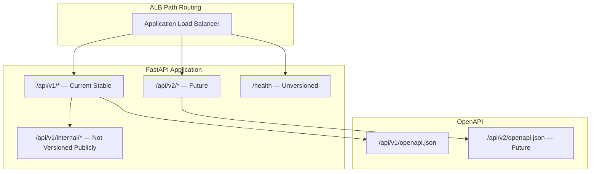
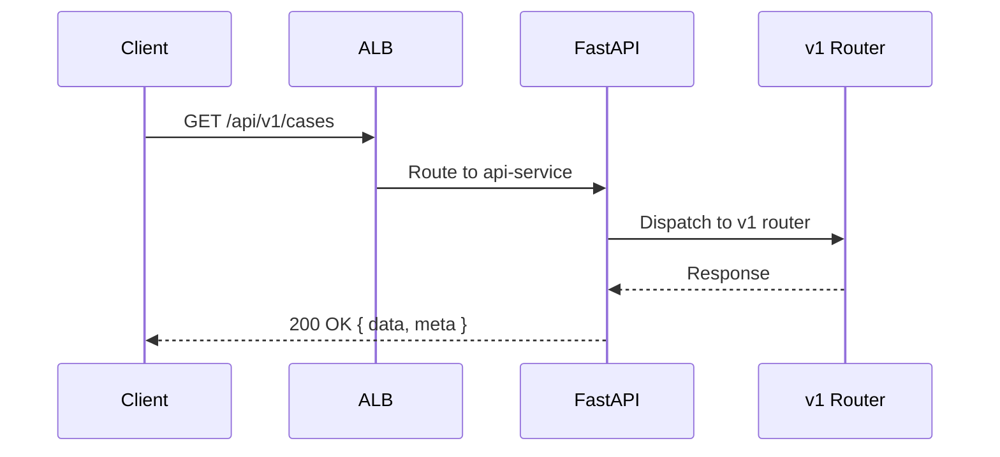
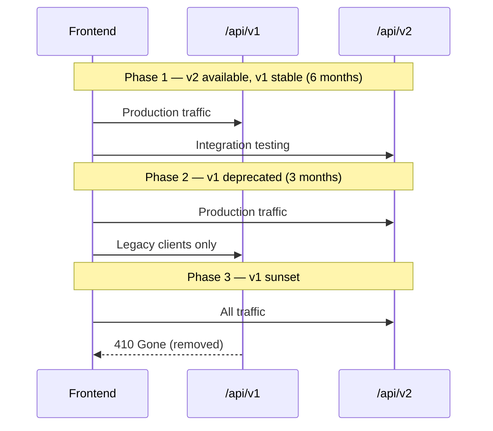
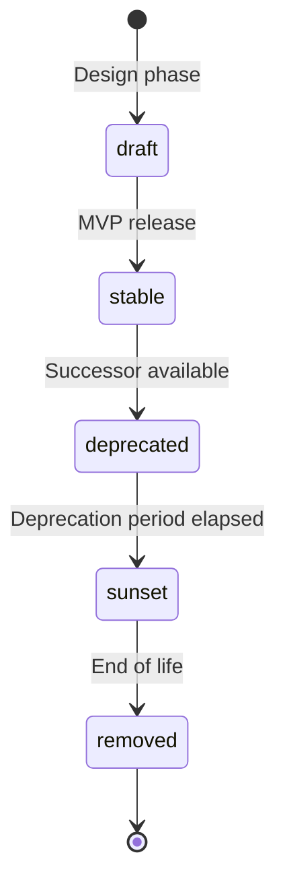

# API Versioning

**LexFlow AI** — `/api/v1` Version Strategy  
**Version:** 1.0  
**Status:** Draft — Pre-Implementation  
**Last Updated:** 2026-07-06

---

## Purpose

Define the API versioning strategy for LexFlow AI — including URL prefix conventions, breaking vs non-breaking change policies, deprecation workflow, and the path to future versions (`/api/v2`).

---

## Scope

| In Scope | Out of Scope |
|----------|--------------|
| URL path versioning (`/api/v1`) | Database schema versioning (Alembic) |
| Breaking change definition and process | n8n workflow slug versioning |
| Deprecation headers and sunset policy | Frontend feature flag versioning |
| OpenAPI spec versioning | Internal webhook path versioning |
| Client SDK generation per version | Mobile app store release cadence |

---

## Responsibilities

| Role | Responsibility |
|------|----------------|
| **Architecture team** | Approve breaking changes; require ADR for new major versions |
| **Backend engineers** | Maintain backward compatibility within a major version |
| **Frontend engineers** | Pin SDK to active API version; migrate on deprecation notice |
| **DevOps** | Route ALB paths; deploy multi-version if overlap period needed |
| **Technical writers** | Update docs and changelog on every API change |

---

## Architecture



### Versioning Model

LexFlow AI uses **URL path versioning** — the major version is the first path segment after `/api/`:

```
https://api.lexflow.{firm-domain}/api/v1/cases
https://api.lexflow.{firm-domain}/api/v1/documents/search
```

| Component | Versioning Approach |
|-----------|---------------------|
| Public REST API | URL prefix `/api/v{n}` |
| Internal n8n webhooks | Tied to `/api/v1/internal/` — bump with major version |
| OpenAPI spec | Per-version at `/api/v{n}/openapi.json` |
| TypeScript SDK | Generated per version in `packages/sdk/` |
| Domain events | Schema version in event payload (`schemaVersion: 1`) |

---

## Flow Diagrams

### Client Request Routing



### Deprecation Warning Flow

```mermaid
sequenceDiagram
    participant C as Client
    participant API as FastAPI
    participant LOG as Deprecation Logger

    C->>API: GET /api/v1/cases?legacyFilter=true
    API->>API: Handler marked @deprecated(sunset=2027-01-01)
    API->>LOG: Log deprecated endpoint usage (client, count)
    API-->>C: 200 OK<br/>Deprecation: true<br/>Sunset: Sat, 01 Jan 2027 00:00:00 GMT<br/>Link: </api/v2/cases>; rel="successor-version"
```

### Major Version Migration



---

## Current Version: v1

### Base URL

```
Production:  https://api.lexflow.{firm-domain}/api/v1
Staging:     https://api.staging.lexflow.{firm-domain}/api/v1
Development: http://localhost:8000/api/v1
```

### Unversioned Endpoints

| Path | Purpose |
|------|---------|
| `/health` | Liveness/readiness probe |
| `/health/ready` | Dependency check (DB, Redis, MQ) |

All other endpoints require the `/api/v1` prefix.

### OpenAPI & Documentation

| Resource | Path | Production |
|----------|------|------------|
| OpenAPI JSON | `/api/v1/openapi.json` | Available (auth required) |
| Swagger UI | `/api/v1/docs` | **Disabled** |
| ReDoc | `/api/v1/redoc` | **Disabled** |

OpenAPI spec is exported in CI and published to the internal developer portal.

---

## Breaking vs Non-Breaking Changes

### Non-Breaking (Allowed in v1)

These changes do **not** require a new major version:

| Change | Example |
|--------|---------|
| Add optional request field | New optional `metadata` field on case create |
| Add response field | New `upcomingDeadlineCount` on case detail |
| Add new endpoint | `GET /cases/{id}/billing-summary` |
| Add optional query parameter | `?includeArchived=true` |
| Add new enum value (additive) | New `practiceArea: "immigration"` |
| Add new error type URI | New `.../quota-exceeded` type |
| Performance improvements | Faster search, no contract change |
| Bug fix restoring documented behavior | Fix pagination total count |

### Breaking (Requires v2 or ADR exception)

| Change | Example |
|--------|---------|
| Remove or rename field | `clientId` → `clientReference` |
| Change field type | `priority: string` → `priority: integer` |
| Change URL path | `/cases/{id}/tasks` → `/tasks?caseId=` |
| Change authentication method | JWT claims structure change |
| Change error format | Moving away from RFC 7807 |
| Change pagination defaults | `pageSize` default 25 → 10 |
| Remove endpoint | Delete `GET /cases/{id}/notes` |
| Change required fields | Make `practiceArea` required on create |
| Change HTTP status code | 403 → 404 for a non-security endpoint |
| Rename enum value | `litigation` → `civil_litigation` |

**Rule:** If a client written against the current OpenAPI spec could break without code changes, it is a breaking change.

---

## Deprecation Policy

### Timeline

| Phase | Duration | Client Action |
|-------|----------|---------------|
| **Announced** | Day 0 | Deprecation headers added; changelog updated |
| **Deprecated** | 6 months minimum | Migrate to replacement endpoint |
| **Sunset warning** | 3 months before removal | Automated alerts to API consumers |
| **Removed** | After sunset date | Endpoint returns `410 Gone` |

### Deprecation Headers

Deprecated endpoints return:

```http
Deprecation: true
Sunset: Sat, 01 Jan 2027 00:00:00 GMT
Link: </api/v2/cases>; rel="successor-version"
X-LexFlow-Deprecation-Notice: Use GET /api/v2/cases instead. Field "status" renamed to "caseStatus".
```

### 410 Gone Response (Post-Sunset)

```json
{
  "type": "https://lexflow.ai/errors/endpoint-removed",
  "title": "Endpoint Removed",
  "status": 410,
  "detail": "This endpoint was removed on 2027-01-01. Use /api/v2/cases instead.",
  "instance": "/api/v1/cases",
  "meta": {
    "requestId": "...",
    "timestamp": "...",
    "successorVersion": "/api/v2/cases"
  }
}
```

---

## Version Lifecycle



| State | Description |
|-------|-------------|
| `draft` | Pre-implementation; spec may change freely |
| `stable` | Production-ready; backward compatible changes only |
| `deprecated` | Successor available; deprecation headers active |
| `sunset` | Final warning period |
| `removed` | Returns 410 Gone |

**Current state:** v1 is `draft` (pre-implementation).

---

## Internal API Versioning

Internal n8n webhooks are versioned with the public API major version:

```
/api/v1/internal/webhooks/n8n/{workflowSlug}
```

When v2 launches:
- New workflows use v2 callback URLs
- v1 callbacks remain active during overlap period
- n8n workflow JSON updated to point to new callback URL

Internal endpoints are **not** included in the public OpenAPI spec.

---

## SDK & Client Generation

```
FastAPI /api/v1/openapi.json
  → scripts/openapi/generate-ts-client.sh --version v1
  → packages/sdk/src/v1/client.ts
  → packages/shared/src/types/v1/
```

CI validates:
1. OpenAPI spec is valid
2. Generated types match committed types (no drift)
3. No breaking changes without version bump (openapi-diff tool)

### Client Pinning

```typescript
// packages/sdk/src/client.ts
export const API_VERSION = 'v1';
export const BASE_URL = `${config.apiHost}/api/${API_VERSION}`;
```

Frontend must not hardcode `/api/v1` — use SDK constant.

---

## Multi-Version Deployment

During v1 → v2 migration, both versions run in the **same FastAPI application**:

```
apps/api/src/api/
├── v1/
│   ├── router.py
│   ├── cases.py
│   └── ...
└── v2/
    ├── router.py
    ├── cases.py
    └── ...
```

Shared domain services (`services/`) are reused — only HTTP binding layers differ.

| Approach | When |
|----------|------|
| Same app, both routers | Overlap period (recommended) |
| Separate ECS services | Only if v2 requires incompatible dependencies |

---

## Best Practices

1. **Never break v1 within a release cycle** — add fields, don't rename.
2. **Document every API change in CHANGELOG.md** — even non-breaking additions.
3. **Use OpenAPI diff in CI** — block accidental breaking changes.
4. **Version domain event schemas separately** — `schemaVersion` in event payload.
5. **Give integrators 6+ months deprecation notice** — law firms have slow release cycles.
6. **Keep v1 and v2 domain services shared** — version the HTTP layer only.
7. **Require ADR for major version bumps** — document why breaking change is necessary.

---

## Tradeoffs

| Decision | Benefit | Cost |
|----------|---------|------|
| URL path versioning | Explicit, cacheable, easy to route | URL changes on major bump |
| Single major version in production | Simpler ops, one SDK | Slower breaking change cadence |
| 6-month deprecation minimum | Enterprise client compatibility | Long tail of deprecated code |
| Shared domain services across versions | DRY business logic | v1/v2 handlers may diverge in mapping |
| Internal webhooks tied to v1 | Consistent security model | n8n JSON updates on major bump |
| Disabled Swagger in production | Reduced attack surface | Developers use exported spec |

---

## Future Improvements

| Phase | Enhancement |
|-------|-------------|
| Phase 2 | Automated deprecation usage dashboard (% traffic on deprecated endpoints) |
| Phase 3 | API changelog endpoint (`GET /api/v1/changelog`) |
| Phase 3 | Client registration for sunset notification emails |
| Phase 4 | Header-based versioning (`Accept-Version: v1`) as alternative — not planned initially |
| Phase 4 | GraphQL gateway with separate versioning |

### v2 Candidates (Hypothetical)

Changes that would trigger v2 (not planned yet):
- Unified job/status model across AI, documents, and workflows
- Cursor-only pagination (remove offset)
- OAuth 2.0 client credentials for machine integrations
- Multi-tenant firm hierarchy (parent firm → offices)

---

## References

- [rest-standards.md](./rest-standards.md) — Response envelope (stable within v1)
- [error-handling.md](./error-handling.md) — Error type URIs (stable within v1)
- [README.md](./README.md) — API documentation index
- [../api-architecture.md](../api-architecture.md) — Legacy architecture doc
- [../development-standards.md](../development-standards.md) — PR process for API changes
- [../13-decisions/README.md](../13-decisions/README.md) — ADR process for breaking changes
- [OpenAPI Specification 3.1](https://spec.openapis.org/oas/v3.1.0)
