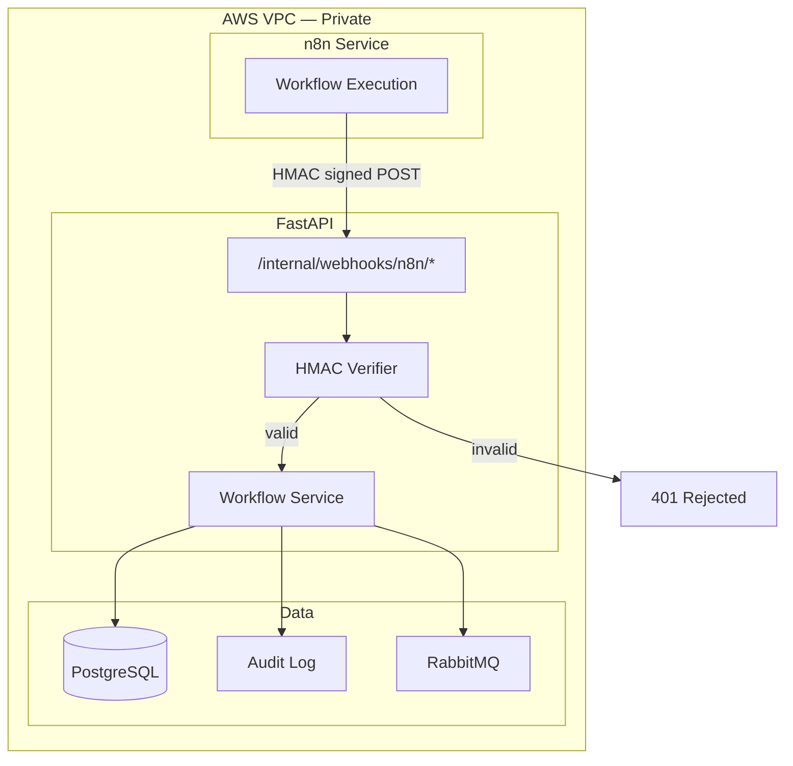
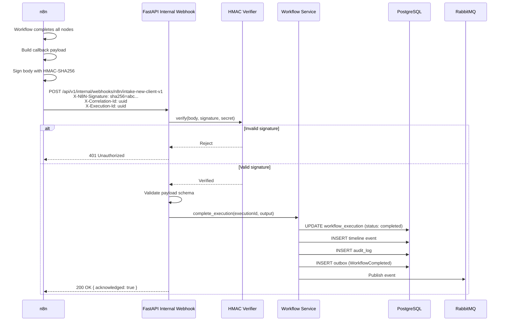
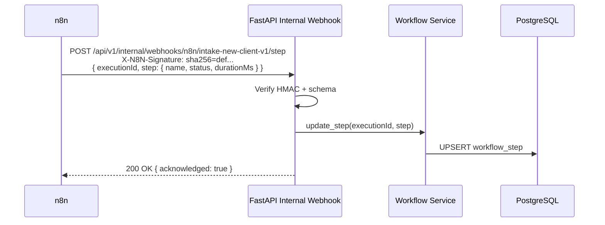
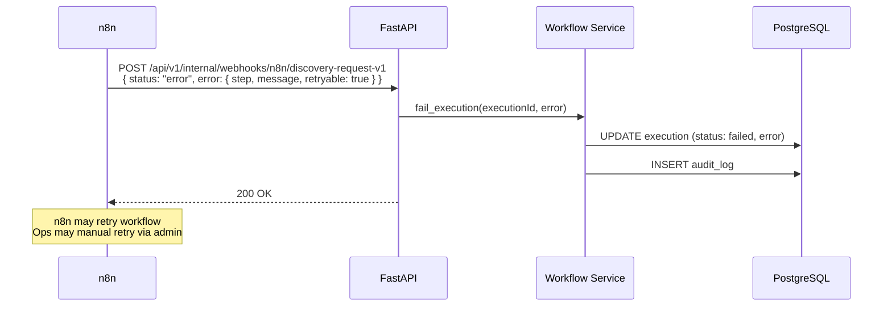
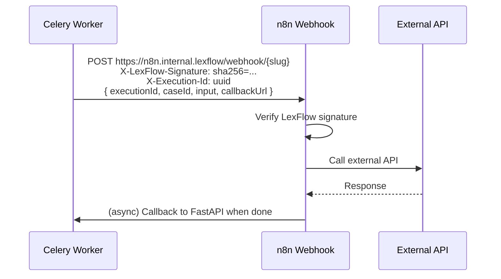
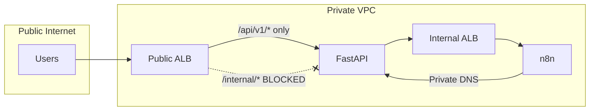

# Internal Webhooks (n8n)

**LexFlow AI** — n8n HMAC Callback API  
**Version:** 1.0  
**Status:** Draft — Pre-Implementation  
**Last Updated:** 2026-07-06

---

## Purpose

Document the **internal webhook API** used by n8n to callback to FastAPI with workflow execution results and step progress. These endpoints are **not public** — they are excluded from the public OpenAPI spec and authenticated via HMAC-SHA256 signatures instead of JWT.

---

## Scope

| In Scope | Out of Scope |
|----------|--------------|
| n8n → FastAPI callback endpoints | FastAPI → n8n trigger payload (see [Workflow Endpoints](./endpoints-workflows.md)) |
| HMAC signature verification | n8n workflow node configuration |
| Callback payload schemas | n8n credential storage |
| Step progress updates | Public third-party webhook subscriptions |
| Error callback handling | Celery worker → n8n trigger (worker domain) |
| Network access restrictions | n8n UI administration |

**Base path:** `/api/v1/internal/webhooks/n8n/`  
**Authentication:** HMAC-SHA256 (`X-N8N-Signature` header)  
**Network:** VPC internal only — not reachable from public internet

---

## Responsibilities

| Component | Responsibility |
|-----------|----------------|
| **Internal webhook router** | Receive callbacks, verify signature, route by slug |
| **HMAC verifier** | Validate `X-N8N-Signature` against shared secret |
| **Workflow service** | Update execution status, persist output, emit events |
| **Network (SG + ALB)** | Deny public ingress; allow n8n SG and API SG only |
| **n8n** | Sign outbound callbacks; retry on failure |
| **Secrets Manager** | Store per-workflow or shared HMAC secret |

Business logic interpretation of workflow output is **always** performed by FastAPI — n8n reports raw step results only.

---

## Architecture



### Security Layers

| Layer | Control |
|-------|---------|
| Network | n8n in private subnet; no public DNS |
| Security Group | Inbound to API only from n8n SG + worker SG |
| HMAC | Payload integrity + authenticity |
| Schema validation | Payload validated against workflow slug schema |
| Idempotency | `X-Execution-Id` deduplication |

---

## Flow Diagrams

### Successful Workflow Completion Callback



### Step Progress Update



### Error Callback with Retry



### FastAPI → n8n Trigger (Outbound Reference)



---

## Endpoints

### POST `/internal/webhooks/n8n/{workflowSlug}`

Workflow completion or error callback.

**Authentication:** HMAC-SHA256 — not JWT

**Required headers:**

```http
Content-Type: application/json
X-N8N-Signature: sha256={hex_digest}
X-Correlation-Id: 550e8400-e29b-41d4-a716-446655440000
X-Execution-Id: ex1a2b3c4-d5e6-7890-abcd-ef1234567890
```

**Success callback payload:**

```json
{
  "executionId": "ex1a2b3c4-d5e6-7890-abcd-ef1234567890",
  "status": "success",
  "output": {
    "sharepointFolderUrl": "https://firm.sharepoint.com/sites/Cases/Smith-v-Acme",
    "emailSent": true,
    "externalReferenceId": "ext-123"
  },
  "steps": [
    {
      "name": "create-sharepoint-folder",
      "status": "completed",
      "durationMs": 1200
    },
    {
      "name": "send-welcome-email",
      "status": "completed",
      "durationMs": 800
    },
    {
      "name": "notify-lead-attorney",
      "status": "completed",
      "durationMs": 400
    }
  ]
}
```

**Error callback payload:**

```json
{
  "executionId": "ex2b3c4d5-e6f7-8901-bcde-f12345678901",
  "status": "error",
  "error": {
    "step": "send-welcome-email",
    "message": "SMTP connection refused",
    "code": "smtp_connection_error",
    "retryable": true
  },
  "steps": [
    {
      "name": "create-sharepoint-folder",
      "status": "completed",
      "durationMs": 1200
    },
    {
      "name": "send-welcome-email",
      "status": "failed",
      "durationMs": 60000
    }
  ]
}
```

**Response (200):**

```json
{
  "acknowledged": true,
  "executionId": "ex1a2b3c4-d5e6-7890-abcd-ef1234567890"
}
```

**Error responses:**

| Status | When |
|--------|------|
| 401 | Invalid or missing HMAC signature |
| 400 | Malformed JSON |
| 422 | Payload fails schema validation for workflow slug |
| 404 | Unknown `executionId` |
| 409 | Execution already in terminal state (idempotent re-delivery returns 200) |

---

### POST `/internal/webhooks/n8n/{workflowSlug}/step`

Intermediate step progress update (optional — for long-running workflows).

**Authentication:** HMAC-SHA256

**Request:**

```json
{
  "executionId": "ex1a2b3c4-d5e6-7890-abcd-ef1234567890",
  "step": {
    "name": "create-sharepoint-folder",
    "status": "running",
    "startedAt": "2026-07-06T08:00:05Z",
    "durationMs": null
  }
}
```

**Response (200):**

```json
{
  "acknowledged": true
}
```

Step updates are **informational** — execution status remains `running` until final callback.

---

## HMAC Signature Specification

### Signing (n8n → FastAPI)

```
signature = HMAC-SHA256(
  key = shared_secret,
  message = raw_request_body_bytes
)

Header: X-N8N-Signature: sha256={hex(signature)}
```

### Verification (FastAPI)

1. Read raw request body (before JSON parsing)
2. Load shared secret from AWS Secrets Manager (`lexflow/n8n/webhook-secret`)
3. Compute HMAC-SHA256 of raw body
4. Compare with `X-N8N-Signature` header using **constant-time comparison**
5. Reject if mismatch

### Outbound Signing (FastAPI/Celery → n8n)

Worker triggers use the same algorithm with header `X-LexFlow-Signature`:

```http
POST https://n8n.internal.lexflow/webhook/intake-new-client-v1
X-LexFlow-Signature: sha256={hex_digest}
X-Correlation-Id: {uuid}
X-Execution-Id: {uuid}
Content-Type: application/json

{
  "executionId": "ex1a2b3c4-d5e6-7890-abcd-ef1234567890",
  "caseId": "c1d2e3f4-a5b6-7890-cdef-123456789012",
  "workflowSlug": "intake-new-client-v1",
  "triggeredBy": "b2c3d4e5-f6a7-8901-bcde-f12345678901",
  "input": {
    "clientName": "Acme Corp",
    "clientEmail": "contact@acme.com",
    "practiceArea": "corporate",
    "documents": [
      {
        "documentId": "d1e2f3a4-b5c6-7890-def1-234567890abc",
        "s3PresignedUrl": "https://lexflow-docs.s3.amazonaws.com/..."
      }
    ]
  },
  "callbackUrl": "https://api.internal.lexflow/api/v1/internal/webhooks/n8n/intake-new-client-v1"
}
```

---

## Secret Management

| Secret | Storage | Rotation |
|--------|---------|----------|
| n8n webhook HMAC secret | AWS Secrets Manager | Quarterly |
| n8n admin credentials | AWS Secrets Manager | Quarterly |
| Per-workflow secrets (optional) | AWS Secrets Manager | On compromise |

**Rules:**
- Secrets never in repo, n8n JSON exports, or workflow definitions
- Injected at ECS task startup via IAM role
- Rotation requires coordinated update in n8n credentials + FastAPI config

---

## Idempotency & Retry

| Scenario | Behavior |
|----------|----------|
| Duplicate success callback | Return 200; no state change (execution already `completed`) |
| Duplicate error callback | Return 200; no state change (execution already `failed`) |
| Callback for unknown executionId | Return 404 |
| n8n retry on 5xx | Safe — idempotent handler |
| n8n retry on 401 | Alert ops — likely secret mismatch |
| Callback timeout | n8n retries up to 3 times with 30-second timeout |

### Timeout Policy

| Direction | Timeout | Retry |
|-----------|---------|-------|
| n8n → FastAPI callback | 30 seconds | 3 attempts |
| FastAPI worker → n8n trigger | 10 seconds | Celery retry |
| n8n external API node | 60 seconds | 3 n8n node retries |

---

## Payload Schema by Workflow Slug

Each workflow slug has a registered JSON schema for `output` validation:

| Slug | Output Schema Key |
|------|-------------------|
| `intake-new-client-v1` | `schemas/n8n/intake-new-client-v1-output.json` |
| `document-upload-notify-v1` | `schemas/n8n/document-upload-notify-v1-output.json` |
| `discovery-request-v1` | `schemas/n8n/discovery-request-v1-output.json` |
| `case-close-archive-v1` | `schemas/n8n/case-close-archive-v1-output.json` |

Schema validation failures return **422** — n8n logs the error; ops investigates workflow output mapping.

---

## Network Access Control



| Rule | Implementation |
|------|----------------|
| `/internal/*` not on public ALB | Path-based deny rule |
| n8n has no public DNS | Internal hosted zone only |
| Callback source IP | n8n security group only |
| Admin UI | VPN or bastion access only |

---

## Best Practices

1. **Always verify HMAC on raw body** — before JSON parsing; encoding matters.
2. **Use constant-time signature comparison** — prevent timing attacks.
3. **Treat callbacks as idempotent** — n8n may deliver more than once.
4. **Validate output against per-slug schema** — catch n8n mapping errors early.
5. **Log correlation ID across trigger → callback** — essential for debugging.
6. **Never expose internal endpoints in public OpenAPI** — separate spec if needed.
7. **Return 200 quickly** — offload heavy processing to async handler if needed.
8. **Alert on 401 spikes** — indicates secret rotation failure or attack attempt.

---

## Tradeoffs

| Decision | Benefit | Cost |
|----------|---------|------|
| HMAC vs mTLS | Simple; works with n8n HTTP nodes | Shared secret rotation coordination |
| Shared secret vs per-workflow | Simpler secret management | Blast radius if compromised |
| 200 on duplicate callback | n8n retry-safe | Must detect idempotent duplicates |
| Schema validation on callback | Catch workflow bugs | Schema maintenance per workflow |
| No JWT on internal routes | Clear separation of auth models | Two auth systems to document |
| Internal path on same FastAPI app | Shared domain services | Must enforce network + path isolation |

---

## Future Improvements

- mTLS between n8n and FastAPI (supplement HMAC)
- Webhook delivery receipt log with replay capability
- Per-workflow HMAC secrets with automatic rotation
- Callback payload encryption for sensitive output fields
- Dead letter queue for failed callback processing
- Admin UI to replay callback from stored payload

---

## References

- [endpoints-workflows.md](./endpoints-workflows.md) — Public workflow trigger and status API
- [authentication.md](./authentication.md) — JWT auth (public routes only)
- [error-handling.md](./error-handling.md) — 401/422 on webhook errors
- [versioning.md](./versioning.md) — Internal path versioned with `/api/v1`
- [../06-workflows/workflow-orchestration.md](../workflow-orchestration.md) — Full n8n integration architecture
- [../08-security/security-architecture.md](../security-architecture.md) — n8n network isolation
- [../08-security/authentication-authorization.md](../authentication-authorization.md) — Service-to-service auth
- [ADR-002](../13-decisions/002-n8n-orchestration-only.md) — n8n as orchestrator only
- [HMAC RFC 2104](https://datatracker.ietf.org/doc/html/rfc2104)
